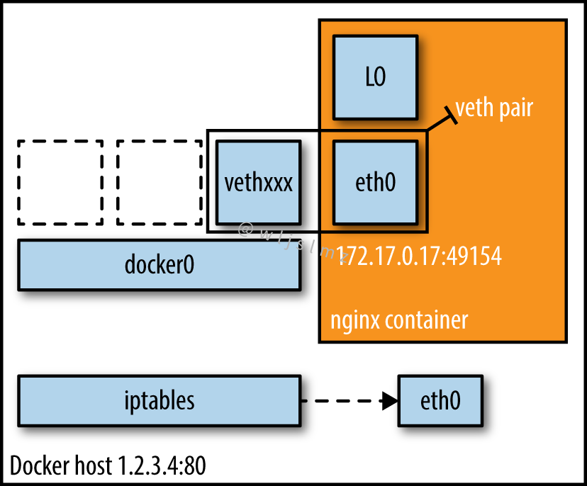
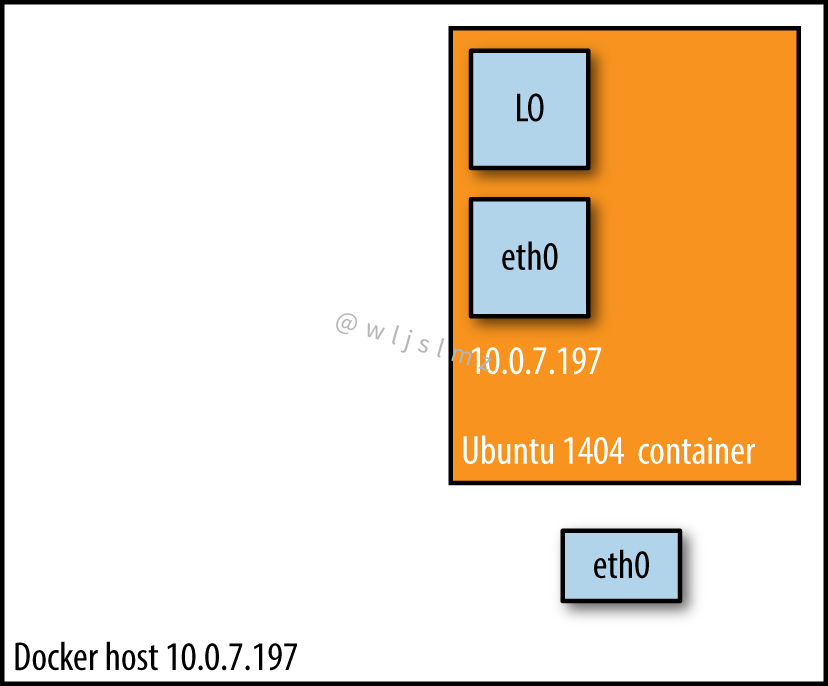

Docker 中网络模式有两个比较常用：Bridge 和 Host，这两种模式有很大的区别，本文笔者将带大家好好了解一下这两种模式。

## Docker 网络基础

容器是在不同平台上部署应用程序的一种流行方式，在某些情况下，容器需要相互通信，这个过程可以通过 Docker 网络来实现。

Docker 有一个网络模型，允许容器自动通信，此外，它支持与相同或不同主机和外部世界的通信，网络是容器部署和管理的一个关键方面，因此，拥有出色的网络技能可以帮助您提高工作效率。

> 注意：用户可以将容器添加到多个网络。

要管理网络操作，例如创建新网络、将容器连接到网络、断开容器与网络的连接、列出可用网络和删除网络等，我们使用以下命令：

```shell
docker network
```

执行结果：

今天我们要将的 Docker 网络模式是通过以下命令查看：

```
docker network ls
```

执行结果：

我们看到有 bridge、host、none 三种，我们本文就讨论 bridge、host。

## bridge 模式

当你启动 Docker 时，会自动创建一个默认的桥接网络。一个新启动的容器会自动连接到它。您还可以创建用户定义的自定义桥接网络，用户定义的桥接网络优于默认的桥接网络。

Bridge 网络是最常见的网络类型，它仅限于运行 Docker 引擎的单个主机中的容器，Bridge 网络易于创建、管理和故障排除



Bridge 网络将 172.17.xx 范围内的 IP 分配给其中的容器，为了使桥接网络上的容器能够与外界通信或可访问，需要配置端口映射。例如，假设您可以让 Docker 容器在端口 80 上运行 Web 服务，由于此容器连接到私有子网上的桥接网络，因此需要将主机系统上的端口（如 8000）映射到容器上的端口 80，以便外部流量到达 Web 服务。

## host 模式

消除容器与 Docker 主机之间的网络隔离，直接使用主机的网络。如果您运行绑定到端口 80 的容器并使用主机网络，则容器的应用程序可在主机 IP 地址的端口 80 上使用。意味着您将无法在同一主机上运行多个 Web 容器，在同一端口上，因为该端口现在对主机网络中的所有容器都是通用的。



使用 host 驱动程序时，容器共享 Docker 主机的网络堆栈，从网络的角度来看，**容器就像主机本身一样**。

host 消除了 docker 主机和 docker 容器之间的网络隔离，以便直接使用主机网络。但是这样一来，您将无法在同一主机上运行多个容器，在同一端口上，因为主机网络中的所有容器都将具有主机系统的公共端口。
