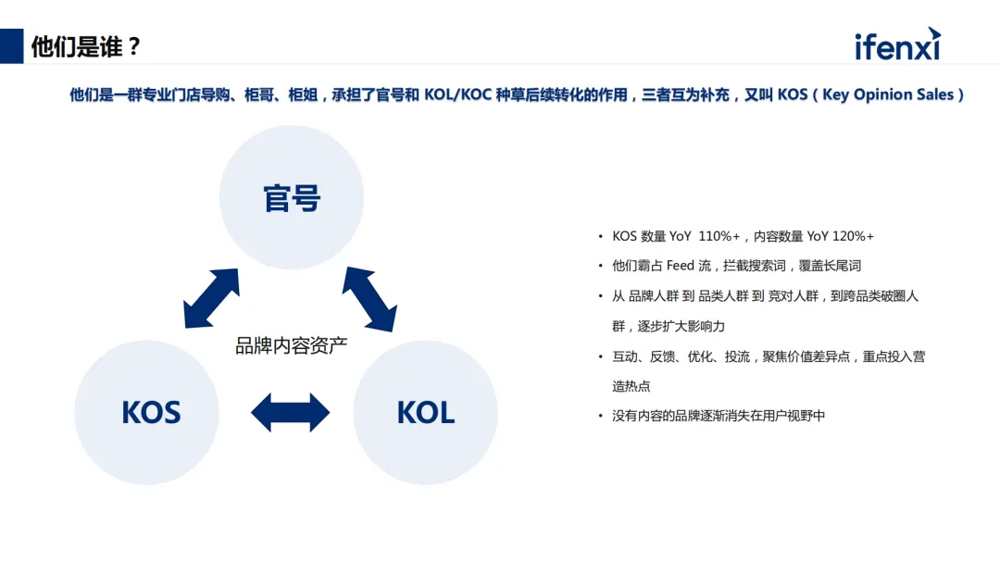

# 大模型提升门店经营效率的三个环节，帮助企业留住消费者

原创 数字化服务平台 爱分析ifenxi  *2024-04-28 18:04* *北京*

现如今在社交平台上能看到各式各类的品牌内容营销，但纯粹的广告行为难免会引起消费者的反感，而某些头部品牌企业打造了一批“金牌销售账号”，进行内容运营场景的最佳实践，从内容创作的质量到获客营销的最终结果，都展现了非常显著的效果。  

本文从品牌主门店经营的三个环节详细展开说明。

---

**01**

**品牌方提升门店销售的新手段**

近几年小红书、抖音、视频号等社交平台上走进人们的视野，不少品牌方通过运营一批门店销售人员的账号，发布展示商品、介绍活动、新品信息等内容，此类账号统一叫KOS矩阵账号。品牌通常有大量该类账号做引导转化，共充当了三种角色：品牌代言、用户推荐、产品链接。因为这类账号的运营者多为门店导购或销售经验丰富的人，掌握着门店商品的一手信息，并受过专业的销售技巧培训，同时因为账号清一色的以某门店的形式做首页装修，简介里会写出是哪个门店的工作人员，天然的带给客户一种信任感。

KOS矩阵账号与品牌官号以及合作的KOL、 KOC 等角色形成了互补关系。品牌官号更倾向于做声量、人群的覆盖，品牌故事倾向于做软种草，甚至视频内不会直接提及某商品。中间缺少了用户感兴趣时二次搜索商品信息的环节。所以KOS作为用户需求的承接，大量账号助力品牌完成了最后一个转化环节。

这类账号每年以 110% 以上的速度增长，内容数量也以超快的速度增长。不仅仅拦截用户的二次搜索流量，还会霸占Feed流，覆盖用户长尾词，这种内容会使没有内容营销的品牌，逐渐消失在用户视野里，使得用户刷到的内容全是由 KOS 发布的。

这类门店员工的账号会按照一定的节奏，根据行业的不同发布内容，账号的平均互动率跟大盘相差不大，约2.5%。像小红书平台，互动率大概在 2% 到 3% 之间的，以某客户的小红书平台为例，共有 125 个日常活跃的 KOS 角色。在品牌没有额外花钱投流的情况下，每一个账号平均历史发布 309 篇内容，累计发布 9, 000 多篇，且已达到了 100 万+阅读量。经统计，在过去的90天品牌曝光高达100多万次。这些数据都是汇聚起来，每个账号的粉丝数几百到一万不定，但是账号的个数增加，声量的覆盖是非常可观的。

品牌为了控制这么多的 KOS 账号，实现统一节奏，分为三个阶段。

**1、打造统一理解能力**，首先确保品牌下一线导购，对商品、品牌价值有统一理解，对调性统一把控。

**2、提升组织运营能力**，在每月的重大节点上，发布同样主题的内容，包括新品上市，要造势做内容的声量。

3、一线销售人员不太具备创作能力，企业需要**提供激发创作能力的手段**，包括了物质激励、工具赋能等。

**02**

**统一的管理平台，实现统一的理解能力**

通常企业里都会有内容管控或内容统一管理平台，平台会把品牌历史生产的内容进行统一管理。

统一管理是为了把内容进行标签化和结构化，方便后续的使用和复用。内容是企业非常重要的资产和素材，我们构建的AI知识库，对企业用户来说，不只局限于存储内容，还可以对内容进行 AI 处理，比如理解、自动标注、自动识别、 OCR 识别、 ASR 识别、统一进行合规检测、质量评估，确保企业内容是优质的。

有了统一沉淀后，需要通过大语言模型对内容进行统一的学习和理解。包括商品信息、历史文件、图片、视频等，这些信息会以各种形式为载体存在平台上，学习理解后进行利用。

利用方面，统一用机器人以问答的形式，回答员工所有不确定的问题，给到明确的标准回答，回答会涉及到文字、图片甚至视频来建立统一的认知。

建立统一的AI知识库，对比传统知识库有很多的优势。传统知识库都是基于规则配置，问答非常有限，需要很高的运营成本，而 AI 知识库可自动理解所有的历史内容，只要通过大语言模型理解了询问者的意图，就可以融合企业知识去回答，不再需要提前预设。而且不仅仅只是支持传统知识库，很多问答文字现在可以支持多模态、上下多次联动的询问，以更人性化的方式回答员工的问题，对内对外都是非常好的统一理解力的呈现。

**03**

**总部把控全程，赋能一线提升运营能力**

品牌总部在驱动一线执行 KOS 生产或分发内容时，需要工具去抓过程，现在已经实现总部统一任务管理能力，共有两种方式。第一种，由集团统一的运营团队或市场部，按照节奏制定群发任务，再下发到一线人员。任务包括了活动主题、细节要求、素材、 brief 等，把任务直接下发到导购手机上，通过 APP 或小程序接收任务，基于提供的素材和文字要求，去生产创作内容。但这种方式对于生产的能力是有一定要求的。

另一种方式是由总部统一把内容生产好，以批量下发的方式给到一线人员，由他们完成二次创作和最后的发布。

实现碎片化的内容覆盖，有四个非常重要的要素。

1、提供 AIGC 赋能，面对不同的人有不同的运营方式，此时面临最大挑战就是内容不够丰富。现在基于 AI 能力，可以给每一个导购的每一类客户生成所需内容。

2、基础素材，基础素材由历史沉淀的优质内容、图片、视频组成的。由总部以高效的手段让它直达一线，基于此进行二创。

3、获客营销，该能力本质上是数据跟踪能力，谁看了内容并对此感兴趣，就需重点孵化该客户，对高客单价的商品会更有效。

4、积分的激励，这种激励更多是驱动，自发的让销售一线人员完成生产和投放。实际上是人性的驱动，在生产且得到效果后带来的精神和物质奖励。

**04** 

**善用大模型工具，激活员工创作力**

创造力对于很多员工来说是一件具有挑战性的事，大部分人没有能力创作内容的。但好在可运用AIGC基于用户需求创作出不同种类的内容。  

比如展示家居客户所使用的商品主体，是家居企业原始的商品，这是不会变化的，但背景可以根据使用者的需求来调试。需要雪山的背景就可以自动完成替换。

沙发可根据客户想要的风格，生成不同风格嵌入，其中最大的挑战是不同的品类、品牌，对于内容的调性和风格的定义，这个概念非常抽象，需不断地与客户打磨，最后打磨出客户认为符合品牌调性的产品。

鞋服客户也会大量应用生图、生文能力。店里上新了一款鞋子，现在统一下发了基础素材，产品的正面照看起来平平无奇，如果店员都发这张图，一定会被平台限流，因为内容出现大量的雷同，没有吸引力。我们简单地给商品替换不同的背景，甚至鞋子的大小、位置也可以灵活调整。

小红书的文字也可以灵活生成，并每次生成不同的内容，每个一线的人员发表的文字、图片都是不同的。内容不会被平台检测为重复内容，而且对消费者更具新鲜感。

还有很多客户在利用文生文的能力，可利用于批量生产的长尾内容，完成搜索词的拦截以及 SEO 优化，通过需求批量生产出包含关键字的内容，并且一键发布内容到官网，不一定直接展示给用户，因为关键词会被搜索引擎捕捉，所以会不断地拦截搜索该内容的用户。同理，小红书上的搜索流量也非常大的，我们有大量的内容拦截长尾搜索词，就可以让用户更多地看到品牌

对于短视频，虽然它的生产很简单，但对于没有经验的人来说，也是一件很有挑战的事，产出的短视频不一定很吸引人。所以建议由集团批量混剪短视频，规定视频的固定结构，片头、片尾都是固定素材。中间会涉及商品的场景使用介绍、用户痛点介绍、产品细节的展示介绍，提前定义成若干种模板。模板是从抖音等短视频平台上爆火视频提炼出来的，把内容沉淀到工具上，提前混剪大量的短视频，下发到一线人员完成最后的短视频投放。这对于一线人员来说做法非常简单，标准化和执行力都会很强。

有了大量内容后，对于内容如何去把控？内容太多可以通过 AI 把控。帷幄提供了 AI 评估能力，通过生成内容，评估图文信息的标题、正文、包含的图片、清晰度、图片重复率、图片清晰度等维度去综合评估。

如果出现了违规的内容，内容是不能被使用的，会体现在合规检测中，所有企业对外发放的内容，底线是不能出现合规问题。通过内容的评估，从中筛选出头部的内容，完成下发，供一线使用。

内容的生产、下发还能形成一个闭环。当企业有了足够多的内容，可以用公域平台的用户互动数据，回流到平台后，二次评估内容质量，校验内容跟期望效果是否一致。从而真正沉淀到平台、沉淀消费者认可的好内容，接下来就是用好内容去训练模型。

对于大模型的使用，很多都是开源模型，但企业的核心价值在于训模型的数据，数据问题一直困扰了很多企业用户，因为历史上没有沉淀过优质内容，所以面向未来十年的内容战略，需要沉淀属于企业自己的 AI 模型，未来可能只需要沉淀出模型，就可以自动完成优质的、符合品牌调性内容生产。

以上就是本次分享，如需获取专家完整版视频实录和课件可扫码领取。

⩓

15 年 ToB、产品、业务经验，0-1负责「Whale帷幄」内容营销产品线，为 1500+ 头部消费品牌提供营销与运营解决方案，京东、小米、华为等多年互联网从业经验。

**注：**点击左下角**“阅读原文”**，领取专家完整版实录和分享课件。

