## Kos种草崛起！3个最新品牌案例教大家打造小红书kos矩阵卖货

[🔗 B端产品经理需要更多地考虑产品的功能性、稳定性、安全性、合规性等，而C端产品经理需要更多地考虑产品的易用性](https://ke.qidianla.com/courses/tobpm)

> 从KOL到KOC，小红书今年重点宣导KOS。本文将以INTO YOU、萌睫尚品、荔树等品牌为例，分享小红书kos矩阵卖货该如何做，一起来看看吧。

从KOL到KOC，小红书在今年又开始重点宣导KOS。我们也明显的看到，小红书平台推广kos已经有了初步结果：蒲公英里种草达人43w+，带货达人数量已达61w+。这对一些品牌来说，会是一个新的增长&投放方向。

本期就和大家分享几个我们关注到的如**INTO YOU、萌睫尚品、荔树**等品牌，他们在小红书上是如何通过矩阵号进行产品销售的，探讨下适合在小红书拓展的一些新的有效投放形态。

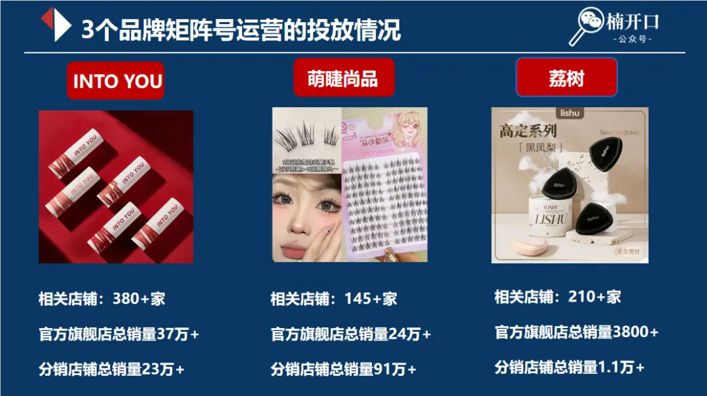

最近在小红书上出现了许多与“裸门”相关的分享笔记。这个话题从七月底开始热度逐渐上升，一直持续到现在的十月热度还在增长。

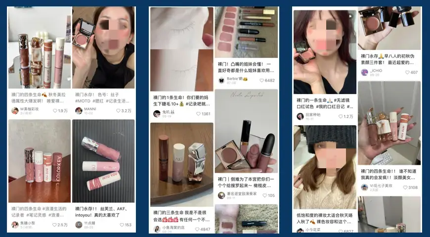

美妆品牌INTOYOU更是蹭着这个话题的热度发布了大批笔记并做了很多账号来销售自己的产品。于是我们开始对INTO YOU进行品牌研究分析，发现了他们在小红书**采用多个账号挂车卖货**的形式。

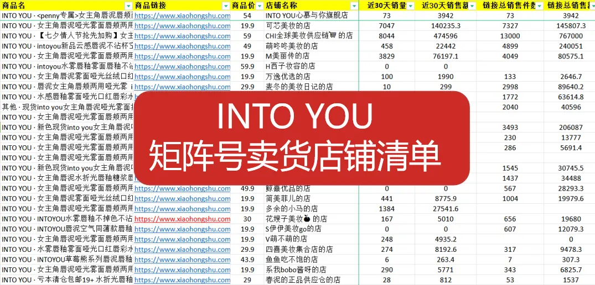

**INTO YOU**

**核心产品：** 以女主角唇泥、空气唇泥、罐装唇泥系列唇泥产品为主，主打哑光妆效+口红腮红两用功效。**客单价：**59元**特点：**小红书以多个账号挂车卖货为主，其主要内容是唇妆展示，并伴随着巨大的价格落差优势。**（19.9元/17.9元）**

以下是对INTO YOU的部分数据整理（ps：由于数据的抓取可能不够完整，存在一定的误差，所以相关数据仅供参考。）

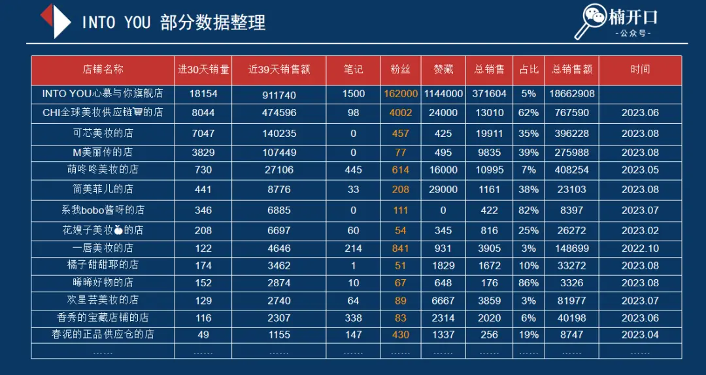

（数据来源：蝉小红）

由对相关数据的分析可知，除了INTOYOU的官方旗舰店之外，还有大约380家小红书店铺在上线销售他们的产品。其中，在过去的30天内有100多家店铺产生了直接的销量。这些店铺大多是在近3个月开始售卖INTO YOU相关产品的，大部分账号粉丝数量基本上没有超过1000。同时，从分销与整个官方旗舰店的占比来看，分销店铺一共贡献了大约23万件销量，而官方旗舰店贡献了约37万件，**分销量占到了总销量的40%左右。**

**以下分析了2家较为典型的分销店铺。**

**萌咚咚美妆的店**

**店铺情况介绍**：以卖INTO YOU、FLORTTE、橘朵等多个品牌的唇妆产品为主，INTO YOU相关产品近30天销量为730件，占到总销量的7%，相关产品总销售额超过40万。

萌咚咚美妆的店账号的笔记内容形态大致相同，我们对其曝光量较大的笔记进行分析，发现账号发布的内容形态如下：**并非是典型的达人账号逻辑，而是热门素材剪辑买货的逻辑**，明显发现账号笔记中的博主不是同一个人，基本上都是这个品牌在各个平台做的比较好的素材的合集或者混剪。

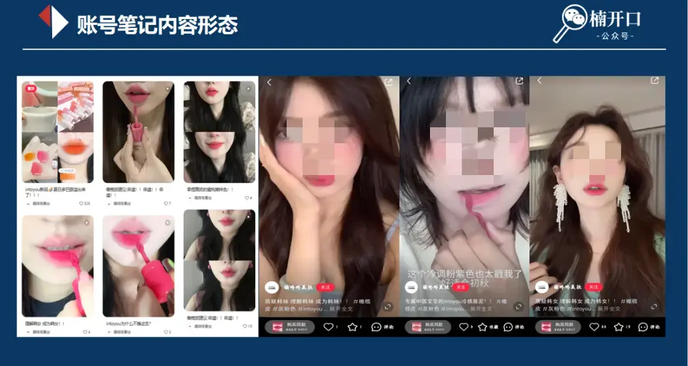

（图片来源：小红书）

在转化上，小红书店铺产品售价比天猫旗舰店的价格低，具有明显的价格优势，容易形成转化。

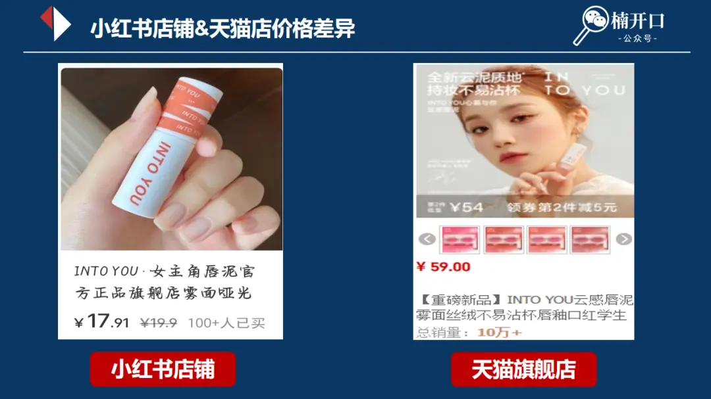

（图片来源：小红书&淘宝）

**简美菲儿的店**

**店铺情况：**以卖INTO YOU、FLORTTE、AKF等多个品牌的唇妆产品为主；INTO YOU相关产品近30天销量441件，占到总销量的38%，相关产品总销售额约为2.3万；简美菲儿账号的粉丝量是非常小的，从整个账号内容生态来看，**它也不是自制的内容，属于热门素材的合集，但是有加上了一些自己拍摄的内容形态。**该账号的爆文基本上都属于之前比较热门内容素材的混剪素材/截图拼图。

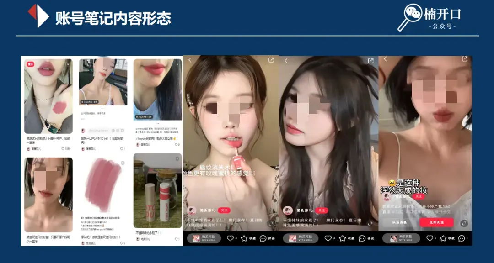

（图片来源：小红书）

在转化上，简美菲儿店铺的商品价格更是远低于官方旗舰店，基本上是官方旗舰店半价的折扣在售卖。

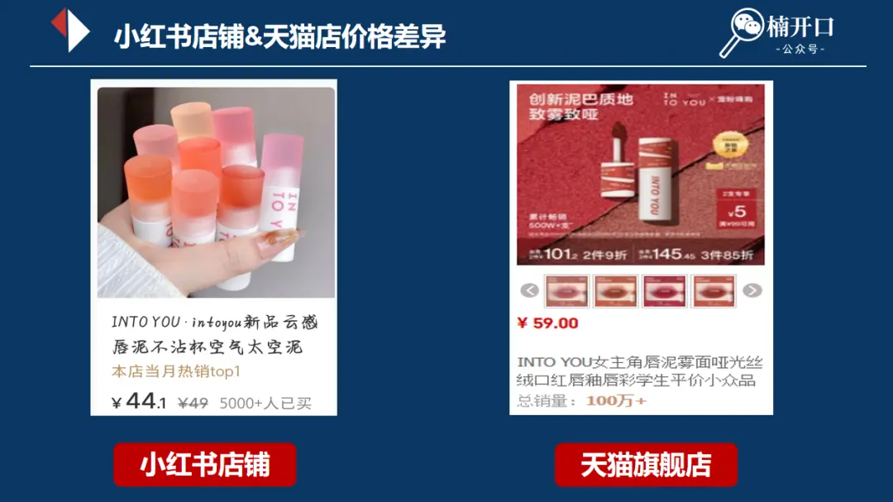

（图片来源：小红书&淘宝）

上面的2个账号还有1个共同的特征就是它们都是**企业认证号。**个人账号可以通过关联企业认证号联通认证号的店铺，这使得用户可以从多个账号的端口进入小店，同时个人账号还可以通过发布相关笔记，获取流量曝光，从而带动更多的产品销量。通过对以上的分析，能够总结出INTO YOU多店铺售卖获得成功是因为具备了以下的3个关键因素。

### 1.  持续的内容更新

INTO YOU是一个在小红书平台有非常大曝光的品牌，其拥有大量的优质内容素材，形成了庞大的内容素材库。这些内容素材具有很高的可复制性，可以供分销店铺进行混剪创作，从而解决了内容产出的难题，保证每个账号都能有持续的内容更新。

### 2、 内容能够爆量

有些店铺采用了利益诱导机制“惊喜盒子”增加评论区的留言，同时依靠“裸门”的热点话题不断输出相关内容。以微醺少女账号为例，几乎所有的内容都引导大家评论处发“惊喜盒子”展开，发送关键词就会有相关的优惠券掉落。这迎合了大多数人喜欢占便宜的心理，随着内容的互动变高，保证了整个账号的热度。

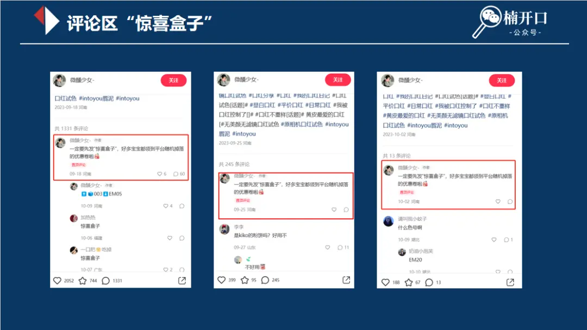

（图片来源：小红书）

### 3. 高的产品转化率

小红书店铺INTO YOU的相关产品普遍售价为19.9元，普遍比天猫旗舰店的低，有较高的价格落差，支撑了小红店的高转化率，拉动了产品销量的增长。小红书上还有许多与INTO YOU一样通过多个账号卖货的品牌，像**橘朵、尔木萄、红地球和unny club**等，这些品牌都是一些在淘系有大量分销的品牌，他们不像INTO YOU一样以近3个月成长起来的一些新账号去进行商品售卖，而是依靠一些在小红书有了一定成绩的**供应链店铺**，比如上面介绍到的萌咚咚美妆的店，来进行产品的分销售卖。

这些品牌在小红书上的渠道还是**以官店为主，其它的分销账号并没有产生很大的销量，**因此他们都算不上是典型性的把整个小红书矩阵号当成核心业务的品牌。

**但是还是有和INTO YOU一样非常具有典型性的在小红书通过矩阵号去卖货的品牌，他们就是接下来分享到的萌睫尚品和荔树。**

萌睫尚品的假睫毛产品在9月份时一直都在top30的带货内容榜单上，且当时出现了多家不同的店铺都有高销量的情况，**它是一个非常典型的供应链产品，走的是单品、爆品的道路。**

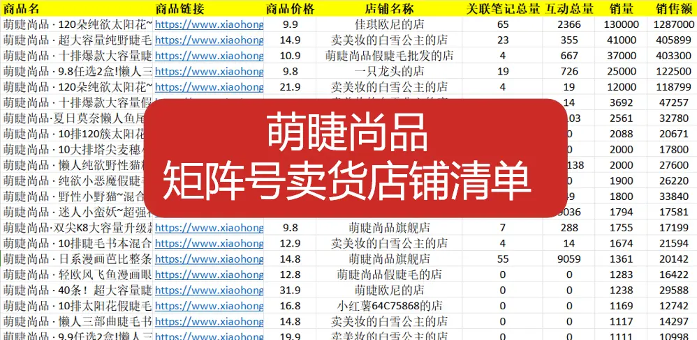

**萌睫尚品**

**核心产品：** 太阳花假睫毛、猫耳朵假睫毛、小野兔假睫毛等假睫毛类产品**客单价：**9.8元**特点：**小红书以多个账号自制内容挂车卖货为主；所有内容自制，内容主要是以产品展示，突出超级性价比优势。

小红书至少有145家店铺在售卖相关产品，近30天产生了直接销量的店铺有60多家。

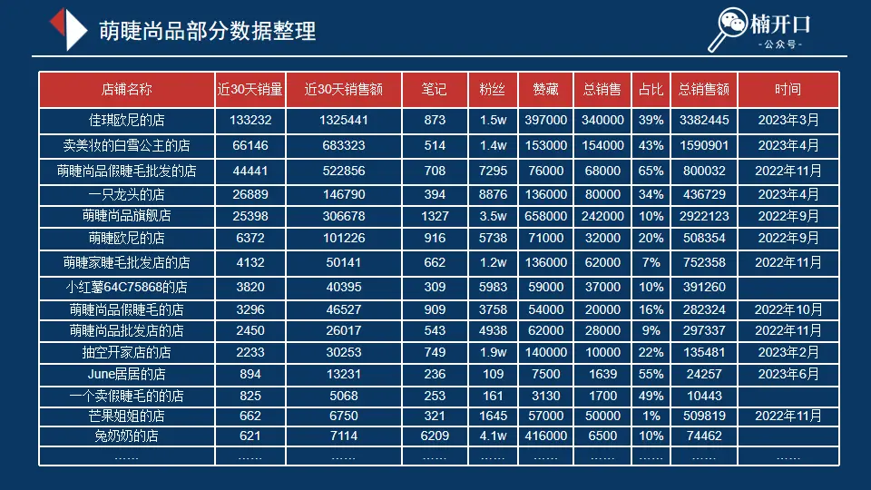

（数据来源：蝉小红）

对萌睫尚品进行数据整理时是在9月中旬（ps：由于数据的抓取可能不够完整，存在一定的误差，所以相关数据仅供参考。）当时它近30天的销量在32万件左右，总销量累计超过116万件，近30天销量更是占到总销量的30%左右。**近期销量的增长也能窥探平台对电商业务的态度。**不同于INTO YOU，萌睫尚品的官方旗舰店相关销量在所有的店铺中并不是最大的，**一些分销店售卖得非常成功，销量远超旗舰店。**

同时我们从店铺的名称看到有**“萌睫尚品假睫毛批发的店”“萌睫家睫毛批发店的店”“萌睫尚品假睫毛的店”**等，由此我们可以发现它与INTO YOU的策略是不同的，品牌方自己内部组建了矩阵号，而INTO YOU是从外部来进行分销的。

**以下是对其销量最高店铺进行的分析。**

**佳琪欧尼的店**

店铺情况：主要售卖萌睫尚品的眼睫毛产品的产品。近30天销量13万+，销售额132万+。店铺的带货内容形态基本上是接近的，**相似的封面，突出超低价格的标题，简单的笔记内容，**除了内容形态之外，就是同样的评论引导“**惊喜盒子”关键词**逻辑，让内容更爆，更有热度。

（图片来源：小红书）

笔记标题突出 **9.9元120簇**，主要通过超低价来吸引流量，拉动销量增长。

萌睫尚品的矩阵号卖货逻辑也具备了和INTO YOU相同的3个关键特征：

### 1. 持续的内容更新

萌睫尚品在小红书平台上自己建立了一套低门槛的内容生产逻辑，以产品实拍内容为主，同时品牌还招募了大量用户进行晒单，用户在评论区晒单可以获得免单或返现的机会，这不仅满足了消费者的心理需求，同时丰富了品牌内容素材库。这一逻辑使得品牌可以以较低的成本进行内容创作，并且这些内容具有可复制性。

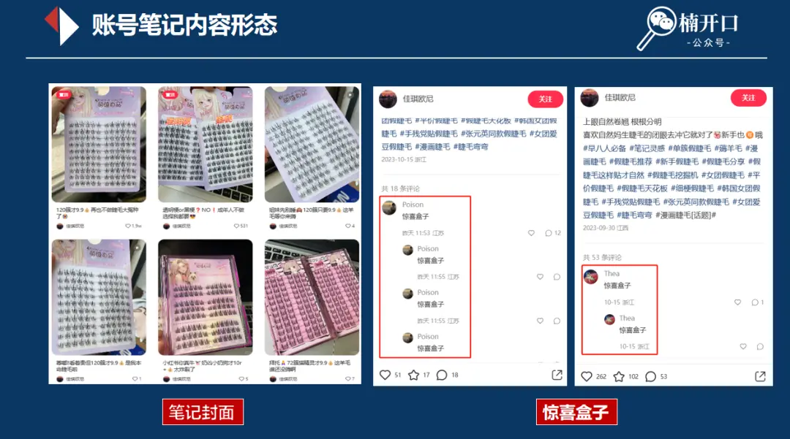

### 2. 内容能够爆量

萌睫尚品同样通过“惊喜盒子”拉高评论区的评论，增加流量曝光；同时晒图返现或免单的活动也为其带来了一定的曝光。

在这个阶段，有人可能会问，这类账号是否需要进行投放流量？为了回答这个问题，我们可以进行投产比的分析。以萌睫尚品为例，其主打卖点是9.9元商品。即使是最便宜的薯条投放，其点赞成本也大致在2.1元左右。然而，并不是每一个点赞都能转化为实际的购买行为。如果假设每5个点赞才能形成一个转化，那么投放流量的成本就达到了11元。对于售价为9.9元的商品来说，这是不现实的。**换句话说，这类内容并不适合进行投放流量，因为其利润空间很难支撑起投放流量的成本。**

### 3. 高的产品转化率

萌睫尚品以其超低价格，拉动产品销量的增长，“9.9元120簇”极大地挑动了用户的消费热情。用户对于这一类“9.9商品”往往不会有这是一种盲目消费的心理压力，反正足够便宜。**萌睫尚品刚好是INTO YOU在小红书上玩法的一个补充。INTO YOU通过供应链端口进行售卖，而萌睫尚品则通过自身构建的矩阵号来实现销售。**虽然这2个品牌采用了不同的逻辑来销售商品，但它们打法的成功都围绕着**大量可复制的优质内容素材、大量的内容曝光以及高转化率**这3个关键因素，这3个要素对达成kos矩阵出货卖上量的结果而言缺一不可，否则很难达成事半功倍的效果。下面分析的品牌恰好就是这种模式下关键要素没有做好的一个典型应用案例。

荔树这个品牌目前在抖音销售过亿，近期小红书的多个店铺也上线了其相关产品，核心推荐的是**黑凤梨粉扑**。

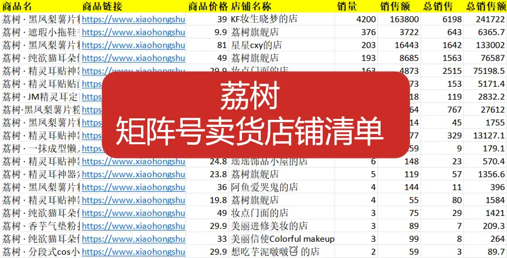

**荔树**

**核心产品：** 荔树粉扑、假睫毛 **客单价：** 38元 **特点：** 小红书除旗舰店外有多个分销店铺，使用产品测试、产品横测等笔记内容形式，具有一定的价格落差。

目前小红书上有210家左右的店铺在售卖其产品，近30天有直接销量的小店有24家，销量相对于INTO YOU和萌睫尚品来说比较小，合作销售的店铺有10家左右。（ps：由于数据的抓取可能不够完整，存在一定的误差，所以相关数据仅供参考。）

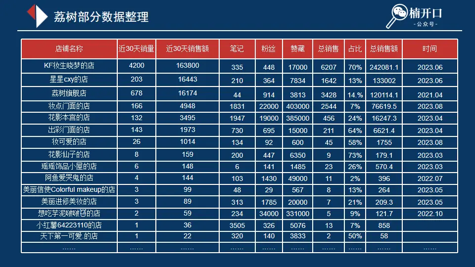

（数据来源：蝉小红）

荔树的黑凤梨粉扑在抖音有大量的达人推广，内容素材积累了足够多量，这就解决了内容储备量的问题，提供了可复制模版。

**以下是选了其中店铺销量最好的进行分析。**

**KF妆生晓梦的店**

**店铺情况：** 主要售卖粉扑、眼线笔、修容笔和唇线笔等美妆工具。近30天销量4200件，占到总销量的70%，总销售额24万+。账号的笔记的内容形态大致相同，简单的产品图作为封面，**笔记标题突出“不吃粉”、“服帖”** 等特点，相关的视频笔记也做了不吃粉测试或者粉扑类产品的横测。通过对比可以清楚地发现**其视频素材明显不是同一个人，而是对优质内容素材的搬运剪辑。**

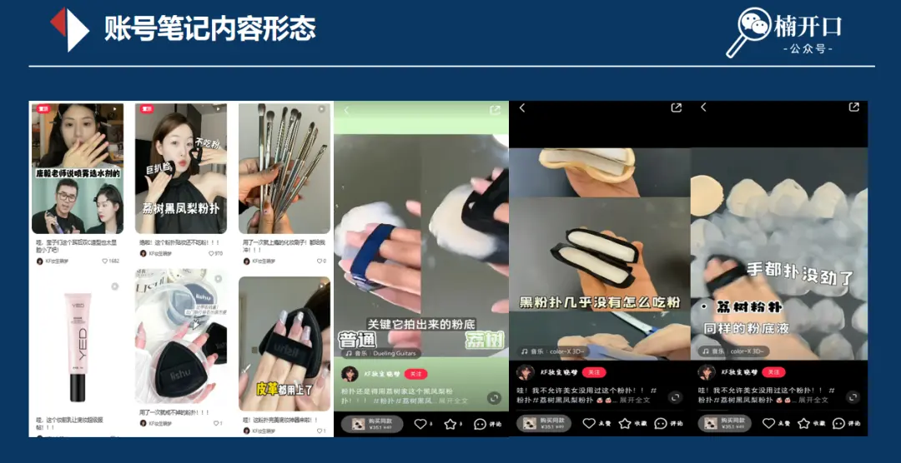

（图片来源：小红书）

价格落差但相对较小，几乎与天猫店铺和抖店相同，价格优势不够明显。相对于粉扑类产品来说它并不具备太大的价格优势，因此没有形成很大的转化，导致没法带来销量的暴涨。

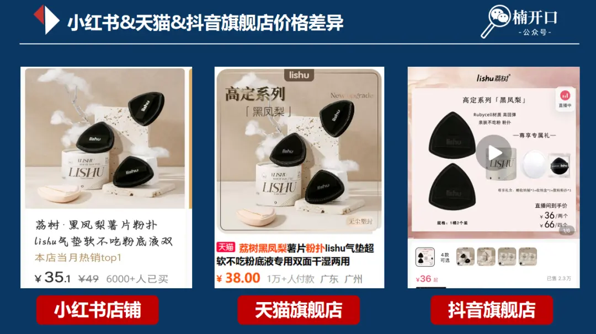

（图片来源：小红书&淘宝&抖音）

此外，在对荔树的研究和分析中，我们还发现了**一些店铺之间的重合率非常高**，这些店铺并不只售卖单一品牌的产品。由此我们对一些数据进行了统合，以下是相关结论：我们所研究的品牌共**覆盖了1390家店铺，其中接近400家店铺至少在售卖2个品牌的产品。**

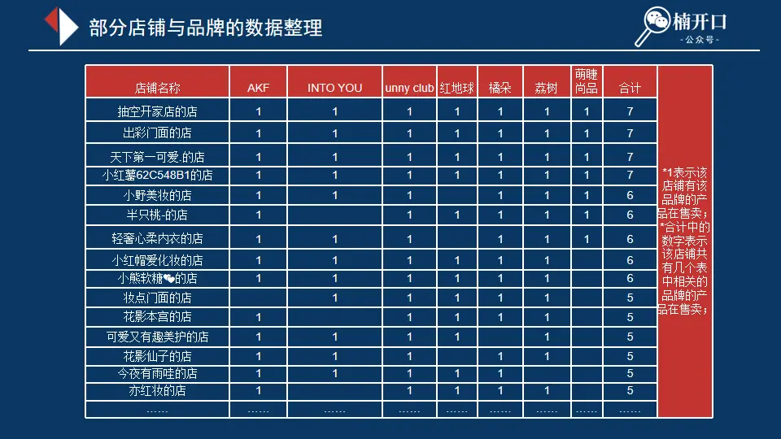

（数据来源：蝉小红）

这些店铺基本上都是**以个人逻辑经营的，它们通常涵盖3到5个甚至更多的品牌**，且在小红书平台上已经积累了一定数量的粉丝。对于那些在全网上有一定曝光并且已经积累了足够多的内容素材的品牌来说，与这些重合率高的店铺进行初步合作是一个快速看到经济成效的方式。**通过与这些店铺合作，品牌可以迅速扩大自己的影响力，并通过店铺的粉丝群体进行产品推广和销售。**这种合作关系可以为品牌带来更多的曝光和销售机会，而对于店铺来说，与知名品牌合作也可以增强其在市场中的竞争力和吸引力。通过共同合作，品牌和店铺可以实现互利共赢的局面。

关于品牌店铺的信息我们已经做了整理，方便有想在小红书上进行分销合作卖货需求的品牌直接进行对接。具体可以找我进行领取！

这就是本期对发现的小红书矩阵号卖货新生态的全部探讨和分析，虽然它的打法没办法适配所有的品牌，但是能给我们带来一些新增长方向/机会打法。

品牌想要在小红书培养kos，搭建属于自己的矩阵号去卖货，需要注意以下3个关键因素：

### 1. 保证有持续不断的内容输出

在这方面，小红书官方提出了一个有趣的理念，即每个人都有成为”kos”的机会。而要成为”kos”关键是具备持续不断的创作能力，无论是模仿还是自主创作能力。对品牌方来说，他们可以为”kos”提供大量优质的内容素材模板、策略和玩法，赋能它们持续创作的能力。

### 2. 内容有足够多的曝光

一些品牌已经形成了成熟的内容输出模板，积累了足够多的爆款内容素材，为kos提供运营玩法的培训，可以让他们掌握品牌的爆款逻辑，提升内容产出的爆文率，让大家能够持续不断地产出大曝光笔记。

### 3. 提高转化率

在转化方面，给予一定的价格落差能够帮助品牌方更好地在新平台上成长。

**品牌可以通过相关培训培养一批属于自己的”kos”，并通过矩阵号销售产品。同时，品牌也可以为”kos”提供相关的货源渠道和物流服务，从而实现更好的转化效果。这种策略不仅有助于品牌的发展，也能够帮助”kos”获得更好的收益和成长机会。**
