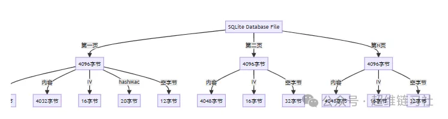

# 终于找到微信聊天记录SQLite数据库文件解密方法了，一起来看看吧！

**超维链习社**

得道前，砍柴时惦记着挑水，挑水时惦记着做饭；得道后，砍柴即砍柴，挑水即挑水，做饭即做饭。

https://github.com/xuchengsheng/

- 获取当前登录微信的微信昵称、账号、手机号、邮箱、秘钥、微信Id、文件夹路径

- 将微信PC的多个聊天记录数据库合并为单一数据库文件

- 支持微信聊天对话窗口（文本消息，引用消息，图片消息，表情消息，卡片链接消息，系统消息，等）

- 综合管理微信会话、联系人、群聊与朋友圈

- 支持导出微信各类记录(聊天记录，联系人，群聊，等)

- 查看历史朋友圈记录，超越三日限制，随时回看朋友圈历史

- 展示好友数、群聊数及今日收发消息总量的微信统计功能

- 过去15天内每日微信消息数量统计

- 最近一个月内微信互动最频繁的前10位联系人

- 展示微信消息类别占比图表

- 展示微信最近使用的关键字词云图

- 点击下载 wx-dump-4j-bin.tar.gz

- 解压缩 `wx-dump-4j-bin.tar.gz`，进入 bin 目录

- 双击`start.bat`启动文件

- 启动成功后访问：http://localhost:8080

源码方式部署

- 下载源码`git clone https://github.com/xuchengsheng/wx-dump-4j.git`

- 安装后端依赖`cd wx-dump-4j & mvn clean install`

- 使用开发工具启动 `com.xcs.wx.WxDumpApplication`

- 安装前端依赖`cd wx-dump-ui & npm install`

- 启动前端服务`npm run start`

- 访问：http://localhost:8000

### 📚实现原理

- 微信SQLite数据库文件解密实现，基于HmacSHA1的安全解密算法

### ⛔️使用限制

本软件仅适用于Windows操作系统。我们目前不支持macOS、Linux或其他操作系统。如果你在尝试在非Windows系统上运行本软件时可能遇到兼容性问题，这些问题可能导致软件无法正常运行或产生其他意外后果。

| 操作系统    | 支持情况 |
| ------- | ---- |
| Windows | 支持   |
| macOS   | 不支持  |
| Linux   | 不支持  |

## 微信SQLite数据库文件解密实现

- 微信SQLite数据库文件解密实现

- SQLite页结构描述

- SQLite页结构图

- 解密实现过程

- 源码地址

#### SQLite页结构描述

微信`SQLite`数据库文件以每个页面4096字节的大小进行划分，这些页面组成了文件的基本结构。每个页面内部包含了关键的元素，包括盐值、加密后的内容、初始化向量（`IV`）、哈希值（`hashMac`），以及用于保留的空字节。这个结构在整个数据库文件中起到了关键的组织和安全保障的作用。

首个页面是独特的，它包含了生成加密密钥所需的盐值、加密后的内容、初始化向量（`IV`）、哈希值（`hashMac`），以及用于保留的空字节。盐值在加密密钥生成过程中发挥着关键的作用，而哈希值则用于验证密钥的正确性，提供了额外的安全层。空字节的存在为未来可能的拓展或变化预留了空间。

随后的页面结构与首个页面相似，仍然包括了加密后的内容、初始化向量（`IV`）以及用于保留的空字节。这种一致性的结构确保了整个数据库文件的统一性和安全性，使得每个页面都能够独立存储经过加密的数据块，并在需要时通过初始化向量进行解密。这种巧妙的设计使得`SQLite`数据库文件在存储和保护数据方面表现出色。

#### SQLite页结构图



解密实现过程

`DecryptServiceImpl`类是一个解密服务的实现，专门用于解密`SQLite`数据库文件。首先，它定义了`SQLite`数据库文件的文件头、加密算法（`HmacSHA1`）、页面大小（4096字节）、迭代次数（64000次）以及密钥长度（32字节）。主要功能由`wechatDecrypt`方法实现，该方法接收密码和解密业务对象作为参数。

在`wechatDecrypt`方法内部，首先通过`FileInputStream`读取数据库文件内容，提取文件头、盐值、第一页信息，包括内容、IV、`hashMac`和保留字段。随后，利用`PBKDF2`算法和用户提供的密码生成密钥，并根据提取的盐值和`hashMac`验证密钥的正确性。

如果密钥验证成功，便创建输出文件，写入`SQLite`文件头，并对第一页进行解密，写入解密后的内容和保留字段。接着，循环处理后续数据块，逐一解密并写入到输出文件。整个过程保证了对`SQLite`数据库文件的完整性和保密性的维护。

在解密过程中，`doDecrypt`方法使用`AES/CBC/NoPadding`模式对数据进行解密。为了处理大文件，`splitDataPages`方法将文件内容分割成多个页面进行逐一处理。

最后，通过`checkKey`方法检查密钥的有效性，确保解密过程中密钥的正确性。该类结合了多重密码学技术，保障了对`SQLite`数据库文件的高效且安全的解密操作。

```cpp
public class DecryptServiceImpl implements DecryptService {

    /**
     * SQLite数据库的文件头
     */
    private static final String SQLITE_FILE_HEADER = "SQLite format 3\u0000";

    /**
     * 算法
     */
    private static final String ALGORITHM = "HmacSHA1";

    /**
     * 一页的大小
     */
    private static final int DEFAULT_PAGESIZE = 4096;

    /**
     * 迭代次数
     */
    private static final int ITERATIONS = 64000;

    /**
     * Key长度
     */
    private static final int HASH_KEY_LENGTH = 32;

    @Override
    public void wechatDecrypt(String password, DecryptBO decryptBO) {
        // 创建File文件
        File file = new File(decryptBO.getInput());

        try (FileInputStream fis = new FileInputStream(file)) {
            // 文件大小
            byte[] fileContent = new byte[(int) file.length()];
            // 读取内容
            fis.read(fileContent);

            // 提取盐值
            byte[] salt = Arrays.copyOfRange(fileContent, 0, 16);
            // 提取第一页
            byte[] firstPage = Arrays.copyOfRange(fileContent, 16, DEFAULT_PAGESIZE);
            // 提取第一页的内容与IV
            byte[] firstPageBodyAndIv = Arrays.copyOfRange(firstPage, 0, firstPage.length - 32);
            // 提取第一页的内容
            byte[] firstPageBody = Arrays.copyOfRange(firstPage, 0, firstPage.length - 48);
            // 提取第一页IV
            byte[] firstPageIv = Arrays.copyOfRange(firstPage, firstPage.length - 48, firstPage.length - 32);
            // 提取第一页的hashMac
            byte[] firstPageHashMac = Arrays.copyOfRange(firstPage, firstPage.length - 32, firstPage.length - 12);
            // 提取第一页的保留字段
            byte[] firstPageReservedSegment = Arrays.copyOfRange(firstPage, firstPage.length - 48, firstPage.length);

            // 生成key
            byte[] key = Pbkdf2HmacUtil.pbkdf2Hmac(ALGORITHM, HexUtil.decodeHex(password), salt, ITERATIONS, HASH_KEY_LENGTH);

            byte[] macSalt = new byte[salt.length];
            for (int i = 0; i < salt.length; i++) {
                macSalt[i] = (byte) (salt[i] ^ 58);
            }
            // 秘钥匹配成功
            if (checkKey(key, macSalt, firstPageHashMac, firstPageBodyAndIv)) {
                File outputFile = new File(decryptBO.getOutput());
                File parentDir = outputFile.getParentFile();

                // 检查父目录是否存在，如果不存在，则创建
                if (!parentDir.exists()) {
                    parentDir.mkdirs();
                }

                // 解密并写入新文件
                try (FileOutputStream deFile = new FileOutputStream(outputFile)) {
                    deFile.write(SQLITE_FILE_HEADER.getBytes());
                    deFile.write(doDecrypt(key, firstPageIv, firstPageBody));
                    deFile.write(firstPageReservedSegment);
                    // 解密后续数据块
                    for (byte[] page : splitDataPages(fileContent)) {
                        byte[] iv = Arrays.copyOfRange(page, page.length - 48, page.length - 32);
                        byte[] body = Arrays.copyOfRange(page, 0, page.length - 48);
                        byte[] reservedSegment = Arrays.copyOfRange(page, page.length - 48, page.length);
                        deFile.write(doDecrypt(key, iv, body));
                        deFile.write(reservedSegment);
                    }
                }
            }
        } catch (Exception e) {
            e.printStackTrace();
        }
    }

    /**
     * 使用AES/CBC/NoPadding模式进行解密
     *
     * @param key   密钥
     * @param iv    初始化向量
     * @param input 待解密的数据
     * @return 解密后的数据
     * @throws GeneralSecurityException 抛出异常
     */
    private byte[] doDecrypt(byte[] key, byte[] iv, byte[] input) throws GeneralSecurityException {
        Cipher cipher = Cipher.getInstance("AES/CBC/NoPadding");
        SecretKeySpec secretKeySpec = new SecretKeySpec(key, "AES");
        IvParameterSpec ivParameterSpec = new IvParameterSpec(iv);
        cipher.init(Cipher.DECRYPT_MODE, secretKeySpec, ivParameterSpec);
        return cipher.doFinal(input);
    }

    /**
     * 将数据分割成多个页面
     *
     * @param fileContent 文件内容的字节数组
     * @return 分割后的页面列表
     */
    private List<byte[]> splitDataPages(byte[] fileContent) {
        List<byte[]> pages = new ArrayList<>();
        for (int i = DEFAULT_PAGESIZE; i < fileContent.length; i += DEFAULT_PAGESIZE) {
            // 计算每个分割页面的结束位置
            int end = Math.min(i + DEFAULT_PAGESIZE, fileContent.length);
            byte[] slice = new byte[end - i];
            // 将数据复制到新的页面中
            System.arraycopy(fileContent, i, slice, 0, slice.length);
            pages.add(slice);
        }
        return pages;
    }

    /**
     * 检查密钥是否有效
     *
     * @param byteKey 密钥的字节数组
     * @param macSalt MAC盐值
     * @param hashMac 预期的MAC哈希值
     * @param message 消息内容
     * @return 如果密钥有效返回true，否则返回false
     * @throws Exception 抛出异常
     */
    private boolean checkKey(byte[] byteKey, byte[] macSalt, byte[] hashMac, byte[] message) throws Exception {
        // 使用PBKDF2算法生成MAC密钥
        byte[] macKey = Pbkdf2HmacUtil.pbkdf2Hmac(ALGORITHM, byteKey, macSalt, 2, 32);
        Mac mac = Mac.getInstance(ALGORITHM);
        SecretKeySpec keySpec = new SecretKeySpec(macKey, ALGORITHM);
        mac.init(keySpec);
        // 更新MAC计算的消息内容
        mac.update(message);
        // 添加额外的数据到消息中
        mac.update(new byte[]{1, 0, 0, 0});
        // 比较计算出的MAC值和预期的MAC值是否相同
        return Arrays.equals(hashMac, mac.doFinal());
    }
}
```

- https://github.com/xuchengsheng/wx-dump-4j
