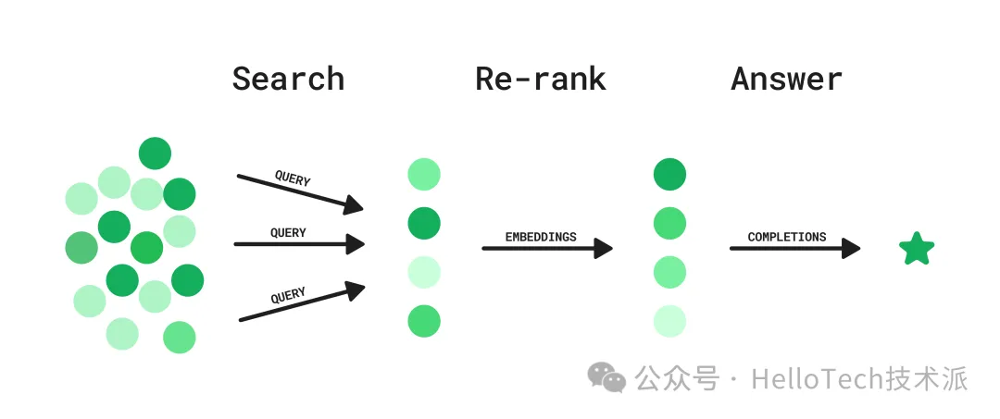

### 问题概述

搜索相关信息有时感觉就像大海捞针，但不要绝望，GPT 实际上可以为我们做很多这样的工作。在本文中，我们探索了一种使用各种 AI 技术增强现有搜索系统的方法，帮助我们筛选有价值信息。

检索 GPT 信息的两种方法是：

- 模仿人类浏览（**Mimicking Human Browsing**）：GPT 触发搜索，评估结果，并在必要时修改搜索查询。它还可以跟进特定的搜索结果以形成思维链，就像人类用户所做的那样。

- 使用 Embeddings 进行检索（**Retrieval with Embeddings**）：计算内容和用户查询的嵌入，然后检索最相关的内容（按余弦相似度衡量）。这种技术被谷歌等搜索引擎大量使用。

这些方法都很有前途，但都有其缺点：第一种方法由于其迭代性质而可能很慢，第二种方法需要提前嵌入整个知识库，不断嵌入新内容并维护矢量数据库。

通过结合这些方法，并从重新排名方法中汲取灵感，我们确定了一种介于两者之间的方法。**这种方法可以在任何现有的搜索系统之上实现**，例如 Slack 搜索 API，也可以在包含私有数据的内部 ElasticSearch 实例上实现。其工作原理如下：



### 解决思路

**第 1 步：搜索**

1. 用户提出问题。

2. GPT 生成潜在查询列表。

3. 搜索查询并行执行。

**第 2 步：重新排名**

1. 每个结果的嵌入用于计算语义相似性，以生成用户问题的假设理想答案。

2. 根据此相似性指标对结果进行排名和筛选。

**第 3 步：回答**

1. 给定排名靠前的搜索结果，该模型会生成用户问题的答案，包括引用和链接。

这种混合方法提供相对较低的延迟，并且**可以集成到任何现有的搜索 API 中，而无需维护向量数据库**。下面我们将使用新闻 API 作为示例进行搜索。

### ### 代码实现

#### 0.环境准备

设置 `OPENAI_API_KEY`、 `NEWS_API_KEY` 环境变量。

准备工具函数

```python
# Dependencies
from datetime import date, timedelta  # date handling for fetching recent news
from IPython import display  # for pretty printing
import json  # for parsing the JSON api responses and model outputs
from numpy import dot  # for cosine similarity
from openai import OpenAI
import os  # for loading environment variables
import requests  # for making the API requests
from tqdm.notebook import tqdm  # for printing progress bars

client = OpenAI(api_key=os.environ.get("OPENAI_API_KEY", "<your OpenAI API key if not set as env var>"))

# Load environment variables
news_api_key = os.getenv("NEWS_API_KEY")

GPT_MODEL = "gpt-3.5-turbo"


# Helper functions
def json_gpt(input: str):
    completion = client.chat.completions.create(model=GPT_MODEL,
      messages=[
        {"role": "system", "content": "Output only valid JSON"},
        {"role": "user", "content": input},
      ],  
    temperature=0.5)

    text = completion.choices[0].message.content
    parsed = json.loads(text)

    return parsed


def embeddings(input: list[str]) -> list[list[str]]:
    response = client.embeddings.create(model="text-embedding-3-small", input=input)
    return [data.embedding for data in response.data]
```

#### 1. 搜索

用户提出问题

```python
# User asks a question
USER_QUESTION = "Who won the NBA championship? And who was the MVP? Tell me a bit about the last game."
```

现在，为了尽可能详尽，使用该模型根据此问题生成各种查询的列表。

```python
QUERIES_INPUT = f"""
You have access to a search API that returns recent news articles.
Generate an array of search queries that are relevant to this question.
Use a variation of related keywords for the queries, trying to be as general as possible.
Include as many queries as you can think of, including and excluding terms.
For example, include queries like ['keyword_1 keyword_2', 'keyword_1', 'keyword_2'].
Be creative. The more queries you include, the more likely you are to find relevant results.

User question: {USER_QUESTION}

Format: {{"queries": ["query_1", "query_2", "query_3"]}}
"""

queries = json_gpt(QUERIES_INPUT)["queries"]

# Let's include the original question as well for good measure
queries.append(USER_QUESTION)

queries
```

输出如下：

```python
['NBA championship winner',
 'MVP of NBA championship',
 'Last game of NBA championship',
 'NBA finals winner',
 'Most valuable player of NBA championship',
 'Finals game of NBA',
 'Who won the NBA finals',
 'NBA championship game summary',
 'NBA finals MVP',
 'Champion of NBA playoffs',
 'NBA finals last game highlights',
 'NBA championship series result',
 'NBA finals game score',
 'NBA finals game recap',
 'NBA champion team and player',
 'NBA finals statistics',
 'NBA championship final score',
 'NBA finals best player',
 'NBA playoffs champion and MVP',
 'NBA finals game analysis',
 'Who won the NBA championship? And who was the MVP? Tell me a bit about the last game.']
```

查询生成查询效果，接下来使用这些问题运行搜索。

```python
def search_news(
    query: str,
    news_api_key: str = news_api_key,
    num_articles: int = 50,
    from_datetime: str = "2023-06-01",  # the 2023 NBA finals were played in June 2023
    to_datetime: str = "2023-06-30",
) -> dict:
    response = requests.get(
        "https://newsapi.org/v2/everything",
        params={
            "q": query,
            "apiKey": news_api_key,
            "pageSize": num_articles,
            "sortBy": "relevancy",
            "from": from_datetime,
            "to": to_datetime,
        },
    )

    return response.json()


articles = []

for query in tqdm(queries):
    result = search_news(query)
    if result["status"] == "ok":
        articles = articles + result["articles"]
    else:
        raise Exception(result["message"])

# remove duplicates
articles = list({article["url"]: article for article in articles}.values())

print("Total number of articles:", len(articles))
print("Top 5 articles of query 1:", "\n")

for article in articles[0:5]:
    print("Title:", article["title"])
    print("Description:", article["description"])
    print("Content:", article["content"][0:100] + "...")
    print()
```
