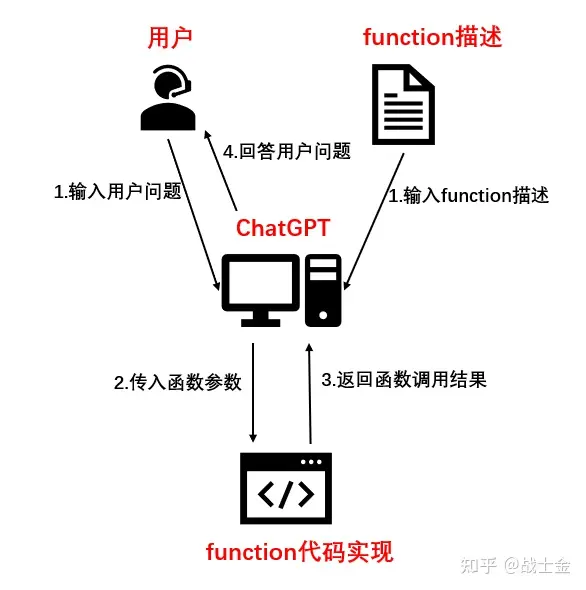

## 大模型工具调用(function call)原理及实现

## function call原理

今天ChatGLM3发布了，介绍说原生支持**工具调用（**听起来很厉害吧！），其实就是openai提供的Function Call功能。使用Function Call功能时，你需要定义（**并不是真的写程序去定义一个函数，而仅仅是用文字来描述一个函数**）一些function（需要指定函数名，函数用途的描述，参数名，参数描述），传给LLM，当用户输入一个问题时，LLM通过文本分析是否需要调用某一个function，如果需要调用，那么LLM返回一个json，json包括需要调用的function名，需要输入到function的参数名，以及参数值。总而言之，function call帮我们做了两件事情**：1.判断是否要调用某个预定义的函数。2.如果要调用，从用户输入的文本里提取出函数所需要的函数值。**

通过查询天气举个例子，这块我用openai的funciton call进行演示，chatglm3的权重还没有下完hhh：

首先我们定义一些function，如下所示，我只定义了一个查询天气的函数get_current_weather，我们需要对这个函数进行简单的描述，如“获取今天的天气”。这个函数有两个参数，分别是地点location和时间time，也需要进行文本描述。LLM根据函数描述，参数描述以及用户的输入，来决定是不是要调用这个funciton。

```python
func = {
        "name": "get_current_weather",
        "description": "获取今天的天气",
        "parameters": {
            "type": "object",
            "properties": {
                "location": {
                    "type": "string",
                    "description": "获取天气情况的城市或者国家，比如北京、东京、新加坡"
                },
                "time": {
                    "type": "string",
                    "description": "时间信息"
                },

            },
            "required": ["location", "time"]
        }
    }
```

当我们在openai的**请求里添加了funtions相关的字段**，他会增加一个判断是否需要调用function的环节。

以下以向ChatGPT输入**“10月27日北京天气怎么样”**为例：

请求里没有functions字段得到的结果如下，他会告诉你一大段答案(应该是假的)，就是走Chatgpt正常的回答。

```text
根据天气预报，10月27日北京的天气预计为晴到多云，气温较低。最高气温约为16摄氏度，最低气温约为4摄氏度。需要注意保暖措施，适时添衣物。', message=AIMessage(content='根据天气预报，10月27日北京的天气预计为晴到多云，气温较低。最高气温约为16摄氏度，最低气温约为4摄氏度。需要注意保暖措施，适时添衣物。'
```

请求里如果有functions字段，返回了一个json，并帮我们从输入文本里抽取了get_current_weather所需要的location和time的函数值（因为chatgpt训练数据截至到2021年，它还帮忙脑补了个年份hhh）。

```text
 {'name': 'get_current_weather', 'arguments': '{\n  "location": "北京",\n  "time": "2021-10-27"\n}'}
```

本质上ChatGPT不就是在帮我们在做**个文本结构化**嘛，这个有啥用呢？我们知道，ChatGPT并不能帮我们真正的去查询天气，但是我们可以真的用python去定义一个get_current_weather函数，在这个函数里，编写程序（调用查询天气的工具包）去实现查询天气的功能，函数的输入就用ChatGPT返回的json里的内容，相当于我们通过编程帮ChatGPT提供了一个查询天气的工具，因此也可以管function call叫做“工具调用”。get_current_weather返回天气信息给ChatGPT，ChatGPT再回答给用户。整体流程如下图所示。我们可以定义各种功能的函数帮ChatGPT完成任务，比如查询网页，算数等，因此工具调用对于agent来说非常重要。



### chatglm3 function call实现原理

把chatglm2和chatglm3模型文件diff一下就能发现，代码改动很少，增加了几个新的token，增加一些处理function字符串的逻辑。chatglm3官方function call示例如下，和chatgpt 定义的function结构几乎就是一致的。将包含函数描述的system_info 变量通过history传入到LLM的chat接口里。

```python
tools = [
    {
        "name": "track",
        "description": "追踪指定股票的实时价格",
        "parameters": {
            "type": "object",
            "properties": {
                "symbol": {
                    "description": "需要追踪的股票代码"
                }
            },
            "required": ['symbol']
        }
    },
    {
        "name": "text-to-speech",
        "description": "将文本转换为语音",
        "parameters": {
            "type": "object",
            "properties": {
                "text": {
                    "description": "需要转换成语音的文本"
                },
                "voice": {
                    "description": "要使用的语音类型（男声、女声等）"
                },
                "speed": {
                    "description": "语音的速度（快、中等、慢等）"
                }
            },
            "required": ['text']
        }
    }
]
system_info = {"role": "system", "content": "Answer the following questions as best as you can. You have access to the following tools:", "tools": tools}

history = [system_info]
query = "帮我查询股票10111的价格"
response, history = model.chat(tokenizer, query, history=history)
print(response)
```

接下来，chatglm3的chat接口调用了tokenization_chatglm.py里边的build_chat_input函数，处理history的内容，具体代码如下。嗯，就是直接把json格式的函数描述（存在item["tools"]里）直接转换成了字符串，然后和其他输入一并送入LLM，就是这么简单。**归根到底function call能力就是在prompt上边做了手脚**。那为什么chatglm3比别的模型更加强调自己工具调用能力强呢？当然是微调时候有function call格式的数据啦！

```python

```


