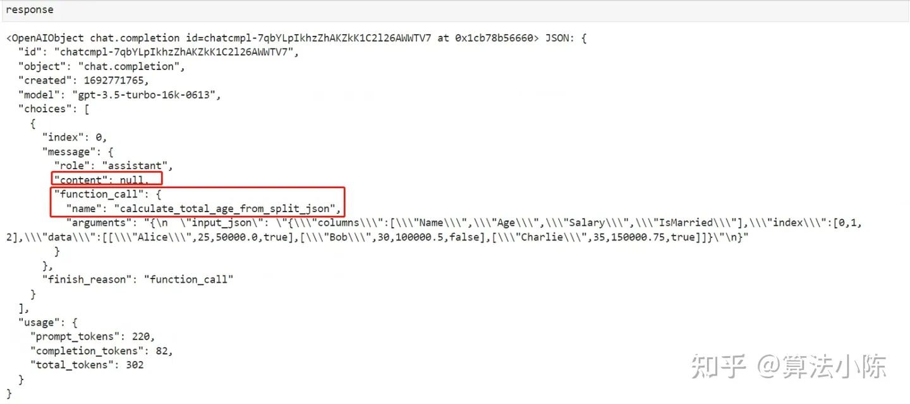

## Function calling功能的实际应用流程与案例解析

**本文目标：介绍Chat Completions模型的Function calling参数和使用方法，并完整的实现一个Chat模型的Function calling功能案例。**


## 一、介绍

**你能想象到如果大模型可以接入互联网，且具备通过API的方式实现类似于ChatGPT的插件的数据能力后，它将会变的多强吗？**

我们都知道大模型的知识库是截至到2021年9月份，这也就意味着在这个日期之后的知识它是一无所知的，尽管可以通过激发它的涌现能力让它具备一定的推理能力，但固有的知识是没办法涌现出来的，比如我们的国产开源大模型之光ChatGLM：


所以能够看出：大模型（LLMs）尽管能力很强且具备非常强大的涌现能力，但是也存在一些局限性，显而易见的问题就是：**它无法获取最新的信息数据、只能给出文字的建议但无法直接解决某些问题**，比如想问大模型：“今天的天气怎么样？“ ，这种简单的场景都无法做到，所以极大程度限制了大语言模型实际应用价值。

于是在2023年4月，AutoGPT针对这种情况提出：**要赋予大语言模型调用外部API的能力。**比如，如果能够让GPT模型调用谷歌邮箱API（Gmail API），则可以自动让GPT模型读取邮件，并自动进行回复等等。在这一背景下，**OpenAI在0613的更新中为目前最先进的Chat Completions 模型增加了Function calling功能**

别小看这个功能，它彻底改变了开发者与AI模型互动的方式。**这个功能允许开发者描述函数给AI模型，然后模型可以智能地决定输出一个包含调用这些函数的参数的JSON对象**。当大模型不具备Function Calling（函数调用）能力之前，开发者想基于大模型开发AI应用的流程是这样的：


而Function Calling的本质是让大语言模型调用外部函数的能力，即Chat Completions模型可以不再仅仅根据自身的数据库知识进行回答，而是可以额外挂载一个函数库，然后根据用户提问去函数库检索，按照实际需求调用外部函数并获取函数运行结果，再基于函数运行结果进行回答。其基本过程如下：


**简单理解就是：根据业务场景，自动选择对应的功能函数，并格式化输出。** 可以是简单的自定义函数，也可以是一个封装了外部工具API的功能型函数，例如一个可以调用谷歌邮箱的函数、或者一个可以获取天气信息的函数。最后看下对比图：


## **二、Function calling的实现过程**

看似复杂，实际上很简单，OpenAI已经帮我们做好了：**提前定义外部函数库，在ChatCompletions.create()函数中进行对应的参数设置**。

**所谓的外部函数库，可以理解为：当进行某一项应用开发时，需要用到的中间处理逻辑函数**，比如你要开发一个邮件自动回复程序，你就需要定义：

- 获取邮件的函数
- 发送邮件的函数
- .......

**在Chat Completion 模型执行Function calling功能时，大模型能够充分发挥自身的语义理解能力，解析用户的输入，然后在函数库中自动挑选出最合适函数进行运行，并给出问题的答案，整个过程不需要人工手动干预。**

## **2.1 如何正确构建外部函数库**

**虽然Chat Completion模型具有函数调用（Function Calling）能力，但其对函数的理解方式并不与传统编程环境下的函数相同**。类似于对话中有效的Prompt设计，优化函数调用的格式和结构能显著提升模型的执行准确性。因此，明确合适的数据传入格式成为关键一步，只有当数据格式设计得当，模型才能更准确地理解和执行任务。

首先从数据的传入格式来看。

### **2.1.1 输入数据格式**

### **2.1.1.1 DataFrame/字符串数据格式**

在pandas库中，两个主要的数据结构是`DataFrame`和`Series`，大多数也都是使用DataFrame结构进行数据处理任务，所以可以创建一个DataFrame数据示例来测试下大模型是否能够理解这种数据格式。

- **数据准备**

```python
 # 创建一个稍微复杂的DataFrame，包含多种数据类型
 df_complex = pd.DataFrame({
     'Name': ['Alice', 'Bob', 'Charlie'],
     'Age': [25, 30, 35],
     'Salary': [50000.0, 100000.5, 150000.75],
     'IsMarried': [True, False, True]
 })
```

输出如下：


- **验证**

传入大模型，看下模型的是否能够解读数据。

```python
 response = openai.ChatCompletion.create(
   model="gpt-3.5-turbo-16k-0613",
   messages=[
     {"role": "system", "content": "你是一位优秀的数据分析师，现在有这样一份数据集：'%s'" % df_complex},
     {"role": "user", "content": "请解释一下这个数据集的分布情况"}
   ]
 )
```

输出如下：

```python
 response.choices[0].message['content']
```


### **2.1.1.2 JSON数据格式**

**OpenAI官方推荐的数据交互格式是：JSON**。从上述的例子中也能看出，虽然大模型可以正确解读DataFrame/字符串类型的数据，但是数据的可读性并不强。同时在程序测试过程中也发现，当数据很大的时候，大模型有也并不能非常准确的将字符串对象识别为DataFrame对象类型。而JSON作为跨函数、跨平台和跨语言的数据格式。其轻量级和纯文本特性也使其在网络传输中非常高效。

**所以：更为通用的方法是借助JSON格式进行跨函数和跨编程环境的通信。**

- **数据准备**

在Python的pandas库中，将DataFrame转换为JSON格式非常简单。直接使用`DataFrame`对象的`to_json`方法实现这一操作。

```python
 # 将DataFrame转换为JSON格式,orient='split'参数将数据、索引和列分开存储
 df_complex_json = df_complex.to_json(orient='split')
 ​
 print(df_complex_json)
```

- 验证

```python
 response = openai.ChatCompletion.create(
   model="gpt-3.5-turbo-16k-0613",
   messages=[
     {"role": "system", "content": "你是一位优秀的数据分析师，现在有这样一份数据集：'%s'" % df_complex_json},
     {"role": "user", "content": "请解释一下这个数据集的分布情况"}
   ]
 )
```

看下模型解析情况：


**模型能够正常识别JSON对象类型，且经过多次测试发现，JSON的数据形式能得到更清晰的解读，同时JSON对象本身的可读性更强。**

### **2.1.2 编写函数规范**

在使用Function Calling（函数调用）与Chat Completion模型进行交互时，**当选定了关键的输入数据格式后，函数编写的规范也同等重要**，至少应具备：

1. **明确的函数名**: 选择一个清晰、描述性强的函数名。
2. **参数顺序和命名**: 参数应有逻辑顺序，并使用描述性强的名称。
3. **详细的函数描述**：要对函数功能和设置的参数变量有明确的说明
- **Step 1：准备数据**

以这个数据集做一个示例：

```python
 # 示例DataFrame
 df_complex = pd.DataFrame({
     'Name': ['Alice', 'Bob', 'Charlie'],
     'Age': [25, 30, 35],
     'Salary': [50000.0, 100000.5, 150000.75],
     'IsMarried': [True, False, True]
 })
 ​
 # 将DataFrame转换为JSON格式（按'split'方向）
 df_complex_json = df_complex.to_json(orient='split')
```

看下输入数据形式：

- **Step 2：设定需求**

假设现在有这样一个需求：让大模型计算这个数据集中所有人的年龄总和。

- **Step 3：编写计算年龄总和的函数**

一个清晰的能让大模型理解的函数应该是这样的：

```python
 def calculate_total_age_from_split_json(input_json):
     """
     从给定的JSON格式字符串（按'split'方向排列）中解析出DataFrame，计算所有人的年龄总和，并以JSON格式返回结果。
 ​
     参数:
     input_json (str): 包含个体数据的JSON格式字符串。
 ​
     返回:
     str: 所有人的年龄总和，以JSON格式返回。
     """
 ​
     # 将JSON字符串转换为DataFrame
     df = pd.read_json(input_json, orient='split')
 ​
     # 计算所有人的年龄总和
     total_age = df['Age'].sum()
 ​
     # 将结果转换为字符串形式，然后使用json.dumps()转换为JSON格式
     return json.dumps({"total_age": str(total_age)})
```

- **Step 4：功能测试**

需要注意的是：前面说到了大模型接收的最优数据格式是JSON，所以传入一个JSON格式进行测试函数是否能正常计算，代码如下：

```python
 # 使用函数计算年龄总和，并以JSON格式输出
 result = calculate_total_age_from_split_json(df_complex_json)
 print("The JSON output is:", result)
```

看下输出结果：


- **Step 5：定义函数库**

在Chat模型实际执行Function calling功能时，是从一个函数库中筛选合适的函数进行调用，因此需要准备一个函数库。最简单的情况下，函数库可以只包含一个函数，如下：

```python
 function_repository = {
             "calculate_total_age_from_split_json": calculate_total_age_from_split_json,
         }
```

**函数库对象必须是一个字典，一个键值对代表一个函数，其中Key是代表函数名称的字符串，而value表示对应的函数。所以上述过程可以简单的理解为：所谓的外部函数库，就是用一个大的字典来存储某应用场景中的所需要的所有函数定义**

## **2.2 如何使用functions参数传递外部函数信息**

当编写好功能函数及函数仓库后，接下来需要思考的就是：**如何将这个函数相关的信息传递给Chat Completions模型？**

[OpenAI](https://link.zhihu.com/?target=https%3A//platform.openai.com/docs/api-reference/chat/create)的官网给出的说明是：使用ChatCompletion.create()的functions参数，向模型传递当前可以调用的外部函数内容信息，具体的参数解释如下：


functions参数和messages参数非常相似，都包含多个字典的list。对于messages来说，每个字典都是一条信息，而对于functions参数来说，每个字典都是一个函数。**在大语言模型(LLMs)实际进行问答时，会根据functions参数提供的信息对各函数进行检索。**

同时，[OpenAI官网说明](https://link.zhihu.com/?target=https%3A//platform.openai.com/docs/api-reference/chat/create)明确规定：**支持Function calling功能的外部函数给大模型返回的结果类型必须是json字符串类型。**


也就是说官方规定了：**函数接受的参数，以 JSON Schema 对象的形式描述**。所以必须要先了解什么是JSON Schema对象。

### **2.2.1 JSON Schema对象**

**JSON Schema 是一个用于描述 JSON 数据格式和结构的元数据标准。它用于验证、注释以及操控 JSON 文档。JSON Schema 本身是用 JSON 格式表示的，提供了一种灵活的方式来校验数据的结构，包括对象属性的类型、数组长度、数字和字符串的值范围等等**。

简单来说，如果你有一个 JSON 对象，JSON Schema 可以作为这个对象的"模板"或"定义"，用于验证该 JSON 对象是否符合预定的规则和结构。比如这样一个简单的 JSON Schema 示例，用于描述一个人的信息：

```json
{
   "$schema": "http://json-schema.org/draft-07/schema#",
   "type": "object",
   "properties": {
     "Name": {
       "type": "string"
     },
     "Age": {
       "type": "integer",
       "minimum": 0
     },
     "Salary": {
       "type": "number"
     },
     "IsMarried": {
       "type": "boolean"
     }
   },
   "required": ["Name", "Age"]
 }
```

- `$schema`: 这是 JSON Schema 的元数据字段，用于定义使用的 JSON Schema 规范的版本。
- `type`: 指定 JSON 对象应有的数据类型。在这个例子中，它是一个 `object`。
- `properties`: 用于描述 JSON 对象内部属性的规则。它是一个对象，其中每个键都是要描述的属性名，每个值都是该属性应满足的条件。
- `required`: 一个数组，列出了哪些字段是必需的。在这个例子中，`Name` 和 `Age` 是必需字段。

**简单来说：JSON Schema本身并不包含某对象的具体内容信息，只包含某类对象的格式信息。**

### **2.2.2 构建外部函数的JSON Schema描述**

所以**将外部函数传递给大模型的第一步，就是要对每一个编写好的功能函数定义其对应的JSON Schema描述。**针对刚才定义计算年龄总和的函数calculate_total_age_from_split_json，编写其JSON Schema描述，如下：

```python
 calculate_total_age_from_split_json = {"name": "calculate_total_age_from_split_json",
                                        "description": "计算年龄总和的函数，从给定的JSON格式字符串（按'split'方向排列）中解析出DataFrame，计算所有人的年龄总和，并以JSON格式返回结果。",
                                        "parameters": {"type": "object",
                                        "properties": {"input_json": {"type": "string",
                                                                      "description": "执行计算年龄总和的数据集"},
                                                    },
                                         "required": ["input_json"],
                                     },
                      }
```

这个 JSON Schema 详细的描述了 `calculate_total_age_from_split_json` 函数及其参数。下面是字段的详细解释：


必须编写calculate_total_age_from_split_json["parameters"]的原因，是因为在**Chat模型在进行对话时，传入和传出数据信息都是以类似JSON数据格式进行传输的**


**functions的官方参数说明是：A list of functions the model may generate JSON inputs for，也说明了模型是通过JSON格式进行数据传输。需要严格保持这种输入输出格式。**


## **2.3 如何加载Function calling功能**

当定义了外部函数仓库、功能函数及功能函数对应的JSON Schema对象描述后，准备工作基本就做完了。接下来就可以进行与大模型的数据交互，具体来说就是在对话参数的基础上补充两个额外参数：

- **functions参数：声明外部函数库**
- **function_call参数：控制是否执行Function calling功能**


其代码如下：

- 普通对话调用代码

```python
 response = openai.ChatCompletion.create(
         model="gpt-3.5-turbo-16k-0613",
         messages=messages,
     )
```

- 增加Function Calling

```python
 functions = [calculate_total_age_from_split_json]
 ​
 response = openai.ChatCompletion.create(
         model="gpt-3.5-turbo-16k-0613",
         messages=messages,

         # 增加这两行
         functions=functions,
         function_call="auto",  
     )
```

## **三、Function Calling流程实践**

**总的来说，当你想让大模型具备函数调用能力，需要经历三个阶段：构建外部函数库 -- > 使用functions参数传递函数信息 -- > 加载Function Calling功能。**如果以上文提到的计算年龄总和作为示例，一个完整的流程应该如下：

- **Step 1：准备数据**

```python
 # 示例DataFrame
 df_complex = pd.DataFrame({
     'Name': ['Alice', 'Bob', 'Charlie'],
     'Age': [25, 30, 35],
     'Salary': [50000.0, 100000.5, 150000.75],
     'IsMarried': [True, False, True]
 })
 ​
 # 将DataFrame转换为JSON格式（按'split'方向）
 df_complex_json = df_complex.to_json(orient='split')
```

- **Step 2：设定需求**

让大模型计算这个数据集中所有人的年龄总和。

- **Step 3：编写计算年龄总和的函数**

```python
 def calculate_total_age_from_split_json(input_json):
     """
     从给定的JSON格式字符串（按'split'方向排列）中解析出DataFrame，计算所有人的年龄总和，并以JSON格式返回结果。
 ​
     参数:
     input_json (str): 包含个体数据的JSON格式字符串。
 ​
     返回:
     str: 所有人的年龄总和，以JSON格式返回。
     """
 ​
     # 将JSON字符串转换为DataFrame
     df = pd.read_json(input_json, orient='split')
 ​
     # 计算所有人的年龄总和
     total_age = df['Age'].sum()
 ​
     # 将结果转换为字符串形式，然后使用json.dumps()转换为JSON格式
     return json.dumps({"total_age": str(total_age)})
```

- **Step 4：功能测试**

```text
 # 使用函数计算年龄总和，并以JSON格式输出
 result = calculate_total_age_from_split_json(df_complex_json)
 print("The JSON output is:", result)
```

- **Step 5：定义函数库**

```python
 function_repository = {
             "calculate_total_age_from_split_json": calculate_total_age_from_split_json,
         }
```

- **Step 6： 创建功能函数的JSON Schema**

```python
 calculate_total_age_from_split_json = {"name": "calculate_total_age_from_split_json",
                       "description": "计算年龄总和的函数，从给定的JSON格式字符串（按'split'方向排列）中解析出DataFrame，计算所有人的年龄总和，并以JSON格式返回结果。",
                       "parameters": {"type": "object",
                                      "properties": {"input_json": {"type": "string",
                                                              "description": "执行计算年龄总和的数据集"},
                                                    },
                                      "required": ["input_json"],
                                     },
                      }
```

- **Step 7：创建函数列表**

类似于输入模型的messages参数是包含多个message的列表，输入模型的functions也是包含多个函数描述的列表，只不过此时只有一个函数，因此functions列表中只有一个字典，代码如下：

```python
 functions = [calculate_total_age_from_split_json]
```

看下输出情况：


- **Step 8：构建messages**

```python
 messages=[
     {"role": "system", "content": "你是一位优秀的数据分析师, 现在有这样一个数据集input_json：%s，数据集以JSON形式呈现" % df_complex_json},
     {"role": "user", "content": "请在数据集input_json上执行计算所有人年龄总和函数"}
 ]
```

- **Step 9：传入模型，让其自动选择函数并完成计算**

```python
 response = openai.ChatCompletion.create(
         model="gpt-3.5-turbo-16k-0613",
         messages=messages,
         functions=functions,
         function_call="auto",  
     )
```

看下大模型的计算结果：



对于添加了Function Calling功能参数后，数据返回会发生以下改变：

- 返回的message中content会变为null
- 增加了一个"function_call"字典，该字典包含两个键值对，Key为"name"的键值对表示完成该对话需要调用的函数名称，也就是calculate_total_age_from_split_json，Key为"arguments"的键值对则表示需要传入该函数的参数。

所以**如果大模型的返回结果中包含function_call关键词，表示这条assistant消息需要调用外部函数。**敲黑板了，一定要理解：**这条消息仍然是assistant传来的消息，只不过这条消息不包含content，而是包含function_call关键词，function_call关键词也是messages参数可以包含的备选关键词之一**。

Function Call里面有两个核心信息：

- **function_name**
- **arguments**

需要将这两个核心信息**保存下来**。

- **Step 10：保存交互过程中的关键信息**

```python
 # 保存交互过程中的函数名称
 function_name = response["choices"][0]["message"]["function_call"]["name"]
 ​
 # 加载交互过程中的参数
 function_args = json.loads(response["choices"][0]["message"]["function_call"]["arguments"])
```

保存的信息如下：


这样做的原因是：首先我们的需求场景应该是这样的：对df_complex_json这个数据集，使用calculate_total_age_from_split_json函数计算出所有人的年龄总和。

**那对于大模型来说，外部函数的计算过程是在本地执行，所以就意味着，它要根据模型返回的函数和函数参数，在本地完成函数计算，然后再将计算过程和结果保存为message并追加到messages后面，并第二次调用Chat Completion模型分析函数的计算结果，并最终根据函数计算结果输出用户问题的答案。**

- **Step 11：保存函数对象**

```python
 # 保存具体的函数对象
 local_fuction_call = function_repository[function_name]
```

看下local_fuction_call输出：


- **Step 12：完成模型计算**

直接将function_args对象传入local_fuction_call中，即可一次性传输全部参数，代码如下：

```python
 final_response = local_fuction_call(**function_args)
```

看下最终计算结果：


通过上述12个过程，模型就可以顺利通过调用外部函数完成计算。

- **Step Final：追加messages构建流程**

上述提到过，此处再重申一遍大模型调用外部函数进行计算、推理等能力的流程应该是：**根据模型返回的函数和函数参数，在本地完成函数计算，然后再将计算过程和结果保存为message并追加到messages后面，并第二次调用Chat Completion模型分析函数的计算结果，并最终根据函数计算结果输出用户问题的答案。**

所以基于这个过程，我们可以将程序这样改造：

**1.在messages中追加模型的第一次返回结果**

```python
 # 追加第一次模型返回结果消息
 messages.append(response["choices"][0]["message"]).
```

**2.在messages中追加模型的第二次返回结果，也就是外部函数的计算结果**

```python
 # 追加function计算结果，注意：function message必须要输入关键词name
 messages.append({"role": "function", "name": function_name, "content": final_response,})
```

所以此时的message内容应该如下：


**3.再次向Chat Completion 模型提问**

此时不再需要向模型重复提问，只需要简单的将已经准备好的messages传入Chat模型即可，代码如下：

```python
 last_response = openai.ChatCompletion.create(
             model="gpt-3.5-turbo-16k-0613",
             messages=messages,)
```

看下最终的输出：


模型最终做出了准确回答。所以**Function calling需要经过两次Chat Completion模型的调用以及一次本地函数的计算**，就可以正确的跑完全部流程。其整体的流程图如下图：


## **四、 总结**

本文给出了Chat Completions模型中Function calling功能的背景，然后详细讲解了Function calling的实现过程。这包括如何构建Chat外部函数库，包括字符串形式、Json形式和函数形式的传入，还解释了如何定义functions，包括JSON与JSON Schema对象和构建外部函数的Json Schema描述。最后，对Function calling的功能实现进行了详细介绍，并对整个流程进行了总结，提供了全面且深入的理解和应用Function calling功能的指导。

最后，感谢您阅读这篇文章！如果您觉得有所收获，别忘了点赞、收藏并关注我，这是我持续创作的动力。您有任何问题或建议，都可以在评论区留言，我会尽力回答并接受您的反馈。如果您希望了解某个特定主题，也欢迎告诉我，我会乐于创作与之相关的文章。谢谢您的支持，期待与您共同成长！
