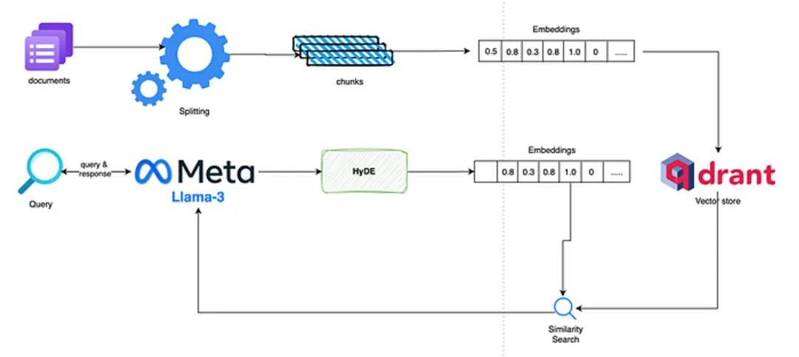
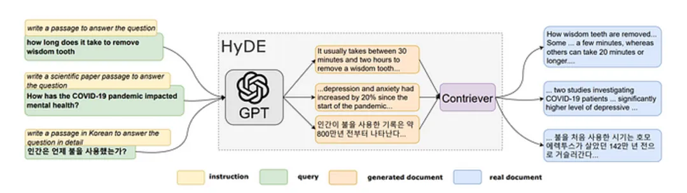
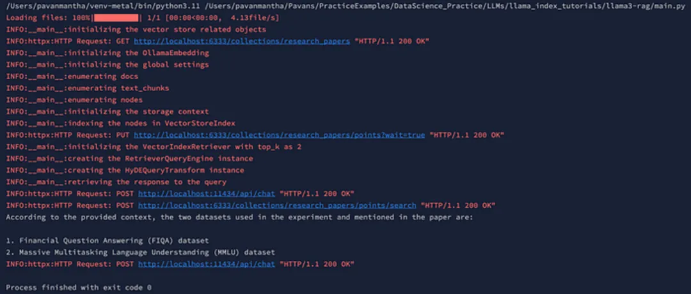

# 使用 Llama3 和 Ollama 改进了 RAG

    在本文中，我们将了解如何利用 Llama-3 ，实现具有完全本地基础设施的高级 RAG。本文为使用 的高级 RAG 的第一天实施提供了第一手指南。



## 

## 介绍：

在本文中，我们将创建一个高级 RAG，它将根据作为管道输入给出的研究论文来回答用户查询。用于构建该管道的技术堆栈如下。

1. Ollama 嵌入模型 mxbai-embed-large

2. Ollama 量化Llama-3 8b 模型

3. 本地托管的 Qdrant 向量数据库。

通过这种设置，明显的两件事是所产生的成本绝对为 0，并且信息高度安全和私密。

## 

## HyDE 是什么？

HyDE（即假设文档嵌入）源自Gau 等人在 2022 年论文中提出的创新工作。标题为“无需相关标签的精确零射击密集检索”。这项研究的主要目标是增强依赖于语义嵌入相似性的零样本密集检索。所提出的解决方案 HyDE 通过两步方法运行。



在初始步骤（称为“步骤 1”）中，语言模型（具体以 GPT-3 为例）通过指令提示引导，根据原始查询生成假设文档。这一过程是针对论文中提出的问题精心定制的，尽管文件具有假设性，但仍确保了相关性。

转到步骤 2，生成的假设文档通过利用 Contriever（其特征为“无监督对比编码器”）转换为嵌入向量。该编码器有助于将假设文档转换为向量表示，然后将其用于后续的相似性搜索和检索任务。

HyDE 的基本功能是通过两个关键组件将文档转换为向量嵌入。第一个方面涉及使用语言模型的生成任务，旨在即使在假设的文档中也能捕获相关性，并承认事实不准确的可能性。随后，由对比编码器管理的文档-文档相似性任务完善了嵌入过程，过滤掉无关的细节并提高了效率。

值得注意的是，HyDE 超越了现有的无监督密集检索器（例如 Contriever）的性能。此外，它在不同任务和语言中表现出与微调检索器相当的性能。这种方法将密集检索压缩为两个连贯的任务，标志着基于语义嵌入的检索方法的显着进步。

### 实现：

```python
from llama_index.core import (
    SimpleDirectoryReader,
    VectorStoreIndex,
    StorageContext,
    Settings,
    get_response_synthesizer)
from llama_index.core.query_engine import RetrieverQueryEngine, TransformQueryEngine
from llama_index.core.node_parser import SentenceSplitter
from llama_index.core.schema import TextNode, MetadataMode
from llama_index.vector_stores.qdrant import QdrantVectorStore
from llama_index.embeddings.ollama import OllamaEmbedding
from llama_index.llms.ollama import Ollama
from llama_index.core.retrievers import VectorIndexRetriever
from llama_index.core.indices.query.query_transform import HyDEQueryTransform
import qdrant_client
import logging
```

1、初始化：

```python
## 创建向量存储以推送嵌入。
logging.basicConfig(level=logging.INFO)
logger = logging.getLogger(__name__)

# load the local data directory and chunk the data for further processing
docs = SimpleDirectoryReader(input_dir="data", required_exts=[".pdf"]).load_data(show_progress=True)
text_parser = SentenceSplitter(chunk_size=512, chunk_overlap=100)

text_chunks = []
doc_ids = []
nodes = []
```

2、创建向量存储以推送嵌入。

```python
# Create a local Qdrant vector store
logger.info("initializing the vector store related objects")
client = qdrant_client.QdrantClient(host="localhost", port=6333)
vector_store = QdrantVectorStore(client=client, collection_name="research_papers"）
```

3、本地嵌入和 LLM 模型

```python
# local vector embeddings model
logger.info("initializing the OllamaEmbedding")
embed_model = OllamaEmbedding(model_name='mxbai-embed-large', base_url='<http://localhost:11434>')
logger.info("initializing the global settings")
Settings.embed_model = embed_model
Settings.llm = Ollama(model="llama3", base_url='<http://localhost:11434>')
Settings.transformations = [text_parser]
```

4、创建节点、向量存储、HyDE 转换器，最后进行查询

```python
logger.info("enumerating docs")
for doc_idx, doc in enumerate(docs):
    curr_text_chunks = text_parser.split_text(doc.text)
    text_chunks.extend(curr_text_chunks)
    doc_ids.extend([doc_idx] * len(curr_text_chunks))

logger.info("enumerating text_chunks")
for idx, text_chunk in enumerate(text_chunks):
    node = TextNode(text=text_chunk)
    src_doc = docs[doc_ids[idx]]
    node.metadata = src_doc.metadata
    nodes.append(node)

logger.info("enumerating nodes")
for node in nodes:
    node_embedding = embed_model.get_text_embedding(
        node.get_content(metadata_mode=MetadataMode.ALL)
    )
    node.embedding = node_embedding

logger.info("initializing the storage context")
storage_context = StorageContext.from_defaults(vector_store=vector_store)
logger.info("indexing the nodes in VectorStoreIndex")
index = VectorStoreIndex(
    nodes=nodes,
    storage_context=storage_context,
    transformations=Settings.transformations,
)

logger.info("initializing the VectorIndexRetriever with top_k as 5")
vector_retriever = VectorIndexRetriever(index=index, similarity_top_k=5)
response_synthesizer = get_response_synthesizer()
logger.info("creating the RetrieverQueryEngine instance")
vector_query_engine = RetrieverQueryEngine(
    retriever=vector_retriever,
    response_synthesizer=response_synthesizer,
)
logger.info("creating the HyDEQueryTransform instance")
hyde = HyDEQueryTransform(include_original=True)
hyde_query_engine = TransformQueryEngine(vector_query_engine, hyde)

logger.info("retrieving the response to the query")
response = hyde_query_engine.query(
    str_or_query_bundle="what are all the data sets used in the experiment and told in the paper")
print(response)

client.close()
```

上面的代码首先配置 INFO 级别消息的日志记录，以便可以在输出中看到每个日志，然后继续从本地目录加载 PDF 数据，将其拆分为文本块。它建立了一个 Qdrant 向量存储来存储研究论文嵌入，并初始化 Ollama 文本嵌入模型以从文本生成嵌入。配置全局设置，处理文本块并将其与文档 ID 关联。文本节点是从块创建的，保留元数据，并使用 Ollama 模型为这些节点生成嵌入。然后，该脚本设置一个存储上下文，用于对 Qdrant 向量存储中的文本嵌入进行索引，并继续对它们进行索引。向量检索器被配置为检索相似的嵌入，并且查询引擎被初始化以处理查询。HyDE 查询转换是为了增强查询处理而设置的。最后，执行查询以检索有关论文实验中提到的数据集的信息，并打印响应。

输出：




## 结论：

总之，通过利用 Meta 的大型语言模型等尖端技术的力量Llama-3，以及 等复杂的方法HyDE，并利用 的功能Ollama，我们准备构建无与伦比的 RAG 管道。通过对top_k、chunk_size、 和等关键超参数进行细致的微调chunk_overlap，我们可以将准确性和有效性提升到新的高度。先进工具和细致优化的融合有望释放我们系统的全部潜力，为突破性进步铺平道路，并确保我们的解决方案站在创新和卓越的前沿，并具有最大的隐私和安全性。

资源：

- HyDE论文：https://arxiv.org/pdf/2212.10496.pdf
