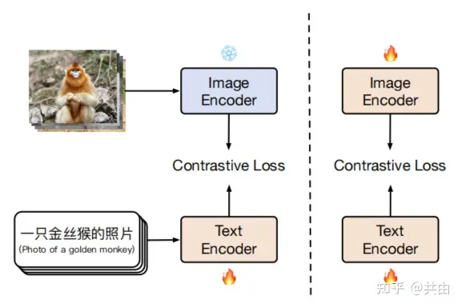

# 多模态表征—CLIP及中文版Chinese-CLIP：理论讲解、代码微调与论文阅读


我之前一直在使用CLIP/Chinese-CLIP，但并未进行过系统的疏导。这次正好可以详细解释一下。相比于CLIP模型，Chinese-CLIP更适合我们的应用和微调，因为原始的CLIP模型只支持英文，对于我们的中文应用来说不够友好。Chinese-CLIP很好地弥补了这方面的不足，它使用了大量的中文-文图对进行训练，与CLIP模型架构完全一致。

下面我将从4部分对本篇章进行讲解，

1. **讲解CLIP的主要内容**；  

2. **讲解Chinese-CLIP的主要内容**；  

3. **CLIP/Chinese-CLIP代码微调**；  

4. **CLIP/Chinese-CLIP论文重点阅读**

CLIP: [https://arxiv.org/abs/2103.00020](https://link.zhihu.com/?target=https%3A//arxiv.org/abs/2103.00020)  Github: [https://github.com/OpenAI/CLIP](https://link.zhihu.com/?target=https%3A//github.com/OpenAI/CLIP)

Chinese-CLIP: [https://arxiv.org/abs/2211.01335](https://link.zhihu.com/?target=https%3A//arxiv.org/abs/2211.01335) Github:[https://github.com/OFA-Sys/Chinese-CLIP](https://link.zhihu.com/?target=https%3A//github.com/OFA-Sys/Chinese-CLIP)

## 1.CLIP模型

CLIP全名Contrastive Language-Image Pretraining，在2021年由OpenAI提出，其核心理念为**图文对比学习预训练**，是一种**多模态学习模型**，旨在将图像和文本进行关联，它可以快速实现**图文特征相似度计算、跨模态检索、零样本图片分类**等任务。

与传统的视觉模型不同，**CLIP的预训练数据并非标注的图像数据，而是从网络上大量采集的弱监督图文对数据，即我们常说的图片和标题（字幕）**。**CLIP收集了4亿规模的图文对数据，旨在通过预训练建模图像与文本的联系**。相比传统复杂的交互式的多模态预训练，**CLIP的模型极为简单**，即我们常说的双塔模型，分别包括**图像塔和文本塔**。图像塔负责提取图像表征，一般为**Vision Transformer**，即常说的ViT，文本塔则负责提取文本特征，使用经典Transformer架构。

### 1.1.CLIP模型架构


上图是CLIP模型的架构以及训练思路，采用了对比学习的思想。**预训练网络的输入是文字和图片的配对**，每一张图像都有一小句解释性文字。将文字和图片分别通过一个编码器，得到向量表示。这里的文本编码器是Bert，而图片编码器是resnet或者是vit。

> 可以看出，CLIP的架构其实是非常简单的，就是两个编码器组合起来通过对比学习来训练，但是它无监督训练了4亿+的<Image,text>，通过大数据堆叠出来了模型的性能以及Zero-shot能力。

### 1.2.CLIP训练

**CLIP执行训练的具体步骤如下**

1. 输入的text和Image分别经过各自的Encoder处理成特征向量；  

2. 构建关系矩阵，矩阵中的每一个元素都是每一个Image特征向量和其他Text特征向量的余弦相似度。该矩阵中主对角线的元素都是匹配的（图像和文本特征完全对应），其他地方的元素并不匹配。  

3. 主对角线的余弦相似度尽可能最大，其他地方的余弦相似度尽可能最小。  

**通过例子说明：**

假设一个批次中有32个<Image,text>,即文本-图像对：

1. 这个32个Image  和32个Text  分别经过图像编码器VIT和文本编码器Bert，从而得到32个Image Embedding和32个Text Embedding
2. 32个Image Embedding与32个Text Embedding两两配对，组成了一个32*32的余弦相似性矩阵(计算Loss使用)。
3. 使用对称交叉熵损失作为其优化目标，这种类型的损失最小化了图像到文本的方向以及文本到图像的方向。在计算对比损失时，CLIP认为在矩阵中只有对角线上的Image与Text组成的对是正样本，其余都是负样本，即正确的嵌入对  （其中 i=j）的余弦相似度被最大化。以对比方式，不相似对  （其中 i≠j）的余弦相似性被最小化。

**为什么使用对比损失，即对称交叉熵损失作为模型训练的损失函数？**

由于训练数据规模庞大，训练过程非常耗时，因此必须改进训练策略以提高效率。采用对比学习进行训练的一个重要原因是出于对训练效率的考虑。如下图所示，最下面的蓝线代表类似GPT2这种需要进行预测的任务，可以看到其训练速度最慢。中间的黄线代表一种词袋模型的方式，不需要逐字逐句地进行文本预测，文本已经被抽象成特征，相应的约束也得以放宽，从而将训练速度提高了3倍。进一步放宽约束，不再预测单词，而是转为判断图片-文本对，也就是绿色的线，即对比学习的方法，这样一来训练效率又可以一下子提高至4倍。

**论文还给出了关键部分的伪代码**：

```python
# extract feature representations of each modality
I_f = image_encoder(I) #[n，d_il  可以是ResNet or Vision Transformer
T_f = text_encoder(T) #[n,d_t]  可以是 CBOW（Continuous Bag-Of-Words） or Text Transformer

# joint multimodal embedding [n, d_e]
I_e = L2_normalize(np.dot(I_f, W_i)，axis=1)  # normal里面是投射，学习如何从单模态到多模态。
T_e = L2_normalize(np.dot(T_f, w_t)，axis=1)  # 这里用了线性投射层

# scaled pairwise cosine similarities [n, n]
logits = np.dot(I_e， T_e.T) * np.exp(t)

# symmetric loss function
labels = np.arange(n)
loss_i = cross.entropy_loss(logits, labels，axis=0)
loss_t = cross.entropy_loss(losits，iatels，axis=1)
loss = (loss_i + loss_t) / 2
```

1. 首先，对图片和文本进行特征提取，分别得到图像特征表示（I_f）和文本特征表示（T_f）。可以使用ResNet或者Vision Transformer来提取图像特征，使用CBOW或者Text Transformer来提取文本特征。  

2. 接着，通过投影层将图像特征和文本特征映射到一个共享的多模态嵌入空间，得到投影后的图像嵌入（I_e）和文本嵌入（T_e）。这里使用了线性投影层，W_i和w_t分别是图像和文本的投影矩阵。  

3. 然后，通过计算两个嵌入之间的余弦相似度得到一个相似度矩阵（logits），其中t是一个缩放参数。余弦相似度的计算函数np.dot(I_e, T_e.T)表示将图像嵌入和文本嵌入转置后做点积。  

4. 最后，使用对比损失函数来寻来你多模态嵌入。损失函数包括两部分：对图像嵌入的损失（loss_i）和对文本嵌入的损失（loss_t）。损失函数使用交叉熵损失函数来计算，labels是一个包含了0到n-1的数组，表示每个样本的类别。最终的总损失(loss)是两部分损失的均值。  

### 1.3.CLIP预测/部署/应用

### 1.3.1.CLIP预测

CLIP的预测是需要对文本端进行一定处理，**例如在做图像分类时，我们要分类的类别是一个个的单词，然而CLIP预训练时候的文本端采用的是句子进行训练。所以在预测的时候也要和预训练阶段保持对齐**，具体做法：

通过**提示模板**对文本端进行改造，对于一个dog，就构造成 A photo of a {dog}，然后将这个改造后的提示送入到Text Encoder中进行特征提取。

**官方代码中也给出了一部分提示模板样例**，例如：

```python
templates = [
    'a photo of a {}.',
    'a photo of the {}.',
    'a photo of my {}.',
    'i love my {}!',
    'a photo of my dirty {}.',
    'a photo of my clean {}.',
    'a photo of my new {}.',
    'a photo of my old {}.',
    'a photo of a person {}.',
    'a video of a person {}.',
     ...
     ...
]
```

### 1.3.2.CLIP部署

**CLIP环境安装：**

```python
conda create -n clip python=3.9
activate clip

pip install torch==1.9.0
pip install torchaudio==0.9.0
pip install torchvision==0.10.0

pip install ftfy regex tqdm
pip install git+https://github.com/openai/CLIP.git
```

**CLIP权重下载：**

```python
_MODELS = {
"RN50":"https://openaipublic.azureedge.net/clip/models/afeb0e10f9e5a86da6080e35cf09123aca3b358a0c3e3b6c78a7b63bc04b6762/RN50.pt",   "RN101":"https://openaipublic.azureedge.net/clip/models/8fa8567bab74a42d41c5915025a8e4538c3bdbe8804a470a72f30b0d94fab599/RN101.pt",
  "RN50x4":"https://openaipublic.azureedge.net/clip/models/7e526bd135e493cef0776de27d5f42653e6b4c8bf9e0f653bb11773263205fdd/RN50x4.pt",
    "RN50x16": "https://openaipublic.azureedge.net/clip/models/52378b407f34354e150460fe41077663dd5b39c54cd0bfd2b27167a4a06ec9aa/RN50x16.pt",
    "RN50x64": "https://openaipublic.azureedge.net/clip/models/be1cfb55d75a9666199fb2206c106743da0f6468c9d327f3e0d0a543a9919d9c/RN50x64.pt",
    "ViT-B/32": "https://openaipublic.azureedge.net/clip/models/40d365715913c9da98579312b702a82c18be219cc2a73407c4526f58eba950af/ViT-B-32.pt",
    "ViT-B/16": "https://openaipublic.azureedge.net/clip/models/5806e77cd80f8b59890b7e101eabd078d9fb84e6937f9e85e4ecb61988df416f/ViT-B-16.pt",
    "ViT-L/14": "https://openaipublic.azureedge.net/clip/models/b8cca3fd41ae0c99ba7e8951adf17d267cdb84cd88be6f7c2e0eca1737a03836/ViT-L-14.pt",
    "ViT-L/14@336px": "https://openaipublic.azureedge.net/clip/models/3035c92b350959924f9f00213499208652fc7ea050643e8b385c2dac08641f02/ViT-L-14-336px.pt",
}
```

### 1.3.3.CLIP应用

**图文相似度计算：**

```python
import torch
import clip
from PIL import Image

device = "cuda" if torch.cuda.is_available() else "cpu"
model, preprocess = clip.load("ViT-B/32", device=device)

image = preprocess(Image.open("CLIP.png")).unsqueeze(0).to(device)
text = clip.tokenize(["a diagram", "a dog", "a cat"]).to(device)

with torch.no_grad():
    image_features = model.encode_image(image)
    text_features = model.encode_text(text)

    logits_per_image, logits_per_text = model(image, text)
    probs = logits_per_image.softmax(dim=-1).cpu().numpy()

print("Label probs:", probs)  # prints: [[0.9927937  0.00421068 0.00299572]]
```

**图文检索（Top-k）:**

```python
import torch
import clip
from PIL import Image

device = "cuda" if torch.cuda.is_available() else "cpu"
model, preprocess = clip.load("ViT-B/32", device=device)

image = preprocess(Image.open("CLIP.png")).unsqueeze(0).to(device)
text = clip.tokenize(["a diagram", "a dog", "a cat","a yellow dog","a running dog"]).to(device)

with torch.no_grad():
    image_features = model.encode_image(image)
    text_features = model.encode_text(text)

image_features /= image_features.norm(dim=-1, keepdim=True)
text_features /= text_features.norm(dim=-1, keepdim=True)
similarity = (100.0 * image_features @ text_features.T).softmax(dim=-1)
values, indices = similarity[0].topk(3)
print(values,indices)
```

对于其他的应用可以自行去探索，比如我也将这个CLIP/Chinese-CLIP应用在图像或者文本端的召回：

```python
from PIL import Image

def compute(item_emb_1,item_emb_2):
    norm1 = np.linalg.norm(item_emb_1)
    norm2 = np.linalg.norm(item_emb_2)
    s = sum([a * b for a, b in zip(item_emb_1, item_emb_2)])
    return s

device = "cuda" if torch.cuda.is_available() else "cpu"
model, preprocess = clip.load("ViT-B/32", device=device)

image = [preprocess(Image.open("CLIP1.png")).unsqueeze(0).to(device),preprocess(Image.open("CLIP2.png")).unsqueeze(0).to(device)]
text = clip.tokenize(["a diagram", "a dog", "a cat","a yellow dog","a running dog"]).to(device)

with torch.no_grad():
    image_features = model.encode_image(image)
    text_features = model.encode_text(text)

image_features /= image_features.norm(dim=-1, keepdim=True)
text_features /= text_features.norm(dim=-1, keepdim=True)

scores_img=compute(img_embedding[0].numpy().tolist(),img_embedding[1].numpy().tolist())
print(scores)
```

## 2.Chinese-CLIP

Chinese-CLIP是一次极其朴素的开源，没错就是CLIP的汉化，旨在推动中文社区多模态发展，

原始的CLIP模型基于英文图文语料，不能用于中文的图文表征提取场景。Chinese-CLIP以**英文CLIP视觉侧参数和中文Roberta参数，作为模型初始化值**。 基于大规模原生中文图文数据，实现了CLIP模型的中文化版本，从而满足对中文版本的需求，这也是我之前一直在用的~

为什么要做中文CLIP—**虽然大家关注CLIP基本都关注它学习图像信息的能力，但其实它的成功也离不开对文本的学习。** 我们在应用的时候总不能直接将中文文本翻译成英文来做多模态的检索或相似度计算吧？这样会大大影响精度，以后大家都去用英文的了，没有人来发展中文模型的能力了，所以我觉得这是值得做的，不论是科研还是实际应用中。

### 2.1.Chinese-CLIP模型

**Chinese-CLIP延续了CLIP的模型架构**，使用了不同的训练方式以及全新的中文数据集，即在双流架构和对比学习的支持下，能够有效地整合中文的图像和文本信息到一个共享的嵌入空间，并拥有处理多模态数据的能力。初始阶段以预训练的方式设定了两种编码器：**一种是CLIP的视觉编码器，另一种是中文版的RoBERTa文本编码器**。


**Chinese-CLIP执行训练的具体步骤如下：**

**主要思想是冻结 image encoder（冻结所有的参数）使用 LiT 让 text encoder 能够从 OpenAI 的 CLIP 的基础视觉模型中读出高质量的表示，然后将这些表示迁移到需要的数据域中。**

第一阶段：冻结 image encoder 的所有参数，只训练 text encoder，这一动作是基于一个假设：训练好的 vision backbone 已经有很强的能力来抽取视觉特征了。第一阶段的训练直到对下游任务没有明显的提升而结束；

第二阶段，让 image encoder 的参数参与训练，这样一来image encoder的参数就可以学习中文图片数据集了。

**Chinese-CLIP使用的数据集：**

大规模的中文image-text-pairs（约 2 亿规模），其中包括来自 LAION-5B 中文子集、Wukong 的中文数据、以及来自 COCO、Visual Genome 的翻译图文数据等

### 2.2.Chinese-CLIP部署

**Chinese-CLIP环境安装：**

1. 通过pip安装：

```python
pip install cn_clip
```

1. 从源代码安装：

```python
https://github.com/OFA-Sys/Chinese-CLIP.git #先下载源码
cd Chinese-CLIP
pip install -e .
```

**Chinese-CLIP权重下载：**

Chinese-CLIP目前开源5个不同规模，其模型信息见下表：


[https://github.com/OFA-Sys/Chinese-CLIP](https://link.zhihu.com/?target=https%3A//github.com/OFA-Sys/Chinese-CLIP)中给出了下载的链接，可以根据需求自行下载，我用的CN-CLIP(VIT-L/14@336px)效果已经很不错了

### 2.3.Chinese-CLIP应用

**图文特征向量计算以及相似度计算：**

```text
import torch 
from PIL import Image

import cn_clip.clip as clip
from cn_clip.clip import load_from_name, available_models
print("Available models:", available_models())  
# Available models: ['ViT-B-16', 'ViT-L-14', 'ViT-L-14-336', 'ViT-H-14', 'RN50']

device = "cuda" if torch.cuda.is_available() else "cpu"
model, preprocess = load_from_name("ViT-B-16", device=device, download_root='./')
model.eval()
image = preprocess(Image.open("examples/pokemon.jpeg")).unsqueeze(0).to(device)
text = clip.tokenize(["杰尼龟", "妙蛙种子", "小火龙", "皮卡丘"]).to(device)

with torch.no_grad():
    image_features = model.encode_image(image)
    text_features = model.encode_text(text)
    # 对特征进行归一化，请使用归一化后的图文特征用于下游任务
    image_features /= image_features.norm(dim=-1, keepdim=True) 
    text_features /= text_features.norm(dim=-1, keepdim=True)    

    logits_per_image, logits_per_text = model.get_similarity(image, text)
    probs = logits_per_image.softmax(dim=-1).cpu().numpy()

print("Label probs:", probs)  # [[1.268734e-03 5.436878e-02 6.795761e-04 9.436829e-01]]
```

> 可以发现和CLIP是一样，所以CLIP可以实施的应用，在Chinese-CLIP同样适用，只需要将依赖库以及相应的model转换一下就可以了,省下的应用方向就省略不写了

## 3.CLIP/Chinese-CLIP模型微调

CLIP的源代码中并没有提供微调训练的程序，可以自行手动码，其实结构很简单，损失函数的形式也给出了，即:

```python
# symmetric loss function
labels = np.arange(n)
loss_i = cross.entropy_loss(logits, labels，axis=0)
loss_t = cross.entropy_loss(losits，iatels，axis=1)
loss = (loss_i + loss_t) / 2
```

但是里面的训练细节，例如分布式、warmup步数、学习率、训练步数等等一些加速训练的手段刚接触的人很难些的出来，你以为那就没有办法了吗！

No No No，Chinese-CLIP源码给出了我们训练源码，我们可以使用Chinese-CLIP的微调源码去执行CLIP或者Chinese-CLIP，以应用我们想要微调的数据。

但是Chinese-CLIP微调源码比较复杂，涉及了很多，不想看的可以跳过，下面我详解一下Chinese-CLIP微调~

**Chinese-CLIP的训练代码位于**：`Chinese-CLIP/cn_clip/training/main.py`

### 3.1.微调所需要的参数

参数设置位于：`Chinese-CLIP/cn_clip/training/params.py`

```python
def parse_args():
    parser = argparse.ArgumentParser()
    parser.add_argument(
        "--train-data",type=str,required=True, help="Path to the LMDB directory with training data split")
    parser.add_argument("--val-data",type=str,default=None,help="Path to the LMDB directory with validation data split, default to None which disables validation",)
    parser.add_argument("--num-workers", type=int, default=4, help="The number of workers for training dataloader.")
    parser.add_argument("--valid-num-workers", type=int, default=1, help="The number of workers for validation dataloader (if making validation).")
    parser.add_argument("--logs",type=str,default="./logs/",help="Where to store logs. Use None to avoid storing logs.",)
    parser.add_argument("--name",type=str,default="train_clip",help="Optional identifier for the experiment when storing logs. Otherwise use current time.",)
    parser.add_argument("--log-interval", type=int, default=10, help="How often to log loss info.")
    parser.add_argument("--report-training-batch-acc", default=False,action="store_true", help="Whether to report training batch accuracy.")
    parser.add_argument("--batch-size", type=int, default=64, help="Batch size for training per GPU.")
    parser.add_argument( "--valid-batch-size", type=int, default=64, help="Batch size for validation per GPU.")
    parser.add_argument("--max-steps", type=int, default=None, help="Number of steps to train for (in higher priority to --max_epochs).")
    parser.add_argument("--max-epochs", type=int, default=32, help="Number of full epochs to train for (only works if --max_steps is None).")
    parser.add_argument("--valid-step-interval", type=int, default=None, help="The step interval for validation (default to None which disables validation between steps).")
    parser.add_argument("--valid-epoch-interval", type=int, default=1, help="The epoch interval for validation (default to 1, set None to disable validation between epochs).")
    parser.add_argument("--context-length", type=int, default=52, help="The maximum length of input text (include [CLS] & [SEP] tokens). Default to 52.")
    parser.add_argument("--lr", type=float, default=None, help="Learning rate.")
    parser.add_argument("--beta1", type=float, default=None, help="Adam beta 1.")
    parser.add_argument("--beta2", type=float, default=None, help="Adam beta 2.")
    parser.add_argument("--eps", type=float, default=None, help="Adam epsilon.")
    parser.add_argument("--wd", type=float, default=0.2, help="Weight decay.")
    parser.add_argument("--warmup", type=int, default=500, help="Number of steps to warmup for.")
    parser.add_argument("--use-bn-sync",default=False, action="store_true", help="Whether to use batch norm sync.")
    parser.add_argument("--use-augment",default=False,action="store_true", help="Whether to use image augment.")
    parser.add_argument("--skip-scheduler",action="store_true",default=False, help="Use this flag to skip the learning rate decay.",)
    parser.add_argument("--save-epoch-frequency", type=int, default=1, help="How often to save checkpoints by epochs.")
    parser.add_argument("--save-step-frequency", type=int, default=-1, help="How often to save checkpoints by steps.")
...
...
```

**参数解释：**

- 分布式  

- `WORKER_CNT`: 训练的机器个数  

- `GPUS_PER_NODE`: 每个机器上的GPU个数  

- 训练/验证数据  

- `train-data`: 训练数据LMDB目录，  

- `val-data`: 验证数据LMDB目录，指定为None时，则不进行训练过程中的验证。

- `num-workers`: 训练集数据处理（DataLoader）的进程数，默认为4。

- `valid-num-workers`: 验证集数据处理（DataLoader）的进程数（如果进行验证），默认为1。  

- 训练超参数  

- `vision-model`: 指定视觉backbone, 从 `["ViT-B-16", "ViT-L-14", "ViT-L-14-336", "ViT-H-14", "RN50"]`选择。  

- `text-model`: 指定文本backbone, 从 `["RoBERTa-wwm-ext-base-chinese", "RoBERTa-wwm-ext-large-chinese", "RBT3-chinese"]`选择。  

- `context-length`: 文本输入序列长度。  

- `warmup`: warmup步数。  

- `batch-size`: 训练时单卡batch-size。（请保证`训练样本总数 > batch-size * GPU数`，至少满足1个训练batch）  

- `lr`: 学习率。  

- `wd`: weight decay。  
  ....  
  ....  
  **（具体参考github中给出的细节）**  

**参数的设置**：

可以参考位于`run_scripts/muge_finetune_vit-b-16-rbt-base.sh`中给出的超参数

**然后可以执行`run_scripts/muge_finetune_vit-b-16-rbt-base.sh`以进行微调，下面的介绍可以选择不看，如果对源码中的细节感兴趣，想了解分布式，冻结等操作的可以看一下**

### 3.2.Train源码解析

`Chinese-CLIP/cn_clip/training/main.py`

1. 解析参数：调用了一个叫做`parse_args`的函数，解析并获取命令行传入参数，并将其存储在`args`变量中。

`args = parse_args()`

2. 设置分布式训练环境：首先根据环境变量设置本地设备的排名、所使用的CUDA设备，并将其存储在`args`变量中。然后初始化分布式训练组，使用了NCCL作为后端，最后获取当前进程的rank和整个训练环境的world_size，并将其存储在`args`变量中。

```text
args.local_device_rank = int(os.environ["LOCAL_RANK"])  
torch.cuda.set_device(args.local_device_rank)
args.device = torch.device("cuda", args.local_device_rank)
dist.init_process_group(backend="nccl")
args.rank = dist.get_rank()
args.world_size = dist.get_world_size()
```

3. 设置输出路径：使用当前时间生成一个时间戳，并根据时间戳设置日志文件的路径和检查点的路径。如果当前进程是主进程，会根据参数创建对应的目录。

```text
time_suffix = strftime("%Y-%m-%d-%H-%M-%S", gmtime())
args.log_path = os.path.join(args.logs, args.name, "out_{}.log".format(time_suffix))

args.checkpoint_path = os.path.join(args.logs, args.name, "checkpoints")
if is_master(args):
    for dirname in [args.checkpoint_path]:
        if dirname:
            os.makedirs(dirname, exist_ok=True)
```

4. 检查精度参数：用于确保args.precision的取值在指定范围内，即’amp’、‘fp16’或’fp32’

`assert args.precision in ['amp', 'fp16', 'fp32']`

5. 设置日志记录：设置了日志级别，并初始化了日志队列，进而进行了一些日志记录的准备工作。

```text
args.log_level = logging.DEBUG if args.debug else logging.INFO
log_queue = setup_primary_logging(args.log_path, args.log_level, args.rank)
setup_worker_logging(args.rank, log_queue, args.log_level)
```

6.构建CLIP模型：这里根据传入的参数，拼接了视觉模型和文本模型的配置文件路径，然后加载并解析了视觉模型和文本模型的配置文件，将其存储在model_info中，最后将args.use_flash_attention设置到model_info中。最后构建了CLIP模型实例，并传入了model_info中的参数

```text
vision_model_config_file = Path(__file__).parent.parent / f"clip/model_configs/{args.vision_model.replace('/', '-')}.json"
text_model_config_file = Path(__file__).parent.parent / f"clip/model_configs/{args.text_model.replace('/', '-')}.json"

with open(vision_model_config_file, 'r') as fv, open(text_model_config_file, 'r') as ft:
    model_info = json.load(fv)
    if isinstance(model_info['vision_layers'], str):
        model_info['vision_layers'] = eval(model_info['vision_layers'])
    for k, v in json.load(ft).items():
        model_info[k] = v
model_info['use_flash_attention'] = args.use_flash_attention

model = CLIP(**model_info)
```

7. 加载预训练权重：加载预训练的CLIP模型权重和BERT模型权重，用于fine-tuning或推理过

```text
if args.clip_weight_path is not None:
    assert os.path.exists(args.clip_weight_path), "Pretrained CLIP weight not exists!"
if args.bert_weight_path is not None:
    assert os.path.exists(args.bert_weight_path), "Pretrained BERT weight not exists!"
load(model, clip_path=args.clip_weight_path, bert_path=args.bert_weight_path, use_flash_attention=args.use_flash_attention)
```

8. 检查32精度：首先检查精度参数是否为"amp"或"fp32"，如果是的话，则调用convert_models_to_fp32函数，将模型参数转换为32位浮点数。并将模型移动到对应的GPU设备上

```text
if args.precision == "amp" or args.precision == "fp32":
    convert_models_to_fp32(model)
model.cuda(args.local_device_rank)
```

9. 检查16精度：如果精度参数是"fp16"，则调用`convert_weights`函数，将模型中的权重转换为半精度浮点数。

```text
if args.precision == "fp16":
    convert_weights(model)
```

10.梯度检查点：如果选择了梯度检查点，则首先确保所使用的PyTorch版本不小于1.8.0，然后调用`set_grad_checkpointing`函数激活梯度检查点功能，并记录日志信息。

```text
if args.grad_checkpointing:
    assert not torch_version_str_compare_lessequal(torch.__version__, "1.8.0"), \
        "Currently our grad_checkpointing is not compatible with torch version <= 1.8.0."
    model.set_grad_checkpointing()
    logging.info("Grad-checkpointing activated.")
```

11. FlashAttention：如果选择了使用FlashAttention，则先确保FlashAttention库已安装，然后记录日志表示正在使用FlashAttention。

```text
if args.use_flash_attention:
    assert importlib.util.find_spec("flash_attn"), "flash_attn is not installed."
    logging.info("Using FlashAttention.")
```

12. BatchNorm：如果选择使用同步的BatchNorm操作，则调用函数将模型转换为同步BatchNorm形式

```text
if args.use_bn_sync:
    model = torch.nn.SyncBatchNorm.convert_sync_batchnorm(model)
```

13. 冻结视觉模型：如果选择冻结视觉编码器（`args.freeze_vision`），则将视觉编码器的参数设置为不可训练。如果视觉模型是ResNet-50（`args.vision_model`为’RN50’），还将BatchNorm层的运行均值和方差设置为评估模式，以防止在训练过程中更新这些统计信息。记录日志信息表示视觉编码器在训练期间被冻结。

```text
if args.freeze_vision:
    for k, v in model.visual.named_parameters():
        v.requires_grad = False
    if args.vision_model in ['RN50']:
        for m in model.visual.modules():
            if isinstance(m, torch.nn.BatchNorm2d):
                m.eval()
    logging.info("The visual encoder is freezed during training.")
```

14. 初始化数据：使用`get_data`函数初始化数据集

```text
data = get_data(args, epoch_id=0, max_txt_length=args.context_length)
```

15.初始化数据集、优化器、学习率调度器和梯度缩放器，为模型的训练做准备:

```text
if args.train_data is None:
    optimizer = None
    scheduler = None
else:
    optimizer = optim.AdamW(
        [
            {"params": gain_or_bias_params, "weight_decay": 0.},
            {"params": rest_params, "weight_decay": args.wd},
        ],
        lr=args.lr,
        betas=(args.beta1, args.beta2),
        eps=args.eps,
    )
    num_batches = data["train"].dataloader.num_batches
    if args.max_steps is not None:
        args.max_epochs = ceil(args.max_steps * args.accum_freq / num_batches)
    else:
        assert args.max_epochs is not None and args.max_epochs > 0
        args.max_steps = (num_batches // args.accum_freq) * args.max_epochs
    total_steps = args.max_steps
    scheduler = cosine_lr(optimizer, args.lr, args.warmup, total_steps)
```

16. 加载检查点权重：加载检查点文件中保存的模型权重，并根据需要对模型进行相应的操作。如果指定了使用 `flash_attention`，会对模型进行调整。然后会加载模型的状态字典并恢复模型的状态。如果不指定重置数据偏移，会恢复训练的起始 epoch 和步数，并重新加载相应的数据集和数据加载器。如果不指定重置优化器，会恢复优化器的状态

```text
 if args.resume is None:
        latest_path = os.path.join(args.checkpoint_path, f"epoch_latest.pt")
        if os.path.isfile(latest_path):
            args.resume = latest_path
    if args.resume is not None:
        if os.path.isfile(args.resume):
            logging.info(
                f"=> begin to load checkpoint '{args.resume}'"
            )
            checkpoint = torch.load(args.resume, map_location="cpu")
            sd = {k: v for k, v in checkpoint["state_dict"].items() if "bert.pooler" not in k}
            resize_pos_embed(sd, model, prefix="module.")
            if args.use_flash_attention:
                sd = convert_state_dict(sd)
            model.load_state_dict(sd)
            if not args.reset_data_offset:
                start_epoch = checkpoint["epoch"]
                steps = checkpoint["step"]
                data = get_data(args, epoch_id=start_epoch,max_txt_length=args.context_length)
            if not args.reset_optimizer and optimizer is not None:
                optimizer.load_state_dict(checkpoint["optimizer"])
                logging.info("=> optimizer state is restored from the checkpoint")
            logging.info(f"=> loaded checkpoint '{args.resume}' (epoch {checkpoint['epoch']} @ {steps} steps)")
        else:
            logging.info("=> no checkpoint found at '{}'".format(args.resume))
```

17. 进行训练状态：遍历每个 epoch，每个 epoch 内，首先判断当前进程是否为主进程（通过 `is_master(args)` 函数来判断）。如果不是主进程，打印当前 epoch 的信息。如果使用了知识蒸馏（distillation）的方法（`args.distllation=True`），则调用 `train` 函数来进行模型训练，并传入额外的参数 `teacher_model`。否则，只调用 `train` 函数进行模型训练。`train` 函数会返回每个 epoch 中进行的训练步数 `num_steps_this_epoch`。

```text
for epoch in range(start_epoch, args.max_epochs):
     if is_master(args) == 0:
            logging.info(f'Start epoch {epoch + 1}')
     if args.distllation:
            num_steps_this_epoch = train(model, data, epoch, optimizer, scaler, scheduler, args, steps, teacher_model)
     else:
            num_steps_this_epoch = train(model, data, epoch, optimizer, scaler, scheduler, args, steps)
```

- train(model, data, epoch, optimizer, scaler, scheduler, args, steps, teacher_model)：（代码简单，不细致讲解了）将模型设置为训练模式，并根据需要冻结视觉部分的参数。获取训练数据集的dataloader和sampler。定义图像和文本的交叉熵损失函数。设置每个epoch的批次数，并迭代训练数据。对每个batch进行训练：对图像和文本进行前向传播计算损失。根据训练精度设置是否采用混合精度训练。更新模型参数，并进行相关的记录和日志输出。在特定的训练步骤进行验证集的评估，并保存模型参数。返回该epoch训练的步数。

```text
def train(model, data, epoch, optimizer, scaler, scheduler, args, global_trained_steps):
    model.train()
    if args.freeze_vision:
        freeze_vision_bn(args, model)
    dataloader, sampler = data['train'].dataloader,  data['train'].sampler
    loss_img = nn.CrossEntropyLoss()
    loss_txt = nn.CrossEntropyLoss()
    loss_img = loss_img.cuda(args.local_device_rank)
    loss_txt = loss_txt.cuda(args.local_device_rank)
    if sampler is not None:
        sampler.set_epoch(epoch)
    num_batches_per_epoch = dataloader.num_batches
    data_iter = iter(dataloader)
    end = time.time()
    epoch_trained_steps = 0
    for i in range(global_trained_steps - num_batches_per_epoch * epoch, num_batches_per_epoch):
        batch = next(data_iter)
        step = num_batches_per_epoch * epoch + i
        if step >= args.max_steps:
            logging.info("Stopping training due to step {} has reached max_steps {}".format(step, args.max_steps))
            return epoch_trained_steps
        scheduler(step)
        optimizer.zero_grad()
        images, texts, eos_indices = batch
        images = images.cuda(args.local_device_rank, non_blocking=True)
        texts = texts.cuda(args.local_device_rank, non_blocking=True)
        eos_indices = eos_indices.cuda(args.local_device_rank, non_blocking=True)
        data_time = time.time() - end
        m = model.module
        # with automatic mixed precision.
        if args.precision == "amp":
            with autocast():
                total_loss, acc = get_loss(model, images, texts, loss_img, loss_txt, args)
                scaler.scale(total_loss).backward()
                scaler.step(optimizer)
            scaler.update()
        else:
            total_loss, acc = get_loss(model, images, texts, loss_img, loss_txt, args)
            total_loss.backward()
            optimizer.step()
            ....
```

18. 验证数据：如果指定了验证数据集（`args.val_data` 不为 None）和验证间隔（`args.valid_epoch_interval` 不为 None），并且当前 epoch 是验证的时间点（`(epoch + 1) % args.valid_epoch_interval == 0`），则调用 `evaluate` 函数对模型进行验证。如果没有使用闪躲注意力（flash attention），直接调用 `evaluate` 函数；否则，在使用了半精度训练（fp16）的情况下，使用 `torch.cuda.amp.autocast()` 上下文管理器来运行 `evaluate` 函数，以确保模型在 GPU 上运行。如果还存在下一个 epoch（`epoch + 1 < args.max_epochs`），则重新加载下一个 epoch 的数据集和数据加载器。

```text
steps += num_steps_this_epoch
if args.val_data is not None and args.valid_epoch_interval is not None and (
        (epoch + 1) % args.valid_epoch_interval) == 0:
    assert "val" in data, "Error: Valid dataset has not been built."
    if not args.use_flash_attention:
        evaluate(model, data, epoch, args, steps)
    else:
        with torch.cuda.amp.autocast():
            evaluate(model, data, epoch, args, steps)
if epoch + 1 < args.max_epochs:
    data = get_data(args, epoch_id=epoch + 1, max_txt_length=args.context_length)
```

## 

4.CLIP/Chinese-CLIP论文阅读

### 4.1.CLIP Paper

### **Abstract**

最先进的计算机视觉系统经过训练，可以预测一组固定的预定对象类别。这种受限的监督形式限制了它们的通用性和可用性，因为要指定任何其他视觉概念都需要额外的标记数据。直接从原始文本中学习图像是一种很有前途的替代方法，它可以利用更广泛的监督来源。 我们证明，**预测哪张图片配哪条标题这一简单的预训练任务是一种高效、可扩展的方法，可以在从互联网上收集的 4 亿对（图像、文本）数据集上从头开始学习 SOTA 图像表征。**预训练完成后，**自然语言将被用来引用所学到的视觉概念（或描述新概念），从而实现模型向下游任务的零转移。**我们在 30 多个不同的现有计算机视觉数据集上进行了基准测试，研究了这种方法的性能，这些数据集涵盖了 OCR、视频中的动作识别、地理定位以及多种类型的细粒度对象分类等任务。 该模型可以无缝转移到大多数任务中，而且无需进行任何特定数据集的训练，就能与完全受监督的基准模型相媲美。例如，我们在 ImageNet zero-shot 上的准确率与原始 ResNet-50 不相上下，而无需使用它所训练的 128 万个训练示例中的任何一个。我们将在 [https://github.com/OpenAI/CLIP](https://link.zhihu.com/?target=https%3A//github.com/OpenAI/CLIP) 上发布我们的代码和预训练模型权重。

### **1. Introduction and Motivating Work**

在过去几年中，直接从原始文本中学习的预训练方法给 NLP 带来了革命性的变化。自回归和掩码语言建模等与任务无关的目标在计算能力、模型容量和数据方面已经跨越了许多数量级，能力稳步提高。作为标准化输入输出接口的 "文本到文本"的发展，使任务无关架构能够零距离传输到下游数据集，不再需要专门的输出头或数据集特定定制。像 GPT-3 这样的旗舰系统现在在许多任务中都具有定制模型的竞争力，同时几乎不需要特定数据集的训练数据。

这些结果表明，在网络规模的文本集合中，现代预训练方法可获得的监督总量超过了高质量的人群标签 NLP 数据集。然而，在计算机视觉等其他领域，在人群标签数据集（如 ImageNet）上预训练模型仍然是标准做法。 直接从网络文本中学习的可扩展预训练方法能否在计算机视觉领域带来类似的突破？先前的工作令人鼓舞。

20 多年前，**Mori 等人（1999 年）通过训练一个模型来预测与图像配对的文本文档中的名词和形容词，探索改进基于内容的图像检索**。Quattoni 等人（2007 年）证明，**通过在分类器的权重空间中进行流形学习，可以学习到数据效率更高的图像表征，而这些分类器是为预测与图像相关的标题中的单词而训练的**。Srivastava & Salakhutdinov（2012 年）**在低级图像和文本标签特征的基础上，通过训练多模态深度玻尔兹曼机探索了深度表征学习**。 Joulin 等人（2016 年）对这一研究方向进行了更新，证明了为预测图像标题中的单词而训练的 CNN 可以学习有用的图像表征。他们将 YFCC100M 数据集（Thomee 等人，2016 年）中图片的标题、描述和标签元数据转换成了词袋多标签分类任务，结果表明，预训练 AlexNet（Krizhevsky 等人，2012 年）来预测这些标签所学习到的表征在转移任务中的表现与基于 ImageNet 的预训练类似。随后，Li 等人（2017 年）将这一方法扩展到**预测单个单词之外的短语 ngram，并展示了他们的系统通过根据学习到的视觉 ngram 词典对目标类别进行评分并预测得分最高的类别，从而实现向其他图像分类数据集零距离转移的能力**。VirTex (Desai & Johnson,2020)、ICMLM (Bulent Sariyildiz 等人, 2020) 和 ConVIRT (Zhang 等人, 2020) 采用了**更新颖的架构和预训练方法，最近展示了基于转换器的语言建模、遮蔽语言建模和对比目标从文本中学习图像表征的潜力**。

使用自然语言监督进行图像表征学习虽然是令人兴奋的概念证明，但仍然很少见。 这可能是因为在常见基准上的表现远低于其他方法。 例如，Li 等人（2017 年）在零镜头设置下，在 ImageNet 上只达到了 11.5% 的准确率，这远远低于当前技术水平的 88.4% 的准确率。它甚至低于经典计算机视觉方法 50% 的准确率。相反，范围更窄但目标更明确的弱监督使用却提高了性能。Mahajan 等人（2018 年）的研究表明，预测 Instagram 图像上的 ImageNet 相关标签是一项有效的预训练任务。Kolesnikov 等人（2019 年）和 Dosovitskiy 等人（2020 年）也通过预训练模型来预测 JFT-300M 数据集的嘈杂标签类别，在更广泛的传输基准集上取得了巨大的收益。

这一研究方向代表了当前从有限的有监督 "金标签 "中学习和从几乎无限量的原始文本中学习的实用中间路线。然而，这并不是没有妥协。自然语言由于其通用性，能够表达更广泛的视觉概念，因此也能监督更广泛的视觉概念。这两种方法都使用静态软最大分类器进行预测，缺乏动态输出机制。这严重削弱了它们的灵活性，也限制了它们的 "零点 "能力。

这些弱监督模型与最近直接从自然语言学习图像表征的探索之间的一个关键区别在于规模。Mahajan 等人（2018 年）和 Kolesnikov 等人（2019 年）在数百万到数十亿张图像上对其模型进行了长达数年的加速训练，而 VirTex、ICMLM 和 ConVIRT 则在一到二十万张图像上进行了为期数天的加速训练。在这项工作中，我们缩小了这一差距，研究了在大规模自然语言监督下训练的图像分类器的行为。**借助互联网上大量公开可用的此类数据，我们创建了一个包含 4 亿对（图像、文本）数据的新数据集，并证明了从头开始训练的简化版 ConVIRT（我们称之为 CLIP，即对比语言-图像预训练）是一种高效的自然语言监督学习方法**。

我们研究了 CLIP 的可扩展性，训练了一系列 8 个模型，计算量几乎达到 2 个数量级，并观察到传输性能是计算量的平稳可预测函数。**我们发现，CLIP 与 GPT 系列类似，能在预训练期间学会执行一系列任务，包括 OCR、地理定位、动作识别等**。我们在 30 多个现有数据集上对 CLIP 的零点转移性能进行了基准测试，发现它可以与之前的特定任务监督模型相媲美。我们还通过线性探针表示学习分析证实了这些发现，并表明 CLIP 优于最佳的公开 ImageNet 模型，同时计算效率更高。此外，我们还发现，CLIP 模型的零镜头比同等准确度的监督 ImageNet 模型更稳健，这表明对任务无关模型的零镜头评估更能代表模型的能力。

### **2. Approach**


### **2.1. Natural Language Supervision**

我们的方法的核心是通过自然语言中的监督来学习感知。正如导言中所讨论的，这完全不是一个新想法，但是用于描述这一领域工作的术语多种多样，甚至似乎相互矛盾，而且所述动机也各不相同。Zhang 等人（2020 年）、Gomez 等人（2017 年）、Joulin 等人（2016 年）和 Desai & Johnson（2020 年）都介绍了**从与图像配对的文本中学习视觉表征的方法，但他们将自己的方法分别描述为无监督、自监督、弱监督和监督**。

我们要强调的是，**这些方法的共同点不在于所使用的特定方法的任何细节，而在于将自然语言作为一种训练信号**。所有这些方法都是从自然语言监督中学习的。虽然早期的工作在使用主题模型和 n-gram 表示时与自然语言的复杂性进行了斗争，但深度上下文表示学习的改进表明，我们现在拥有了有效利用这一丰富监督来源的工具。

与其他训练方法相比，从自然语言中学习有几个潜在的优势。**与用于图像分类的标准众包标签相比，自然语言监督更容易扩展，因为它不要求注释采用经典的 "机器学习兼容格式"**，如典型的1-of-N多数票 "黄金标签"。相反，基于自然语言的方法可以被动地学习互联网上大量文本中包含的监督信息。与大多数无监督或自监督学习方法相比，从自然语言中学习还有一个重要优势，即它 "不仅仅 "学习一种表征，而且还将该表征与语言联系起来，从而实现灵活的零点转移。在下面的小节中，我们将详细介绍我们所采用的具体方法。

### **2.2. Creating a Sufficiently Large Dataset**

现有工作主要使用三个数据集：MS-COCO、Visual Genome和 YFCC100M。虽然 MS-COCO 和 Visual Genome 是高质量的人群标签数据集，但按照现代标准，它们的规模较小，每个数据集约有 100,000 张训练照片。相比之下，其他计算机视觉系统是在多达 35 亿张 Instagram 照片上进行训练的。YFCC100M 有 1 亿张照片，是一个可能的替代方案，但每张图片的元数据都很稀少，而且质量参差不齐。许多图像使用自动生成的文件名，如 20160716 113957.JPG 作为 "标题"，或包含相机曝光设置的 "描述"。经过过滤，只保留具有自然语言标题和/或英文描述的图片后，数据集缩小了 6 倍，只有 1,500 万张照片。这与 ImageNet 的规模大致相同。

自然语言监督的一个主要动机是互联网上公开的大量此类数据。由于现有数据集不能充分反映这种可能性，因此仅考虑这些数据集的结果会低估这一研究领域的潜力。为了解决这个问题，**我们构建了一个新的数据集，其中包含从互联网上各种公开来源收集的 4 亿对（图像、文本）数据。为了尽可能广泛地涵盖视觉概念，我们在构建过程中搜索了（图像、文本）对，其文本包括一组 500,000 个查询中的一个。我们通过在每个查询中包含多达 20,000 个（图片、文本）配对来大致平衡结果的类别**。结果数据集的总字数与用于训练 GPT-2 的 WebText 数据集相似。我们将该数据集称为 WIT，代表 WebImageText。

### **2.3. Selecting an Efficient Pre-Training Method**

最先进的计算机视觉系统需要使用大量计算。Mahajan 等人（2018 年）训练他们的 ResNeXt101-32x48d 需要 19 个 GPU 年，Xie 等人（2020 年）训练他们的 Noisy Student EfficientNet-L2 需要 33 个 TPUv3 核年。考虑到这两个系统都是为了预测 1000 个 ImageNet 类别而训练的，因此从自然语言中学习一组开放的视觉概念似乎是一项艰巨的任务。在努力的过程中，我们发现训练效率是成功扩展自然语言监督的关键，因此我们根据这一指标选择了最终的预训练方法。


我们最初的方法与 VirTex 类似，从头开始联合训练图像 CNN 和文本转换器，以预测图像的标题。然而，我们在有效扩展这种方法时遇到了困难。在图 2 中，我们看到一个 6,300 万参数的转换器语言模型（其计算量已是 ResNet-50 图像编码器的两倍）**在学习识别 ImageNet 类别时，比预测相同文本的词袋编码的简单基线慢三倍。**

这两种方法都有一个关键的相似之处。由于与图像同时出现的描述、评论和相关文本种类繁多，因此这是一项艰巨的任务。最近在图像对比性表征学习方面的研究发现，对比性目标能比同等的预测性目标学习到更好的表征。其他研究发现，虽然图像生成模型可以学习高质量的图像表征，但与具有相同性能的对比模型相比，它们所需的计算量要高出一个数量级。注意到这些发现后，**我们探索训练一个系统来解决可能更容易的代理任务，即只预测哪个文本作为一个整体与哪个图像配对，而不预测该文本的确切单词。从相同的字袋编码基线开始，我们将预测目标换成了图 2 中的对比目标，并观察到零镜头传输到 ImageNet 的效率提高了 4 倍**。


给定一批N个（图片、文本）配对，CLIP 经过训练可预测 N × N 个可能的（图片、文本）配对中哪一个实际出现。为此，**CLIP 会学习一个具有高点互信息的词组，以及超过一定搜索量的所有维基百科文章的名称**。**通过联合训练图像编码器和文本编码器，多模态嵌入空间将批次中 N 个真实配对的图像和文本嵌入的余弦相似度最大化，同时将**  **个错误配对的嵌入的余弦相似度最小化**。我们在这些相似性得分上优化对称交叉熵损失。图 3 中包含了 CLIP 核心实现的伪代码。据我们所知，这种批量构建技术和目标最早是作为多类 N 对损失（multi-class N-pair loss Sohn，2016 年）引入深度度量学习领域的，后来被 Oord 等人（2018 年）作为 InfoNCE 损失推广到对比性表征学习中，最近又被 Zhang 等人（2020 年）调整用于医学成像领域的对比性（文本、图像）表征学习。

**由于我们的预训练数据集规模很大，因此过拟合不是主要问题**，而且与 Zhang 等人（2020 年）的实现相比，CLIP 的训练细节也有所简化。**我们从头开始训练 CLIP，不使用 ImageNet 权重初始化图像编码器，也不使用预训练权重初始化文本编码器**。我们不使用表征和对比嵌入空间之间的非线性投影，这一改变由 Bachman 等人（2019）引入，并由 Chen 等人（2020b）推广。 我们只使用线性投影将每个编码器的表征映射到多模态嵌入空间。 我们没有注意到两个版本在训练效率上的差异，并推测非线性投影可能只在自监督表征学习方法中与当前图像的细节共同适应。我们还删除了 Zhang 等人（2020）的文本转换函数 tu，因为 CLIP 预训练数据集中的许多（图像、文本）对都只有一句话。我们还简化了图像转换函数 tv。从调整大小的图像中随机裁剪方形图像是训练过程中使用的唯一数据增强方法。最后，控制 softmax 中对数范围的温度参数 τ 在训练过程中直接优化为对数参数化的乘法标量，以避免变成超参数。

### 2.4. Choosing and Scaling a Model

我们为图像编码器考虑了两种不同的架构。对于第一种，**我们使用 ResNet-50（He 等人，2016a）作为图像编码器的基础架构**，因为它被广泛采用，性能也得到了验证。我们利用 He 等人（2019）的 ResNetD 改进和 Zhang（2019）的反斜矩形-2 模糊池化对原始版本进行了几处修改。我们还用注意力汇集机制取代了全局平均汇集层。注意力汇集以单层 "变换器式 "多头 QKV 注意的形式实现，其中查询以图像的全局平均汇集表示为条件。对于第二种架构，**我们使用最近推出的视觉转换器（ViT）（Dosovitskiy 等人，2020 年）进行实验**。我们紧跟他们的实现方法，只做了一些小的修改，即在变换器之前为组合的补丁和位置嵌入添加额外的归一化层，并使用略有不同的初始化方案。

**文本编码器是一个 Transformer**（Vaswani 等人，2017 年），采用了 Radford 等人（2019 年）中描述的架构修改。我们使用一个具有 6300 万个参数的 12 层 512 宽模型，其中有 8 个注意头，作为基本尺寸。转换器在文本的小写字节对编码（BPE）表示法上运行，词汇量为 49152 个。为提高计算效率，最大序列长度上限为 76。文本序列用[SOS]和[EOS]标记括起来，转换器最高层在[EOS]标记处的激活被视为文本的特征表示，该特征表示经过层归一化处理，然后线性投射到多模态嵌入空间中。在文本编码器中使用了屏蔽自注意，以保持使用预训练语言模型进行初始化的能力，或将语言建模作为一个辅助目标添加进去，不过这方面的探索将作为未来工作的一部分。

以往的计算机视觉研究通常通过单独增加宽度（Mahajan 等人，2018 年）或深度（He 等人，2016 年a）来扩展模型，而对于 ResNet 图像编码器，我们采用了 Tan & Le（2019 年）的方法，该方法发现在宽度、深度和分辨率上分配额外计算量的效果优于仅在模型的一个维度上分配计算量的效果。Tan 和 Le（2019 年）调整了 EfficientNet 架构中分配给每个维度的计算量比例，而我们则采用了一个简单的基线，即在增加模型的宽度、深度和分辨率时平均分配额外的计算量。对于文本编码器，我们只将模型的宽度缩放至与 ResNet 宽度的计算增幅成比例，而完全不缩放深度，因为我们发现 CLIP 的性能对文本编码器的容量不太敏感。

### **2.5. Training**

我们训练了一系列 5 个 ResNets 和 3 个视觉转换器。 对于 ResNets，我们训练了一个 ResNet-50、一个 ResNet-101，然后又训练了 3 个 ResNet-101，它们遵循 EfficientNet 风格的模型缩放，计算量大约是 ResNet-50 的 4 倍、16 倍和 64 倍。它们分别称为 RN50x4、RN50x16 和 RN50x64。对于视觉转换器，我们训练了 ViT-B/32、ViT-B/16 和 ViT-L/14。我们对所有模型进行了 32 次历时训练。我们使用 Adam 优化器（Kingma & Ba，2014 年），对所有非增益或偏置的权重进行解耦权重衰减正则化，并使用余弦计划对学习率进行衰减。在对基线 ResNet- 50 模型进行 1 个历时训练时，采用网格搜索、随机搜索和手动调整相结合的方法设置初始超参数。由于计算上的限制，对于较大的模型，则采用启发式调整超参数。可学习的温度参数τ被初始化为相当于（Wu 等，2018 年）的 0.07，并被剪切以防止对数缩放超过 100，我们发现这是防止训练不稳定所必需的。我们使用了 32,768 个超大迷你批次，并使用混合精度来加速训练并节省内存。为节省额外内存，使用了梯度检查点、半精度亚当统计（Dhariwal 等人，2020）和半精度随机舍入文本编码器权重。嵌入相似度的计算也是分片进行的，单个 GPU 仅计算其本地批次嵌入所需的成对相似度子集。最大的 ResNet 模型 RN50x64 在 592 个 V100 GPU 上的训练耗时 18 天，而最大的 Vision Transformer 在 256 个 V100 GPU 上的训练耗时 12 天。对于 ViT-L/14，我们还以更高的 336 像素分辨率进行了一次额外的预训练，以提高性能，这与 FixRes 类似。我们将此模型命名为 ViT-L/14@336px。除非另有说明，本文中以 "CLIP "报告的所有结果都使用了我们认为性能最佳的这一模型。

### 4.2.Chinese-CLIP Paper

### Abstract

视觉语言基础模型的巨大成功推动了计算机视觉和多模态表征学习的研究和应用。在这项工作中，我们提出了中文 CLIP 的两阶段预训练方法，即**第一阶段用锁定图像调谐训练模型，第二阶段用对比调谐训练模型**。具体而言，我们开发了 5 个不同规模的中文 CLIP 模型，参数从 7,700 万到 9.58 亿个不等，并在收集的大规模中文图像-文本对数据集上对它们进行了预训练。我们的综合实验证明，中文 CLIP 可以在 MUGE、Flickr30K-CN 和 COCO-CN 上的零点学习和 ffnetuning 设置中实现最先进的性能，并且根据 ELEVATER 基准的评估，它能够在零点图像分类中实现有竞争力的性能。我们已经发布了我们的代码、模型和演示 。

### 1 Introduction

从 NLP 预训练的兴起开始，基础模型就吸引了多个研究领域的关注。基础模型从大规模无监督或弱监督数据中学习，是下游模型的基础。**多模态表征学习中基础模型的一个里程碑是 CLIP**。与传统的生成式预训练不同，CLIP 是一种基于对比学习的模型，它是在一个大规模数据集上进行预训练的，该数据集包括从网络上收集的约 4 亿个图像-文本对数据。尽管方法简单，但 CLIP 不仅在视觉语言检索方面取得了优异的成绩，更重要的是，它作为视觉基础模型，在一系列数据集的零镜头图像分类中表现出了最先进的性能。**CLIP 建立了视觉与语言之间的联系，改变了多模态表征学习和计算机视觉领域的研究**。


尽管如此，要有效地将跨模态预训练模型转移到另一种语言中仍有困难，原因有几个。首先，**学习如何对语言原生视觉和语言数据的分布进行建模对转换至关重要**。虽然 CLIP 在大多数情况下都是一个强大的基础模型，但我们发现，**带有机器翻译功能的 CLIP 很难在中国本地的跨模态检索基准测试中表现出色**。图 1 显示了原始 CLIP 和我们的中文 CLIP 在所有模型尺度上的巨大性能差距。我们认为，两个编码器从语言原生图像和文本中学习是至关重要的。其次，**以前的中文多模态预训练方法的性能受到几个因素的制约**。从头开始预训练需要收集大规模的高质量语言特定图像文本对数据集，类似于 OpenAI CLIP 的网络图像文本（WIT）。虽然通过 CLIP 初始化和锁定图像调整（Locked-Image Tuning）可以实现 CLIP 到中文数据的快速转换，但视觉编码器仍然无法从语言特定域中学习图像信息。

因此，我们提出了中文 CLIP，一个基于公开的中文图像-文本配对数据进行预训练的特定语言视觉语言基础模型。此外，我们仍然使用与 OpenAI CLIP 相同的架构。为了高效地将跨模态基础模型移植到中文数据中，我们开发了一种两阶段预训练方法，该方法也适用于其他视觉语言基础模型，如 ALIGN、Florence 等。在这项工作中，我们以 CLIP 为例。**具体来说，我们首先用预训练模型初始化两个编码器，即 CLIP 的视觉编码器和 RoBERTa-wwm-Chinese 的文本编码器（Cui et al.）在第 1 阶段，我们冻结图像编码器，仅使用 LiT 优化文本编码器；在第 2 阶段，我们使用对比度调整 2 训练两个编码器。这样，新模型可以通过初始化和 LiT 继承基础模型，并通过对比度调整有效地转移到语言特定数据。**

我们在3个中文跨模态检索数据集上评估了中文CLIP，包括**MUGE 2、Flickr30K-CN和COCOCN**。实验结果表明，在零镜头学习和fInetuning两种设置下，大尺寸和超大尺寸中文CLIP在这3个数据集上都达到了最先进的性能。此外，我们还在 ELEVATER 基准的 "野外图像分类 "赛道上评估了零镜头图像分类的能力。

在分类数据集上，与最先进的方法相比，中文 CLIP 的性能极具竞争力，并优于中文基线。此外，我们还提供了英伟达 TensorRT 和 ONNX 模型用于部署，其推理速度比 Pytorch 模型快 2 到 10 倍。

简而言之，我们的贡献在于：

- 我们提出了中文 CLIP，它是在我们收集的大规模中文图像-文本对数据上预训练的 CLIP 的简单实现，我们还提出了一种两阶段预训练方法，以实现较高的预训练效率和改进的下游性能。
- 中文 CLIP 在零点学习和ffnetuning 设置下的跨模态检索中取得了最先进的性能，在零点图像分类中取得了具有竞争力的性能。

### 2 Method

基于大规模弱监督数据的简单视觉语言对比预训练的 CLIP是多模态表征学习的重要基础模型。它可以直接用于跨模态检索，其图像编码器可以作为视觉骨干。在这项工作中，我们提出通过在大规模中文多模态数据上预训练视觉语言模型来建立语言特定的 CLIP 模型。下面，我们将详细介绍中文 CLIP 的方法设计和实现。

### 2.1 Data

CLIP 成功的关键之一应该是用于预训练的大规模数据集。根据CLIP重新实施的实验，扩大数据规模和延长训练过程可以持续提高模型在零点学习中的性能。今年，最新的多模态预训练模型悟空和R2D2在一个包含1亿对图像-文本的公共数据集和一个包含2.5亿样本的内部数据集上进行了预训练，其中只发布了2300万样本的子集。为了便于重新实施，我们的目标是在尽可能多的公开数据上对中文 CLIP 进行预训练，因此我们重点收集高质量的公开数据集。我们从最新的LAION-5B中提取中文数据（带"zh"标记），并从悟空数据集中收集数据。然而，由于链接不可用的问题，我们只能分别从LAION-5B和悟空中收集到约1.08 亿个样本和7200 万个样本。此外，我们还添加了经典英文多模态数据集的翻译数据，包括Visual Genome和MSCOCO，其中测试集已被删除。最后，我们构建了一个包含约 2 亿个图像-文本对的中文多模态预训练数据集。

下面说明了数据预处理的过程。 对于来自 LAION-5B 的部分数据，我们删除了由 mCLIP计算的 CLIP 分数低于 0.26 的样本。 此外，我们还删除了标题中包含内部黑名单中的词语的样本。黑名单中包含与广告、图片名称等相关的词语。我们会删除太短（少于 5 个字符）或太长（超过 50 个字符）的样本。对于图片，我们将其大小调整为：大多数情况下为 224 × 224，ViT-L/14@336px 为 336 × 336。

### 2.2 Pretraining Method

中文 CLIP 模型的预训练有多种设计方案。最简单的方法之一应该是从头开始预训练，即随机初始化图像和文本编码器。 然而，我们假设其性能将受到当前预训练数据的数量和质量的限制。为了充分利用现有预训练模型的优势，**我们在初始化模型时，图像编码器使用了 CLIP正式版本中的预训练检查点权重，文本编码器使用了 RoBERTa-wwm-ext 和 RBT3** 。**为了使模型适应引入的预训练数据，可以使用 "对比调谐 "对其进行预训练，这与将 CLIP 转移到下游检索数据的方法类似。与 "对比调谐 "相比，"锁定图像调谐"（LiT）在下游传输中表现出更好的性能。**



在这项工作中，我们提出了一种两阶段预训练方法，如图 2 所示。其核心思想是**首先利用 LiT 使文本编码器从 OpenAI CLIP 的基础视觉模型中读出高质量的表示**，**然后将整个模型转移到引入的预训练数据域中**。**仅用 LiT 对中文 CLIP 进行预训练是不够的，因为图像编码器需要学习中文数据集的图像信息，并对这些数据的分布进行建模**。**在两阶段预训练之前，我们首先用预训练的模型对两个编码器进行初始化**。在第一阶段，**我们通过在预训练期间冻结图像编码器的参数来 "锁定 "图像编码器。我们只对文本编码器进行视觉语言对齐的预训练**，这是基于这样一个假设，即**带有预训练权重的视觉骨干已经是一个强大的视觉基础模型**。我们对其进行预训练，直到下游任务的性能没有明显改善为止，即使我们延长预训练的进度。 然后，我们切换到第二阶段，**通过优化图像编码器来 "解锁 "图像编码器**。 在第二阶段，我**们继续进行预训练，不冻结任何参数，以便图像编码器能够学习中文网站图像数据分布的建模**。在消融研究中，我们讨论了预训练检查点的初始化和预训练方法对下游性能的影响。实验结果表明，两阶段预训练方法的效果优于从头开始预训练或直接从预训练模型进行调优。
