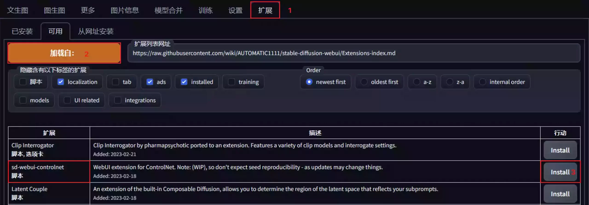
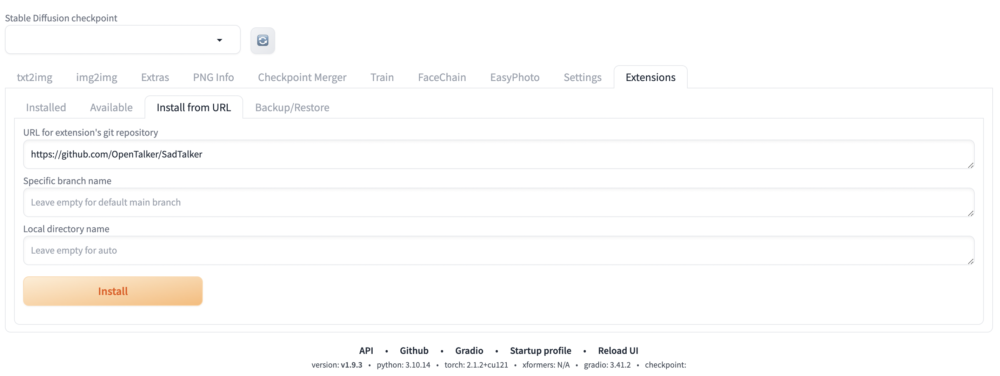
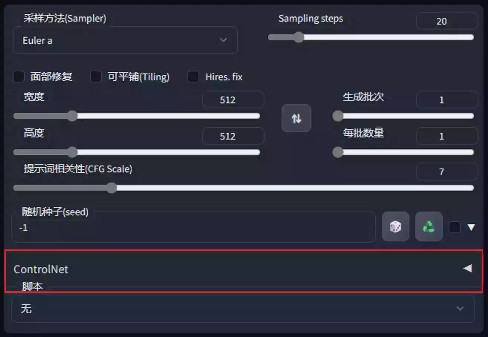

# ControlNet安装教程

本文是关于使用ControlNet插件进行AI绘图的安装教程，包括如何自动和手动安装插件以及如何下载所需的模型文件，并提供相关网盘和GitHub下载链接。安装完成后，用户将能够在Stable Diffusion WebUI的主界面中看到ControlNet窗口，并使用其进行AI绘图创作。

## 前置条件

### Stable Diffusion WebUI

若您想使用`` `ControlNet` ``来进行AI绘图创作，那么您必须已经在电脑内安装部署了`Stable Diffusion`。  
关于`Stable Diffusion`怎么部署，请看下面的文章，内容详细且所有需要的模型本站均已提供下载。

请您通过上面的文章已经确保完成`Stable Diffusion`的安装之后，再继续阅读下文。

## 注意事项

您的`Stable Diffusion WebUI`版本必须在2023年2月份之后，不然可能安装插件后无法正常使用。  
因为`Stable Diffusion WebUI`的新版有很多变化，以及所需的依赖环境更新；为避免出现不可预见的问题，强烈建议您根据上面的文章重新安装部署一遍。

## 安装教程

### 插件下载

#### 自动下载

目前`ControlNet`插件已集成在`Stable Diffusion WebUI`的扩展内，可以一键自动下载安装。

根据图片红框顺序点击安装即可，`Stable Diffusion WebUI -> 扩展 -> 可用 -> 加载 -> sd-webui-controlnet -> install`。

安装完毕后，`Stable Diffusion WebUI -> 扩展 -> 已安装`， 会显示以下内容。不好找的话，可以使用`Stable Diffusion WebUI -> 扩展 -> 通过URL` ，复制表格中的URL地址，即可。

| Extension                                 | URL                                                                                                                                                                                                                                                                                                                                                                                                                                                         | Branch | Version                                                                                                                              | Date                | Update                                                                                                                                                                                                                                                                                                                                                                                                                                                                                                                                                                                                                                                                                                                                                                                                                                                                                                                                                                                                                                                                                                                                                                                                                                                                                                                                                                                                                                                                                                                                                                                                                                                                                                                                                                  |
| ----------------------------------------- | ----------------------------------------------------------------------------------------------------------------------------------------------------------------------------------------------------------------------------------------------------------------------------------------------------------------------------------------------------------------------------------------------------------------------------------------------------------- | ------ | ------------------------------------------------------------------------------------------------------------------------------------ | ------------------- | ----------------------------------------------------------------------------------------------------------------------------------------------------------------------------------------------------------------------------------------------------------------------------------------------------------------------------------------------------------------------------------------------------------------------------------------------------------------------------------------------------------------------------------------------------------------------------------------------------------------------------------------------------------------------------------------------------------------------------------------------------------------------------------------------------------------------------------------------------------------------------------------------------------------------------------------------------------------------------------------------------------------------------------------------------------------------------------------------------------------------------------------------------------------------------------------------------------------------------------------------------------------------------------------------------------------------------------------------------------------------------------------------------------------------------------------------------------------------------------------------------------------------------------------------------------------------------------------------------------------------------------------------------------------------------------------------------------------------------------------------------------------------- |
| SadTalker                                 | https://github.com/OpenTalker/SadTalker.git                                                                                                                                                                                                                                                                                                                                                                                                                 | main   | [cd4c0465](https://github.com/OpenTalker/SadTalker/commit/cd4c0465ae0b54a6f85af57f5c65fec9fe23e7f8)                                  | 2023-10-11 00:10:21 | unknown                                                                                                                                                                                                                                                                                                                                                                                                                                                                                                                                                                                                                                                                                                                                                                                                                                                                                                                                                                                                                                                                                                                                                                                                                                                                                                                                                                                                                                                                                                                                                                                                                                                                                                                                                                 |
| canvas-zoom                               | [GitHub - richrobber2/canvas-zoom: zoom and pan functionality](https://github.com/richrobber2/canvas-zoom.git)                                                                                                                                                                                                                                                                                                                                              | main   | [b2211237](https://github.com/richrobber2/canvas-zoom/commit/b2211237395bb09f9dbf3d7de9970016cb5df8b5)                               | 2024-03-02 03:01:37 | unknown                                                                                                                                                                                                                                                                                                                                                                                                                                                                                                                                                                                                                                                                                                                                                                                                                                                                                                                                                                                                                                                                                                                                                                                                                                                                                                                                                                                                                                                                                                                                                                                                                                                                                                                                                                 |
| facechain                                 | [GitHub - modelscope/facechain: FaceChain is a deep-learning toolchain for generating your Digital-Twin.](https://github.com/modelscope/facechain.git)                                                                                                                                                                                                                                                                                                      | main   | [686a34b3](https://github.com/modelscope/facechain/commit/686a34b30a117cf8ed01b66b31b7f75b7bdcee3b)                                  | 2024-04-07 09:40:32 | unknown                                                                                                                                                                                                                                                                                                                                                                                                                                                                                                                                                                                                                                                                                                                                                                                                                                                                                                                                                                                                                                                                                                                                                                                                                                                                                                                                                                                                                                                                                                                                                                                                                                                                                                                                                                 |
| multidiffusion-upscaler-for-automatic1111 | [GitHub - pkuliyi2015/multidiffusion-upscaler-for-automatic1111: Tiled Diffusion and VAE optimize, licensed under CC BY-NC-SA 4.0](https://github.com/pkuliyi2015/multidiffusion-upscaler-for-automatic1111.git)                                                                                                                                                                                                                                            | main   | [574a0963](https://github.com/pkuliyi2015/multidiffusion-upscaler-for-automatic1111/commit/574a0963133a34815f65bfaf985c19de54fdf323) | 2024-03-30 17:56:11 | unknown                                                                                                                                                                                                                                                                                                                                                                                                                                                                                                                                                                                                                                                                                                                                                                                                                                                                                                                                                                                                                                                                                                                                                                                                                                                                                                                                                                                                                                                                                                                                                                                                                                                                                                                                                                 |
| sd-webui-EasyPhoto                        | [GitHub - aigc-apps/sd-webui-EasyPhoto: 📷 EasyPhoto \| Your Smart AI Photo Generator.](https://github.com/aigc-apps/sd-webui-EasyPhoto.git)                                                                                                                                                                                                                                                                                                                | main   | [2e5e4974](https://github.com/aigc-apps/sd-webui-EasyPhoto/commit/2e5e4974aa1bdac0bcd4af2387425e21d0e15212)                          | 2024-03-22 17:41:52 | unknown                                                                                                                                                                                                                                                                                                                                                                                                                                                                                                                                                                                                                                                                                                                                                                                                                                                                                                                                                                                                                                                                                                                                                                                                                                                                                                                                                                                                                                                                                                                                                                                                                                                                                                                                                                 |
| sd-webui-controlnet                       | [GitHub - Mikubill/sd-webui-controlnet: WebUI extension for ControlNet](https://github.com/Mikubill/sd-webui-controlnet.git)                                                                                                                                                                                                                                                                                                                                | main   | [7b4cdea2](https://github.com/Mikubill/sd-webui-controlnet/commit/7b4cdea2a44dda6eb042eed5af1439726a4c5e1a)                          | 2024-05-21 02:25:07 | unknown                                                                                                                                                                                                                                                                                                                                                                                                                                                                                                                                                                                                                                                                                                                                                                                                                                                                                                                                                                                                                                                                                                                                                                                                                                                                                                                                                                                                                                                                                                                                                                                                                                                                                                                                                                 |
| sd-webui-prompt-all-in-one                | [GitHub - Physton/sd-webui-prompt-all-in-one: This is an extension based on sd-webui, aimed at improving the user experience of the prompt/negative prompt input box. It has a more intuitive and powerful input interface function, and provides automatic translation, history record, and bookmarking functions. 这是一个基于 sd-webui 的扩展，旨在提高提示词/反向提示词输入框的使用体验。它拥有更直观、强大的输入界面功能，它提供了自动翻译、历史记录和收藏等功能。](https://github.com/Physton/sd-webui-prompt-all-in-one) | main   | [f00a3f56](https://github.com/Physton/sd-webui-prompt-all-in-one/commit/f00a3f56ba499e8be6e498f7206ecea7fef055e5)                    | 2024-05-22 00:57:50 | unknown                                                                                                                                                                                                                                                                                                                                                                                                                                                                                                                                                                                                                                                                                                                                                                                                                                                                                                                                                                                                                                                                                                                                                                                                                                                                                                                                                                                                                                                                                                                                                                                                                                                                                                                                                                 |
| sd-webui-segment-anything                 | [GitHub - continue-revolution/sd-webui-segment-anything: Segment Anything for Stable Diffusion WebUI](https://github.com/continue-revolution/sd-webui-segment-anything.git)                                                                                                                                                                                                                                                                                 | master | [982138cf](https://github.com/continue-revolution/sd-webui-segment-anything/commit/982138cfb505de61a3cbb257b2fa9d461d9b5493)         | 2024-02-24 04:25:02 | unknownExtension    URL    Branch    Version    Date    Update LDSR    built-in    None             Lora    built-in    None             ScuNET    built-in    None             SwinIR    built-in    None             canvas-zoom-and-pan    built-in    None             extra-options-section    built-in    None             hypertile    built-in    None             mobile    built-in    None             postprocessing-for-training    built-in    None             prompt-bracket-checker    built-in    None             soft-inpainting    built-in    None             SadTalker    https://github.com/OpenTalker/SadTalker.git    main    cd4c0465    2023-10-11 00:10:21    unknown canvas-zoom    https://github.com/richrobber2/canvas-zoom.git    main    b2211237    2024-03-02 03:01:37    unknown facechain    https://github.com/modelscope/facechain.git    main    686a34b3    2024-04-07 09:40:32    unknown multidiffusion-upscaler-for-automatic1111    https://github.com/pkuliyi2015/multidiffusion-upscaler-for-automatic1111.git    main    574a0963    2024-03-30 17:56:11    unknown sd-webui-EasyPhoto    https://github.com/aigc-apps/sd-webui-EasyPhoto.git    main    2e5e4974    2024-03-22 17:41:52    unknown sd-webui-controlnet    https://github.com/Mikubill/sd-webui-controlnet.git    main    7b4cdea2    2024-05-21 02:25:07    unknown sd-webui-prompt-all-in-one    https://github.com/Physton/sd-webui-prompt-all-in-one    main    f00a3f56    2024-05-22 00:57:50    unknown sd-webui-segment-anything    https://github.com/continue-revolution/sd-webui-segment-anything.git    master    982138cf    2024-02-24 04:25:02    unknown |

如果您有需要编辑姿势的需求，那么建议您往下翻一点，找到一个名为`OpenPose Editor`的插件，安装该插件。

OpenPose Editor

安装完成后，重新加载`Stable Diffusion WebUI`的主界面。

> 注意：如果遇到报错，或者长时间卡顿在安装状态，可以刷新WebUI界面尝试重新安装。但是，重新安装时可能存在报错，大概意思是提示您已经存在未完成的下载文件，无法继续安装。此时需要你手动前往`Stable Diffusion WebUI`的项目目录，手动删除之前未下载完成的已损坏文件，以本站的完整路径为例：<`D:\openai.wiki\stable-diffusion-webui\tmp\sd-webui-controlnet`>，删除除该目录内的<`sd-webui-controlnet`>文件夹，然后重新来到UI界面点击Install按钮安装。

#### 手动下载

如果您无法通过自动安装，也可以手动下载自行安装。

GitHub下载地址：[https://github.com/Mikubill/sd-webui-controlnet](https://openai.wiki/go?_=47fe78c830aHR0cHM6Ly9naXRodWIuY29tL01pa3ViaWxsL3NkLXdlYnVpLWNvbnRyb2xuZXQ%3D)。

网盘下载地址：为方便无法使用外网的大家使用，也可通过下面的连接自行下载。

下载完成后，将`sd-webui-controlnet-main.zip`文件解压至你的`Stable Diffusion WebUI`项目`extensions`文件夹内。  
例如本站的完成路径为：`D:\openai.wiki\stable-diffusion-webui\extensions\sd-webui-controlnet`

安装完成后，重新加载`Stable Diffusion WebUI`的主界面。

### 模型下载

因模型较大较多，描述文件较长，不在此文进行描述，请自行前往下面的文章下载相关所需模型。

模型下载完成后，将模型pth文件移动至你的`Stable Diffusion WebUI`项目`extensions\sd-webui-controlnet\models`文件夹内。

例如本站的PTH模型文件放置路径为：`D:\openai.wiki\stable-diffusion-webui\extensions\sd-webui-controlnet\models`

## 安装完成

在完成上述所有安装步骤之后，您将会在`Stable Diffusion WebUI`的<[http://127.0.0.1:7860/](https://openai.wiki/go?_=764f133814aHR0cDovLzEyNy4wLjAuMTo3ODYwLw%3D%3D)>网页主界面看到关于ControlNet的窗口，界面如下。

# ControlNet模型下载

本页提供ControlNet所有模型的下载，提供以下两种方式。

- 官网下载：需要魔法上网，下载速度不是很快。
- 网盘下载：本站已将所有模型下载打包上传至国内不限速网盘，不用会员，免客户端，免广告。

## 官网下载

下面为官网下载地址，需要注册HuggingFace的账号。

最新模型：[https://huggingface.co/lllyasviel/ControlNet-v1-1/tree/main](https://openai.wiki/go?_=2434b38ae8aHR0cHM6Ly9odWdnaW5nZmFjZS5jby9sbGx5YXN2aWVsL0NvbnRyb2xOZXQtdjEtMS90cmVlL21haW4%3D)

旧版模型：[https://huggingface.co/lllyasviel/ControlNet/tree/main/models](https://openai.wiki/go?_=2e1ab940e7aHR0cHM6Ly9odWdnaW5nZmFjZS5jby9sbGx5YXN2aWVsL0NvbnRyb2xOZXQvdHJlZS9tYWluL21vZGVscw%3D%3D)

## 网盘下载

### 单独下载

**以下为旧版本模型一下载地址，请尽量下载上面的最新版本模型。**

以下模型全部基于`Stable Diffusion WebUI的V1.5版本官方模型+ControlNet模型`融合而成。  
点击相应的模型名称，将会自动跳转到网盘下载地址，适合仅想使用某一个模型。

| 模型名称                                                                                                                 | 模型描述                                                                   |
| -------------------------------------------------------------------------------------------------------------------- | ---------------------------------------------------------------------- |
| [control_sd15_canny.pth](https://openai.wiki/go?_=35e9e0a823aHR0cHM6Ly93d3cuMTIzcGFuLmNvbS9zL3NLZDktekVKYy5odG1s)    | 适用于给线稿上色，或将图片转化为线搞后重新上色，比较适合人物。                                        |
| [control_sd15_depth.pth](https://openai.wiki/go?_=a33cc4744caHR0cHM6Ly93d3cuMTIzcGFuLmNvbS9zL3NLZDktTEVKYy5odG1s)    | 创造具有景深的中间图，建筑人物皆可使用。 Stability的模型64×64深度，ControlNet模型可生成512×512深度图。 |
| [control_sd15_hed.pth](https://openai.wiki/go?_=9e3dea4d3daHR0cHM6Ly93d3cuMTIzcGFuLmNvbS9zL3NLZDktNUVKYy5odG1s)      | 提取的图像目标边界将保留更多细节，此模型适合重新着色和风格化。                                        |
| [control_sd15_mlsd.pth](https://openai.wiki/go?_=bdd7cee7c6aHR0cHM6Ly93d3cuMTIzcGFuLmNvbS9zL3NLZDktcUVKYy5odG1s)     | 该模型基本不能识别人物的，但非常适合建筑生成，根据底图或自行手绘的线稿去生成中间图，然后再生成图片。                     |
| [control_sd15_normal.pth](https://openai.wiki/go?_=b56be6941daHR0cHM6Ly93d3cuMTIzcGFuLmNvbS9zL3NLZDktNkVKYy5odG1s)   | 根据底图生成类似法线贴图的中间图，并用此中间图生成建模效果图。 此方法适用于人物建模和建筑建模，但更适合人物建模。           |
| [control_sd15_openpose.pth](https://openai.wiki/go?_=b5dc97b8fcaHR0cHM6Ly93d3cuMTIzcGFuLmNvbS9zL3NLZDkteUVKYy5odG1s) | 根据图片生成动作骨骼中间图，然后生成图片，使用真人图片是最合适的，因为模型库使用的真人素材。                         |
| [control_sd15_scribble.pth](https://openai.wiki/go?_=14114cf202aHR0cHM6Ly93d3cuMTIzcGFuLmNvbS9zL3NLZDktVkVKYy5odG1s) | 使用人类涂鸦控制SD。该模型使用边界边缘进行训练，具有非常强大的数据增强功能，以模拟类似于人类绘制的边界线。                 |
| [control_sd15_seg.pth](https://openai.wiki/go?_=10ebba09e4aHR0cHM6Ly93d3cuMTIzcGFuLmNvbS9zL3NLZDktakVKYy5odG1s)      | 使用语义分割来控制SD，协议是ADE20k。 现在您需要输入图像，然后一个名为Uniformer的模型将为您检测分割。         |

## 参考描述

**以后关于模型的描述为[官方描述](https://openai.wiki/go?_=45eea66c5faHR0cHM6Ly9odWdnaW5nZmFjZS5jby9sbGx5YXN2aWVsL0NvbnRyb2xOZXQvYmxvYi9tYWluL1JFQURNRS5tZA%3D%3D)【机器翻译】，可供参考。**

ControlNet/models/control_sd15_canny.pth

- ControlNet+SD1.5 模型，用于使用精明边缘检测来控制 SD。

ControlNet/models/control_sd15_depth.pth

- ControlNet+SD1.5模型使用Midas深度估计来控制SD。

ControlNet/models/control_sd15_hed.pth

- ControlNet+SD1.5 型号使用 HED 边缘检测（软边缘）控制 SD。

ControlNet/models/control_sd15_mlsd.pth

- ControlNet+SD1.5模型使用M-LSD线检测来控制SD（也可以与传统的Hough变换一起使用）。

ControlNet/models/control_sd15_normal.pth

- ControlNet+SD1.5 模型使用法线贴图控制 SD。最好使用该 Gradio 应用程序生成的法线贴图。只要方向正确，其他法线贴图也可以工作（左边看红色，右边看蓝色，上看绿色，下看紫色）。

ControlNet/models/control_sd15_openpose.pth

- ControlNet+SD1.5 模型，使用 OpenPose 姿势检测控制 SD。直接操纵姿势骨架也应该有效。

ControlNet/models/control_sd15_scribble.pth

- ControlNet+SD1.5模型使用人类涂鸦控制SD。该模型使用边界边缘进行训练，具有非常强大的数据增强功能，以模拟类似于人类绘制的边界线。

ControlNet/models/control_sd15_seg.pth

- ControlNet+SD1.5模型使用语义分割来控制SD。协议是ADE20k。

ControlNet/annotator/ckpts/body_pose_model.pth

- 第三方模型：Openpose的姿势检测模型。

ControlNet/annotator/ckpts/hand_pose_model.pth

- 第三方模型：Openpose的手部检测模型。

ControlNet/annotator/ckpts/dpt_hybrid-midas-501f0c75.pt

- 第三方模型：迈达斯深度估计模型。

ControlNet/annotator/ckpts/mlsd_large_512_fp32.pth

- 第三方模型：M-LSD检测模型。

ControlNet/annotator/ckpts/mlsd_tiny_512_fp32.pth

- 第三方模型：M-LSD的另一个较小的检测模型（我们不使用这个）。

ControlNet/annotator/ckpts/network-bsds500.pth

- 第三方模型：霍尔效应器件边界检测。

ControlNet/annotator/ckpts/upernet_global_small.pth

- 第三方模型：Uniformer 语义分割。
