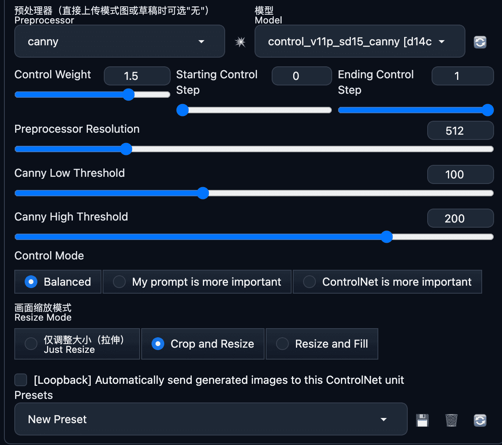

# 文字生成图片的Prompt

```textile
best quality, ultra high res, (photorealistic:1.4), 1girl, nude, full body, spread legs,  <lora:koreanDollLikeness_v15:1> ,<lora:yaeMikoRealistic_yaemikoMixed:1>,
Negative prompt: paintings, sketches, (worst quality:2),(low quality:2),(normal quality:2), lowres, normal quality, ((monochrome)), ((grayscale)), skin spots, acnes, skin blemishes, age spot, glans,{{{bad_hands}}},badhand, bad_feet,
ENSD: 31337, Size: 960x1024, Seed: 4138265202, Steps: 20, Sampler: DPM++ SDE Karras, CFG scale: 7, Clip skip: 2, Model hash: fc2511737a
```

# Stable Diffustion AI生图 冬至海报系列主题

[原文](https://lingshunlab.com/ai/stable-diffusion-ai-raw-winter-solstice-poster-series-theme "下午1:28")

## 本地部署配置

系统：Win10  
CPU：i3  
内存：16 GB  
显卡：3060Ti 8GB  
硬盘：SSD

Stable Diffusiton安装在外置移动SSD硬盘（512GB）

## AI生图效果


## 启动WebUI

### 启动参数

```bash
Launching Web UI with arguments: --listen --medvramm-sdxxl
```

## 模型选择

### 模型

Stable Diffusion 模型(ckpt)： revAnimated_v122EOL.safetensors

> 下载地址：  
> https://civitai.com/models/7371/rev-animated  
> or  
> [LiblibAI·哩布哩布AI - 中国领先的AI创作平台](https://www.liblib.art/modelinfo/1004b01e19714137a593e30007f3c737)

SD VAE：Automatic自动

### 其他模型

embedding

Bad-Hands-5 ：https://civitai.com/models/116230/bad-hands-5

EasyNegative ：https://civitai.com/models/7808/easynegative

参数如下图：


## 文生图

### 正向提示词（你想要的）

```tex
(((a bowl of Traditional tangyuan))),only one bowl,steaming hot and steaming,buddhist mood,simple_background,in winter,winter solstice,highres,snowflakes,masterpiece,rim light,
```

例如如下图：


### 反向提示词（你不想要的）

```tex
(nsfw),(low qulity),(worst quality:1.4) bad-hands-5,EasyNegative,blob,humans,
```

例如如下图：


## 生成设置

### 基本参数

采样方法： DPM++ 2M Karras

步数： 25 step

图片大小： 512 x 768 

生成批次：  4 

提示词相关性（CFG Scale）： 7

随机种子（seed）： -1

例如如下图：


## ControlNet 设置

准备好ControlNet需要用的图片：


加载该图片

勾选 启动

勾选 预览（Allow Preview）

控制类型： Canny（边缘检测）

控制权重（Control Weight）： 1.5 




## 开始「Generate」

最后，点击「Generate」开始生成，开始燃烧你的显卡吧。


