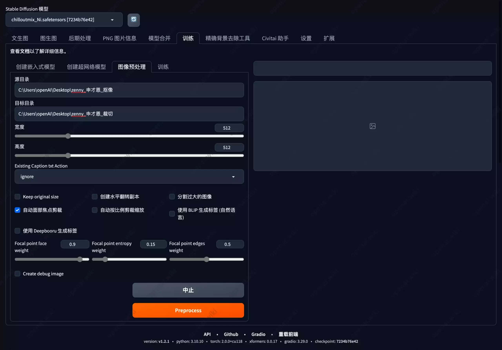
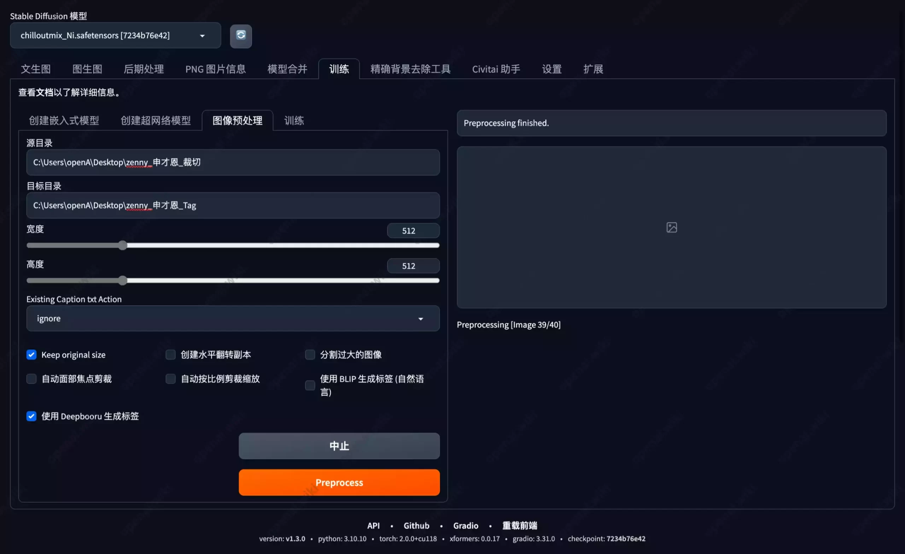

# Stable Diffusion｜LoRA模型训练｜素材准备

[原文](https://openai.wiki/author/-GVnTZ1z-qVR)


# LoRA模型训练教程图像素材准备与打标

之前本站也想写一下关于LoRA训练的教程，但是站长太懒了，而且最近私事和其它工作比较多，所以一直耽搁着。

本次站长也是零开始学习，一边学，一边教给大家，这样的好处是其中遇到的任何问题都有详细记录，你可能遇到的问题在我这里都有所解答。

本期教程以准备素材为主，因为素材的质量与模型的好坏是直接挂钩的，所以希望大家在训练时尽量遵守以下各类规则。

## 素材示例

本站提供40张网高清网图做为训练所用的数据，此素材的人物为国外模特`申才恩`，希望不要起诉我（狗头）。

## 清晰度

下面是宽、高、分辨率、模式等完全一致的图片，但是左图非常清晰，右图却非常模糊。

显然，左图才是高质量的图像，虽然我们目前看来可能没有什么区别，但如果我们放大一些再来看一下。

左图发丝清晰可见，右图面部全部都模糊在一起，这会导致光影、颜色、结构等较多细节缺失。

我们可以把左图理解为你使用手机直接拍摄的照片，右图是通过微信等软件发送后，自动压缩的图片。微信或其它软件为了节省带宽和手机存储空间等原因，将会自动压缩图片，所以训练时一定一定要尽量选择高质量的清晰图片。

## 高清放大

有些人比较聪明，可能会想到另一种曲线救国的办法。既然图片模糊会影响效果，那我直接通过Stable Diffusion的插件进行修复呢？

我们可以看到，效果虽然会好上那么一些，但还是会丢失很多细节。因为放大修复的作用并不是还原图像，而是通过AI算法去弥补，它只是去猜测各个模糊的像素点位置应该填充什么色块，但绝对不会像原图一样清晰真实。

## 素材角度

在选择素材时，尽量选择各个角度的图像，不要全部或大量素材都是正面，这样AI才能够更加全面的学习，而不局限于单个视图的绘画能力，以下是一些角度的示例。

## 素材抠像

理论上来讲，素材的背景越干净简洁，其绘画效果和学习速度提升越大。而且抠像之后我们在打标签的时候，也不会添加一些奇奇怪怪的内容到标签内，非常有利于学习，也有利于打标签更加轻松。

**什么是抠像？抠像后的效果是怎么样的？**

可以看到，左侧原图中除了人物的其它场景，都已经消失了，这就是抠像，让AI学习的时候可以过滤很多干扰。

以下是站长理解的AI训练学习方法示意图，AI是通过区块进行学习的，如果你将不需要的部分剔除掉，那么在学习过程中就会对为空的部分不学习，也避免AI会将枕头等内容作为角色的一部分而被学习，从来达到加快学习速度和效果的目的。

目前有以下几种方法进行抠像，可以按照自身条件进行选择。

- cv_unet_image-matting
  - 开源人像抠图项目，支持批量抠像，效果还不错，本站本次所使用的抠像方法就是基于此项目。
  - [开源自动识别人像AI抠图｜教程](https://openai.wiki/cv_unet_image-matting.html)
- PBRemTools
  - 中文名”精确背景去除工具”，支持通过语言关键字抠像指定物体，比如”人”，”剑”，”枪”等。
  - 经本站测试效果一般，但也还算能用。该工具的优点就是可以通过SD内置的拓展安装，直接在拓展内搜索`PBRemTools`即可。
  - GitHub：[mattyamonaca/PBRemTools: Precise background remover (github.com)](https://openai.wiki/go?_=0a5a60d5c5aHR0cHM6Ly9naXRodWIuY29tL21hdHR5YW1vbmFjYS9QQlJlbVRvb2xz)
  - 本站其实已经编辑好了该工具的教程，但是这个工具比较简单，所以没有单独发出来，如果后续大家有需要的话，可以在评论区要求我发。
- Photoshop
  - 有点麻烦，需要一张一张手动抠图，不太建议使用。
  - `**更新：在站长写下一篇训练部分的教程时，试用了最新的Photoshop Beta版本，拥有了一键移除背景的功能，效果非常棒，推荐搭配自动化脚本使用。**`

其实无论哪一种工具都是可以的，只要能处理干净就好。退一万步而言，哪怕不进行抠图，也是可以进行训练的，如果你觉得这个步骤比较麻烦，直接跳过即可。

以下是各工具的抠像效果对比，大家可以自行选择。

可以看到`cv_unet_image-matting`的效果还是不错的；而`PBRemTools`的边缘抠像效果并不好；`Photoshop`效果的非常不错，但仅针对特定主体，如果主体不明确则效果极差。

### 示例下载

以下是本站已经使用`cv_unet_image-matting`方法自动抠像处理后的素材，共计`40张`。如有需要，可以自行下载。

### 抠像备注

下面是一些抠像之后的图像示例，可以看到部分是没有抠干净的，或者因为存在其它物体遮挡而导致肢体不全的。

但是这些并不重要，因为模型训练主要还是看脸，所以只要面部是完整的，效果就不会太差。

## 素材裁切

图像的尺寸我们可以选择`512像素*512像素`，因为多数的训练集都是基于`512像素*512像素`，与原训练集保持一致的比例，可以得到更好的效果。

而且，超出面部范围之外的大部分内容是没有什么用的，因为我们只是希望保留面部替换而已。

我们有很多种办法仅保留面部图像，但是效果各不相同，以下是三种主流的方式。

| 类型               | 优点            | 缺点      | 方式                                                                              |
| ---------------- | ------------- | ------- | ------------------------------------------------------------------------------- |
| Birme            | 支持批量｜不限尺寸     | 不支持单独放大 | [在线网站](https://openai.wiki/go?_=9825464dc4aHR0cHM6Ly93d3cuYmlybWUubmV0Lw%3D%3D) |
| Stable Diffusion | 支持批量｜不限尺寸     | 不支持单独放大 | 内置插件                                                                            |
| Photoshop        | 手动调整面部大小｜不限尺寸 | 不支持批量   | 手动安装                                                                            |

以下是这三种方式的区别，Birme可以手动选择裁切的位置；Stable Diffusion是全自动聚焦面部的，无法手动选择；Photoshop麻烦一些，但是可以放大面部，本站比较推荐这种方式。其实一共也没有多少张图像，用来训练机的图像一般都是在几十张之内，手动裁切也就是十分钟左右的时间，可以获得更好的效果，总比一次次重新训练要好的多吧？一劳永逸哦。




下面是关于使用PS和使用其它两款软件进行裁切的区别：

左边是完整的图像，站长已经添加了裁切范围示意框。红色区域就是通过Birme或Stable Diffusion裁切后所得到的范围，裁切之后的效果如中间图像所示，这种方式会保留较大的身体部分，这部分内容其实对于LoRA训练并没有太多用处，还会导致聚焦于面部的信息过少。最右侧的图像是我们通过Photoshop手动聚焦面部之后所裁切的图像，这样可以仅针对于面部，对于AI机器学习来说，可以更加有针对性的学习，得到更好的效果。

## 标签生成

此时我们需要做比较重要的一项工作了，那就是生成标签，也就是Tag。我们也可以手动填写每个标签，但这太累了，而且也不全面，所以建议大家先批量自动生成，然后再进行手动修改，这样的效果可以更好。

### 打标设置

我们将源目录设置为我们已经裁剪并抠像完成的文件夹，并且设置一下输出目录，用来保存自动打标后的图像和txt描述文件。

注意：经本站测试，如果不勾选`Keep original size`选项，在输出目录的新图像将会变的模糊。生成标签时尽量在BLIP和Deepbooru中选择一个，因为两个标签同时勾选，生成后的标签将会有部分重叠。



### 效果展示

本站这里抽出一张做为示例，为大家看一下打标之后的效果。

以下是根据该图像所自动生成的标签：

```
1girl, adidas, black_hair, black_nails, blue_nails, blue_shirt, clothes_writing, 
fingernails, japan, lips, long_hair, nail_polish, parted_lips, pink_nails, 
realistic, shirt, short_sleeves, simple_background, soccer, soccer_uniform, 
solo, sportswear, t-shirt, upper_body, white_background
```


翻译后的内容如下：

```
1个女孩，阿迪达斯，黑发，黑色指甲，蓝色指甲，蓝色衬衫，服装文字，指甲，日本，嘴唇，
长发，指甲油，张开嘴唇，粉色指甲，逼真，衬衫，短袖，简单背景，足球，足球服，独奏，
运动服，T恤衫，上半身，白色背景。
```


## 标签修改

关于标签的修改有两种方式，但是方便程度不同，效果一致，大家可以根据自身喜好选择。

### 打标说明

关于标签的修改，应该怎么改？这里提前交代一下，毕竟标签的好坏，直接会影响到后缀生成的效果。

一个相对完善的标签应该包含以下内容：

| Tag类型 | Tag内容                                                                                     | 描述                          |
| ----- | ----------------------------------------------------------------------------------------- | --------------------------- |
| 主题    | `1 boy`｜`1 girl`｜`自动设置的主触发Tag`                                                            | 用于涵盖所有不需要调节的特征项             |
| 动作    | `sitting`｜`standing`｜`looking at viewer`                                                  | 坐着｜站着｜看着观众                  |
| 特征    | `blonde hair`｜`short hair`｜`lips`｜`mole`                                                  | 金发｜短发｜嘴唇｜痣                  |
| 视角    | `upper body`｜`full body shot`｜`from side`｜<br>`lie down`｜`lying on stomach`               | 上半身｜全身照｜侧面｜躺着｜趴着            |
| 光影    | `absurdres:1.2`｜`night`｜`Kodak portra 400`｜<br>`film grain`                               | 荒谬：1.2｜夜色｜柯达portra 400｜胶片颗粒 |
| 其它    | `blurry background`｜`table in front of couch`｜`White background`｜`solid color background` | 模糊背景｜沙发前的桌子｜白色背景｜纯色背景       |

同样以下图为例，我们目前得到的自动标签内容如下：

```
1个女孩，阿迪达斯，黑发，黑色指甲，蓝色指甲，蓝色衬衫，服装文字，指甲，日本，嘴唇，长发，指甲油，张开嘴唇，
粉色指甲，逼真，衬衫，短袖，简单背景，足球，足球服，独奏，运动服，T恤衫，上半身，白色背景。

```

如果你需要某一部分是可控的，那么就将这一部分放在标签内；如果某一部分是该LoRA的特征，那么最好不要去添加。

举例：如果我们需要后续可以修改头发的颜色，那就在标签内填写现在有头发特征，如`黑发`｜`长发`，这样后续才方便我们使用SD生成时进行修改。如果关于该图的所有Tag内都没有关于头发的描述，那么AI将会理解关于头发的部分，是这个LoRA的一部分，是内置在LoRA模型内无法进行单独修改的。

所以我们应该设置此图的Tag如下：

```
1个女孩，黑发，蓝色指甲，蓝色衬衫，指甲，长发，指甲油，张开嘴唇，粉色指甲，逼真，衬衫，短袖，简单背景，
足球服，独展，运动服，T恤衫，上半身，白色背景。

```

此时还需要关于角度的描述，我们手动添加：

```
1个女孩，黑发，蓝色指甲，蓝色衬衫，指甲，长发，指甲油，张开嘴唇，粉色指甲，逼真，衬衫，短袖，简单背景，
足球服，独展，运动服，T恤衫，上半身，白色背景，躺着，
```

注意：Tag的顺序对于权重的大小是有所影响的，Tag越靠前，权重影响越大。

### 手动改标

手动改标最好是安装VS Code工作，支持双窗口显示，任意修改即可。

### BooruDatasetTagManager

一个可以支持自动翻译的打标开源软件，个人感觉还是挺好用的（新版），对于英文不好的人来说，非常友好。

GitHub：[https://github.com/starik222/BooruDatasetTagManager](https://openai.wiki/go?_=0da95e4fccaHR0cHM6Ly9naXRodWIuY29tL3N0YXJpazIyMi9Cb29ydURhdGFzZXRUYWdNYW5hZ2Vy)

### 示例下载

手动修改标签之后的最终LoRA训练素材下载：

## 总结

好啦，至此我们已经完成了所有准备工作。不过呢，这些都是理论上的，因为站长也还没有开始训练，这是第一次做LoRA模型训练。


