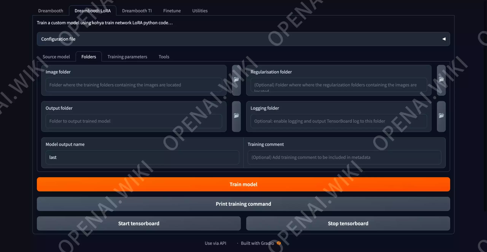

# Stable Diffusion｜LoRA模型训练｜详细教程

[原文](https://openai.wiki/author/-GVnTZ1z-qVR)

# **LoRA模型训练教程｜训练工具安装与参数详解**

之前已经讲过了关于训练素材的准备教程，本次为大家带来详细的训练插件GUI版本安装部署教程，以及训练时所对应的各参数应该如何设置的教程。

其中涉及到的内容多而杂，如果这些参数你都不想了解，只想快速的通过已整理好的素材训练出一个自己的LoRA模型，那么可以仅看本文中安装部署kohya_ss的部分，其它内容大致看一眼，有一个概念就好。因为下一篇文章，本站将会通过奇淫巧技教大家抛弃复杂的设置，如何快速生成一个效果非常棒的LoRA模型。

本期内容包括kohya_ss的GUI网页界面版安装部署教程，以及如何在局域网内运行kohya_ss工具。以及关于训练LoRA时在kohya_ss工具内设置的各项参数含义、功能、推荐值等内容。对于如何训练模型、最佳学习率推算等内容也进行了讲解，并在最后提供了本站所训练的演示模型下载。

## 前置条件

希望大家在观看此教程之前，先观看上一篇关于素材准备的内容，因为只有合适的素材和较好的Tag打标，才能够得到更好的AI绘画模型。

[素材准备](./lora-train-1.md)

## kohya_ss

kohya_ss是用来训练LoRA模型的一个工具，目前已经集成了GUI界面，对于新手来说非常友好，毕竟总要比改文本内的参数更加直观吧？

下面是关于kohya_ss的安装教程，整个过程还是比较简单的。

### 官方仓库

GitHub：[bmaltais/kohya_ss (github.com)](https://github.com/bmaltais/kohya_ss)

### 相关组件

在安装`kohya_ss`之前，我们需要先安装`Visual Stuidio`的发行库。

### kohya_ss部署

上面的都是前置条件，在完成Git和Python的安装之后，我们此时可以真正开始训练工具的安装部署环节啦。

以管理员方式运行CMD【`！必须是管理员方式！`】，执行如下命令。该命令行的作用是，解锁Powershell的安全功能，不然后续无法训练。

powershell -Command "Set-ExecutionPolicy Unrestricted"

检测`D盘`是否在`openai.wiki`，没有则创建该文件夹。

if not exist D:\openai.wiki mkdir D:\openai.wiki

强制切换工作路径为`D盘`的`openai.wiki`文件夹。

cd /d D:\openai.wiki

拉取Github仓库文件夹，将其下载至`openai.wiki`文件夹。

```bash
git clone https://github.com/bmaltais/kohya_ss.git
```

git clone https://github.com/bmaltais/kohya_ss.git

【可选】注意：如果您无法完成通过`git clone`安装，执行后报错或者无法下载，可以下载本站所提供的离线版本，将该文件解压至`D:\openai.wiki`即可。

通过以下命令行，切换至kohya_ss项目目录。

cd kohya_ss

执行如下命令，将会自动安装所有必要的依赖库。

setup.bat

### kohya_ss配置

在完成以上所有依赖库的安装之后，我们将会看到如下各项提示，本站已经为你翻译好啦。

```bash
Do you want to uninstall previous versions of torch and associated files before installing? Usefull if you are upgrading from torch 1.12.1 to torch 2.0.0 or if you are downgrading from torch 2.0.0 to torch 1.12.1.
[1] - Yes
[2] - No (recommanded for most)
Enter your choice (1 or 2):
---------------------------------------------------------
您想在安装之前卸载以前版本的 torch 和相关文件吗？ 如果您要从 torch 1.12.1 升级到 torch 2.0.0，或者如果您要从 torch 2.0.0 降级到 torch 1.12.1，这很有用。
[1] - 是的
[2] - 否（对大多数人推荐）
输入您的选择（1 或 2）：
```

我们输入`1`，因为我们这个虚拟环境什么都没安装。

```bash
WARNING: Skipping xformers as it is not installed.
WARNING: Skipping torch as it is not installed.
WARNING: Skipping torchvision as it is not installed.
WARNING: Skipping triton as it is not installed.
Please choose the version of torch you want to install:
[1] - v1 (torch 1.12.1) (Recommended)
[2] - v2 (torch 2.0.0) (Experimental)
Enter your choice (1 or 2):
---------------------------------------------------------
警告：跳过 xformers，因为它没有安装。
警告：跳过手电筒，因为它未安装。
警告：跳过 torchvision，因为它没有安装。
警告：跳过 triton，因为它没有安装。
请选择您要安装的手电筒版本：
[1] - v1 (torch 1.12.1) (推荐)
[2] - v2 (torch 2.0.0)（实验性）
输入您的选择（1 或 2）：
```

听话的选择推荐，输入`1`并按下`回车`键即可，此时将会自动安装1.12.1版本的Torch+CU116以及相关组件。

等待大概5分钟左右，将会看到下提示：

```bash
------------------------------------------------------------------------------------------------------------------------
In which compute environment are you running?
Please select a choice using the arrow or number keys, and selecting with enter
 * This machine
    AWS (Amazon SageMaker)

------------------------------------------------------------------------------------------------------------------------
您在哪个计算环境中运行？
请使用箭头或数字键选择一个选项，然后使用回车进行选择
  * 本机
     AWS（亚马逊 SageMaker）
```

我们可以通过键盘的上下按钮进行选择，我这里因为在本机中使用，所以直接按下回车即可。

```bash
------------------------------------------------------------------------------------------------------------------------
Which type of machine are you using?
Please select a choice using the arrow or number keys, and selecting with enter
 * No distributed training
    multi-CPU
    multi-GPU
    TPU
------------------------------------------------------------------------------------------------------------------------
您使用的是哪种类型的机器？
请使用箭头或数字键选择一个选项，然后使用回车进行选择
  * 没有分布式训练
     多个CPU
     多个GPU
     TPU
```

如果你有多张显卡就选择第3个，否则直接按下回车。

```bash
------------------------------------------------------------------------------------------------------------------------
Do you want to run your training on CPU only (even if a GPU / Apple Silicon device is available)? [yes/NO]:
------------------------------------------------------------------------------------------------------------------------
您是否只想在 CPU 上运行训练（即使 GPU / Apple Silicon 设备可用）？ [是/否]：
```

因为我这里有英伟达显卡，所以肯定是使用GPU来训练更好的，我们输入NO，然后按下回车。

```bash
Do you wish to optimize your script with torch dynamo?[yes/NO]:
你想用 torch dynamo 优化你的脚本吗？[是/否]：
```

直接输入`no`，并按下`回车`键。

```bash
您想使用 DeepSpeed 吗？ [是/否]：
```

直接输入`no`，并按下`回车`键。

```bash
What GPU(s) (by id) should be used for training on this machine as a comma-seperated list? [all]:
应该使用什么 GPU（按 id）在这台机器上作为逗号分隔列表进行训练？ [全部]：
```

输入`all`，然后按下`回车`键，这会自动调用你电脑中所有可用的GPU。

```bash
Do you wish to use FP16 or BF16 (mixed precision)?
Please select a choice using the arrow or number keys, and selecting with enter
 * no
    fp16
    bf16
    fp8
您要使用 FP16 还是 BF16（混合精度）？
请使用箭头或数字键选择一个选项，然后使用回车进行选择
  * 不
     fp16
     bf16
     fp8
```

直接按下`回车`键即可，因为这里我们后续是可以在GUI中修改的。

```bash
accelerate configuration saved at C:\Users\openA/.cache\huggingface\accelerate\default_config.yaml
配置保存在 C:\Users\openA/.cache\huggingface\accelerate\default_config.yaml
```

此时代表该项目已经成功被配置，无需其它额外的操作啦。

### kohya_ss配置修改

如果我们选错了，或者后续想要修改`kohya_ss`的配置。

那么我们可以通过修改`C:\Users\用户名\.cache\huggingface\accelerate\default_config.yaml`文件，来达到更新`kohya_ss`的配置目的。

如果你找不到该文件，可以在`CMD`或`运行`窗口中，执行如下命令，这将会自动打开你的`kohya_ss`默认配置文件。

```bash
%USERPROFILE%\.cache\huggingface\accelerate\default_config.yaml
```

### 【可选】CUDANN

如果你的显卡为30/40系列，可以下载CUDANN组件，该组件可以加快训练速度。

如果你的显卡是30以下，比如20/10系列，那么可以跳过此部分啦，因为安了也没用（比如站长就流下了贫穷的泪水）。

先在CMD中执行如下命令，激活虚拟环境。

```bash
D:\openai.wiki\kohya_ss\venv\Scripts\activate
```

执行如下命令，自动安装CUDANN相关工具。

```bash
python D:\openai.wiki\kohya_ss\tools\cudann_1.8_install.py
```

### 启动kohya_ss

我们此时找到`D:\openai.wiki\kohya_ss`目录内的`gui-user.bat`文件，双击运行该文件，将会打开一个CMD界面，然后加载相关启动文件，内容如下。

```bash
System Information:
System: Windows, Release: 10, Version: 10.0.22621, Machine: AMD64, Processor: Intel64 Family 6 Model 158 Stepping 13, GenuineIntel

Python Information:
Version: 3.10.11, Implementation: CPython, Compiler: MSC v.1916 64 bit (AMD64)

Virtual Environment Information:
Path: D:\openai.wiki\kohya_ss\venv

GPU Information:
Name: NVIDIA GeForce RTX 2080 Ti, VRAM: 11264 MiB

Validating that requirements are satisfied.
All requirements satisfied.
headless: False
Load CSS...
Running on local URL:  http://127.0.0.1:7860

To create a public link, set `share=True` in `launch()`.
```

#### Linux/Ubantu的安装和启动

```bash
git clone https://github.com/bmaltais/kohya_ss.git

## 安装必要的依赖
sudo apt update -y && sudo apt install -y python3-tk

./setup.sh 

## 监听本机的7861端口，并接收局域网访问
./gui.sh --listen 0.0.0.0 --server_port 7861 --inbrowser
```

首先我们可以看到电脑的一切配置文件，最后我们可以看到一串网址`http://127.0.0.1:7860`，这就是我们的启动方式，我们在浏览器打开该地址即可看到该工具的GUI操作界面啦！


## 训练基本设置

因为我们要训练的是LoRA模型，所以我们切换到`Dreambooth LoRA`选项卡，此时我们来了解一下本页的基本设置。


首先映入眼帘的是`Configuration file`下拉菜单，这个是用来载入默认配置的，我们如果之前已经保存过预设，那么可以快速载入。因为我们这是第一次使用，所以忽略该选项即可。

- Source model｜源模型
  - 通过名称我们就可以知道，这是关于模型的设置部分。

### Pretrained model name or path｜预训练模型名称或路径

就是用来选择你希望基于哪个模型来训练LoRA的，假如你想训练二次元模型，那么你在这里选择Stable Diffusion-V1.5肯定是不合适的，因为这个模型并不是二次元的风格，应该选择NovelAI之类的基础模型，这类模型对于二次元风格更加友好。如果你想训练亚洲真实人物，那么可以使用Chilloutmix之类的模型，这类模型对于亚洲人类型的绘画更加友好。

### Model Quick Pick｜型号快速选择

这里是一些关于基础模型型号的预设快速加载，比如你不知道下面的`v2`和`v_parameterization`功能是什么？应不应该勾选？

关于是否勾选，我们应该先确定基础模型是基于Stable Diffusion官方模型的哪个版本进行训练的。

比如本站此次打算使用`chilloutmix_Ni`这个模型做为基础模型，那么我们就前往[Civitai](https://openai.wiki/go?_=353513c85baHR0cHM6Ly9jaXZpdGFpLmNvbS8%3D)网站内查找该模型的相关信息。

在最右侧我们可以看到`Base Model = SD 1.5`，那这也就代表，`chilloutmix_Ni`模型是基于`Stable Diffusion-v1.5`官方模型所训练的。


因此，我们此时在`Model Quick Pick`内选择`Stable Diffusion-v1-5`，我们选择完成后发现`v2`和`v_parameterization`并没有被勾选，那就代表我们后缀基于此模型的训练，都不需要勾选这两个选项。

如果我们的基础模型是`Base Model = SD 2`的话，那我们将`Model Quick Pick`修改为`Stable Diffusion-2`，此时`v2`和`v_parameterization`都会被默认勾选，这就代表我们以后如果训练基于这SD2模型时，都是需要勾选的。

### 【可选】关于`V2`和`v_parameterization`

关于`V2`和`v_parameterization`到底是什么？

以下几点在 Stable Diffusion 2.0 中发生了显着变化。

1. 使用分词器
2. 使用哪个Text Encoder，使用哪个输出层（2.0使用倒数第二层）
3. Text Encoder的输出维度(768->1024)
4. U-Net的结构（CrossAttention的头数等）
5. v-parameterization（采样方式好像变了）

其中碱基使用1-4个，非碱基使用1-5个（768-v）。使用 1-4 进行 v2 选择，使用 5 进行 v_parameterization 选择。 –`--pretrained_model_name_or_path`

指定要从中执行额外训练的模型。您可以指定稳定扩散检查点文件（.ckpt 或 .safetensors）、扩散器本地磁盘上的模型目录或扩散器模型 ID（例如“stabilityai/stable-diffusion-2”）。

### Save trained model as｜模型存储格式

训练完成之后，我们需要将该模型以什么格式进行保存？推荐使用默认的[Safetensors](https://openai.wiki/ai-painting-model-guide.html#safetensors%E6%A0%BC%E5%BC%8F)，这是最新的主流安全模型格式。

### 总结

说了这么多废话，本站是如何设置的呢？


已知`chilloutmix_Ni`的基础模型为`Stable Diffusion-v1-5`，而`Stable Diffusion-v1-5`又不需要勾选`v2`和`v_parameterization`这两个选项，所以我们只修改模型的路径即可。

`Pretrained model name or path`选项后面有两个`📄📂`按钮，第1个`📄`是`加载文件`，第2个`📂`是`加载文件夹`。我们选择第1个📄加载文件按钮，然后选择已经下载好的模型文件即可。

## Folders

此时我们切换到Folders选项卡，可以看到如下界面内容。该部分是关于训练所用到的素材、输出模型、日志路径、模型名称等信息填写的。



### Image folder

该选项是用来选择你所提供的训练素材文件夹，就是已经打好Tag的图像目录，本站在上篇已经为大家讲解了相关内容，但这里有几个问题需要注意一下。

本站的`kohya_ss`项目路径为`D:\openai.wiki\kohya_ss`，所以我在该目录下新建了一个名为`train`的文件夹，用来放置训练素材，建议大家也这样去做，也可以随便找一个地方新建文件夹。那么现在完整的用户存在训练素材的路径为`D:\openai.wiki\kohya_ss\train`。

本站之前的素材文件夹名为`zenny_申才恩_Tag`，我们将该文件夹复制至`D:\openai.wiki\kohya_ss\train`目录内。

另一个问题出现了，那就是文件夹的命名问题，该素材文件夹的名称`非常非常重要`！因为这是训练之中唯一一个通过文件夹名称来设置的参数。

比如本站目前的文件夹名称为`zenny_申才恩_Tag`，但做为训练数据的文件夹必须是以开头数字，中间下划线，最后是名称的形式，例如`30_Zenny`。

- 这个100代表着什么？
  - 这100代表着Repeat的次数。
- Repeat又是什么？
  - Repeat就是学习的次数。
- Repeat数值填写多少合适？
  - 这个和另一个参数有关，那就是Epoch。
  - 有人使用低Repeat+高Epoch来进行训练，也有人反过来训练。

关于Repeat的次数，大家可以参考下面的表格。

| 类型  | 次数     |
| --- | ------ |
| 二次元 | 7-15   |
| 人物  | 20-30  |
| 实物  | 30-100 |

本站决定使用30次，所以最终的素材文件夹名称为`30_Zenny`。

最后一个问题，那就是在Image folder选择文件夹时，不要选择`D:\openai.wiki\kohya_ss\train\30_Zenny`，应该是训练素材的上级目录，也就是`D:\openai.wiki\kohya_ss\train`文件夹。


### Output folder

模型输出目录，可以随便新建个文件夹，将文件路径填写进行即可，没有什么特殊要求，就是用来保存你所训练好的模型路径。

### Regularisation folder

正则化文件夹，我们直接忽略即可。

### Logging folder

日志保存目录，该目录非常重要，站长在这里吃了亏。

随便官方描述中注意该路径是可选的，非必要的，但我们一定要设置，不然后面无法使用Tensorboard进行Loss值观测。

找一个位置新建文件夹，然后将该文件夹填写至Logging folder文本框内（达咩）。

依然会报错，这里网上也没有找到相关办法，后来站长研究了一下，在该目录中新建一个空的`log.txt`文件，这样就可以了！

### Model output name

这里是模型的输出名称，这个模型的名称也就是你在SD中所使用的LoRA标签名称。

比如`<lora:zenny:1>`标签，其中的`zenny`便是我们在该部分填写的名称。

你也可以在你的LoRA名称中添加版本信息，比如`zenny_0.1`，那么我们后续使用使的标签名称就是`<lora:zenny_0.1:1>`啦。

## 寻找最优学习率数值

在我们开始训练之前，需要先寻找一个最好的学习数值，这个数值将会帮我们解决非常多的问题，也能够让我们后续的训练效果更好。

你现在也不需要了解这个参数有什么用，后面都会讲到，我们目前只需要知道怎么得到这个数值。

### 界面示例

我们先切换至`Training parameters`选项卡，界面设置如下：


### 参数示例

是不是一头雾水？什么破玩意，乱七八糟的？但是这并不重要，因为我们只需要改如下几个参数，即可找到最优学习率数值。

| 参数                         | 默认        | 修改为         | 备注             |
| -------------------------- | --------- | ----------- | -------------- |
| Learning rate              | 0.0001    | 1           |                |
| LR Scheduler               | cosine    | constant    |                |
| Optimizer                  | AdamW8bit | DAdaptation |                |
| Text Encoder learning rate | 0.00005   | 0.5         |                |
| Unet learning rate         | 0.0001    | 1           |                |
| Network Rank (Dimension)   | 8         | 128         |                |
| Network Alpha              | 1         | 64          |                |
| Max resolution             | 512,512   | 512,512     | 这要设置的与你素材分辨率一致 |

还是看不懂？没关系，本文后面将会介绍这些功能的作用，你只需要记住，修改以上内容为与本站上图中的参数一致即可得到推荐参数。

我们此时已经设置好了所有相关参数，点击下面的黄色`Train model`按钮，在CMD窗口内将会显示你正在训练的信息。

### 参数观测

在点击`Train model`按钮之后，等待几分钟，我们就已经开始模型的训练了，但是目前并不是在训练模型，而是测试推荐的最佳学习数值。

我们现在点击`Start tensorboard`按钮，将会在你的浏览器内自动打开一个`http://localhost:6006/`网址，这个网址的界面如下：


我们先说一个题外话，那就是`Loss`值。可以看到第一个图表的名称为`loss/average（损失/平均）`，这里的loss是一个比较重要的参考值，相当于比赛的最终成绩，我们要想办法让最终训练出来的模型loss值维持在`0.08`左右，这才是一个趋近于完美的模型（并非绝对）。

另外，在上图中还有一个比较重要的参数，也是我们执行此次任务的目的，那就是查看`lr/d*lr`的数值，当我们开始执行训练之后，可以看到`lr/d*lr`的曲线逐渐趋于平稳，在该曲线最终固定之后，我们查看`lr/d*lr`的数值，该数值就是我们所需要的最终学习率。

本次站长所得到的数值为`3e-5`，大家一定要查看自己的数值，`不要完全照抄站长所给出的数值`，因为这与你的素材等设置息息相关，`每个人都是不同的`。


### 科学计数法

`3e-5`是什么数值？这是科学计数法，避免数值过长，不方便显示和输入。

科学计数法中的 `3e-5` 表示 `3/10^{-5}`，即数字 3 乘以10的负五次方。这种表示方法常用于表示非常大或非常小的数字，因为它可以简化数字的表达方式并减少数字位数。

要计算 `3e-5` 的值，可以将其转换为标准小数形式。具体地，将 `3e-5` 中的指数部分 `-5` 应用于十进制数`10`，得到`10^{-5}`。然后将数字 3 乘以`10^{-5}`，得到：

```shell
3e-5 = 3 x 10^-5 = 0.00003
```

因此，`3e-5` 的值是`0.00003`。

看不懂？没关系，有非常简单的办法得到十进制数值。

无论你是`Windows`还是`MacOS`，复制`3e-5`，然后打开你系统中的计算器，粘贴`3e-5`到计算器内，然后按下`=`按钮，将会自动计算出来十进制的数值。

## 训练教程

说了这么多了，我们也该开始尝试训练模型啦，下面是一些参数的解释，以及设置的截图。

**⚠️注意：下面的内容你可能看的云里雾里，但是这并不重要，看不懂也没有关系，因为大部分参数都是固定的，看不懂的部分可以跳过，下一篇教程站长将会通过更加简易的方式教你如何快速训练，本次****`训练示例`****为全方面介绍，所以内容大而全。简易大概看一眼，然后直接看**`**下一篇**`**教程即可。**

### 学习率

以下参数越高，学习速度越快。

`Learning rate`和`Unet learning rate`参数是指学习率，一般取决于使用哪种学习脚本，我们本次填写刚刚获取到的`推荐学习率`数值。

注意：在设置`Unet learning rate`参数后，将会覆盖`Learning rate`参数。

`Text Encoder learning rate`参数一般为推荐学习率的`10分之1`左右，所以我们直接将`推荐学习率的数值除以10`之后填写至此即可。该参数有助于学习文本编码器（对Tag更敏感）。

### 批处理数量

`Train batch size`需要根据你的硬件情况来填写，数值越大，训练速度越快。但这要取决你的GPU内存大小，如果填写数据过大，显存会爆掉。

| 显存大小 | 素材分辨率    | 推荐值 |
| ---- | -------- | --- |
| 12G  | 512*512  | 6   |
| 24G  | 1024*768 | 4   |
| 6G   | 512*512  | 1   |

站长的显卡是2080TI（11GB显存），也就只能使用1。

### Epoch

是循环次数，循环次数越多越好，但该过大容易`过拟合`，本次演示以`1`为例。

### 什么是过拟合？

这里又出现了一个新的知识点，过拟合是指训练出的模型与素材图像过度相似，甚至完全一样。

有些人可能认为，这样不是更好吗？这的确从某种意义上来说是好的，但这高度限制了AI的自由发挥，严重影响了AI在绘画时的创作性。

### Save every N epochs

该参数的主要作用是按多少Epoch轮次保存，例如我这里设置为1，那么翻译成人话就是每学习一轮（Epoch），就会生成一个模型。

- Save every N epochs为1
  - 如果Epoch为10时，那么将会生成10个模型。
- Save every N epochs为2
  - 如果Epoch为10时，那么将会生成5个模型。

也就是每经过多少次循环，才会存储一个历史模型记录，方便你对比查看每个模型的区别。

### Optimizer

该选项为优化器类型，如果你不想了解，可以跳过，训练时选择`AdamW8bit`即可。

- AdamW : [torch.optim.AdamW](https://openai.wiki/go?_=e82c10f13faHR0cHM6Ly9weXRvcmNoLm9yZy9kb2NzL3N0YWJsZS9nZW5lcmF0ZWQvdG9yY2gub3B0aW0uQWRhbVcuaHRtbA%3D%3D)
  - 与过去版本中未指定选项时相同
- AdamW8bit : 同上
  - 与过去版本中指定的 –use_8bit_adam 相同
- Lion : [https://github.com/lucidrains/lion-pytorch](https://openai.wiki/go?_=2597046a07aHR0cHM6Ly9naXRodWIuY29tL2x1Y2lkcmFpbnMvbGlvbi1weXRvcmNo)
  - 与过去版本中指定的 –use_lion_optimizer 相同
- SGDNesterov : [torch.optim.SGD](https://openai.wiki/go?_=ef98a226f7aHR0cHM6Ly9weXRvcmNoLm9yZy9kb2NzL3N0YWJsZS9nZW5lcmF0ZWQvdG9yY2gub3B0aW0uU0dELmh0bWw%3D), nesterov=True
- SGDNesterov8bit : 参数同上
- DAdaptation(DAdaptAdamPreprint) : [https://github.com/facebookresearch/dadaptation](https://openai.wiki/go?_=368bb59a81aHR0cHM6Ly9naXRodWIuY29tL2ZhY2Vib29rcmVzZWFyY2gvZGFkYXB0YXRpb24%3D)
- DAdaptAdam : 参数同上
- DAdaptAdaGrad : 参数同上
- DAdaptAdan : 参数同上
- DAdaptAdanIP : 引数は同上
- DAdaptLion : 参数同上
- DAdaptSGD : 参数同上
- AdaFactor : [Transformers AdaFactor](https://openai.wiki/go?_=02d6df99fdaHR0cHM6Ly9odWdnaW5nZmFjZS5jby9kb2NzL3RyYW5zZm9ybWVycy9tYWluX2NsYXNzZXMvb3B0aW1pemVyX3NjaGVkdWxlcw%3D%3D)
- 任何优化器

### LR Scheduler

您可以从线性、余弦、cosine_with_restarts、多项式、常数、constant_with_warmup 或任何调度程序中选择学习率调度程序。默认值是常量，我们此次使用`constant_with_warmup`。

### LR warmup (% of steps)

你可以指定预热调度程序的步数（逐渐改变学习率）。

### Network Alpha

LoRA 权重缩放的 alpha，推荐填写为64即可。

### Network Rank (Dimension)

学习精度，精细度越高，模型的细节就越好。但物极必反，也不是完全越高越好，因为维度提升有助于学会更多细节，但模型收敛速度将会变慢，需要的训练时间也会更长，更容易过拟合。

下面是各参数对应的模型输出大小：

|                          | 参数  | 模型体积   | 推荐场景     |
| ------------------------ | --- | ------ | -------- |
| Network Rank (Dimension) | 32  | 40MB+  | 二次元｜人物   |
| Network Rank (Dimension) | 64  | 70MB+  | 人物       |
| Network Rank (Dimension) | 128 | 140MB+ | 人物｜实物｜风景 |

目前主流LoRA模型的DIM参数都为128，所以我们这里简易也是128即可。

DIM表示神经网络的维度，维度越大，模型的表达能力就越强，模型最终的体积也会越大。

其实只看下图对比也可以明白，右图128的网格比左图32的要密集很多，那么学习后的模型自然会更精细咯。


### 参数示例

综上所述，我们当前设置的主要参数如下：

|                            | 中文      | 参数影响           | 参数                   | 备注                                   |
| -------------------------- | ------- | -------------- | -------------------- | ------------------------------------ |
| Repeat                     | 学习次数    | 次数多，学习效果好。     | 30                   | 本次训练素材文件夹名为30_Zenny 代表Repeat的次数为30次。 |
| Epoch                      | 循环      | 循环多，学习效果好。     | 1                    | 设置为1，只循环训练1次，生成1个模型。                 |
| Batch_size                 | GPU并行数量 | 越高，训练越快。       | 1                    | 站长电脑较差，GPU并行任务数设置为1。                 |
| Learning rate              | 学习率     | 学习速度           | 0.00003              | 填写我们之前推算出的3e-5转换为10进制                |
| Unet learning rate         | 学习率     | 学习速度           | 0.00003              | 填写我们之前推算出的3e-5转换为10进制                |
| Text Encoder learning rate | 学习文本编码器 | 对Tag更敏感        | 0.000003             | 填写我们之前推算出的3e-5转换为10进制除以10            |
| Network Rank (Dimension)   | 学习精度    | 数值越高，细节越好。     | 128                  | 因为我们训练的是人物，所以推荐填写128。                |
| Network Alpha              | 权重缩放    | LoRA权重缩放的Alpha | 64                   | LoRA权重缩放的Alpha，推荐填写为64即可。            |
| LR Scheduler               | 学习率调度器  | 训练时的算法         | constant_with_warmup | 无法选择哪种训练方法，都推荐使用该参数。                 |
| Optimizer                  | 优化器类型   | 训练时的关键算法       | AdamW8bit            | 不要更改，否则不适配上面的所有参数。                   |
| LR warmup (% of steps)     | 逐渐改变学习率 | 定预热调度程序的步数     | 0                    | 我们已经找到了最佳参数，所以关闭该选项。                 |

训练的总步数是如何计算的？

```bash
image*repeat*epoch/batch_size=total steps
```

例如本次训练的总步数公式为：40张图片*30步*1个循环/1并行数=1200总训练步数。

以下是在我们得到了最优学习率之后的设置详情截图：


根据如上设置，我们点击`Train model`按钮，然后可以通过CMD窗口查看模型训练的进度，当进度条被填满时，我们可以在所设置的模型目录内看到我们已经训练好的模型啦。

最后训练完成时，CMD窗口的内容如下：

最终Loss值为`0.0805`，还算是比较理想的；共计耗时`10分41秒`，效率也还不错。

```bash
===================================BUG REPORT===================================
Welcome to bitsandbytes. For bug reports, please submit your error trace to: https://github.com/TimDettmers/bitsandbytes/issues
For effortless bug reporting copy-paste your error into this form: https://docs.google.com/forms/d/e/1FAIpQLScPB8emS3Thkp66nvqwmjTEgxp8Y9ufuWTzFyr9kJ5AoI47dQ/viewform?usp=sf_link
================================================================================
CUDA SETUP: Loading binary D:\openai.wiki\kohya_ss\venv\lib\site-packages\bitsandbytes\libbitsandbytes_cuda116.dll...
use 8-bit AdamW optimizer | {}
running training / 学習開始
  num train images * repeats / 学習画像の数×繰り返し回数: 1200
  num reg images / 正則化画像の数: 0
  num batches per epoch / 1epochのバッチ数: 1200
  num epochs / epoch数: 1
  batch size per device / バッチサイズ: 1
  gradient accumulation steps / 勾配を合計するステップ数 = 1
  total optimization steps / 学習ステップ数: 1200
steps:   0%|                                                                                  | 0/1200 [00:00<?, ?it/s]
epoch 1/1
steps: 100%|██████████████████████████████████████████████████████████| 1200/1200 [10:40<00:00,  1.87it/s, loss=0.0805]
saving checkpoint: D:/openai.wiki/kohya_ss/model\Zenny.safetensors
model saved.
steps: 100%|██████████████████████████████████████████████████████████| 1200/1200 [10:41<00:00,  1.87it/s, loss=0.0805]
```

### 示例模型下载

本站已经将本次训练之后的模型打包上传至网盘，欢迎大家下载体验效果。

## 效果测试

### Prompt

下面是本站所使用的Prompt，通过该Prompt生成的相关内容。

```bash
stream, 1girl, the most beautiful image ever seen, uhd, RAW, korea, sharp focus, realistic, (photorealistic), best quality, ultra high res, masterpiece, <lora:Zenny:1>
Negative prompt: (3 arms:1.1), (worst quality:2), (low quality:2), (normal quality:2), lowres, acnes, skin blemishes, age spot, glans,extra fingers,fewer fingers,strange fingers, ((monochrome)), ((grayscale)),(bad legs:1.5), (bad hands:1.5), (3_hands:1.5), large_pussy, huge_pusyy, excessive_pubic_hair, huge_clitoris, fat_mons, colored_pubic_hair, mismatched_pubic_hair, erect_clitoris, clitoris_slip, pussy_juice_puddle, excessive_pussy_juice, pussy_juice_trail, pussy_juice_drip_through_clothes, medium_breasts, small_medium_breasts, large_breasts, huge_breasts, gigantic_breasts, large_areolae, long_nipples, sagging_breasts, veiny_breasts, pointy_breasts, asymmetrical_breasts, dark_areolae, dark_nipples, (big_head:1.5)
Steps: 35, Sampler: DPM++ SDE Karras, CFG scale: 7, Seed: 1601975102, Size: 512x765, Model hash: 7234b76e42, Model: chilloutmix_Ni, Denoising strength: 0.4, Hires upscale: 2, Hires steps: 24, Hires upscaler: R-ESRGAN 4x+, Lora hashes: Zenny: a05810a605f8, Version: v1.3.0
```

### 模型效果展示

以下是训练之后的模型图效果图，可以看到效果还是非常不错的！

### 模型原图展示

下面是模型的原图，通过与上面的训练模型图对比可以看到，效果真的很不错。

## 常见错误

如果你的CMD窗口在训练看到`loss=nan`，那么大概率是因为你的显存不够了，或者参数设置的不正确。

```bash
steps:   0%|                                                                                  | 0/2000 [00:00<?, ?it/s]
epoch 1/5
steps:  20%|████████████▍                                                 | 400/2000 [04:09<16:37,  1.60it/s, loss=nan]
saving checkpoint: D:/openai.wiki/kohya_ss/model/Zenny-000001.safetensors

epoch 2/5
steps:  30%|██████████████████▌                                           | 600/2000 [06:12<14:29,  1.61it/s, loss=nan]
```

如果你在训练时看到TensorBorard界面内出现如下内容，同样是参数不正确或显存不足所造成的，可以尝试降低相关Dim等参数。


## 总结

关于LoRA的模型训练教程，越写越深入，我本以为可以很简单的给大家讲明白，但没想居然越来越复杂化了。

比如我要教你微积分，那么我需要先教你中学数学和几何的基本知识。 微积分包括函数、函数的极限、函数的导数、微分与不定积分、定积分、空间解析几何、二元函数、二元函数的偏导数和全微分、重积分、函数的积分、无穷级数、常微分方程等内容。

有些东西我能一看就懂，但是想讲明白，其实的前置知识太多太多了，所以这真的很影响教学进度。
