# Stable Diffusion｜LoRA模型训练｜极速版

[原文](https://openai.wiki/author/-GVnTZ1z-qVR)

# **LoRA模型训练教程｜极速训练教程**

之前已经两篇已经讲过了关于训练LoRA模型的所有相关内容，但是因为讲的过于细致，所以大家肯定有很多地方是一知半解的，其实常用的参数就只有那几个而已，本期将会为大家带来如何快速训练LoRA模型的教程。

在开始此教程之前，请确认电脑中已经安装部署完成kohya_ss，因为本文以训练为主，安装过程之前讲过，不做过多复述。

既然是极速版，那么本文将会抛弃大部分固定参数的讲解，只讲如何设置修改某一部分，你看完这篇教程，操作一次之后，可以在三十分钟内训练一个属于自己的订制LoRA模型。

## 前置教程

如果在本教程中存在不理解的部分，可以查阅如下文章，解决你所有的疑惑。

[LoRA模型训练 -- 素材准备](./lora-train-1.md)

[LoRA模型训练 -- 详细教程](./lora-train-1.md)


## 训练过程

训练一个模型需要哪些步骤？

`准备图像素材`→`裁切并抠像素材`→`自动打标`→`手动改标`→`推算参数`→`训练模型`→`效果测试`

这七个步骤其实并不繁琐，本站使用的素材数量为`35张`，`50步`，只需要循环`1次`就能够得到较好的效果，下面开始教学吧。

## 准备图像素材

这一步没有什么好说的，假如你想训练一个LoRA人物，那么你必须要先准备关于此人物的相关图像素材。

### 素材描述

本次使用的模特素材是站长的女神”南韩魅魔-张娜英”，随便选了35张，打算训练50次。

如果你的素材只有十几张，那就训练个七八十次，适当提高训练次数即可。

之前介绍素材准备那一期，可能大家觉得对于素材的要求太高了，这次我们使用质量较低的图像素材，模糊、滤镜、各样的画风和妆容。

### 素材展示

### 素材下载

你们有福啦，这35张素材也打包送给你们吧。

## 裁切并抠像素材

此部分内容之前本站介绍过三种方式，但是现在突然发现在Photoshop的新版很香啊，建议直接使用`Photoshop手动裁切+自动抠像`，点击两下就能完成抠像和裁切，已经是非常方便的了。

### Photoshop下载

本站不提供盗版软件下载，但是提供指路链接，请自行【[点击前往](https://openai.wiki/go?_=6676cbe2d7aHR0cDovL2FpLm9wZW5haS5ydW4%3D)】探索。

### 操作教程

我们可以一次性在Photoshop中打开这35张图片，然后直接点击下面的`移除背景`按钮。

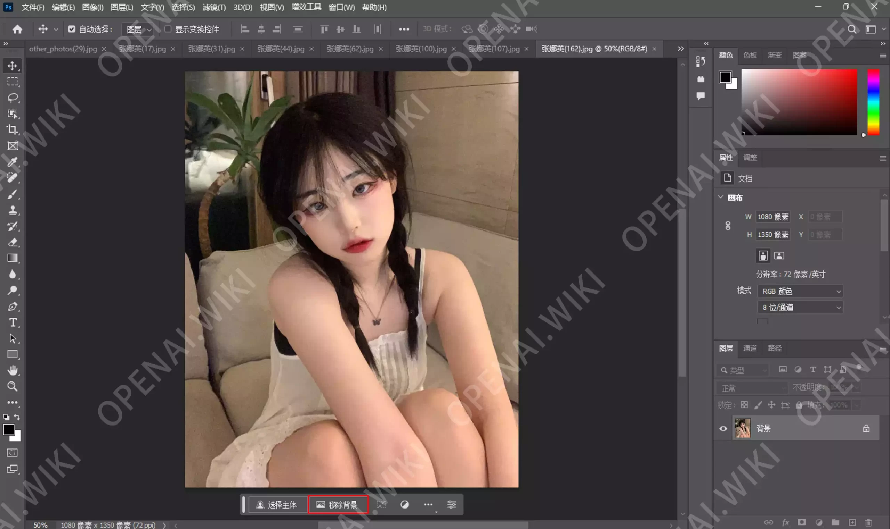

移除背景之后我们直接顺便裁切一下头部，记得输入512*512，不然可能不是1:1的比例。

然后拖拽选框至合适位置之后，双击裁切区域框，或者按键盘上的`回车`键，确定裁切。

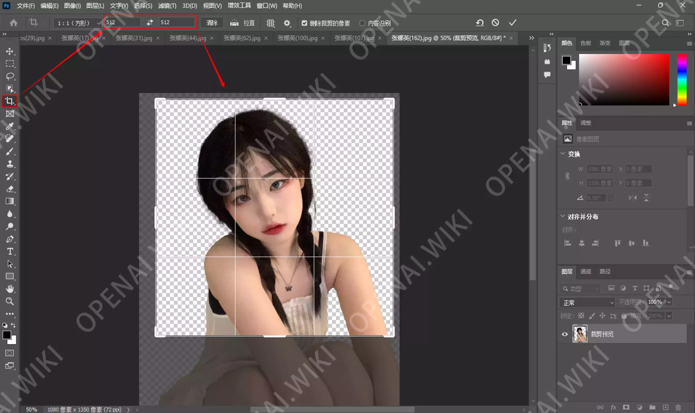

选择`文件`→`导出`→`导出为…`，根据下方设置之后，点击蓝色的`导出`按钮即可。

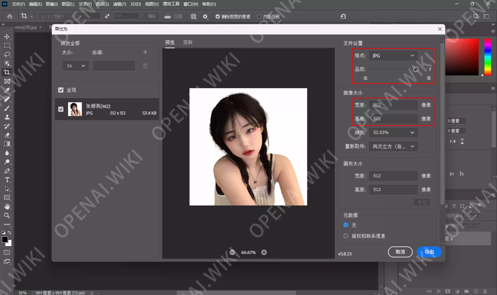

熟练操作之后，平均1分钟导出3张，一共也没多少张，所以慢慢弄吧，毕竟这样在生成Tag标签时，效果更好一些。

## 自动打标

打开SD，切换同至`图像预处理`选项卡，输入我们裁切好之后的图像文件夹，然后再新建一个文件夹用来存放自动生成的Tag，记得勾选`Keep original size`和使用`Deepbooru`生成标签选项，最后点击`Preprocess`按钮，开始自动打标。

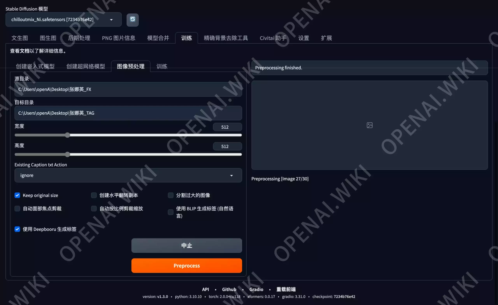

自动打标速度还是非常快的，35张图在几秒内就已经处理完成了。

## 手动改标

使用BooruDatasetTagManager软件加载已经生成Tag的文件夹，加载完成之后点击自动翻译。

### 改标描述

老生常谈，标签生成时可能会生成`脸`｜`鼻子`｜`嘴巴`｜`张嘴`｜`绿色美瞳`｜`帽子`｜`红色头发`等标签，哪些应该保留？哪些应该删除呢？

首先是五官中的`脸`｜`鼻子`｜`嘴巴`，这些是我们模特自带的，如果你把这些保留着，那么将会变成可自定义的部分了，我们希望以后生成的鼻子和嘴巴都使用张娜英自身的，那就别保留这些标签，直接`删除`。

其次是`张嘴`｜`吐舌头`等，这种是要保留的，因为这不是五官的描述，是表情的表述，`保留`之后方便我们后续为LoRA模型通过关键字换表情。

最后是`红色头发`｜`绿色美瞳`｜`帽子`等Tag，这些我们可能想让他变成黑色头发、红色美瞳、其他款式的帽子等，所以也是需要`保留`的。

简而言之，**你不希望后续通过提示词替换的内容，那就删除**；希望**可以通过提示词修改的部分，那就保留**。五官是模特自身的特色，所以我们不需要保留五官的描述，其它的装饰和表情Tag，建议全部保留。

注意：如果图中有手或者其它物体、部位并没有在Tag标签中描写，那么AI学习时不知道这部分是什么东西，会影响其它Tag的权限，建议自行补全。

### 改标示例1


| 自动Tag             | 中文Tag      | 操作  | 备注      |
| ----------------- | ---------- | --- | ------- |
| 1girl             | 1个女人       |     | 必须存在性别  |
| baseball cap      | 棒球帽        |     |         |
| blue headwear     | 蓝色头饰       | 删除  | 重复      |
| cup               | 杯子         |     |         |
| drink             | 喝          | 删除  | 没有喝的动作  |
| hand on own cheek | 把手放在自己的脸颊上 |     |         |
| hand on own face  | 把手放在自己脸上   | 删除  | 重复且不太准确 |
| hat               | 帽子         | 删除  | 重复      |
| head rest         | 枕着头/托着头    |     |         |
| jewelry           | 首饰         |     |         |
| lips              | 嘴唇         | 删除  | 五官Tag删除 |
| long hair         | 长发         |     |         |
| necklace          | 项链         |     |         |
| nose              | 鼻子         | 删除  | 五官Tag删除 |
| realistic         | 现实的/真实的    |     |         |
| shirt             | 衬衫         |     |         |
| simple background | 简单背景/无背景   |     |         |
| solo              | 单人         |     |         |
| upper body        | 上半身        |     |         |
| white background  | 白色背景       | 删除  | 重复      |
| straw             | 吸管         | 添加  | 补全缺失Tag |

### 改标示例2

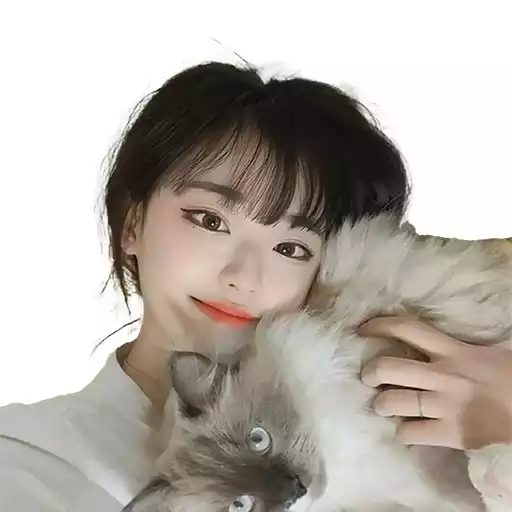

| 自动Tag             | 中文Tag    | 操作  | 备注      |
| ----------------- | -------- | --- | ------- |
| 1girl             | 1个女人     |     | 必须存在性别  |
| animal            | 动物       | 删除  | 已填写为猫   |
| animal focus      | 动物焦点     | 删除  | 焦点为人物   |
| black eyes        | 黑眼       |     |         |
| black hair        | 黑发       |     |         |
| cat               | 猫        |     |         |
| closed mouth      | 闭嘴       |     |         |
| dog               | 狗        | 删除  | 不正确     |
| lips              | 嘴唇       | 删除  | 五官Tag删除 |
| looking at viewer | 看向阅图者    |     |         |
| shiba inu         | 柴犬       | 删除  | 不正确     |
| short hair        | 短发       |     |         |
| simple background | 简单背景/无背景 |     |         |
| smile             | 微笑       |     |         |
| solo              | 单人       |     |         |
| white background  | 白色背景     |     |         |
| hand              | 手        | 添加  | 补全缺失Tag |

### 总结

一般都是删除的比较多，手动添加的部分非常少，所以整体的改标速度还是非常快的。

只要不是特别离谱的Tag标签错误，不改也没有什么大事。

## 推算参数

### 模型配置

运行`kohya_ss`，切换同至`Dreambooth LoRA`选项卡。

首先我们需要设置一个基础模型，也就是我们训练的LoRA模型要基于哪个大模型去训练。

比如本次站长要训练真人模型，想使用Chilloutmix-Ni大模型进行训练。那就【[点击前往C站](https://openai.wiki/go?_=353513c85baHR0cHM6Ly9jaXZpdGFpLmNvbS8%3D)】去查询该模型的信息，可以在右侧看到`Base Model SD 1.5`，那就代表我们的大模型为`SD 1.5`版本。

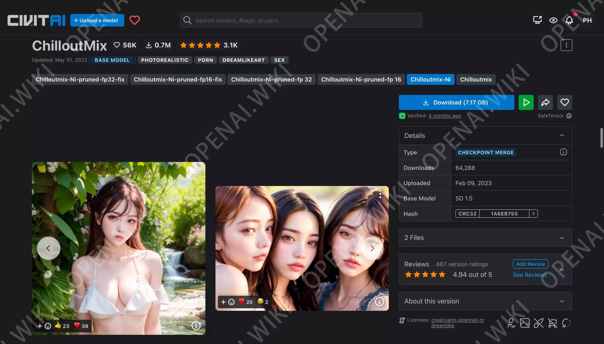

回到`Dreambooth LoRA`界面，已知模型SD版本为1.5，那就在`Model Quick Pick`内直接选择`SD1.5`。

关于下面的`v2`和`v_parameterization`不要动，因为在你选择`Model Quick Pick`时，它会自动判定是否需要勾选其它选项。

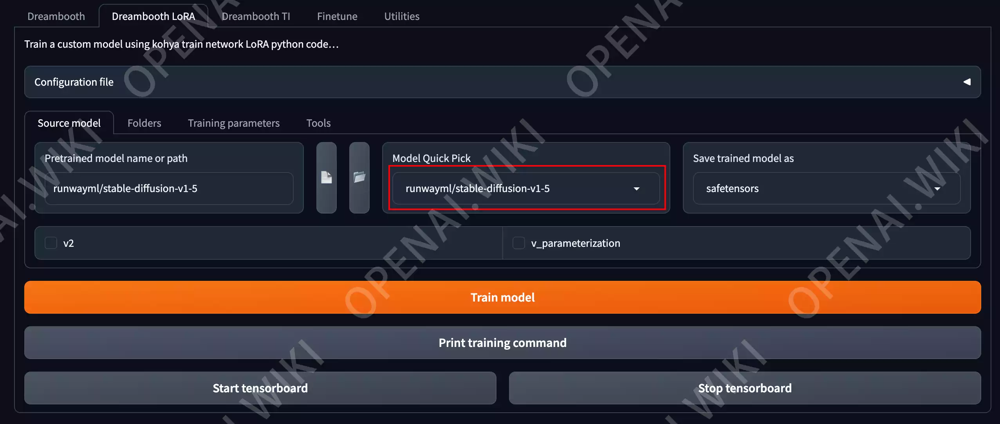

此时点击`📄`按钮，然后会弹出一个窗口，让你`选择模型路径`，正常选择你已经下载好的基础模型即可。

`Model Quick Pick`选项会自动变为`custom`，不用理会。

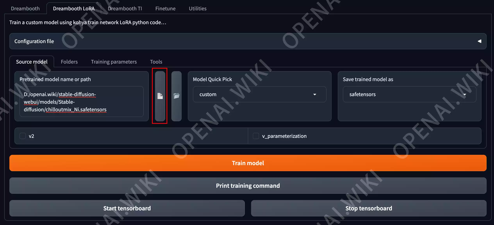

### 文件配置

此时我们需要新建三个文件夹，目录位置随意，只要你能找的到就好。

- Image folder
  - 用于加载你的训练图片文件夹，站长将已经打好Tag的`张娜英_TAG`文件夹移动至该目录下。
  - 此时我们还需要理性该文件夹的名称，名称格式为【`每单图训练次数_模型名称`】。
  - 站长想训练30次，模型名称为张娜英，因此需要将文件夹名称修改为`30_ZhangNaYing`。
  - 最后！不要直接填写此文件夹，要填写此文件夹的上级目录。该文件夹内只有需要训练的素材，不要放其它的内容。
- Output folder
  - 用于保存我们稍后训练完成的模型文件夹
  - 如果已经有其它训练好的模型在此，要先删除。
- Logging folder
  - 用于保存生成的日子文件夹
  - **注意：要在该文件夹内新建一个空的****`log.txt`****文件，不然会报错。**
- Model output name
  - 此处设置为训练完成后的LoRA模型名称
  - 本次训练的角色为`张娜英`，所以站长设置为`ZhangNaYing`。（不支持中文）

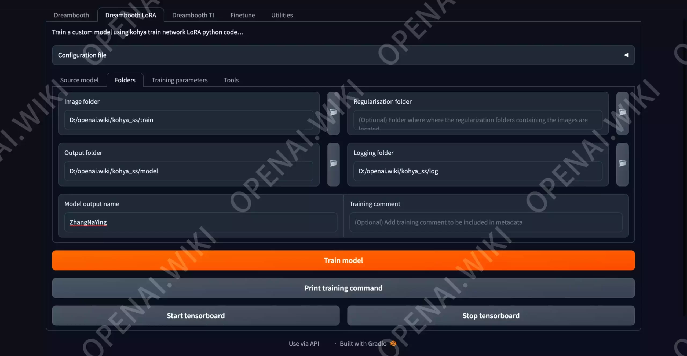

### 推算参数配置

下图是关于推算参数时的常规设置，所有参数都是固定的，无论你训练什么模型，都别修改，就这样去配置即可。

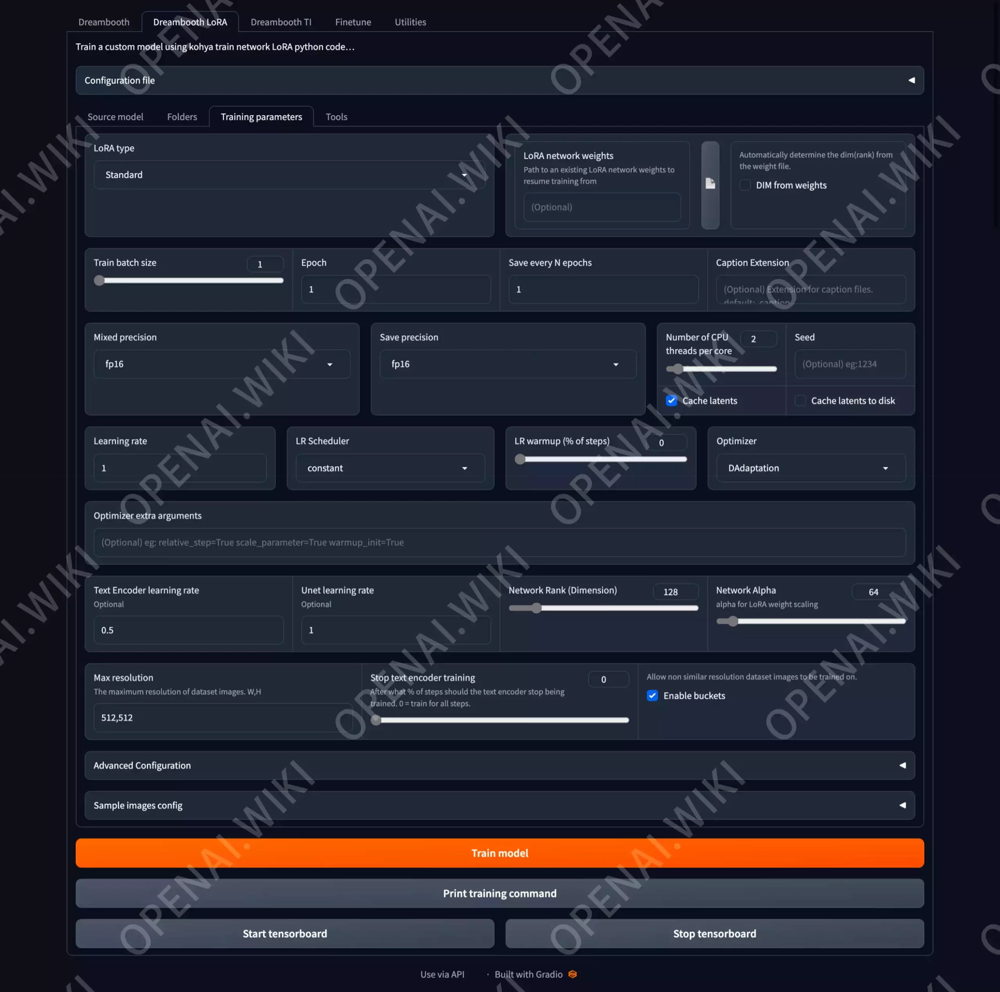

### 推算结果

我们已经完成了所有相关配置，此时点击`Train model`按钮。

此时需要等待片刻，可以在`kohya_ss`的`CMD窗口`中看到如下输出内容：

```bash
Folder 30_ZhangNaYing: 35 images found
Folder 30_ZhangNaYing: 1050 steps
max_train_steps = 1050
stop_text_encoder_training = 0
lr_warmup_steps = 0
accelerate launch --num_cpu_threads_per_process=2 "train_network.py" --enable_bucket --pretrained_model_name_or_path="D:/openai.wiki/stable-diffusion-webui/models/Stable-diffusion/chilloutmix_Ni.safetensors" --train_data_dir="D:/openai.wiki/kohya_ss/train" --resolution=512,512 --output_dir="D:/openai.wiki/kohya_ss/model" --logging_dir="D:/openai.wiki/kohya_ss/log" --network_alpha="64" --save_model_as=safetensors --network_module=networks.lora --text_encoder_lr=0.5 --unet_lr=1.0 --network_dim=128 --output_name="ZhangNaYing" --lr_scheduler_num_cycles="1" --learning_rate="1.0" --lr_scheduler="constant" --train_batch_size="1" --max_train_steps="1050" --save_every_n_epochs="1" --mixed_precision="fp16" --save_precision="fp16" --cache_latents --optimizer_type="DAdaptation" --max_data_loader_n_workers="0" --bucket_reso_steps=64 --xformers --bucket_no_upscale
prepare tokenizer
Use DreamBooth method.
prepare images.
found directory D:\openai.wiki\kohya_ss\train\30_ZhangNaYing contains 35 image files
1050 train images with repeating.
0 reg images.
no regularization images / 正則化画像が見つかりませんでした
[Dataset 0]
  batch_size: 1
  resolution: (512, 512)
  enable_bucket: True
  min_bucket_reso: 256
  max_bucket_reso: 1024
  bucket_reso_steps: 64
  bucket_no_upscale: True

  [Subset 0 of Dataset 0]
    image_dir: "D:\openai.wiki\kohya_ss\train\30_ZhangNaYing"
    image_count: 35
    num_repeats: 30
    shuffle_caption: False
    keep_tokens: 0
    caption_dropout_rate: 0.0
    caption_dropout_every_n_epoches: 0
    caption_tag_dropout_rate: 0.0
    color_aug: False
    flip_aug: False
    face_crop_aug_range: None
    random_crop: False
    token_warmup_min: 1,
    token_warmup_step: 0,
    is_reg: False
    class_tokens: ZhangNaYing
    caption_extension: .caption


[Dataset 0]
loading image sizes.
100%|████████████████████████████████████████████████████████████████████████████████| 35/35 [00:00<00:00, 3674.06it/s]
make buckets
min_bucket_reso and max_bucket_reso are ignored if bucket_no_upscale is set, because bucket reso is defined by image size automatically / bucket_no_upscaleが指定された場合は、bucketの解像度は画像サイズから自動計算されるため、min_bucket_resoとmax_bucket_resoは無視されます
number of images (including repeats) / 各bucketの画像枚数（繰り返し回数を含む）
bucket 0: resolution (512, 512), count: 1050
mean ar error (without repeats): 0.0
prepare accelerator
D:\openai.wiki\kohya_ss\venv\lib\site-packages\accelerate\accelerator.py:249: FutureWarning: `logging_dir` is deprecated and will be removed in version 0.18.0 of 🤗 Accelerate. Use `project_dir` instead.
  warnings.warn(
Using accelerator 0.15.0 or above.
loading model for process 0/1
load StableDiffusion checkpoint: D:/openai.wiki/stable-diffusion-webui/models/Stable-diffusion/chilloutmix_Ni.safetensors
loading u-net: <All keys matched successfully>
loading vae: <All keys matched successfully>
loading text encoder: <All keys matched successfully>
CrossAttention.forward has been replaced to enable xformers.
[Dataset 0]
caching latents.
100%|██████████████████████████████████████████████████████████████████████████████████| 35/35 [00:41<00:00,  1.18s/it]
import network module: networks.lora
create LoRA network. base dim (rank): 128, alpha: 64.0
create LoRA for Text Encoder: 72 modules.
create LoRA for U-Net: 192 modules.
enable LoRA for text encoder
enable LoRA for U-Net
prepare optimizer, data loader etc.
when multiple learning rates are specified with dadaptation (e.g. for Text Encoder and U-Net), only the first one will take effect / D-Adaptationで複数の学習率を指定した場合（Text EncoderとU-Netなど）、最初の学習率のみが有効になります: lr=0.5
use D-Adaptation Adam optimizer | {}
running training / 学習開始
  num train images * repeats / 学習画像の数×繰り返し回数: 1050
  num reg images / 正則化画像の数: 0
  num batches per epoch / 1epochのバッチ数: 1050
  num epochs / epoch数: 1
  batch size per device / バッチサイズ: 1
  gradient accumulation steps / 勾配を合計するステップ数 = 1
  total optimization steps / 学習ステップ数: 1050
steps:   0%|                                                                                  | 0/1050 [00:00<?, ?it/s]
epoch 1/1
steps:  10%|█████▋                                                     | 102/1050 [01:31<14:14,  1.11it/s, loss=0.0886]
```

当你看到steps为5%以上的时候，回到GUI界面，点击Start tensorboard按钮。


此时将会自动弹出一个网页，我们在左侧筛选只看最下面的，也就是最新的一个数据。

然后查看`lr/d*lr`数据表窗口，等待一条直线的出现，如果没出现直线就点几下`刷新数据`按钮。

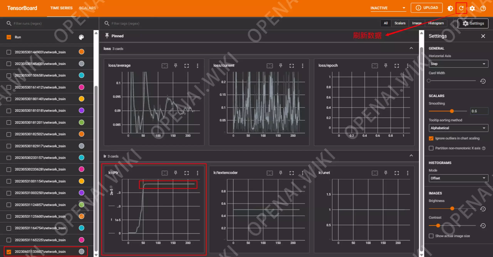

把鼠标放到直线上，可以看到一个数值，这个数值主是我们的推荐学习率，请记住你自己的数值，因为后面会用到。

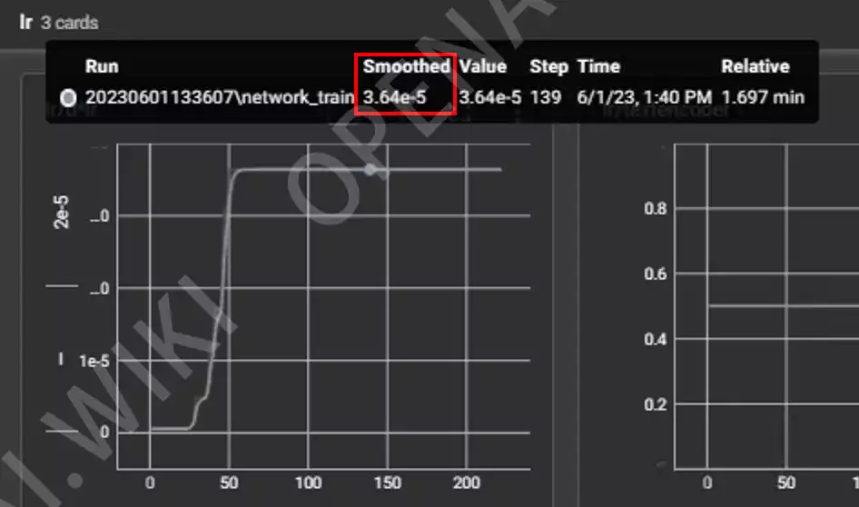

此时我们是否继续当前的训练已经不再重要，可以直接关闭CMD窗口，然后重新运行`kohya_ss`。

## 训练模型

我们在上一步已经得到了推荐训练数值为`3.64e-5`，这是科学计数法的显示方式，我们直接把这个数据粘贴到系统的计算器，然后按`=`键，就可以正常的`十进制`显示方式，也就是`0.0000364`。

下面我们在红框区域填写该数值，在填写`Text Encoder learning rate`时，记得将该数值除以10，那么也就`0.0000364/10=0.00000364`，其它所有参数照抄，与本站一至即可。

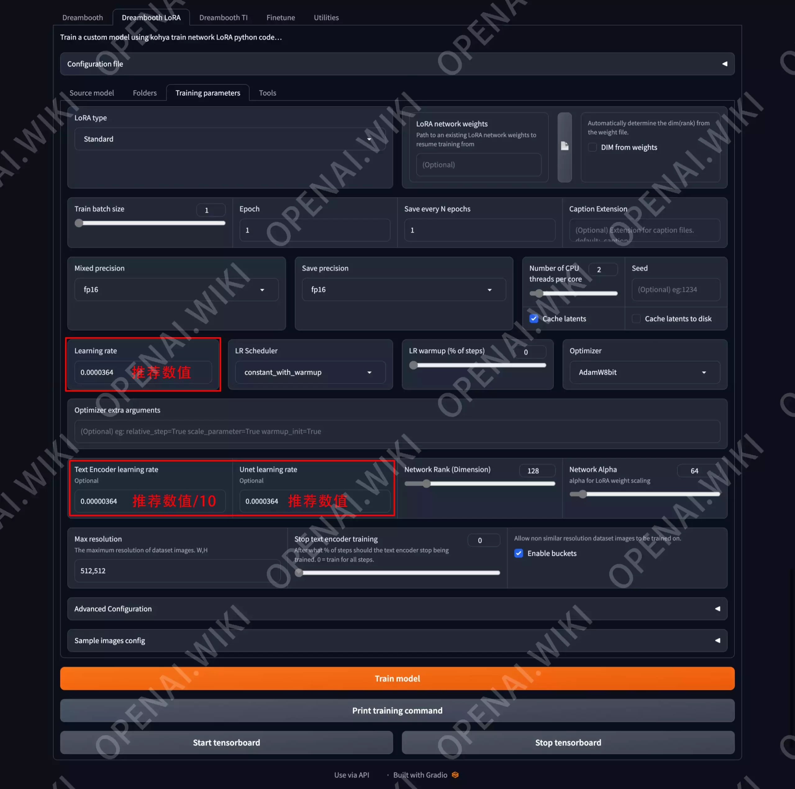

一切就绪之后，点击`Train model`按钮，然后就可以在CMD窗口内看到模型正在训练啦。

```bash
Folder 30_ZhangNaYing: 35 images found
Folder 30_ZhangNaYing: 1050 steps
max_train_steps = 1050
stop_text_encoder_training = 0
lr_warmup_steps = 0
accelerate launch --num_cpu_threads_per_process=2 "train_network.py" --enable_bucket --pretrained_model_name_or_path="D:/openai.wiki/stable-diffusion-webui/models/Stable-diffusion/chilloutmix_Ni.safetensors" --train_data_dir="D:/openai.wiki/kohya_ss/train" --resolution=512,512 --output_dir="D:/openai.wiki/kohya_ss/model" --logging_dir="D:/openai.wiki/kohya_ss/log" --network_alpha="64" --save_model_as=safetensors --network_module=networks.lora --text_encoder_lr=3.64e-06 --unet_lr=3.64e-05 --network_dim=128 --output_name="ZhangNaYing" --lr_scheduler_num_cycles="1" --learning_rate="3.64e-05" --lr_scheduler="constant_with_warmup" --train_batch_size="1" --max_train_steps="1050" --save_every_n_epochs="1" --mixed_precision="fp16" --save_precision="fp16" --cache_latents --optimizer_type="AdamW8bit" --max_data_loader_n_workers="0" --bucket_reso_steps=64 --xformers --bucket_no_upscale
prepare tokenizer
Use DreamBooth method.
prepare images.
found directory D:\openai.wiki\kohya_ss\train\30_ZhangNaYing contains 35 image files
1050 train images with repeating.
0 reg images.
no regularization images / 正則化画像が見つかりませんでした
[Dataset 0]
  batch_size: 1
  resolution: (512, 512)
  enable_bucket: True
  min_bucket_reso: 256
  max_bucket_reso: 1024
  bucket_reso_steps: 64
  bucket_no_upscale: True

  [Subset 0 of Dataset 0]
    image_dir: "D:\openai.wiki\kohya_ss\train\30_ZhangNaYing"
    image_count: 35
    num_repeats: 30
    shuffle_caption: False
    keep_tokens: 0
    caption_dropout_rate: 0.0
    caption_dropout_every_n_epoches: 0
    caption_tag_dropout_rate: 0.0
    color_aug: False
    flip_aug: False
    face_crop_aug_range: None
    random_crop: False
    token_warmup_min: 1,
    token_warmup_step: 0,
    is_reg: False
    class_tokens: ZhangNaYing
    caption_extension: .caption


[Dataset 0]
loading image sizes.
100%|████████████████████████████████████████████████████████████████████████████████| 35/35 [00:00<00:00, 4060.65it/s]
make buckets
min_bucket_reso and max_bucket_reso are ignored if bucket_no_upscale is set, because bucket reso is defined by image size automatically / bucket_no_upscaleが指定された場合は、bucketの解像度は画像サイズから自動計算されるため、min_bucket_resoとmax_bucket_resoは無視されます
number of images (including repeats) / 各bucketの画像枚数（繰り返し回数を含む）
bucket 0: resolution (512, 512), count: 1050
mean ar error (without repeats): 0.0
prepare accelerator
D:\openai.wiki\kohya_ss\venv\lib\site-packages\accelerate\accelerator.py:249: FutureWarning: `logging_dir` is deprecated and will be removed in version 0.18.0 of 🤗 Accelerate. Use `project_dir` instead.
  warnings.warn(
Using accelerator 0.15.0 or above.
loading model for process 0/1
load StableDiffusion checkpoint: D:/openai.wiki/stable-diffusion-webui/models/Stable-diffusion/chilloutmix_Ni.safetensors
loading u-net: <All keys matched successfully>
loading vae: <All keys matched successfully>
loading text encoder: <All keys matched successfully>
CrossAttention.forward has been replaced to enable xformers.
[Dataset 0]
caching latents.
100%|██████████████████████████████████████████████████████████████████████████████████| 35/35 [00:03<00:00,  9.13it/s]
import network module: networks.lora
create LoRA network. base dim (rank): 128, alpha: 64.0
create LoRA for Text Encoder: 72 modules.
create LoRA for U-Net: 192 modules.
enable LoRA for text encoder
enable LoRA for U-Net
prepare optimizer, data loader etc.

===================================BUG REPORT===================================
Welcome to bitsandbytes. For bug reports, please submit your error trace to: https://github.com/TimDettmers/bitsandbytes/issues
For effortless bug reporting copy-paste your error into this form: https://docs.google.com/forms/d/e/1FAIpQLScPB8emS3Thkp66nvqwmjTEgxp8Y9ufuWTzFyr9kJ5AoI47dQ/viewform?usp=sf_link
================================================================================
CUDA SETUP: Loading binary D:\openai.wiki\kohya_ss\venv\lib\site-packages\bitsandbytes\libbitsandbytes_cuda116.dll...
use 8-bit AdamW optimizer | {}
running training / 学習開始
  num train images * repeats / 学習画像の数×繰り返し回数: 1050
  num reg images / 正則化画像の数: 0
  num batches per epoch / 1epochのバッチ数: 1050
  num epochs / epoch数: 1
  batch size per device / バッチサイズ: 1
  gradient accumulation steps / 勾配を合計するステップ数 = 1
  total optimization steps / 学習ステップ数: 1050
steps:   0%|                                                                                  | 0/1050 [00:00<?, ?it/s]
epoch 1/1
steps: 100%|███████████████████████████████████████████████████████████| 1050/1050 [09:15<00:00,  1.89it/s, loss=0.105]
saving checkpoint: D:/openai.wiki/kohya_ss/model\ZhangNaYing.safetensors
model saved.
steps: 100%|███████████████████████████████████████████████████████████| 1050/1050 [09:15<00:00,  1.89it/s, loss=0.105]
```

当`steps`为100%时，我们就可以在所设定的模型目录下看到已经训练完的模型啦。

最后是当前的`Loss值为0.105`，这个数值有点过大了，按道理来说，该值无限接近0.08是比较好的。不知道为什么之前测试给朋友生成的时候该数值都比较好，但是给大家演示的时候却翻车了。

## 效果展示

```ini
1girl, the most beautiful image ever seen,(thin face:1.3), uhd, RAW, korea, sharp focus, realistic, 
(photorealistic), best quality, ultra high res, masterpiece, <lora:ZhangNaYing:1>

Negative prompt: (3 arms:1.1), (worst quality:2), (low quality:2), (normal quality:2), lowres, 
acnes, skin blemishes, age spot, glans,extra fingers,fewer fingers,strange fingers, ((monochrome)), 
((grayscale)),(bad legs:1.5), (bad hands:1.5), (3_hands:1.5), large_pussy, huge_pusyy, 
excessive_pubic_hair, huge_clitoris, fat_mons, colored_pubic_hair, mismatched_pubic_hair, 
erect_clitoris, clitoris_slip, pussy_juice_puddle, excessive_pussy_juice, pussy_juice_trail, 
pussy_juice_drip_through_clothes, medium_breasts, small_medium_breasts, large_breasts, huge_breasts, 
gigantic_breasts, large_areolae, long_nipples, sagging_breasts, veiny_breasts, pointy_breasts, 
asymmetrical_breasts, dark_areolae, dark_nipples, (big_head:1.5)

Steps: 35, Sampler: DPM++ SDE Karras, CFG scale: 7, Seed: 2551890436, Size: 512x765, Model hash: 7234b76e42,
 Model: chilloutmix_Ni, Lora hashes: ZhangNaYing: a01133dfbe40, Version: v1.3.0
```

## 总结

此次的模型训练Loss值并不是很好，但教程中出现的问题越多越好，这样后面才有更多的解决方案可以提供给大家，后面的教程将会提取如何提高或降低Loss值的问题。


