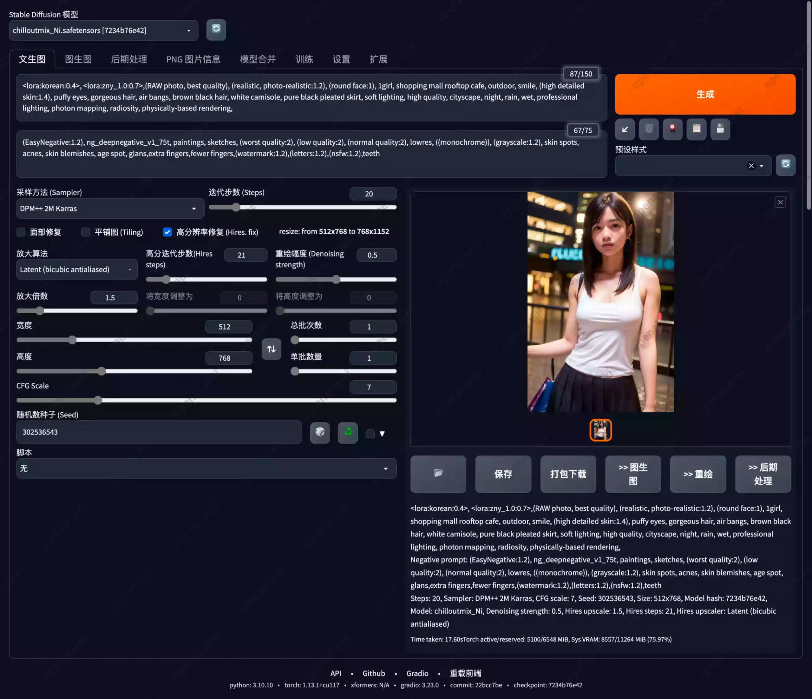
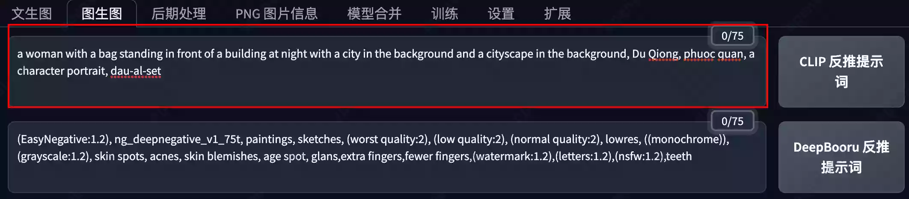
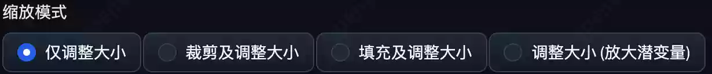
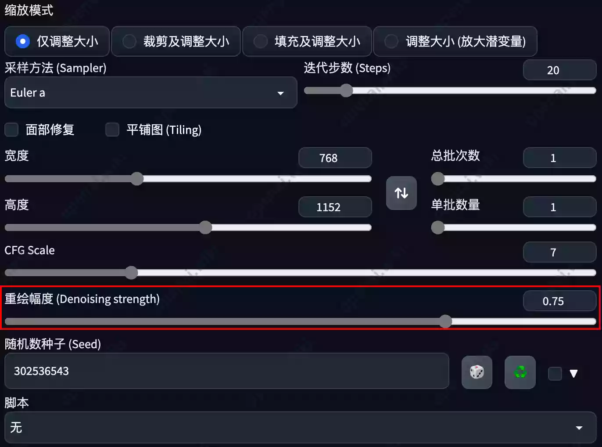
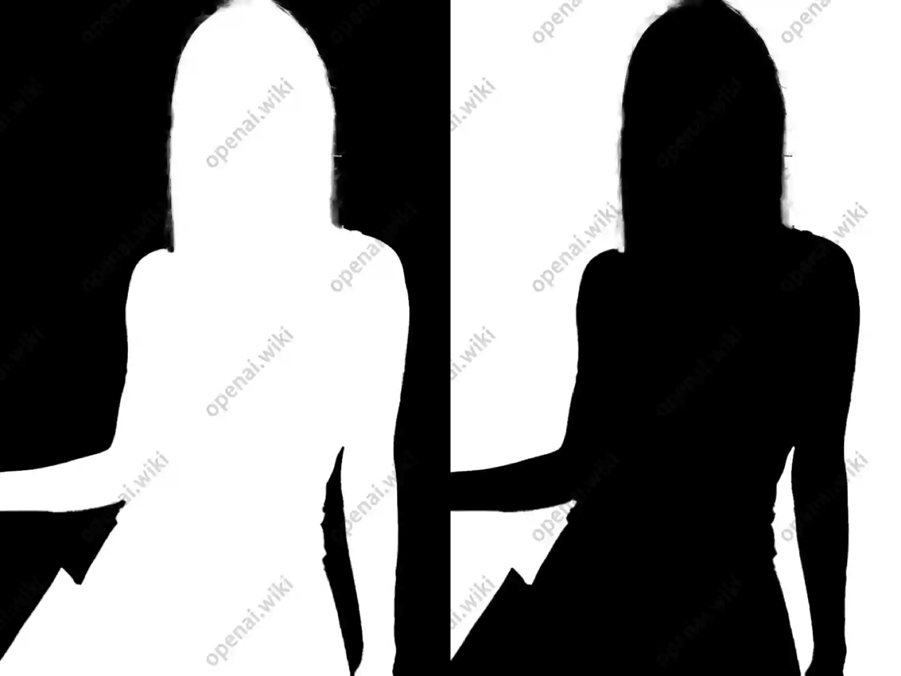
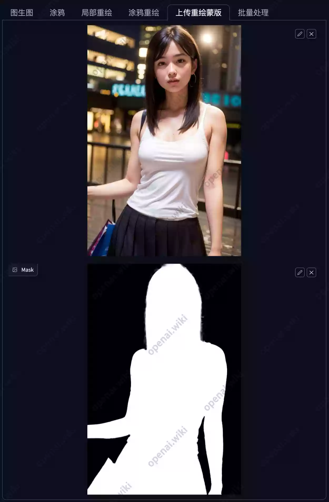
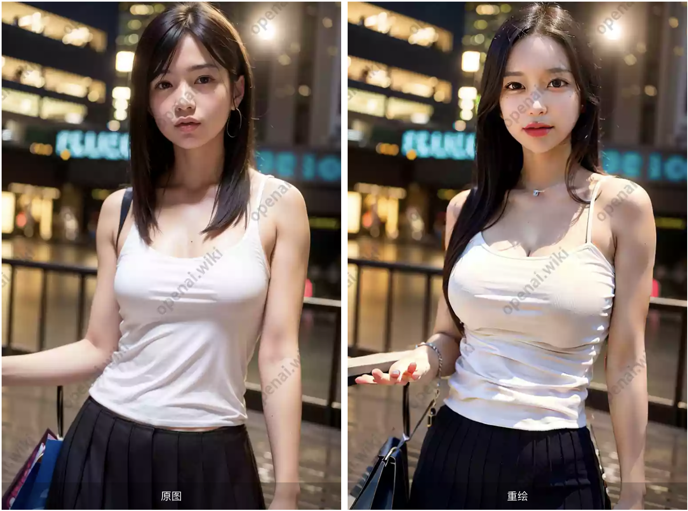
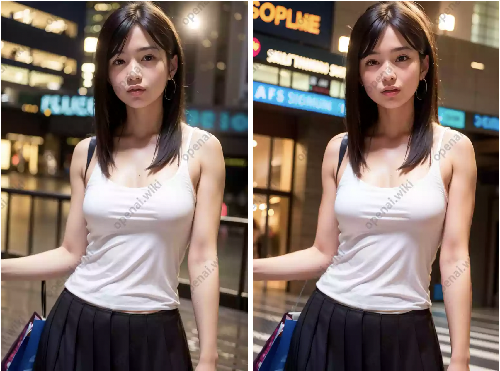
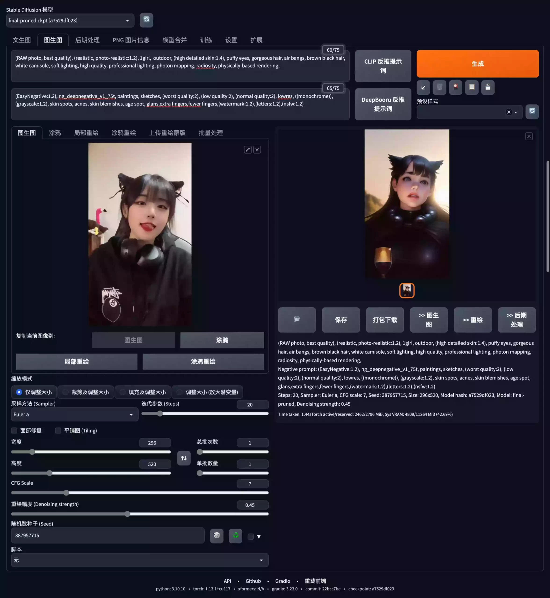
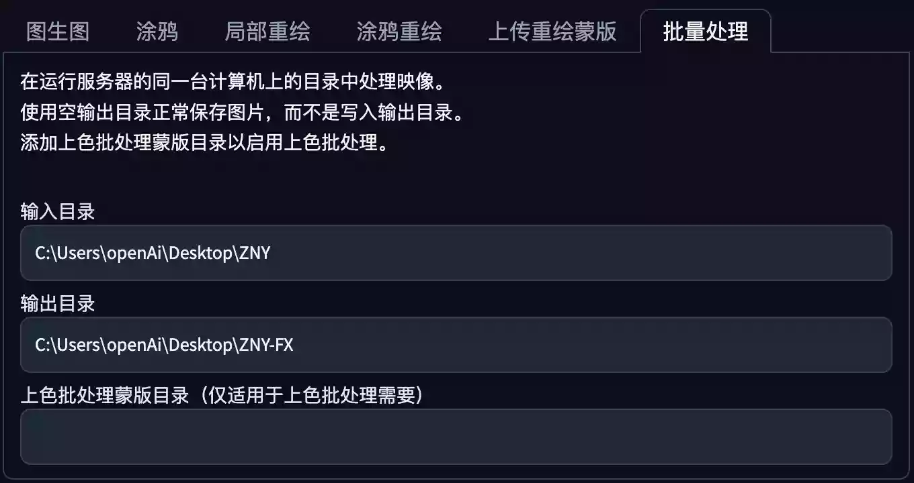

# Stable Diffusion｜图生图

# Stable Diffusion｜图生图反向推理涂鸦蒙版教程

什么是图生图？正在`文生图`那样，`文生图`的含义是以文字的形式生成图片。而`图生图`可以简单的理解为以一张图片为基准，去生成另外一张图片。

本文将教您如何使用`Stable Diffusion`的`CLIP`和`DeepBooru`进行`反向推理`、`涂鸦`、`重绘`、`蒙版`、以及批处理`视频转动漫风格`生成等内容。

之前在`文生图`已经讲解过的部分不再进行单独介绍，本文中只讲解与`文生图`有所差异的部分，如果您还未看文生图部分，请先学习如下内容。

## 反向推理

### CLIP反推提示词

我们可以通过文字生成图片，而CLIP反推提示词就是根据图片推理出文字内容。

在介绍该功能之前，我们先通过文字生成一张图片，下面是生成该所片所用到的正向Prompt提示词。

```
<lora:korean:0.4>, <lora:zny_1.0:0.7>,(RAW photo, best quality), (realistic, photo-realistic:1.2), 
(round face:1), 1girl, shopping mall rooftop cafe, outdoor, smile, (high detailed skin:1.4), 
puffy eyes, gorgeous hair, air bangs, brown black hair, white camisole, pure black pleated skirt, 
soft lighting, high quality, cityscape, night, rain, wet, professional lighting, photon mapping, 
radiosity, physically-based rendering,
```

该提示词的大概翻译内容如下：

```
<lora:角色名:0.4>, <lora:角色名.0:0.7>,(原始照片, 最好的质量), (实际的, 照片般逼真:1.2), (圆脸:1),
 1女孩, 购物中心屋顶咖啡厅, 户外，微笑，（高细节皮肤：1.4），浮肿的眼睛，华丽的头发，空气刘海，棕黑色的头发，
白色吊带背心，纯黑色百褶裙，柔光，高品质，城市景观，夜晚，雨，湿，专业照明， 光子映射、光能传递、基于物理的渲染、
```

完成的提示词以及设置如下：

```
<lora:korean:0.4>, <lora:zny_1.0:0.7>,(RAW photo, best quality), (realistic, photo-realistic:1.2), 
(round face:1), 1girl, shopping mall rooftop cafe, outdoor, smile, (high detailed skin:1.4), 
puffy eyes, gorgeous hair, air bangs, brown black hair, white camisole, pure black pleated skirt, 
soft lighting, high quality, cityscape, night, rain, wet, professional lighting, photon mapping, 
radiosity, physically-based rendering,

Negative prompt: (EasyNegative:1.2), ng_deepnegative_v1_75t, paintings, sketches, (worst quality:2), 
(low quality:2), (normal quality:2), lowres, ((monochrome)), (grayscale:1.2), skin spots, acnes, 
skin blemishes, age spot, glans,extra fingers,fewer fingers,(watermark:1.2),(letters:1.2),(nsfw:1.2),
teeth

Size: 512x768, Seed: 302536543, Model: chilloutmix_Ni, Steps: 20, 
Sampler: DPM++ 2M Karras, CFG scale: 7, Model hash: 7234b76e42, 
Hires steps: 21, Hires upscale: 1.5,
Hires upscaler: Latent (bicubic antialiased), Denoising strength: 0.5
```

文生图的完整生成界面如下：



我们可以如下图所示，在`文生图`界面点击`>>图生图`按钮，快捷将`文生图`界面的图片发送至`图生图`的素材区域。

在点击在`文生图`界面点击`>>图生图`按钮之后，我们可以看到，该图像已经被发送至`图生图`的素材区域，此时我们点击`CLIP反推提示词`按钮，测试反向推理出的文本内容描述。

在点击`CLIP反推提示词`按钮之后，等待片刻，我们将会在`图生图`界面的`正面提示词区域`，得到如下内容。

```
a woman with a bag standing in front of a building at night with a city 
in the background and a cityscape in the background, 
Du Qiong, phuoc quan, a character portrait, dau-al-set
```

翻译成中文之后的内容如下：

```
晚上背着包站在建筑物前的女人，背景是城市，背景是城市景观，杜琼，福泉，人物肖像，街道
```

反推提示词之后得到的显示区域展示：



我们可以看到，其反向推理出来的效果还是不错的，基本符合我们所提供的图像特征。

### DeepBooru反推提示词

我们还是以CLIP反推提示词时所使用的图像为例，但是使用DeepBooru反推方式。

在我们点击DeepBooru反推提示词按钮之后，同样会在图生图界面的正向提示词区域看到如下内容。

```
1girl, blurry, blurry_background, bokeh, breasts, brown_eyes,
 brown_hair, cleavage, depth_of_field, dirty, earrings, jewelry, 
lips, long_hair, looking_at_viewer, medium_breasts, mole, mole_on_breast,
 realistic, skirt, solo, tank_top
```

中文翻译如下：

```
1女孩, 模糊的, 模糊背景, 背景虚化, 乳房, 棕色的眼睛, 棕色的头发, 分裂, 景深, 肮脏的, 耳环, 珠宝, 嘴唇, 
长发, 看着观众, 中等乳房, 痣, 乳房上的痣, 实际的, 裙子, 独展, 背心
```

### 反推总结

其实使用这张图来测试DeepBooru方式是不合理的，因为DeepBooru更适合二次元动漫风格类的图像。而CLIP更擅长推理示例这类较为真实的图像，并且给出自然语言，`自然语言`可以理解为`一句话的形式`，而DeepBooru是关键词的形式都是分段的。

### Interrogate的优劣

- CLIP
  - 注重画面内的联系，生成的自然语言描述。
- DeepBooru
  - 对二次元图片生成标签，对二次元的各种元素把握很好。

至于该功能到底有什么作用，其实最主要的是后面我们会讲到的训练模型部分，通过推理模型可以加速训练，减少自已打标签的麻烦。

## 缩放模式｜Resize mode

缩放模式功能其实是指将素材区域的图片以什么样的方式进行加载，每一种加载方式都会影响输出的图像尺寸结果。



四种图像处理方式的解释如下：

- 拉伸｜Just Resize
  - 简单的将图片缩放至指定比例，不保证原图尺寸比。
- 裁剪｜Crop And Resize
  - 将图片按比例进行缩放，多余的直接裁剪掉。
- 填充｜Resize And Fill
  - 将图片按比例进行缩放，缺少的部分填充。
- 隐空间直接缩放｜Latent upScale
  - 其实与前面三个不同，这个是常用于图像超分辨率的快捷选项，低显存谨慎使用。

## 重绘强度｜Denoising Strength

这里的重绘（去噪）强度和之前我们在文生图里高清修复里的去噪强度是一致的，范围为0-1。

该参数的数值越大代表和原图的差距越大，数值越小则越贴合素材原图的效果。



## 采样步数｜Sampling steps

基本与`文生图`相同，值得注意的是，默认情况下在`重绘强度`较低的时候，实际`采样步数`会下降，具体公式为`采样步数`*`重绘强度`=`实际采样步数`。

## 涂鸦 ｜ Sketch

涂鸦功能使用方法比较简单，我们直接点击涂鸦按钮，此时你的鼠标移动至图像时，将会自动变为画笔样式，期间也可以通过右上角调整画笔粗细，画笔的粗细调节按钮下方还有一个颜色选择区域。

我们在图像上随便涂抹一些内容，此时生成图像的提示词和所有其它参数，包括种子分辨率等设置全部未改变。然后点击`生成`按钮，查看一下效果。

经过对比，我们可以发现在涂鸦的一些特点。

- 涂鸦后未改变任何参数的情况下生成图像，即使没有被涂鸦的区域，也会发生一些改变。
- 已被涂鸦的区域将会根据涂鸦的颜色进行改变，但是这种改变可能会对图像生成的影响较大，甚至姿势也会发生变更。

## 局部重绘 ｜ Inpaint

`局部重绘`功能是大家可能比较常用的功能，我们可以通过点击上或下部的`局部重绘`按钮，切换至`局部重绘选项卡`。

使用方式和我们刚刚在涂鸦功能内所介绍的大同小异，只是没有了颜色选择功能，因为`局部重绘`不需要颜色。

我们还是先随便勾勒一下，直接看效果比较方便于理解，太多文字可能让你无法更直观的去感受。

可以看到，我们将示例图的整个左半侧都通过画笔涂黑，右侧并没有进行任何绘画，Prompt和各项参数全部保持不变，然后点击`生成`按钮。

我们可以非常直观的感受到，其实整个左半侧被涂抹的区域已经发生了一些改变，但是未被涂抹成黑色的右侧区域全部保持不变，但是过度却非常自然，几乎看不出重绘的痕迹。

那么这个功能又有什么作用呢？最大的作用就是只修改我们不满意的地方，比如我对这张图的左下角的纸质购物袋不满意，那么我只需要涂抹这一部分区域，然后重绘即刻。又或者我们需要调节胸部的大小，那么只需要涂抹胸部的区域，然后将`中等乳房`这个关键字变更为`巨乳`即可，非常非常方便！

## 宽度｜高度

有些人可能即使所有参数都一致，但是生成的图像依然与素材图片差异巨大，这里有一个较大的可能性是图像宽高比例的问题。

你所要绘制的宽高比例要与给出的素材图片贴近或一致，这才能够获得更好的效果。

那么如何使比例相等呢？我们可以调节下面的`宽度`｜`高度`滑杆，此时会在图生图的素材预览区弹出红色半透明选区，这个区域就代表宽高比所覆盖的区域。

如果上面的内容你都看不懂也没关系，你只需要调节`宽度`｜`高度`滑杆，使红色框框与显示区域的范围一致或尽量吻合即可。

*注意：如果你的电脑配置不佳，不要让宽度｜高度过大，否则容易因为显存不足而无法出图。*

## 重绘蒙版

关于蒙版一词，如果你会使用Adobe的软件将会明白这是什么意思，其实就是一张只有黑白两色的图像，我们可以通过这张图像控制想要保留的部分。

我们之前通过在SD内手动绘制的功能非常不方便，对于复杂的人物或场景无法精细处理。但是通过导入蒙版的方式，我们可以快捷精细的选择处理保留或重绘的部分。

关于如何在PhotoShop或其它软件中提取蒙版这一块知识与不做单独讲解，只提供一个思路。

我们将想要处理的图像导入至PhotoShop，然后对人像进行抠图，抠图后填充选区的颜色。你需要重绘的区域为白色，不需要重绘的部分为黑色。

以下是笔者通过PhotoShop处理过的两张图片：

- 第一张角色区域为白色，代表对角色进行重绘，保留场景不变。
- 第二张场景区域为白色，代表对场景进行重绘，保留角色不变。



下面是如何加载的方式，我们分别上传原图和蒙版图，为了可以看到更明显的对比效果，笔者对修改了角色标签为其它角色，然后点击生成查看效果。



我们可以看到，重新生成之后的图像蒙版为黑色的部分完全没有改变，但是角色却改变了。



下面我们尝试另外一张蒙版效果，修改部分场景描述的提示词。



可以看到，只有场景改变了，但是角色没有任何变动，这就是蒙版的妙用。

## 批量处理

批量处理这部分的描述大家看到的可能是英文的，我这里对其进行了翻译。大概意思可以理解为，该功能为`批量`对每张图像进行`图生图`。

### 那么它的作用是什么呢？

目前主要应用在批量生成同一风格的图像，例如我们可以将一个视频通过该功能进行重绘，以下称该功能为`视频风格重绘`。

### 视频风格重绘如何去做？

我们可以先通过PhotoShop或Premiere、FFMpeg等工具，将视频转换为序列帧，本次所使用的视频如下。

### 序列帧是什么？

关于帧的理解，这个解释起来可能不是特别容易理解。视频是如何动起来的呢，其实每一秒视频是由很多张图片来组合而成的，有点像在快速翻书的效果，至于一秒之内一共翻了多少页，就代表这个视频是多少帧，目前主流的为24帧、25帧、30帧、60帧。以25帧为例，也就是代表该视频每秒由25张图片所组成。

组成视频的这些图像如果被拆解成一张张图片，那就是一个个帧。如果这些帧的序号是连续的，那就可以称之为序列帧。

我们本次所使用的视频帧率为30FPS，下面是拆解了演示视频第一秒的所有帧如下，可以看到每一张图都是顺滑且连贯的。

### 单张调试

在开始之前，我们还需要一个步骤，那就是效果的确定，我们随便拿出一帧图像导入至SD的图生图界面内，调试正向提示词、反向提示词、迭代步数、种子、CFG、宽高、采样器、重绘幅度等参数，将这些参数调整至你生成单张图像后满意即可。笔者并没有仔细去进行调试，只是大概调了一些参数，具体内容如下。

```
(RAW photo, best quality), (realistic, photo-realistic:1.2), 1girl, outdoor, (high detailed skin:1.4), puffy eyes, gorgeous hair, air bangs, brown black hair, white camisole, soft lighting, high quality, professional lighting, photon mapping, radiosity, physically-based rendering,
Negative prompt: (EasyNegative:1.2), ng_deepnegative_v1_75t, paintings, sketches, (worst quality:2), (low quality:2), (normal quality:2), lowres, ((monochrome)), (grayscale:1.2), skin spots, acnes, skin blemishes, age spot, glans,extra fingers,fewer fingers,(watermark:1.2),(letters:1.2),(nsfw:1.2)
Steps: 20, Sampler: Euler a, CFG scale: 7, Seed: 387957715, Size: 296x520, Model hash: a7529df023, Model: final-pruned, Denoising strength: 0.45
```



`⚠️注意：一定要固定种子，不然所生成的内容将会风格各异，完全不统一。`

### 批量输出

在我们批量输出之前，还需要进行如下设置：

- 【必填】我们将这些序列帧保存至一个新建的文件夹(ZNY)目录下，这就是输入目录。
- 【必填】我们再新建一个文件夹(ZNY-FX)目录，这就是处理之后所保存的输出目录。
- 【可选】该部分不是必要的，如果没有可留空。如果你通过其它方式处理视频后得到了蒙版，那么你也可以将蒙版序列帧目录填写至此。


