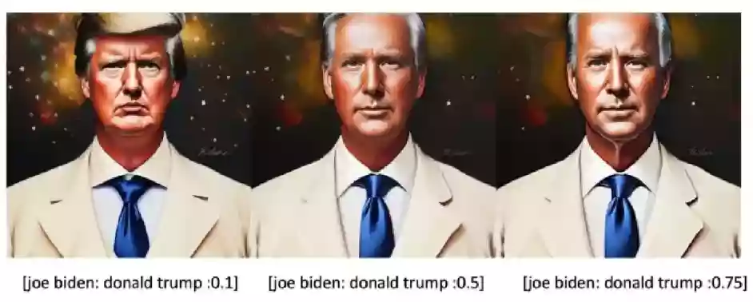

# Stable Diffusion｜Prompt提示词的进阶用法

[原文](https://openai.wiki/author/-GVnTZ1z-qVR)

# Stable Diffusion的Prompt提示词的高级进阶用法

关于Stable Diffusion的提示词其实有很多技巧的，并不是我们直接输入自己想要的内容就可以了，我们可以对每个Prompt的权重进行删减；也可以让多个提示词渐变式生成，甚至是组合、替换、打断、Emoji等，本文将会对Prompt提示词的高级用法进行详细教学。

### Prompt权重增减｜emphasized

Prompt的每个关键字都是可以调整权重的，调整权重需要一些特殊符号和方式，具体规则如下。

| 符号 写法 | 使用 示例 | 默认倍数 | 指定倍数      | 双重符号                 | 多重符号                        |
| ----- | ----- | ---- | --------- | -------------------- | --------------------------- |
| ()    | (关键字) | 1.1  | (关键字:1.1) | ((关键字))=1.1*1.1=1.21 | (((关键字)))=1.1*1.1*1.1=1.331 |
| []    | [关键字] | 0.9  | [关键字:0.5] | [[关键字]]=0.9*0.9=0.81 | [[[关键字]]]=0.9*0.9*0.9=0.729 |

假如我们希望生成图片时，对于红色衣服的提示词权重有所增加，那么可以使用`(红色连衣裙)`来让AI更加注意在生成图像时的权重影响。

什么情况下才需要这样做？比如我们生成的图像中对于手部的露出部分较少，我们可以使用`((舞动的双手))`来增加出现手的概率。

### Prompt渐变｜scheduled

通常有如下语法来进行渐变(一定程度上可以理解为混合)俩个提示词：[`关键词1`:`关键词2`:`数值0-1`]，最后的`数值0-1`代表范围数值，也就是0到1其中的一个数字。

举个例子：如果你的数值0.75，而采样步骤是40步，那么会有40*0.75=30步的过程，提示词为`关键词1`，剩下10步提示词为`关键词2`所以如果你试图均匀混合，最好将该数值调整为`0.5`左右。



> 💡 注意：当这个数值大小>1时，该值将会作为数去替换。
> 
> 举个简单的中文例子，`一个[幻想：赛博朋克：16]景观`，这里的数值已经大于1，那么就代表现在这个数值并不会起到渐变的效果，而是在`第16步`的时候，提示词直接从`幻想`切换成`赛博朋克`去继续生成。

因此诞生了一个非常有用的技巧，如下：

> 💡 我们将`(耳朵:1.9)`作为正向提示词，然后我们将这个放入反向提示词[这: (耳朵:1.9): 0.5]。 第一个关键词为一个毫无意义的词，第二个关键词为`(耳朵:1.9)`代表我们想要生成耳朵 假如你的采样步骤为20步，则前10步会减少一个毫无意义的东西出现的概率，后面的10步则会执行`(耳朵:1.9)`来减少耳朵出现的概率。

我们就得到了一张类似右图一般头发遮住耳朵的图像，这样的效果可以理解为效果渐变叠加，方便进行更多自定义效果。

究其原因是在扩散的过程中最开始的步骤往往更重要，后面的步骤则是对细节进行了更精细的调整

通过这个技巧我们可以将一些提示词只作用于后面的步骤或者只作用于前面的步骤

值得注意的是，这个语法有简写方式如下：

```
[to:when] - 在某步后添加某个词条（to）
[from::when] - 在某步前使用某个词条（from）
```

理解了，让我们来看个复杂例子。

```
fantasy landscape with a [mountain:lake:0.25] and [an oak:a christmas tree:0.75][ in foreground::0.6][ in background:0.25] [shoddy:masterful:0.5]
以上例子采用100步采样
下方为某步数后我们实际的prompt
最开始, fantasy landscape with a mountain and an oak in foreground shoddy
25步后, fantasy landscape with a lake and an oak in foreground in background shoddy
50步后, fantasy landscape with a lake and an oak in foreground in background masterful
60步后, fantasy landscape with a lake and an oak in background masterful
75步后, fantasy landscape with a lake and a christmas tree in background masterful
```

### Prompt交替｜Alternate

一个很有意思的语法，也可以用来混合一些提示，示例：[`关键词1`|`关键词2`] 采样时代表两个关键词被交替使用。也支持多个关键词按顺序使用，例如[`A`|`B`|`C`|`D`] 。

下面进行一个实例，比如我们使用`[red hair|yellow hair], long hair, 1girl`作为提示词，使用DPM++ 2M Karras采样器进行采样。

第10步：头发偏向黄色（使用不同种子，多次生成）。

第11步：头发偏向红色（使用不同种子，多次生成）。

第13步，头发偏向黄色（使用不同种子，多次生成）

如上文所说，扩散的过程中最开始的步骤往往更重要，所以在逐渐收敛的后，你的交替词往往也会效果减弱，最终发色也会其中偏向一种，不会在下一步产生大变。

### Prompt组合｜composable

组合的关键词是AND，注意要大写（我们实际短语的and应该是小写，笔者认为这样做是为了将prompt语法和实际自然语言进行区别），这个AND关键词允许组合（混合）多个提示。

对novelai的|的webui版实现

```
a cat AND a dog
```

值得注意的是，你可以像novelai中一般可以为每个词提供权重，默认为1，比如：

```
a cat :1.2 AND a dog AND a penguin :2.2
```

如果你的某个提示词权重低于0.1，那么该提示词对应的要素就很难产生影响。

### Prompt打断｜BREAK

断开的关键词是`BREAK`,注意要大写。这个关键词会打断上下文的联系，强行进行再次分组。

### 词汇的具体解析

stable diffusion使用Clip作为文本的编码器，Clip的标记器在标记之前将所有单词小写。

得益于Clip的强大，你可以在提示词里使用自然语言（主要是英语，看模型训练时的情况），也可以使用类标记语言。

提示词中开头和结尾的额外空格会被直接丢弃，词与词之间的多余空格也会被丢弃。

支持`颜文字`和`emoji` ，`Unicode`字符（如日语字符）。

### 拼写错误或罕见词

提示单词可以由一个或多个符号组成，常用词通常被解析为具有共同含义或少量含义的单个标记。而拼写错误和不常见的单词被解析为多个可以被识别的标记，示例如下：

bank,bankk会被识别为bank,而bonk不会被识别为bank

_ 通常不会被转换成空格

个人认为这个拼写错误被识别是很大原因因为Clip在训练过程中，人类也有拼写错误然后联系上下文同样能产生识别这个词的效果。

而对于罕见词，他们的信息量太低会被理解为其他的词语，这也解释了颜文字和emoji的作用性相比自然语言更强，因为颜文字和emoji对特定的含义信息是强绑定的关系而且字符数短，而自然语言通常会有歧义。从信息论的角度来看，是不准确的描述。

### 词汇顺序/数量/位置影响

早期的标记具有更一致的位置，因此神经网络更容易预测它们的相关性。而且由于attention机制的特殊性，每次训练时，开始的标记和结束的标记总会被注意到（attention）。而且由于标记越多，单个标记被被注意到的概率越低。

基于以上特性，有以下几点需要注意：

- 开头与结尾的词往往作用性更强。
- 提示词数量越多，单个提示词的作用性越低。
- 开头的数个提示词的作用较强，有更强的相关。
- 关于数量，你可能已经注意到了，当你写prompt时会有数量限制。
- 但是在 webui中，你是可以写 75 个词汇以上的提示的。webui会自动通过对提示词进行分组。当提示超过 75 个 token（可以理解token代表你的提示词），提交多组 75 个 token。单个token只具有同一组中其他内容的上下文。
- 每一组都会被补充至(1,77,768)的张量，然后进行合并，比如俩组就会合并为(1,154,768)的张量，然后被送入U-Net。

值得注意的是

- 为了避免将你的短语分成俩组，webui在分组时会查看附近是否有,来尽量还原你想要的输入。
- 然后你还能通过输入BREAK来快速分组，BREAK必须为大写。

### emoji和颜文字

对emoji的表现良好，对热门的颜文字（欧美环境）表现良好，而且作用力很强。

比如`[red hair|yellow hair], long hair, 1girl,✌️`。
