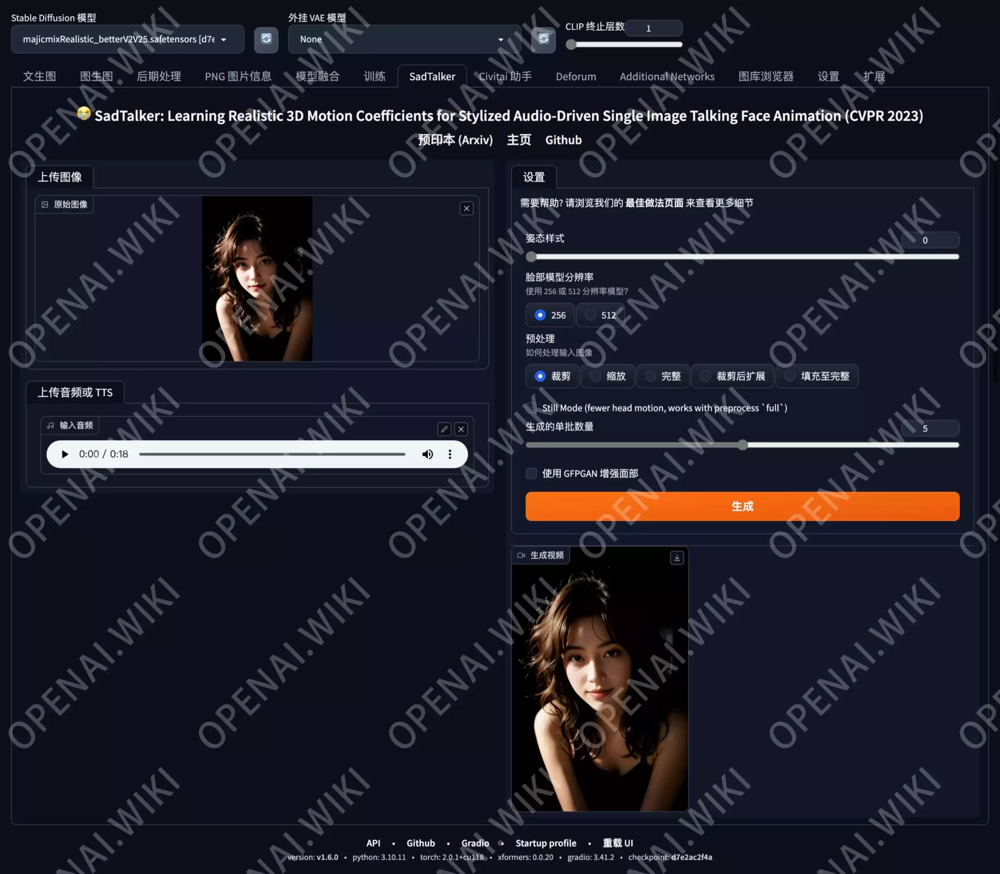

# SD插件｜SadTalker｜照片转口型动画视频

[原文](https://openai.wiki/author/-GVnTZ1z-qVR)

# Stable Diffusion WebUI｜SadTalker｜照片转说话视频

Stable Diffusion WebUI扩展插件SadTalker，翻译中文为悲伤语者，可以让你通过AI快速将写实或卡通人物照片按指定音频生成视频，支持设定其动态方式、分辨率等。

## 项目仓库

GitHub：[OpenTalker/SadTalker](https://openai.wiki/go?_=e14dde86e3aHR0cHM6Ly9naXRodWIuY29tL09wZW5UYWxrZXIvU2FkVGFsa2Vy)

## 前置条件

在执行项目安装之前，我们还需要安装`FFMpeg`，如果您的电脑还未安装`FFMPEG`，请先根据本站所给出的教程安装。[ffmpeg安装](./ffmpeg.md)

## 安装教程

### 快捷安装

[从这里下载](https://www.123pan.com/s/sKd9-ooMc.html)

这种方式最为简单，`下载`后直接`解压`该文件，你将会得到一个名为`SadTalker`的`文件夹`，将其移动至`.\stable-diffusion-webui\extensions`目录内即可完成安装。

注意：这只是插件的安装，但你还是需要`修改bat`启动文件的环境配置，现在你可以直接`跳转`至本文`环境配置`部分，修改bat文件，然后`重新运行SD`。

### 在线安装

此方法适用于魔法环境没有问题的朋友，可以通过在线安装的方式一键安装，非常方便。

打开`Stable Diffusion`的`扩展`界面，依次点击`可下载`→`加载扩展列表`按钮，然后在搜索框中输入`SadTalker`，最后点击`安装`按钮即可，然后等待安装脚本自动执行。（因为本站已经安装过，所以这里显示为`已安装`，你的按钮应该是`安装`。）

### 手动安装

此方法适用于不方便使用魔法环境的朋友，将下面的文件下载完成后重命名文件夹，删除`-main`部分，然后解压至`.\stable-diffusion-webui\extensions`目录下即可。

[扩展从这里下载](https://www.123pan.com/s/sKd9-QoMc.html)

## 模型相关

### 模型下载

因为该扩展需要独立模型，所以我们需要手动下载这些模型，然后将其放置到对应的位置内。

关于此项目的模型，本站已为您下载并整理好。如果你不方便通过官网下载，可以使用本站所提供的网盘下载地址。

[Checkpoint模型](https://www.123pan.com/s/sKd9-EoMc.html)      [GFPGan模型](https://www.123pan.com/s/sKd9-koMc.html)

这两个模型全部需要下载，仅下载其中之一将无法运行。

### 模型安装

该插件安装完成后，我们可以在SD的安装目录中找到如下路径`.\stable-diffusion-webui\extensions\sd-webui-segment-anything\SadTalker`，这就是`SadTalker`扩展的安装路径，我们将之前下载好的两个模型文件解压，然后得到两个名为`checkpoints`和`gfpgan`的文件夹，将这两个文件夹移动至该路径内即可完成模型安装。

### 环境配置

因为该扩展需要指定模型路径，所以我们需要修改启动文件，也就是SD根目录下的`webui-user.bat`文件，如果你之前没有做出过任何修改，那么该文件应该像下面这样：

```ini
@echo off

set PYTHON=
set GIT=
set VENV_DIR=
set COMMANDLINE_ARGS=

call webui.bat
```

### GPU模式

现在我们需要添加一行内容，就像下面这样，注意将这个文件夹路径修改为你自己的实际文件夹路径，因为你的盘符或者目录结构可能与本站不一致。

```ini
set SADTALKER_CHECKPOINTS=D:\openai.wiki\stable-diffusion-webui\extensions\SadTalker\checkpoints
```

下是添加之后的完整文件，然后记得保存。

```ini
@echo off

set PYTHON=

set GIT=

set VENV_DIR=

set COMMANDLINE_ARGS=

set SADTALKER_CHECKPOINTS=D:\openai.wiki\stable-diffusion-webui\extensions\SadTalker\checkpoints

call webui.bat
```

关闭你之前的SD，重新运行`webui-user.bat`文件，然后你将会在SD的主界面看到`SadTalker`选项卡啦。

### CPU模式

如果你希望使用`CPU模式`运行`SadTalker`，那么你需要修改`webui-user.bat`文件的`COMMANDLINE_ARGS`一行，添加参数如下。

```
set COMMANDLINE_ARGS="--disable-safe-unpickle"
```

使用`CPU模式`运行`SadTalker`+`SadTalker模型目录指定`后的完整`配置文件`应该如下所示：

```ini
@echo off

set PYTHON=
set GIT=
set VENV_DIR=
set COMMANDLINE_ARGS="--disable-safe-unpickle"
set SADTALKER_CHECKPOINTS=D:\openai.wiki\stable-diffusion-webui\extensions\SadTalker\checkpoints

call webui.bat
```

关闭你之前的SD，重新运行`webui-user.bat`文件，然后你将会在SD的主界面看到`SadTalker`选项卡啦。

## 使用教程

### 界面介绍

以下是程序的主界面，站长来讲解一下基础功能。



- 上传图像
  - 上传一张你想用来做为说话角色的图像
- 上传音频或 TTS
  - 上传一段你想使用的音频文件，用来匹配口型。
- 姿态样式
  - 这个站长测试了一下，无论数值如何改变都没有什么变化。
- 脸部模型分辨率
  - 这个选择存在256和512两种模式，512当前更清晰，但生成视频的速度被降低的却不止一倍。
- 预处理
  - 处理图像的模式，一般常用的就两个。
  - 裁切：只保留面部部分，其它部分会被裁切。
  - 完整：不进行任何裁切操作，保留完整图像比例。
- Still Mode (fewer head motion, works with preprocess full)
  - 静止模式：勾选后将会较少头部的运动，适用于预处理为完整模式。
- 生成的单批数量
  - 默认该数值为2，站长2080TI显卡可以开到5，过高显存会爆，自行摸索。
  - 数值越大，生成速度越快，反之亦然。
- 使用 GFPGAN 增强面部
  - 可以让面部更加清晰，否则会有一些模糊。
- 生成
  - 点击此按钮后会根据以上设置，自动生成视频。

### 示例文件

我们需要做的就是加载一张图片，并且上传一段音频，关于图片和音频示例如下。

```ini
1girl,smirk,curly hair,in the dark,deep shadow,
Negative prompt: (worst quality:2),(low quality:2),(normal quality:2),lowres,watermark,badhandv4,ng_deepnegative_v1_75t,
Steps: 20, Sampler: Euler, CFG scale: 6, Seed: 4241197616, Size: 512x768, Model hash: d7e2ac2f4a, Model: majicmixRealistic_betterV2V25, Variation seed: 405047501, Variation seed strength: 0.05, Denoising strength: 0.18, Clip skip: 2, Token merging ratio: 0.2, Token merging ratio hr: 0.2, Hires upscale: 2, Hires steps: 15, Hires upscaler: R-ESRGAN 4x+, Version: v1.6.0
```

## 效果测试

为节省本站带宽，仅保留视频前三秒输出。

站长就不测试512分辨率了，因为512单个视频在我的祖传2080TI上单个要跑十分钟以上，所以以下测试全部为256分辨率。

| 默认设置                | 完整设置                |
| ------------------- | ------------------- |
| 姿态模式：0              | 姿态模式：0              |
| 脸部模型分辨率：256         | 脸部模型分辨率：256         |
| 预处理：裁切              | 预处理：完整              |
| Still Mode：取消勾选     | Still Mode：取消勾选     |
| 生成的单批数量：2           | 生成的单批数量：2           |
| 使用 GFPGAN 增强面部：取消勾选 | 使用 GFPGAN 增强面部：取消勾选 |


| 完整+静态               | 完整+静态+面部增强【推荐】    |
| ------------------- | ----------------- |
| 姿态模式：0              | 姿态模式：0            |
| 脸部模型分辨率：256         | 脸部模型分辨率：256       |
| 预处理：完整              | 预处理：完整            |
| Still Mode：勾选       | Still Mode：勾选     |
| 生成的单批数量：2           | 生成的单批数量：2         |
| 使用 GFPGAN 增强面部：取消勾选 | 使用 GFPGAN 增强面部：勾选 |

## 总结

个人认为完整+静态+面部增强这种设置效果比较好，不过有时候眨眼无法完全闭合。

其实该插件也有独立版本，不依赖于SD，如果大家有需要的话可以留言，站长会单独再写一篇。
