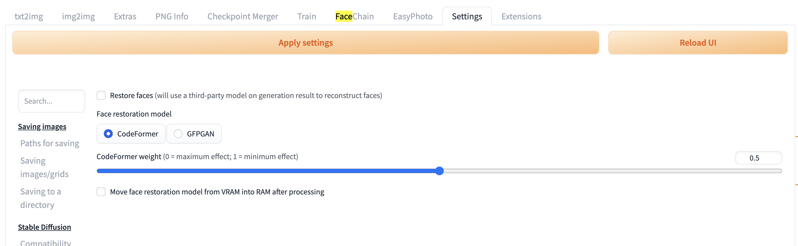

# Stable Diffusion｜文生图基础教程

[原文链接](https://openai.wiki/author/-GVnTZ1z-qVR)

# Stable Diffusion｜文生图以及各项基础功能教程

本文针对Stable Diffusion WebUI的各项基础功能进行讲解，对文生图(txt2img)界面进行介绍，对各采样方式、迭代步数影响、种子等各项内容进行详细教学，每一部分都提供了多图对比预览，也对各图像放大器的参数进行了详细介绍。


## 基础模型区域

在webui的左上角，你可以找到最重要的选项之一，stable diffusion模型。这个选项可以让你选择你所需要的模型。

checkpoint（权重点）是指存放着模型的权重参数的文件。checkpoint 文件实际上是一个变量名-变量值的词典。

模型名称后的[串号]为Hash（哈希值），用于确保下载的模型是否为唯一，每一个文件都有唯一Hash值。

用于选择基础模型，这对于生成图像的影响非常非常重要，常用的基础模型如下。

| 模型名称                                                               | 描述          |
| ------------------------------------------------------------------ | ----------- |
| [官方模型](https://openai.wiki/stable-diffusion-model-v1-5.html)       | 适合生成写实类风格   |
| [NovelAI](https://openai.wiki/stable-diffusion-novelai-model.html) | 适合生成二次元风格   |
| [ControlNet](https://openai.wiki/controlnet-models-download.html)  | 适合生成真人写实类风格 |

## Prompt提示词

用来填写你希望生成的内容Tag关键字，例如我们想生成一个女孩在花园中跳舞，我们可以填写一些关键字，每个关键字中间用英文逗号进行分隔。

```
一个女孩，跳舞，红色连衣裙
```

但是因为SD不支持中文关键字，所以我们还需要将其转换为英文。

```
A girl, dancing, red dress
```

在我们输入这三个关键字之后，点击生成按钮，将会生成如下内容的图片，可以看到几乎还是满足我们的要求的，只不过这实在是太丑了，我们后续会对其进行优化。


## Negative反向提示词

反向提示词的作用其实就是不想生成的内容，如果你不想生成什么，那就把这部分内容写在这里即可。

此时我们添加一些反向Tag，以下这些反向Tag，建议你无论画什么都在反向Tag区域填写如下内容。

```
lowres, bad anatomy, bad hands, text, error, missing fingers, extra digit, fewer digits, 
cropped, worst quality, low quality, normal quality, jpeg artifacts, signature, watermark,
 username, blurry
```

这些反向Tag的中文翻译如下：

```
低分辨率、不良解剖结构、不良手部、文本、错误、缺失手指、多余数字、较少数字、裁剪、质量最差、低质量、
正常质量、jpeg 伪像、签名、水印、用户名、模糊
```


此时我们填写好反向Tag之后，再次尝试生成图像结果如下。


可以看到效果依然不是很好，但是相对于没有填写反向Tag之前来说，已经好了一些，但效果仍然很一般，后面我们再学习如何提升画面质量和美感的问题。

## 随机种子

什么是种子？种子可以理解为每一张图片的身份证号码，无论是通过什么样的方式来生成图像，都会有一个种子编号，这就是图像的唯一标识。

如果我们想要生成与上一次生成的图像完全一致的新图像，那么我们就需要当前设置内的所有参数和种子号码与之前一致，种子的影响是所有参数中影响最大的。

该数值默认为`-1`，`-1`代表着每次生成图像时，这个种子的数值都是`随机变化`的。


## 附加/Extra

如果你点击了附加/Extra就会看到扩展栏


### 种子变异/Variation seed

你想使用的变异种子，规则和seed一致。

### 变异强度/Variation strength

变异种子和原种子的差异强度，为0时为原种子，为1时是新种子。

这里有个技巧，首先我们seed设置为1进行生成。

### 调整种子大小

这个功能挺有用，其原理与上文提到调整图片大小类似，将隐空间大小进行改变，但是我们生成的图片的尺寸没有变化。

通常，当改变分辨率时，图像会完全改变，即使保留了包括种子在内的所有其他参数。

但是通过调整种子大小，可以指定原始图像的分辨率（更正确的说法是隐空间的噪声信息对应的外面的图像的分辨率），而且模型很可能会产生与之非常相似的结果，即使在不同的分辨率下也是如此。


## 批量生成

上面的按钮是生成次数，下面的按钮是每次数量

理论上讲，显存够的话每次数量（Batch size）越高总体生成越快，但是增加每次数量都会加大显存消耗

需要注意

- 批量生成时指定种子后，第二张图的种子将会是当前种子数+1，第三张以此类推
- 批量生成时如果指定了种子变异，第二张图的种子不会变，但是种子变异的值将会是当前种子变异数+1，第三张以此类推。

通过批量生成+指定种子或种子变异可以在一个可控的范围内不断修改画面，方便使用者达到想要的效果。


## **采样方法**

webui中集成了很多不同的采样方法，这块也是目前AI艺术家们乐忠对比的环节，这里结合设置中提供的选项，简单粗略的介绍下它们的各自区别。

| 方法           | 描述                                                                                                                                                                                     |
| ------------ | -------------------------------------------------------------------------------------------------------------------------------------------------------------------------------------- |
| Euler        | 基于Karras论文，在K-diffusion实现，20-30steps就能生成效果不错的图片，采样器设置页面中的sigma noise、sigma tmin和sigma churn这三个属性会影响到它（后面会提这三个参数的作用）；                                                                   |
| Euler a      | 使用了祖先采样（Ancestral sampling）的Euler方法，受采样器设置中的eta参数影响（后面详细介绍eta）；                                                                                                                        |
| LMS          | 线性多步调度器（Linear multistep scheduler）源于K-diffusion的项目实现；                                                                                                                                 |
| heun         | 基于Karras论文，在K-diffusion实现，受采样器设置页面中的 sigma参数影响；                                                                                                                                        |
| DPM2         | 这个是Katherine Crowson在K-diffusion项目中自创的，灵感来源Karras论文中的DPM-Solver-2和算法2，受采样器设置页面中的 sigma参数影响；                                                                                            |
| DPM2 a       | 使用了祖先采样（Ancestral sampling）的DPM2方法，受采样器设置中的ETA参数影响；                                                                                                                                    |
| DPM++ 2S a   | 在K-diffusion实现的2阶单步并使用了祖先采样（Ancestral sampling）的方法，受采样器设置中的eta参数影响；Cheng Lu的github中也提供已经实现的代码，并且可以自定义，1、2、3阶，和单步多步的选择，webui使用的是K-diffusion中已经固定好的版本。对细节感兴趣的小伙伴可以参考Cheng Lu的github和原论文。 |
| DPM++ 2M     | 基于Cheng Lu等人的论文（改进后的版本），在K-diffusion实现的2阶多步采样方法，在Hagging face中Diffusers中被称作已知最强调度器，在速度和质量的平衡最好。这个代表M的多步比上面的S单步在采样时会参考更多步，而非当前步，所以能提供更好的质量。但也更复杂。                                       |
| DPM++ SDE    | DPM++的SDE版本，即随机微分方程（stochastic differential equations），而DPM++原本是ODE的求解器即常微分方程（ordinary differential equations），在K-diffusion实现的版本，代码中调用了祖先采样（Ancestral sampling）方法，所以受采样器设置中的ETA参数影响；   |
| DPM fast     | 在K-diffusion实现的固定步长采样方法，用于steps小于20的情况，受采样器设置中的ETA参数影响；                                                                                                                                |
| DPM adaptive | 基于Cheng Lu等人的论文，在K-diffusion实现的自适应步长采样方法，DPM-Solver-12 和 23，受采样器设置中的ETA参数影响；                                                                                                           |
| Karras<br>后缀 | LMS Karras 基于Karras论文，运用了相关Karras的noise schedule的方法，可以算作是LMS使用Karras noise schedule的版本；                                                                                                |
|              | DPM2 Karras，DPM2 a Karras，DPM++ 2S a Karras，DPM++ 2M Karras，DPM++ SDE Karras这些含有Karras名字的采样方法和上面LMS Karras意思相同，都是相当于使用Karras noise schedule的版本；                                        |
| DDIM         | “官方采样器”随latent diffusion的最初repository一起出现， 基于Jiaming Song等人的论文，也是目前最容易被当作对比对象的采样方法，它在采样器设置界面有自己的ETA；                                                                                   |
| PLMS         | 同样是元老，随latent diffusion的最初repository一起出现；                                                                                                                                              |
| UniPC        | 最新被添加到webui中的采样器，应该是目前最快最新的采样方法，10步就可以生成高质量结果；在采样器设置界面可以自定义的参数目前也比较多。                                                                                                                  |

以下是任何设置全部都相同的情况下，仅更新采样器得到的对比结果图，以及所用的各项参数预设如下。

```
A girl, dancing, red dress,best quality, ultra-detailed, masterpiece, finely detail, highres, 8k wallpaper

Negative prompt: lowres, bad anatomy, bad hands, text, error, missing fingers, extra digit, fewer digits, cropped, worst quality, low quality, normal quality, jpeg artifacts, signature, watermark, username, blurry

Steps: 20, Sampler: DPM++ 2S a Karras, CFG scale: 7, Seed: 3657492522, Size: 512x512, Model hash: 7234b76e42, Model: chilloutmix_Ni
```

## 宽 高/Width Height

非常明显，这俩按钮用来指定图片的宽和高。但是值得注意的是，stable diffusion 最开始是基于从256X256大小的数据集上训练出的。latent diffusion model上用512X512的数据集继续训练而产生，2.0后则使用768X768的图片在继续进行训练。

所以根据原理，stable diffusion 生成512X512左右的图片效果更好，stable diffusion在2.0版本后的模型至少将一侧设置为768像素产生的效果会更好。

我们在生成时，先是产生了一个随机噪声，这个噪声在隐空间中反映为一个张量，这个张量受到我们想生成的图片分辨率大小影响，比如我们隐空间张量大小为4X64X64时对应着外面的512X512图像，隐空间张量大小为4X96X96时对应着外面的768X512图像。

数据集采用512X512大小的图片而去生成256X256尺寸的图片时只会生成图片的部分，但是可能由于stable diffusion耗费巨资在训练时加入过不同分辨率的数据集，本人所经历的现象将会减弱（大模型的黑盒）。

但是就目前的stable diffusion来看生成过大图片还是会出现问题，比如：

```
a girl,red hair
```


生成图片如下，产生了俩个女孩（笔者认为在生成时局部空间内产生收敛，导致最后的图片看着像是俩张图片拼接）

## 正确的生成图片大小策略

基于以上讨论，我们认为以下是生成图片大小是应选择的策略。

- 在使用stable diffusion 2.0以前的模型时，图片一侧大小应该尽量接近512，图片整体靠近512X512；
- 同理对于stable diffusion 2.0后的模型，图片一侧大小应该尽量接近768，图片整体靠近768X768。
- 图片如果需要更高的分辨率则请选择使用超分辨率的手段

## 采样迭代步数

是指在生成每张图像时，应该绘制扩散多少次计算。一般来说数值在20-50次之间即可，以下是关于绘制次数的对比图表。

采样步骤与采样方法息息相关，每次采样相当于对原始图像（噪声）进行了一次去噪。

最初的DDPM采样步数需要上千步才能获得高质量的图片，其消耗的算力和时间成本不可接受。在牺牲准确和多样性的情况下，我们选用了效率更高的采样方式DDIM，获得高质量的图片只需要50到100步。后来如DPM++ 2M之类的采样算法更是将采样步骤缩进至20步，UniPC更是只需要10步左右就能获取高质量的图片，与之带来的是采样的时间和算力消耗大幅下降，同样的时间内同样的设备能生成出的作品能够更多。

至于其中的牺牲，就笔者而言认为是微不足道的（无法诞生于世的东西是没有意义的）

对于魔法师来说，可能最好用的是Euler a或者DDIM或者PM++ 2M，但是各种采样器生成出来的图片差距还是比较大的，请魔法师自行权衡。

注意一下，上文所讲的eta参数和sigma参数会影响不同步数下的多样性


## CFG Scale

CFG参数是指对Prompt提示词的权重影响，指定AI自由发挥的程度是多少。

- CFG的数值越大，则越按提示词引导生成的权重越大，AI自由发挥程度越小。
- CFG的数值越小，则越按提示词引导生成的权重越小，AI自由发挥程度越大。

<aside> 💡 CFG指数/CFG Scale是一个重要的概念，用于描述条件生成过程中文本提示对图像生成的引导程度。在扩散模型中，我们使用随机微分方程来描述前向扩散和反向去噪过程，其中反向去噪过程使用神经网络来拟合关于原始数据分布的梯度，以进行噪声预测。然而，这种噪声预测适用于随机生成图像，无法进行条件生成。

通过数学推论，我们可以使用分类器来进行条件生成。我们可以通过将原始数据的梯度方向与分类器的梯度方向相结合来在条件约束下生成数据点。然而，构建显式分类器存在一些问题，例如需要额外训练分类器，分类器的质量将决定生成效果等。

为了避免这些问题，我们提出了classifier-free（无分类器）的方法，该方法通过对无条件生成的网络以有分类器引导的方式进行扩散生成，相当于对有条件生成的网络以相同的方式进行引导，因此我们可以在diffusion中构造一个隐式的分类器梯度。使用无分类器引导的最终解析式只需要训练两个梯度预估模型，一个是无条件生成的模型，另一个是基于条件的模型。

CFG Scale用来调节文本提示对生成过程的引导程度，当数值为0时，图像生成是无条件的，数值越高，生成过程会越受到文本提示的影响。CFG指数的引入使得文本生成图像更加高效和自然。

</aside>

我们通常认为CFG scale的数值选为7-10是一个非常平衡的区间，既有创意也有能遵循我们的文本提示：

- CFG处于2-6时会创意力（不可控性）提高。
- CFG处于10-15时，你的作品受到你的提示的良性影响。
- CFG处于16-20时，你得确定你的提示真的是你想要的，否则效果不会太好。
- CFG高于20时，可能会产生一些奇怪的现象。

## 面部修复/Restore faces

这个其实和webui关系不大，因为这是一个独立的工具插件。比如我们现在讲的面部修复，面部修复是额外的模型，所以如果你初次使用可能会自动进行下载。

默认的面部修复模型是CoderFormer，此外还有GFPGAN，你可以在setting内进行更改。



下面的数值条可以控制CoderFormer的影响力度，为0时效果最强。

众所周知面部修复模型是用来修复面部的面部修复模型是用来修复面部的面部修复模型……

启用面部修复可能对你生成的画风和细节产生一些不可预知的影响，笔者对这个选项不是很感兴趣，魔法师请自行确认效果。

## 生成无缝贴图/Tiling

这个功能可以说是设计师狂喜了，比如生成这样的图像，轻易突破想象极限。


## 高清修复/Hires. fix

这个功能也是重量级了，尽管和diffusion模型的关系不大，但是根据上文，我们stable diffusion最好是生成512X512或者768X768附近大小的图片，但是显然这种像素级别对于现代人来说不太够用，那么我们就可以通过高清修复（原理利用了超分辨率/图像增强）来达到我们的目的。


### 图像放大器/Upscaler

点开的列表是一系列放大算法，由于大部分和stable diffusion无关，所以我们只讲部分。

### LDSR

中文名为潜在扩散超分辨率模型，放大器们中唯一和diffusion模型靠边的，它出现于stable diffusion的v1.4版本。

LDSR虽然能提供不错的放大效果（写实类），但是非常缓慢，不是很推荐。

如果你读过前俩篇，我们就已经知道扩散模型的前向过程是对图像的破坏，而反向过程是对图像的复原，你是不是马上就联想到了上文我们提到的人工智能有关的放大器的通用原理。可以说扩散模型是天生适合干这件事的，但是基于diffusion的超分辨率相关工作还不是很成熟，目前存在一些缺点。

### R-ESRGAN 4x+

中文名为真实-增强型超分辨率生成对抗网络（R-ESRGAN）模型，R-ESRGAN 4x+是ESRGAN的增强版。

GAN在图像超分辨率这个领域发展很早，所以目前效果出色，能保留精细的细节并产生清晰锐利的图像。

而R-ESRGAN 4x在恢复各种真实世界图像时有更强效果，能产生更平滑的图像。

### R-ESRGAN 4x+ Anime6B

上面的模型在六十亿参数的动漫数据集上训练的结果，理论上相对上面能在二次元风格的图片上产生更优秀的效果。

以上俩个放大模型你可能需要前往设置进行添加。操作菜单在 `Settings --> Postprocessing`中的 `Upscaling`


### SwinIR_4x

基于Jingyun Liang等人的论文，但是各方面性能打不过上面俩

### 放大步数/Hires steps

整个Hires. fix过程你可以理解为我们在图像进行放大后，再基于该图像进行了二次生成

这个Hires steps就是我们二次生成时的步数，如果数值保持为0，就代表和原有图像生成时的步数相同。

由于该步数对最终图像影响很大，所以生成图片时还请自行尝试对你模型和提示词和采样方法比较适合的步数。

如果你是个懒人直接置0即可

### 放大倍数/Upscale by

通常你只需要注意一下这个，表示你最终图片的像素大小。

### 去噪强度/Denoising strength

代表我们在进行Hires步数前，往隐空间（latent space）的图像信息添加的噪声强度。

这个选项对于latent系列的放大器值处于0.5-0.8时效果较好，较低时结果会非常模糊。

也就是说如果你用ESRGAN之类的放大器就可以将本项置0，此时就会直接放大图片，而不会对图像进行二次生成，比较省时。

如果你在用ESRGAN之类的放大器时不将本项置0，相当于多做了一次图生图的流程，但是有些魔法师喜欢这样做。


### 放大至/Resize width height to

如果启用这个，上面所说的放大倍数就会失效，但是这个更方便微调。

如果俩项都置0，那么上面所说的放大倍数就会重新生效。

### 经验总结

- 当我们试图生成高像素级别图片时，我们仍然让stable diffusion生成一张512X768附近的图片，然后通过高清修复再次生成至更大的图片。
- 当我们生成真实图片时，我们一般采用R-ESRGAN 4x+，当我们生成二次元图片时我们一般采用R-ESRGAN 4x+ Anime6B。


