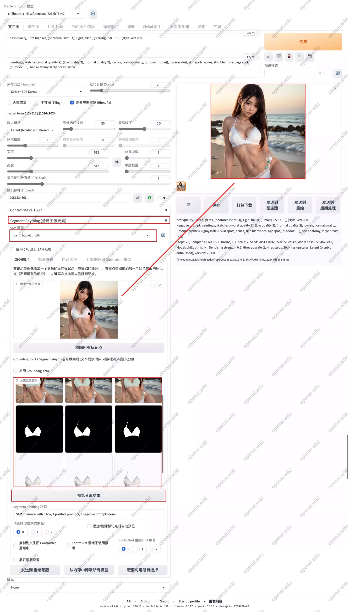
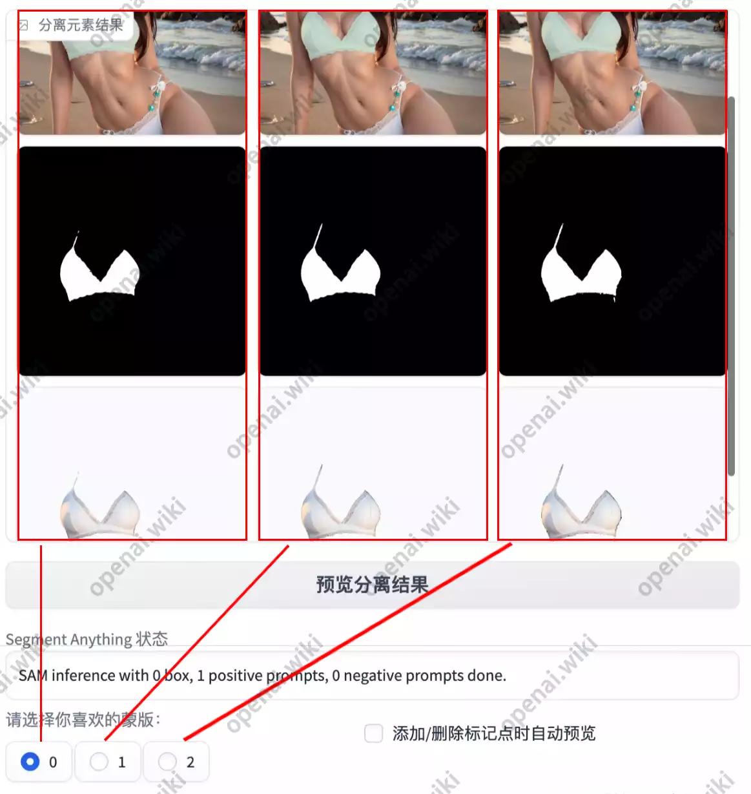
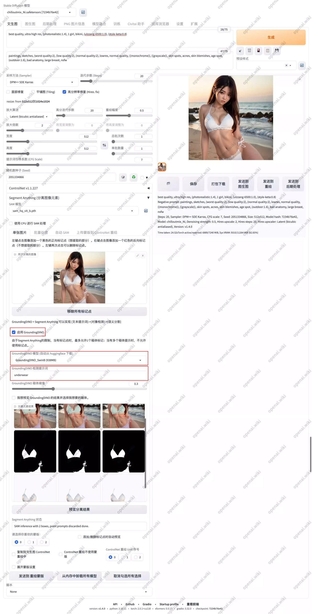
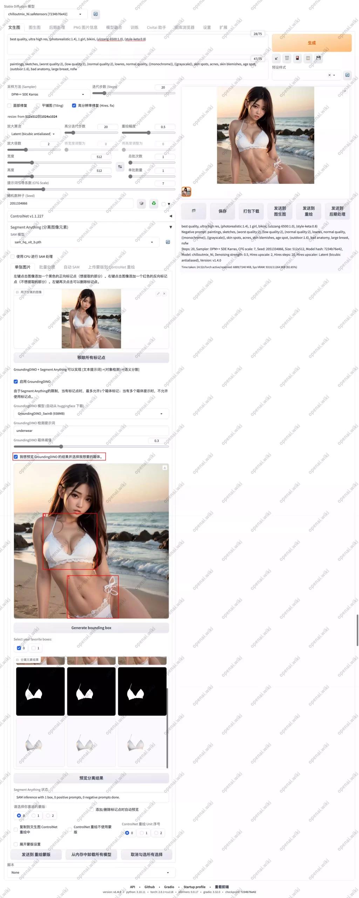
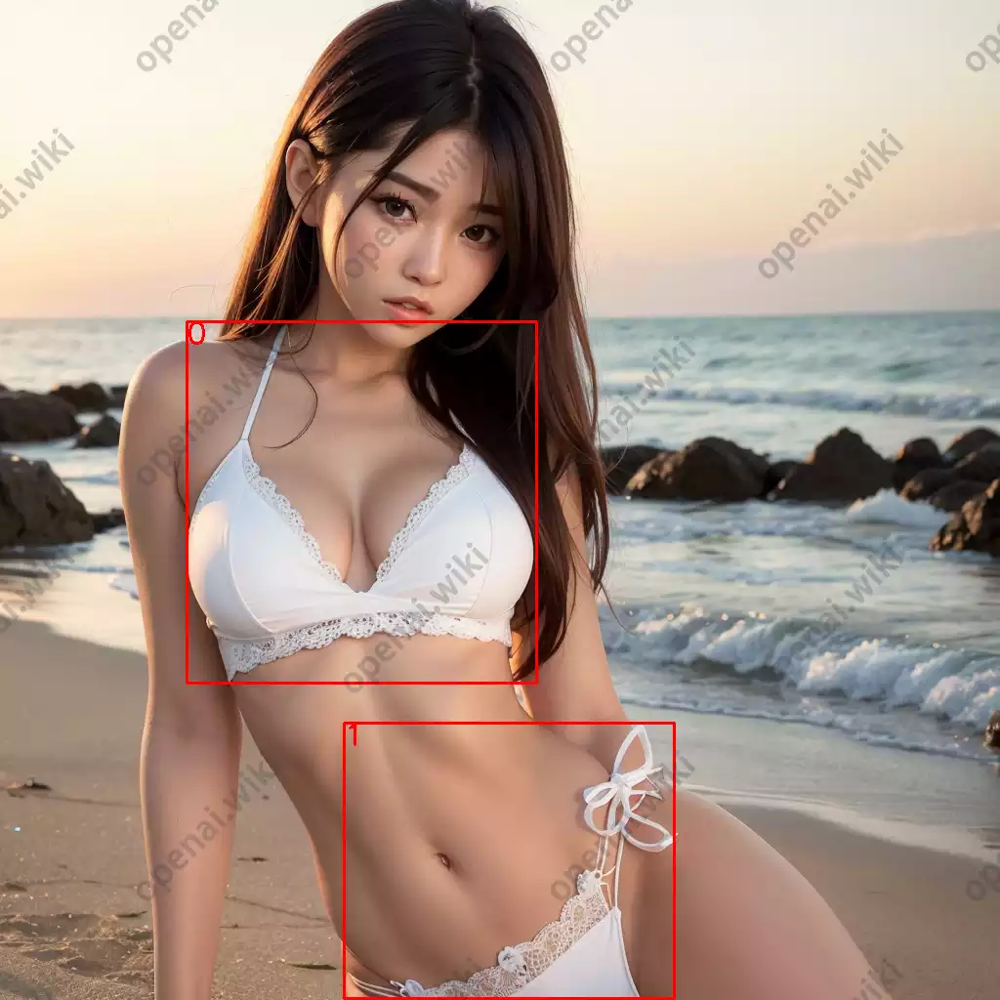
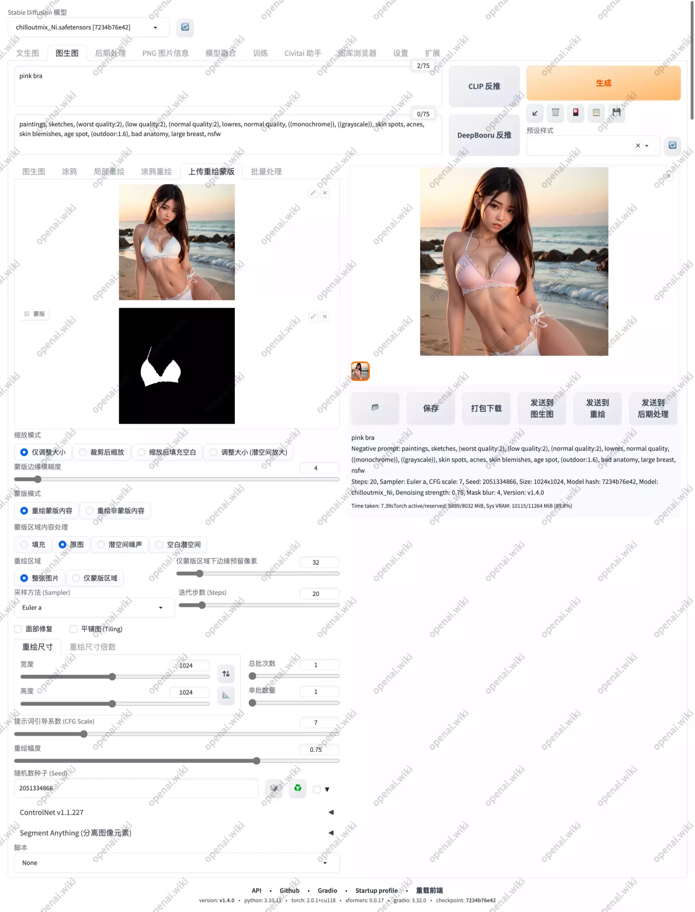

# Segment Anything｜语义分割

[原文](https://openai.wiki/author/-GVnTZ1z-qVR)

# SD插件｜Segment Anything｜自动图像语义分割插件

Stable Diffusion WebUI的Segment Anything插件最近新闻很多，可能完成不次于当初ControlNet发布的时候，因为它也的确是够强大。可以自由分割图像中的任意部分，也可以通过文字描述进行语义分割，还可以批量分割，省去了和Photoshop交互的时间，而且站长感觉好像比PS分割的还要舒服一些。所以本期为大家带来该插件的完整使用教程，所有相关模型下载。

## 项目仓库

GitHub：[continue-revolution/sd-webui-segment-anything](https://openai.wiki/go?_=63b74c544aaHR0cHM6Ly9naXRodWIuY29tL2NvbnRpbnVlLXJldm9sdXRpb24vc2Qtd2VidWktc2VnbWVudC1hbnl0aGluZw%3D%3D)

## 网络问题

在安装过程中，你可能即便开启了魔法上网也无法下载一些编程依赖库，关于魔法上网的相关配置问题不方便在站内讲解，请自行查看【[魔法上网](https://openai.wiki/go?_=cd9d2113f3aHR0cDovL2FpLm9wZW5haS5ydW4v)】的教程内容。

## 安装教程

### 在线安装

此方法适用于魔法环境没有问题的朋友，可以通过在线安装的方式一键安装，非常方便。

打开`Stable Diffusion`的`扩展`界面，在`从网址安装`的选项卡中，填写如下地址，其它留空即可，然后点击`安装`按钮。

```
https://github.com/continue-revolution/sd-webui-segment-anything
```

安装完成后，我们将会看到如下提示，翻译成中文为`插件已安装到.\stable-diffusion-webui\extensions\sd-webui-segment-anything`中，使用`重载前端`按钮重新启动。

## 模型下载｜SAM

关于此项目的模型，本站已为您下载并整理好。如果你不方便通过官网下载，可以使用本站所提供的网盘下载地址。

### Meta AI

此模型来自Meta AI，SAM 模型分为三种类型：

| 模型    | 大小     | 官方下载｜需要魔法                                                                                                                                 | 网盘下载                                                                                            |
| ----- | ------ | ----------------------------------------------------------------------------------------------------------------------------------------- | ----------------------------------------------------------------------------------------------- |
| vit_h | 2.56GB | [点击下载](https://openai.wiki/go?_=4fa67436ffaHR0cHM6Ly9kbC5mYmFpcHVibGljZmlsZXMuY29tL3NlZ21lbnRfYW55dGhpbmcvc2FtX3ZpdF9oXzRiODkzOS5wdGg%3D) | [点击前往](https://openai.wiki/go?_=00d9769fd6aHR0cHM6Ly93d3cuMTIzcGFuLmNvbS9zL3NLZDktTW5JYy5odG1s) |
| vit_l | 1.25GB | [点击下载](https://openai.wiki/go?_=507c8a6f0eaHR0cHM6Ly9kbC5mYmFpcHVibGljZmlsZXMuY29tL3NlZ21lbnRfYW55dGhpbmcvc2FtX3ZpdF9sXzBiMzE5NS5wdGg%3D) | [点击前往](https://openai.wiki/go?_=29bd87a21daHR0cHM6Ly93d3cuMTIzcGFuLmNvbS9zL3NLZDktd25JYy5odG1s) |
| vit_b | 375MB  | [点击下载](https://openai.wiki/go?_=7c581d8f92aHR0cHM6Ly9kbC5mYmFpcHVibGljZmlsZXMuY29tL3NlZ21lbnRfYW55dGhpbmcvc2FtX3ZpdF9iXzAxZWM2NC5wdGg%3D) | [点击前往](https://openai.wiki/go?_=602bb9a1c8aHR0cHM6Ly93d3cuMTIzcGFuLmNvbS9zL3NLZDktZ25JYy5odG1s) |

### SysCV

此模型来自SysCV，同样分为三种类型：

| 模型       | 大小    | 官方下载｜需要魔法                                                                                                                             | 网盘下载                                                                                            |
| -------- | ----- | ------------------------------------------------------------------------------------------------------------------------------------- | ----------------------------------------------------------------------------------------------- |
| hq_vit_h | 2.57G | [点击下载](https://openai.wiki/go?_=159c3ded51aHR0cHM6Ly9odWdnaW5nZmFjZS5jby9sa2VhYi9ocS1zYW0vcmVzb2x2ZS9tYWluL3NhbV9ocV92aXRfaC5wdGg%3D) | [点击前往](https://openai.wiki/go?_=8d0d032874aHR0cHM6Ly93d3cuMTIzcGFuLmNvbS9zL3NLZDktR25JYy5odG1s) |
| hq_vit_l | 1.25G | [点击下载](https://openai.wiki/go?_=15c521e2a2aHR0cHM6Ly9odWdnaW5nZmFjZS5jby9sa2VhYi9ocS1zYW0vcmVzb2x2ZS9tYWluL3NhbV9ocV92aXRfbC5wdGg%3D) | [点击前往](https://openai.wiki/go?_=d6c07d3f6baHR0cHM6Ly93d3cuMTIzcGFuLmNvbS9zL3NLZDktWW5JYy5odG1s) |
| hq_vit_b | 379M  | [点击下载](https://openai.wiki/go?_=fd6bef80d2aHR0cHM6Ly9odWdnaW5nZmFjZS5jby9sa2VhYi9ocS1zYW0vcmVzb2x2ZS9tYWluL3NhbV9ocV92aXRfYi5wdGg%3D) | [点击前往](https://openai.wiki/go?_=42296701b8aHR0cHM6Ly93d3cuMTIzcGFuLmNvbS9zL3NLZDktRm5JYy5odG1s) |

### Kyung Hee University

来自韩国首尔庆熙大学（경희대학교，*KyungHee University*）适用于手机的MobileSAM模型。

| 模型         | 大小      | 官方下载｜需要魔法                                                                                                                                               | 网盘下载                                                                                            |
| ---------- | ------- | ------------------------------------------------------------------------------------------------------------------------------------------------------- | ----------------------------------------------------------------------------------------------- |
| mobile_sam | 38.84MB | [点击下载](https://openai.wiki/go?_=37aa380d9daHR0cHM6Ly9naXRodWIuY29tL0NoYW9uaW5nWmhhbmcvTW9iaWxlU0FNL2Jsb2IvbWFzdGVyL3dlaWdodHMvbW9iaWxlX3NhbS5wdA%3D%3D) | [点击前往](https://openai.wiki/go?_=68e84e1cbbaHR0cHM6Ly93d3cuMTIzcGFuLmNvbS9zL3NLZDktUG5JYy5odG1s) |

### SHI-Labs

Matting-Anything 是来自 SHI-Labs 的后处理模型，适用于 SAM 的任何变体。

| 模型       | 大小     | 官方下载｜需要魔法                                                                                                                                           | 网盘下载                                                                                            |
| -------- | ------ | --------------------------------------------------------------------------------------------------------------------------------------------------- | ----------------------------------------------------------------------------------------------- |
| 11MB mam | 10.5MB | [点击下载](https://openai.wiki/go?_=d7aeab8f36aHR0cHM6Ly9odWdnaW5nZmFjZS5jby9jb25yZXZvL1NBTTRXZWJVSS1FeHRlbnNpb24tTW9kZWxzL3Jlc29sdmUvbWFpbi9tYW0ucHRo) | [点击前往](https://openai.wiki/go?_=5cd610e6a2aHR0cHM6Ly93d3cuMTIzcGFuLmNvbS9zL3NLZDktWG5JYy5odG1s) |

### CASIA-IVA-Lab

FastSAM 是来自 CASIA-IVA-Lab 的 SAM 的 YOLO 变体。

| 模型              | 大小       | 官方下载｜需要魔法                                                                                                                                                     | 网盘下载                                                                                            |
| --------------- | -------- | ------------------------------------------------------------------------------------------------------------------------------------------------------------- | ----------------------------------------------------------------------------------------------- |
| 145MB FastSAM-x | 138.23MB | [点击下载](https://openai.wiki/go?_=edc8090fc4aHR0cHM6Ly9odWdnaW5nZmFjZS5jby9jb25yZXZvL1NBTTRXZWJVSS1FeHRlbnNpb24tTW9kZWxzL3Jlc29sdmUvbWFpbi9GYXN0U0FNLXgucHQ%3D) | [点击前往](https://openai.wiki/go?_=b83e7bf2aaaHR0cHM6Ly93d3cuMTIzcGFuLmNvbS9zL3NLZDktbm5JYy5odG1s) |

模型建议：目前已知在 NVIDIA 3090 Ti 上测试vit_h模型，效果不错。如果你在使用过程中遇到关于 VRAM的报错问题，那应该是你的显存不足，你应该深度切换到较小的模型。

**太复杂了是吗？为什么这么多模型？不用担心，全部下载下来，将这些模型全部都放到****`.\stable-diffusion-webui\models\sam`****目录下即可。**

### 模型目录

下载一个或多个模型，然后将模型放置在以下目录二选一即可。

1. `.\stable-diffusion-webui\extensions\sd-webui-segment-anything\models\sam`
2. `.\stable-diffusion-webui\models\sam`

### 注意事项

- 选择其中一个，不要都选择。如果选择第2个路径做为模型存放目录，一定要删除第1个路径下的`sam`文件夹。 **为了你能够更好的理解，你只需要把下载的模型放到第2个路径就好，其它的什么都不用改。**
- 不要更改模型名称，否则由于`segment anything`内部的 bug，此扩展可能会失败。

## GroundingDINO

GroundingDINO 软件包、GroundingDINO 模型和 ControlNet 注释器模型将在首次使用时自动安装。

### GroundingDINO｜主要功能

- 你可以使用文本提示自动生成边界框。你可以使用 “..” 将不同的类别名称分隔开。SAM 可以将这些边界框转换为遮罩。
- 你可以使用一个边界框和点提示生成遮罩。
- 你可以转到批处理选项卡进行图像抠图，并获得 LoRA/LyCORIS 训练集。

### GroundingDINO｜已知问题

- 当你首次使用 GroundingDINO 功能时，GroundingDINO 将被安装，而不是在你启动 WebUI 时。 确保你的终端可以访问 GitHub，否则你必须手动安装 GroundingDINO。 如果你的终端无法访问 HuggingFace，请手动下载模型并放置在`.\stable-diffusion-webui\models\grounding-dino`下。
- 如果你想使用本地 groundingdino 来绕过所有痛苦的`C++`｜`CUDA`｜`ninja`｜`pycocotools`问题，可以看本文最后的`疑难解答`部分。 GroundingDINO 需要你的设备编译 C++，这可能需要很长时间并且会抛出大量异常。如果你遇到 _C 问题，很可能是因为你没有安装 CUDA Toolkit。 按照这里描述的步骤操作。不要跳过步骤。否则，请转到 Grounded-SAM 问题页面并在那里提交一个问题。 尽管如此，即使你无法安装 GroundingDINO，你仍然可以使用此扩展进行点提示->分割遮罩，不用担心。
- 如果你想使用点提示，SAM最多只能接受一个边界框。此扩展将检查是否有多个边界框。 如果有多个边界框，此扩展将丢弃所有点提示；否则，所有点提示都将生效。你可以始终选择你想要的一个边界框。

### GroundingDINO｜模型下载

以下两种下载方式任选其一即可，下载完成后将所有模型文件移动至`.\stable-diffusion-webui\models\grounding-dino`文件夹内。

官方下载：[https://huggingface.co/ShilongLiu/GroundingDINO/tree/main](https://openai.wiki/go?_=a4e890bdb4aHR0cHM6Ly9odWdnaW5nZmFjZS5jby9TaGlsb25nTGl1L0dyb3VuZGluZ0RJTk8vdHJlZS9tYWlu)

### GroundingDINO｜语义分割模型下载

在你首次运行并使用GroundingDINO时，将会自动下载模型，但自动下载的地址在国外，所以下载速度会非常慢，而WebUI的界面中没有配置模型路径的界面，所以我们需要将模型放置在系统的默认路径内，以下是关于模型下载，还有配置模型路径的方法。

在运行中执行以下代码，这将会自动打开huggingface的模型缓存目录，我们下载好模型之后，解压模型文件，然后将模型文件夹移动至该目录中即可。

```shell
%USERPROFILE%\.cache\huggingface\hub
```

## 自动分割｜AutoSAM

此扩展已支持自动分割功能，大大提高工作效率。

### AutoSAM｜主要功能

- 你可以使用 SAM 增强语义分割，并将输出复制到 control_v11p_sd15_seg。
- 你可以生成随机分割，并将输出复制到 EditAnything ControlNet
- 你可以生成图像布局，并在 PhotoShop 中编辑它们。支持单个图像和批处理。
- 你可以根据类别 ID 生成遮罩。如果你想要一个较大的对象，与纯 SAM+GroundingDINO 分割相比，这往往更准确。

### AutoSAM｜已知问题

- 要使用功能 1 和 4，你需要安装 Mikubill ControlNet 扩展。请不要更改目录名称（sd-webui-controlnet）。
- 如果你将 seg_ufade20k 和 SAM 结合使用，你会观察到显著的改进。如果你将其中一个 Oneformer 预处理器（seg_ofade20k 和 seg_ofcoco）与 SAM 结合使用，你可能只会观察到一些轻微的改进。
- 这是因为与 Uniformer 相比，Oneformer 已经非常强大，对于语义分割而言。SAM 只能改进一些细节，而不能显示语义模型无法显示的某些类别，因为 SAM 不是一个可以识别语义的模型。
- 对于动漫图片，图像布局生成的性能相当差。如果你处理动漫图片，我不建议你使用此功能。对于真实图片的性能我不确定。

## 使用教程

前面的理论已经非常多了，下面是使用的教程，其实使用过程还是非常简单的，以下是每个功能的单独讲解和使用示例。

### 常规分割

站长这里先随便生成一张图像，生成时所用的完整Prompt和图像如下所示：

```
best quality, ultra high res, (photorealistic:1.4), 1 girl, bikini, (ulzzang-6500:1.0), (style-keta:0.8)

Negative prompt: paintings, sketches, (worst quality:2), (low quality:2), (normal quality:2), lowres, normal quality, ((monochrome)), ((grayscale)), skin spots, acnes, skin blemishes, age spot, (outdoor:1.6), bad anatomy, large breast, nsfw

Steps: 20, Sampler: DPM++ SDE Karras, CFG scale: 7, Seed: 2051334866, Size: 512x512, Model hash: 7234b76e42, Model: chilloutmix_Ni, Denoising strength: 0.5, Hires upscale: 2, Hires steps: 20, Hires upscaler: Latent (bicubic antialiased), Version: v1.4.0
```

下面是默认参数的下的使用设置截图：



设置步骤如下：

1. 根据你的Prompt`生成图像`
2. 展示`Segment Anything (分离图像元素)`选项卡
3. 将你所生成的图像，移动至`Segment Anything`的`用于分离的图像`区域。
4. 在`图像`上对你想分离的区域进行`鼠标左键`点击，每次鼠标点击都会产生一个`黑点`，这个`黑点`就是你想要`保留的部分`。也可以使用`鼠标右键`点击你`舍弃`的部分，这将会生成一个`红点`。
5. 点击`预览分离结果`按钮

等待片刻之后，你将会在`分离元素结果`的窗口内看到`9张图像`，因为站长只做了`一个黑色标记`，而且只标记了`内衣`，所以分离出来的图像结果也是内衣，而且效果还是挺让人满意的。

需要注意的一点是，关于蒙版的选择，是按列进行排序的，每一列是一个序号位。

可能因为作者是按照编程的想法，所以从0开始。第1列是蒙版0，第2列是蒙版1，第3列是蒙版2。



### 语义分割

什么是语义分割？其实就是根据你的文字描述，自动分割出所需要的内容，比如站长输入`内衣`，那么就只会对内衣进行抠图分割，但不会保留其它的东西。

语义分割需要在以上使用的基础上，启用`GroundingDINO`，然后输入所需要分割的内容即可。



1. 已经讲过的部分就不讲了，我们还是像`常规分割`教程中一样，只不过这次勾选`启用 GroundingDINO`选项。
2. GroundingDINO模型：下载的模型一共有两个可以选择，但站长测试效果好像相差不大，所以如果你的硬件条件比较好的话，直接选择较大的模型就好。
3. GroundingDINO检测提示词：也就是你需要分割的内容，比如站长想分割内衣，那么就填写`内衣`的英文`underwear`，目前不支持中文。
4. 最后点击`预览分离结果`按钮，经过短暂的等待，就可以得到已经分割完成的图像了。

### 定向语义分割

不知道怎么来命名这个功能，就叫`定向语义分割`吧。因为虽然可以正常分割了，但目还有一个问题，比如一张图内存在多个人，我想分割其中一个；又或者我们示例图中的内衣存在多个部分，如何只分割`胸罩`或者`内裤`呢？



这次我们在之前所有操作的基础上，再多勾选一个选项，那就是`我想预览 GroundingDINO 的结果并选择我想要的箱体`功能。

勾选`我想预览 GroundingDINO 的结果并选择我想要的箱体`选项之后，将会在该菜单下新创建一个显示窗口，该显示窗口下还有一个`Generate bounding box`按钮，我们点击该按钮之后，将会在该新窗口内生成如下图像**。**



这会将所有已认识到的关于`内衣`部分全部框选，并且每个选项框在`左上角`还存在一个`序号`。我们如果只要胸罩的话，那就是0，可以得到一个完整的胸罩。

我们在`Select your favorite boxes`内仅`勾选0`，取消`勾选1`，然后再次点击`分离预览分离结果`按钮。这样就可以只分离胸罩，而不保留内裤啦。

### 重绘蒙版

说了这么多，那么我们分割之后到底有什么用呢？其实就是可以将分割出来的蒙版做为其它功能的蒙版来使用，这样可以大大省去抠图的麻烦，而不用去PS中进行操作了。

比如站长在上面已经得到了胸罩的分割和蒙版，那么我们此时如果只想修改胸罩的颜色，那么直接选择将已分割完成的蒙版发送至`蒙版重绘`内，然后输入想要改变的内容，比如站长这里给出的是粉色胸罩，那么最后得到的就是只有胸罩变成粉色，而对其它部分没有影响的重绘图像啦。



## 官方教程

以下是官方所提供的文字教程，站长已为你翻译成中文，可能具有一定的参考价值。

### 单个图像

1. 上传你的图像。
2. 【可选】在图像上添加点提示。左键点击添加正面点提示（黑点），右键点击添加负面点提示（红点），再次左键点击任何点可取消提示。如果您不想使用 GroundingDINO，则必须添加`点`提示。
3. 【可选】地勾选启用 GroundingDINO，选择您想要的 GroundingDINO 模型，编写文本提示（用 . 分隔不同的类别）并选择一个框阈值（我强烈推荐使用默认设置。较高的阈值可能导致没有边界框）。如果您不想使用点提示，则必须编写文本提示。
4. 【可选】地启用预览 GroundingDINO 边界框，然后点击生成边界框。您必须编写文本提示才能预览边界框。当您在左上角看到带有数字标记的框时，请取消选择您不想要的所有框。如果取消选择所有框，则必须添加点提示来生成遮罩。
5. 点击预览分割按钮。由于 SAM 的限制，如果存在多个边界框，在生成遮罩时您的点提示将不起作用。
6. 选择您喜欢的分割结果。
7. 【可选】勾选扩展遮罩并指定数量，然后点击更新遮罩。
8. [非常重要] 更新您的 ControlNet，并在 ControlNet 设置中勾选允许其他脚本控制此扩展（必选）。

### txt2img

1. 你只能将图像和遮罩复制到 ControlNet 的修复模块。
2. 【可选】勾选 ControlNet inpaint not masked 来反转遮罩的颜色，并修复遮罩之外的区域。
3. 如果您希望使用多个 ControlNet，请选择正确的 ControlNet 索引。
4. 配置 ControlNet 面板。点击启用，预处理器选择 inpaint_global_harmonious，模型选择 control_v11p_sd15_inpaint [ebff9138]。不需要将图像上传到 ControlNet 修复面板。
5. 编写您的提示，配置 A1111 面板，然后点击生成。

### img2img

1. 勾选复制到 Inpaint Upload 和 ControlNet Inpainting。不需要选择 ControlNet 索引。
2. 配置 ControlNet 面板。点击启用，预处理器选择 inpaint_global_harmonious，模型选择 control_v11p_sd15_inpaint [ebff9138]。不需要将图像上传到 ControlNet 修复面板。
3. 点击切换到 Inpaint Upload 按钮。不需要上传其他图像或遮罩，只需留空。编写您的提示，配置 A1111 面板，然后点击生成。

### 批量处理

1. 选择您的 SAM 模型、GroundingDINO 模型、文本提示、框阈值和遮罩扩展量。输入图像的源目录和目标目录。
2. 选择每个边界框的输出数量以配置每个边界框的遮罩数量。我强烈推荐选择 3，因为某些遮罩可能会很奇怪。
3. 点击/取消勾选多个复选框以配置您想要保存的图像。请参考演示以了解这些复选框代表的图像类型。
4. 点击开始批处理并等待。如果在此按钮下方看到“完成”提示，表示操作完成。

## AutoSAM

1. 在使用之前，请安装并更新 Mikubill ControlNet Extension。
2. 根据此处的描述，配置 AutoSAM 可调参数。如果不理解，可以使用默认设置。

### ControlNet

1. 选择预处理器。
   - seg_ufade20k、seg_ofade20k 和 seg_ofcoco 来自 ControlNet 标注器。我强烈推荐使用 seg_ofade20k 和 seg_ofcoco 中的一个，因为它们的性能远远优于 seg_ufade20k。它们都与
   - control_v11p_sd15_seg 兼容。如果要启用像素级精确度，请在预览之前在 txt2img/img2img 默认面板上配置目标宽度和高度。否则，您需要手动设置预处理器的分辨率。
   - random 用于 EditAnything。对于随机预处理器，不需要设置预处理器的分辨率，因为它不包含语义分割，但您需要从 AutoSeg 输出库中选择一张图像复制到 ControlNet。1 表示不同遮罩区域的随机着色，保留给未来的 ControlNet 使用，2 表示固定着色，可用于 EditAnything ControlNet 控制图像。
2. 点击预览分割图像。对于语义分割，您将看到 4 张图像，左侧 2 张是没有 SAM 的，右侧 2 张是使用 SAM 的。对于随机预处理器，您将看到 3 张图像，左上角是混合图像，右上角是随机着色的遮罩，左下角是用于 EditAnything ControlNet 的图像。
3. 勾选复制到 ControlNet 分割，并选择您正在使用 ControlNet 分割模型的正确 ControlNet 索引，如果您希望使用 Multi-ControlNet。
4. 配置 ControlNet 面板。点击启用，预处理器选择 none，模型选择 control_v11p_sd15_seg [e1f51eb9]。不需要将图像上传到 ControlNet 分割面板。
5. 编写您的提示，配置 A1111 面板，然后点击生成。
6. 如果要使用 EditAnything，则需要修改上述一些步骤：
   - 在步骤 1：需要选择随机预处理器。
   - 在步骤 3 和 4 之间：下载
   - SD 1.5 的权重到 ${a1111-webui}/models/ControlNet 或 ${sd-webui-controlnet}/models，配置到 ${sd-webui-controlnet}/models
   - SD 2.1 的权重到 ${a1111-webui}/models/ControlNet 或 ${sd-webui-controlnet}/models，配置到 ${sd-webui-controlnet}/models
   - 在步骤 4：模型选择 control_v11p_sd15_seg [e1f51eb9]

### 图像布局

1. 对于单个图像，只需上传图像，输入输出路径，然后点击生成。您将在输出目录中看到许多图像。
2. 对于批量处理，只需输入源目录和目标目录，然后点击生成。您将在 ${destination}/{image_filename} 目录中看到许多图像。

### 按类别遮罩

1. 选择类似于 ControlNet 步骤 1 的预处理器。这是纯语义分割，因此没有随机预处理器。
2. 输入通过 + 分隔的类别 ID。访问 ade20k 这里和 coco 这里获取类别->ID 映射。请注意，coco 跳过了一些数字，因此实际的 ID 是行号 – 21。例如，如果您想要床+人，则输入应为 7+12（对于 ade20k）和 59+0（对于 coco）。
3. 对于单个图像，上传图像，点击预览，并根据 txt2img 这里和 img2img 这里的说明配置复制。
4. 对于批量处理，与批处理步骤 2-4 类似。

## 疑难解答

### GroundingDINO｜相关介绍

- 由于 GroundingDINO 安装的大量高性能的文本到边界框库的替代方案，所以作者修改了 GroundingDINO 的源代码，并将其推送到这个项目仓库中。 从 [v1.5.0](https://openai.wiki/go?_=1f6a9c0235aHR0cHM6Ly9naXRodWIuY29tL2NvbnRpbnVlLXJldm9sdXRpb24vc2Qtd2VidWktc2VnbWVudC1hbnl0aGluZy9yZWxlYXNlcy90YWcvdjEuNS4w) 开始，你可以选择通过在Setting/Segment Anything 中勾选使用本地 GroundingDINO 来绕过 C++ 问题。这个改变应该解决所有与 ninja、pycocotools、_C 和与 C++/CUDA 编译相关的其他问题。
- 如果你没有修改上述设置，此脚本将首先尝试安装 GroundingDINO，并检查你的环境是否成功构建了 C++ 动态库（令人讨厌的 _C）。 如果是这样，脚本将使用官方实现的 GroundingDINO。如果脚本无法安装 GroundingDINO，它将使用本地 GroundingDINO。
- 如果你仍然希望解决 GroundingDINO 的安装问题，我观察到 Windows 用户常见的问题有：
  - pycocotool：[点击前往查看解决方案](https://openai.wiki/go?_=8958e8dedfaHR0cHM6Ly9naXRodWIuY29tL2NvY29kYXRhc2V0L2NvY29hcGkvaXNzdWVzLzQxNSNpc3N1ZWNvbW1lbnQtNjI3MzEzODE2)
  - _C：[点击前往查看解决方案](https://openai.wiki/go?_=032449c9e1aHR0cHM6Ly9naXRodWIuY29tL2NvbnRpbnVlLXJldm9sdXRpb24vc2Qtd2VidWktc2VnbWVudC1hbnl0aGluZy9pc3N1ZXMvMzIjaXNzdWVjb21tZW50LTE1MTM4NzMyOTY%3D)（必看）

### 其它问题

以下是关于ControlNet的一些常见问题。

- 如果你在安装此扩展后，即使你`使用`或`不使用`此扩展，仍然无法使用 ControlNet/WebUI。
- 观察到来自 ControlNet 的[`AttributeError: 'bool' object has no attribute 'enabled'`](https://openai.wiki/go?_=14fdabe94baHR0cHM6Ly9naXRodWIuY29tL2NvbnRpbnVlLXJldm9sdXRpb24vc2Qtd2VidWktc2VnbWVudC1hbnl0aGluZy9pc3N1ZXMvMTA2)和[`TypeError: 'bool' object is not subscriptable`](https://openai.wiki/go?_=da4bf4d542aHR0cHM6Ly9naXRodWIuY29tL2NvbnRpbnVlLXJldm9sdXRpb24vc2Qtd2VidWktc2VnbWVudC1hbnl0aGluZy9pc3N1ZXMvOTM%3D)等问题
- 当你禁用 SAM 扩展时，问题消失了。
- 这个问题很可能是由于其他一些扩展可能也改变了扩展列表中的位置以控制 ControlNet。最简单的解决方法在[这里](https://openai.wiki/go?_=606f009ff2aHR0cHM6Ly9naXRodWIuY29tL2NvbnRpbnVlLXJldm9sdXRpb24vc2Qtd2VidWktc2VnbWVudC1hbnl0aGluZy9pc3N1ZXMvOTMjaXNzdWVjb21tZW50LTE1NDY3Nzc4NjA%3D)。这个改变将使 SAM 扩展在 ControlNet 之前，绕过内部的前置代码，并且不会阻止你接收到我的任何更新。我没有计划重构我的代码来绕过这个问题。当我创建这个扩展时，我没有预料到要控制 ControlNet，但是 ControlNet 的发展确实超出了我的预期。
- 这个扩展几乎已经进入维护阶段。尽管我认为在可预见的将来不会有重大更新，但是 Mikubill ControlNet 扩展仍在快速发展，我期待更多机会将我的扩展与 ControlNet 相连接。尽管如此，我将继续处理问题，并监视新的研究工作，看看它们是否值得支持。我欢迎任何社区贡献和任何功能请求。
- 你必须使用 gradio>=3.23.0 和 WebUI>=22bcc7be 才能使用这个扩展。A1111 WebUI 是稳定的，一些集成包的作者也已经更新了他们的包。另外，支持不同版本的 WebUI 将需要很大的时间投入，而在这期间我可以创建更多的功能。请更新你的 WebUI，并且是安全的使用。我不打算支持一些旧的 WebUI 提交，比如 a9fed7c3。
- 由于 gradio/A1111 的限制，目前至少不可能支持以下功能。我将密切关注 gradio/A1111 的更新，看看是否有可能支持它们：
- 颜色修复，因为 gradio 奇怪地放大了输入图像，导致浏览器变慢，甚至冻结页面。虽然我已经实现了这个功能，但我将其隐藏了起来。请注意，ControlNet v1.1 的修复模型非常强大，你不再需要依赖传统的修复方法。ControlNet v1.1 不支持颜色修复。
- 编辑遮罩/显式复制，因为 gradio 的图像组件不能接受图像+遮罩作为输出，而这是将遮罩图像明确复制到 img2img 修复/inpaint sketch/ControlNet 的必需方式（即你可以在面板上看到实际的遮罩图像，而不是神秘的内部复制）。如果没有这个功能，你将无法编辑遮罩。
- Inpaint-Anything、EditAnything 和许多其他流行的 SAM 扩展已经得到支持。关于 Inpaint-Anything，你可以查看这个问题以了解如何使用。关于 EditAnything，请查看如何使用。我始终支持任何其他有趣的应用，如果你发现其他有趣的应用，请提交一个功能请求。

## 总结

教程写到一半，突然发现这个项目又更新了，模型目录结构发生更改，好多地方又需要重新写，唉。

现在SD已经越来越完善了，插件玩都玩不过来，以后小插件就不讲了，多讲一些关于这种主流或者爆炸性插件的教程吧。

因为这种教程，想要整理成文字内容，真的！非常！累！
