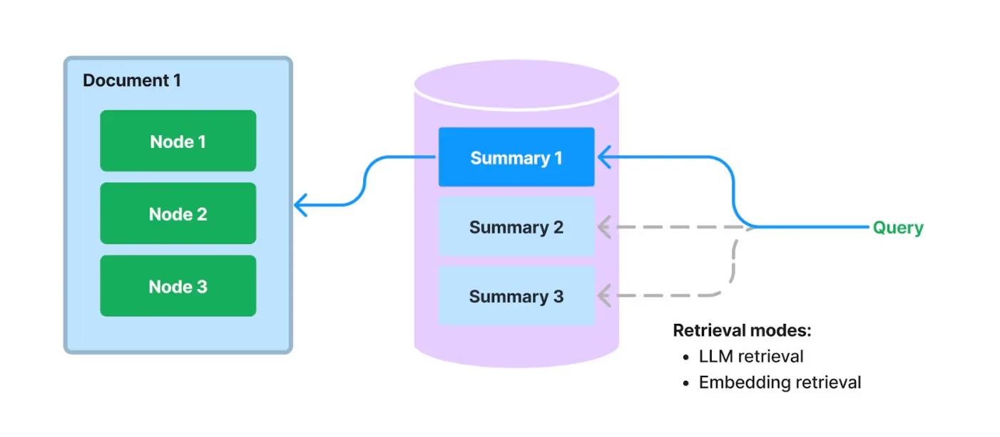

### 初探llamaIndex的Document Summary Index



## 使用文档摘要索引增强大型语言模型问答系统

大型语言模型 (LLM) 的核心用例之一是利用自身数据进行问答。为了实现这一点，我们将 LLM 与一个能够在知识语料库上执行信息检索的“检索”模型配对，并使用 LLM 对检索到的文本进行响应合成。这种整体框架称为**检索增强生成 (Retrieval-Augmented Generation)**。

当今构建 LLM 驱动的问答系统的大多数用户倾向于执行以下某种操作：

- 获取源文档，并将每个文档分割成文本块
- 将文本块存储在向量数据库中
- 在查询时，通过嵌入相似性和/或关键词过滤器检索文本块
- 执行响应合成

出于多种原因，这种方法的检索性能有限。

## 现有方法的局限性

使用文本块进行嵌入检索存在一些限制：

- 文本块缺乏全局上下文。通常情况下，问题需要超出特定块中索引的内容之外的上下文。
- 需要仔细调整 top-k / 相似度得分阈值。 将值设置得太小，您将错过上下文。 将值设置得太大，成本/延迟可能会随着更多无关的上下文而增加。
- 嵌入并不总是为问题选择最相关的上下文。 嵌入本质上是在文本和上下文之间单独确定的。
- 添加关键词过滤器是一种增强检索结果的方法。 但这会带来一系列挑战。 我们需要充分确定每个文档的适当关键词，无论是手动操作还是通过 NLP 关键词提取/主题标记模型。 我们还需要从查询中充分推断适当的关键词。

## 文档摘要索引

[图表：LlamaIndex 的文档摘要索引]

我们在 LlamaIndex 中提出了一种新的索引，用于提取/索引每个文档的 **非结构化文本摘要**。 该索引可以帮助将检索性能提升到现有检索方法之外。 它可以比单个文本块索引更多信息，并且比关键词标签携带更多的语义含义。 它还允许更灵活的检索形式：我们可以同时进行 LLM 检索和基于嵌入的检索。

## 工作原理

在构建时，我们摄取每个文档，并使用 LLM 从每个文档中提取摘要。 我们还将文档分割成文本块（节点）。摘要和节点都存储在我们**文档存储**抽象中。 我们维护从摘要到源文档/节点的映射。

在查询时，我们使用以下方法根据其摘要检索与查询相关的文档：

- **基于 LLM 的检索：** 我们向 LLM 提供一系列文档摘要，并要求 LLM 确定哪些文档是相关的 + 它们的相关性得分。
- **基于嵌入的检索：** 我们基于摘要嵌入相似性（使用 top-k 截断）检索相关文档。
- 请注意，这种用于文档摘要的检索方法（即使使用基于嵌入的方法）也与基于文本块的基于嵌入的检索不同。 文档摘要索引的检索类会检索任何选定文档的 **所有节点**，而不是在节点级别返回相关块。

存储文档摘要也支持 **基于 LLM 的检索**。 我们可以先让 LLM 检查简洁的文档摘要，看看它是否与查询相关，而不是一开始就将整个文档馈送给 LLM。 这利用了比基于嵌入的查找更高级的 LLM 的推理能力，但避免了将整个文档馈送给 LLM 的成本/延迟。

## 额外见解

使用摘要进行文档检索可以被视为语义搜索和所有文档的蛮力摘要之间的“中间地带”。 我们根据给定查询的摘要相关性来查找文档，然后返回所有对应于检索到的文档的 *节点*。

我们为什么要这样做？ 这种检索方法比文本块的 top-k 提供给用户更多的上下文，因为它可以在文档级别检索上下文。 但它也比主题建模更灵活/自动；无需再担心您的文本是否有正确的关键词标签！

文档摘要索引演示 本演示展示了对不同城市的维基百科文章进行的文档摘要索引。

文档摘要索引将从每个文档中提取摘要，并存储该摘要以及与文档相对应的所有节点。

检索可以通过LLM或嵌入（这是一个TODO）执行。我们首先根据它们的摘要选择与查询相关的文档。检索到的所有与所选文档对应的节点都将被检索。

如果您在Colab上打开此笔记本，可能需要安装LlamaIndex 。

```python
%pip install llama-index-llms-openai
!pip install llama-index
import os
import openai

os.environ["OPENAI_API_KEY"] = "sk-..."
openai.api_key = os.environ["OPENAI_API_KEY"]
import logging
import sys

logging.basicConfig(stream=sys.stdout, level=logging.WARNING)
logging.getLogger().addHandler(logging.StreamHandler(stream=sys.stdout))

# # Uncomment if you want to temporarily disable logger
# logger = logging.getLogger()
# logger.disabled = True
import nest_asyncio

nest_asyncio.apply()
from llama_index.core import SimpleDirectoryReader, get_response_synthesizer
from llama_index.core import DocumentSummaryIndex
from llama_index.llms.openai import OpenAI
from llama_index.core.node_parser import SentenceSplitter

```

加载数据集 加载不同城市的维基百科页面。

```python
wiki_titles = ["Toronto", "Seattle", "Chicago", "Boston", "Houston"]
from pathlib import Path

import requests

for title in wiki_titles:
    response = requests.get(
        "https://en.wikipedia.org/w/api.php",
        params={
            "action": "query",
            "format": "json",
            "titles": title,
            "prop": "extracts",
            # 'exintro': True,
            "explaintext": True,
        },
    ).json()
    page = next(iter(response["query"]["pages"].values()))
    wiki_text = page["extract"]

    data_path = Path("data")
    if not data_path.exists():
        Path.mkdir(data_path)

    with open(data_path / f"{title}.txt", "w") as fp:
        fp.write(wiki_text)
# Load all wiki documents
city_docs = []
for wiki_title in wiki_titles:
    docs = SimpleDirectoryReader(
        input_files=[f"data/{wiki_title}.txt"]
    ).load_data()
    docs[0].doc_id = wiki_title
    city_docs.extend(docs)

```

构建文档摘要索引 我们展示了两种构建索引的方法：

1. 使用默认模式构建文档摘要索引
2. 自定义摘要查询

```python
# LLM（gpt-3.5-turbo）
chatgpt = OpenAI(temperature=0, model="gpt-3.5-turbo")
splitter = SentenceSplitter(chunk_size=1024)
# 使用默认模式构建索引
response_synthesizer = get_response_synthesizer(
    response_mode="tree_summarize", use_async=True
)
doc_summary_index = DocumentSummaryIndex.from_documents(
    city_docs,
    llm=chatgpt,
    transformations=[splitter],
    response_synthesizer=response_synthesizer,
    show_progress=True,
)
current doc id: Toronto
current doc id: Seattle
current doc id: Chicago
current doc id: Boston
current doc id: Houston
doc_summary_index.get_document_summary("Boston")

```

文档摘要索引已建立，您可以通过指定的文档ID获取摘要。

```python
"The provided text is about the city of Boston and covers various aspects of the city, including its history, geography, demographics, economy, education system, healthcare facilities, public safety, culture, environment, transportation infrastructure, and international relations. It provides information on Boston's development over time, key events in its history, its significance as a cultural and educational center, its economic sectors, neighborhoods, climate, population, ethnic diversity, landmarks and attractions, colleges and universities, healthcare facilities, public safety measures, cultural scene, annual events, environmental initiatives, churches, pollution control, water purity and availability, climate change and sea level rise, sports teams, parks and recreational areas, government and political system, media, and transportation infrastructure.\n\nSome questions that this text can answer include:\n- What is the history of Boston and how did it develop over time?\n- What were some key events that took place in Boston during the American Revolution?\n- What is the significance of Boston in terms of education and academic research?\n- What are some of the economic sectors that contribute to Boston's economy?\n- How has Boston changed and evolved in the 20th and 21st centuries?\n- What is the geography of Boston and how does it impact the city?\n- What are the neighborhoods in Boston?\n- What is the climate like in Boston?\n- What is the population of Boston and its demographic breakdown?\n- What is the economy of Boston like?\n- What are some notable landmarks and attractions in Boston?\n- What is the ethnic diversity of Boston?\n- What is the religious composition of Boston?\n- What is the impact of colleges and universities on the economy of Boston?\n- What is the role of technology and biotechnology in Boston's economy?\n- What healthcare facilities are located in Boston?\n- How does Boston ensure public safety?\n- What is the cultural scene like in Boston?\n- What are some of the annual events in Boston?\n- What environmental initiatives are being undertaken in Boston?\n- What are some of the churches in Boston and their historical significance?\n- How does Boston control pollution and maintain air quality?\n- What is the status of water purity and availability in Boston?\n- How is Boston addressing climate change and sea level rise?\n- What sports teams are based in Boston and what championships have they won?\n- What are some of the parks and recreational areas in Boston?\n- How is the government and political system structured in Boston?\n- What are some major newspapers, radio stations, and television stations in Boston?\n- What is the transportation infrastructure in Boston, including the airport and major highways?\n- What are some notable movies filmed in Boston?\n- Which video games have used Boston as a setting?\n- What are some of Boston's sister cities and partnership relationships?\n- Where can I find more information about Boston's history and landmarks?"
```

将文档摘要索引保存到磁盘上以便以后使用。

```python
doc_summary_index.storage_context.persist("index")
from llama_index.core import load_index_from_storage
from llama_index.core import StorageContext

# 重建存储上下文
storage_context = StorageContext.from_defaults(persist_dir="index")
doc_summary_index = load_index_from_storage(storage_context)
```

执行来自文档

摘要索引的检索 我们展示了如何在高层次执行查询。我们还展示了如何以较低级别执行检索，以便您可以查看所使用的参数。我们展示了使用文档摘要进行基于LLM的检索和基于嵌入的检索。

高层次查询 注意：这使用了默认的基于嵌入的检索形式。

```python
query_engine = doc_summary_index.as_query_engine(
    response_mode="tree_summarize", use_async=True
)
response = query_engine.query("What are the sports teams in Toronto?")
print(response)
```

文档摘要索引已经配置为进行高层次查询，您可以通过指定的查询获取响应。

```python
"The sports teams in Toronto include the Toronto Maple Leafs (NHL), Toronto Raptors (NBA), Toronto Blue Jays (MLB), Toronto FC (MLS), and Toronto Argonauts (CFL)."

```

基于LLM的检索

```python
from llama_index.core.indices.document_summary import DocumentSummaryIndexLLMRetriever

retriever = DocumentSummaryIndexLLMRetriever(
    doc_summary_index,
    # choice_select_prompt=None,
    # choice_batch_size=10,
    # choice_top_k=1,
    # format_node_batch_fn=None,
    # parse_choice_select_answer_fn=None,
)
retrieved_nodes = retriever.retrieve("What are the sports teams in Toronto?")
print(len(retrieved_nodes))
20
print(retrieved_nodes[0].score)
print(retrieved_nodes[0].node.get_text())

```

LLM检索已经配置，您可以通过指定的查询获取检索到的节点。

```python
10.0
Toronto is the most populous city in Canada and the capital city of the Canadian province of Ontario. With a recorded population of 2,794,356 in 2021, it is the fourth-most populous city in North America. The city is the anchor of the Golden Horseshoe, an urban agglomeration of 9,765,188 people (as of 2021) surrounding the western end of Lake Ontario, while the Greater Toronto Area proper had a 2021 population of 6,712,341. Toronto is an international centre of business, finance, arts, sports and culture, and is recognized as one of the most multicultural and cosmopolitan cities in the world.Indigenous peoples have travelled through and inhabited the Toronto area, located on a broad sloping plateau interspersed with rivers, deep ravines, and urban forest, for more than 10,000 years. After the broadly disputed Toronto Purchase, when the Mississauga surrendered the area to the British Crown, the British established the town of York in 1793 and later designated it as the capital of Upper Canada. During the War of 1812, the town was the site of the Battle of York and suffered heavy damage by American troops. York was renamed and incorporated in 1834 as the city of Toronto. It was designated as the capital of the province of Ontario in 1867 during Canadian Confederation. The city proper has since expanded past its original limits through both annexation and amalgamation to its current area of 630.2 km2 (243.3 sq mi).
The diverse population of Toronto reflects its current and historical role as an important destination for immigrants to Canada. More than half of residents were born outside of Canada, more than half of residents belong to a visible minority group, and over 200 distinct ethnic origins are represented among its inhabitants. While the majority of Torontonians speak English as their primary language, over 160 languages are spoken in the city. The mayor of Toronto is elected by direct popular vote to serve as the chief executive of the city. The Toronto City Council is a unicameral legislative body, comprising 25 councillors since the 2018 municipal election, representing geographical wards throughout the city.Toronto is a prominent centre for music, theatre, motion picture production, and television production, and is home to the headquarters of Canada's major national broadcast networks and media outlets. Its varied cultural institutions, which include numerous museums and galleries, festivals and public events, entertainment districts, national historic sites, and sports activities, attract over 43 million tourists each year. Toronto is known for its many skyscrapers and high-rise buildings, in particular the tallest free-standing structure on land outside of Asia, the CN Tower.The city is home to the Toronto Stock Exchange, the headquarters of Canada's five largest banks, and the headquarters of many large Canadian and multinational corporations. Its economy is highly diversified with strengths in technology, design, financial services, life sciences, education, arts, fashion, aerospace, environmental innovation, food services, and tourism. Toronto is the third-largest tech hub in North America after Silicon Valley and New York City, and the fastest growing.

```

嵌入检索

```python
from llama_index.core.indices.document_summary import (
    DocumentSummaryIndexEmbeddingRetriever,
)

retriever = DocumentSummaryIndexEmbeddingRetriever(
    doc_summary_index,
    # similarity_top_k=1,
)
retrieved_nodes = retriever.retrieve("What are the sports teams in Toronto?")
len(retrieved_nodes)

20
print(retrieved_nodes[0].node.get_text())

```

嵌入检索已经配置，您可以通过指定的查询获取检索到的节点。

```python
Toronto is the most populous city in Canada and the capital city of the Canadian province of Ontario. With a recorded population of 2,794,356 in 2021, it is the fourth-most populous city in North America. The city is the anchor of the Golden Horseshoe, an urban agglomeration of 9,765,188 people (as of 2021) surrounding the western end of Lake Ontario, while the Greater Toronto Area proper had a 2021 population of 6,712,341. Toronto is an international centre of business, finance, arts, sports and culture, and is recognized as one of the most multicultural and cosmopolitan cities in the world.Indigenous peoples have travelled through and inhabited the Toronto area, located on a broad sloping plateau interspersed with rivers, deep ravines, and urban forest, for more than 10,000 years. After the broadly disputed Toronto Purchase, when the Mississauga surrendered the area to the British Crown, the British established the town of York in 1793 and later designated it as the capital of Upper Canada. During the War of 1812, the town was the site of the Battle of York and suffered heavy damage by American troops. York was renamed and incorporated in 1834 as the city of Toronto. It was designated as the capital of the province of Ontario in 1867 during Canadian Confederation. The city proper has since expanded past its original limits through both annexation and amalgamation to its current area of 630.2 km2 (243.3 sq mi).
The diverse population of Toronto reflects its current and historical role as an important destination for immigrants to Canada. More than half of residents were born outside of Canada, more than half of residents belong to a visible minority group, and over 200 distinct ethnic origins are represented among its inhabitants. While the majority of Torontonians speak English as their primary language, over 160 languages are spoken in the city. The mayor of Toronto is elected by direct popular vote to serve as the chief executive of the city. The Toronto City Council is a unicameral legislative body, comprising 25 councillors since the 2018 municipal election, representing geographical wards throughout the city.Toronto is a prominent centre for music, theatre, motion picture production, and television production, and is home to the headquarters of Canada's major national broadcast networks and media outlets. Its varied cultural institutions, which include numerous museums and galleries, festivals and public events, entertainment districts, national historic sites, and sports activities, attract over 43 million tourists each year. Toronto is known for its many skyscrapers and high-rise buildings, in particular the tallest free-standing structure on land outside of Asia, the CN Tower.The city is home to the Toronto Stock Exchange, the headquarters of Canada's five largest banks, and the headquarters of many large Canadian and multinational corporations. Its economy is highly diversified with strengths in technology, design, financial services, life sciences, education, arts, fashion, aerospace, environmental innovation, food services, and tourism. Toronto is the third-largest tech hub in North America after Silicon Valley and New York City, and the fastest growing.


== Toponymy ==

The word Toronto has been recorded with various spellings in French and English, including Tarento, Tarontha, Taronto, Toranto, Torento, Toronto, and Toronton. Taronto referred to "The Narrows", a channel of water through which Lake Simcoe discharges into Lake Couchiching where the Huron had planted tree saplings to corral fish. This narrows was called tkaronto by the Mohawk, meaning "where there are trees standing in the water," and was recorded as early as 1615 by Samuel de Champlain. The word "Toronto", meaning "plenty" also appears in a 1632 French lexicon of the Huron language, which is also an Iroquoian language. It also appears on French maps referring to various locations, including Georgian Bay, Lake Simcoe, and several rivers. A portage route from Lake Ontario to Lake Huron running through this point, known as the Toronto Carrying-Place Trail, led to widespread use of the name.
The pronunciation of the city is broadly   tə-RON-toh, which locals realize as [təˈɹɒno] or [ˈtʃɹɒno], leaving the second 't' silent.


== History ==
# use retriever as part of a query engine
from llama_index.core.query_engine import RetrieverQueryEngine

# configure response synthesizer
response_synthesizer = get_response_synthesizer(response_mode="tree_summarize")

# assemble query engine
query_engine = RetrieverQueryEngine(
    retriever=retriever,
    response_synthesizer=response_synthesizer,
)

# query
response = query_engine.query("What are the sports teams in Toronto?")
print(response)

```

检索已经配置，您可以通过指定的查询获取响应。

```python
"The sports teams in Toronto include the Toronto Maple Leafs (NHL), Toronto Raptors (NBA), Toronto Blue Jays (MLB), Toronto FC (MLS), Toronto Argonauts (CFL), Toronto Rock (NLL), Toronto Wolfpack (Rugby Football League), Toronto Six (NWHL), and Toronto Rush (American Ultimate Disc League)."

```


