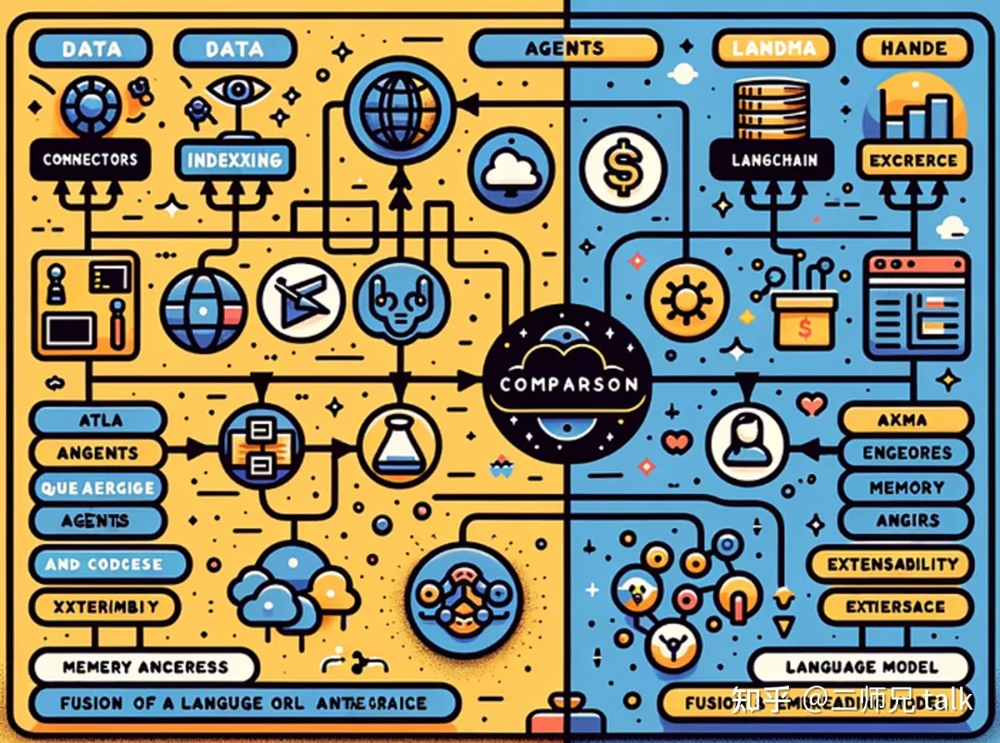
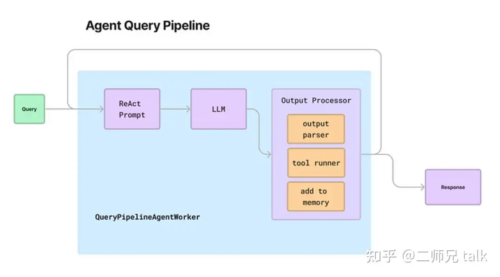

# 通过 LlamaIndex 释放代理和 QueryPipeline 的力量（含代码）

## **介绍**

在不断发展的数据管理环境中，对查询处理效率和智能的追求促使我们采用了一种开创性的方法 - 围绕查询管道构建代理。在这次探索中，我们深入研究了 LlamaIndex 的领域，在这里，平凡转化为非凡。本文不仅仅是一本指南;它利用智能代理的强大功能重新构想查询管道。



## **代理在查询管道方面的优势：提升数据体验**

将代理集成到查询管道中会带来无数好处，从根本上改变您与数据交互和从数据中提取见解的方式。让我们来说明一下主要优势：

1. **复杂的顺序推理**：由 LlamaIndex 提供支持的代理超越了传统查询管道的局限性。它们引入了复杂、顺序推理的概念，允许采用更细致、更智能的查询处理方法。您的数据之旅将成为一系列战略性行动，旨在获得最佳结果。
2. **循环集成的动态适应性**：查询管道中代理的一个显着特征是能够将“循环”引入图形。这种动态适配可确保您的代理不受线性序列的约束，而是可以根据需要重新访问和迭代。结果呢？响应迅速且灵活的查询管道，可根据数据生态系统不断变化的需求进行调整。
3. **量身定制的示例**：ReAct 和“简单”代理：我们展示了两个说明性示例，以指导您了解代理在查询管道中的潜力。
4. **用于工具拾取的****ReAct****代理**：想象一个超越单纯数据获取的代理。ReAct 代理是一个强大的工具，能够智能工具选择，将您的数据处理转化为协调良好的行动的交响乐。借助 LlamaIndex，ReAct 代理成为指挥者，协调工具以优化查询体验。
5. **具有重试层的“简单”代理**：复杂性并不总是答案。我们的“简单”代理通过在文本到 SQL 查询引擎周围无缝合并重试层，增加了一丝复杂性。这种简单性确保了可靠性，使您的查询能够优雅地处理暂时性挑战并提供可靠的结果。




## **代码实现**

让我们深入探讨围绕查询管道实现代理的实际领域。以下代码片段提供了将 LlamaIndex 的魔力变为现实的代码的一瞥。

### **步骤** **I：安装库**

```python3
pip install -Uq llama-index llama-index-core sentence-transformers cohere protobuf pypdf datasets evaluate einops SQLAlchemy
pip install llama-index-llms-openai llama-index-callbacks-arize-phoenix
```

### **第** **II** **步：导入库**

```text
from llama_index.core import SQLDatabase
from llama_index.core.query_pipeline import QueryPipeline
from sqlalchemy import (
    create_engine,
    MetaData,
    Table,
    Column,
    String,
    Integer,
    select,
    column,
)

engine = create_engine("sqlite:///chinook.db")
sql_database = SQLDatabase(engine)


# Setup Data
!curl "https://www.sqlitetutorial.net/wp-content/uploads/2018/03/chinook.zip" -O ./chinook.zip
!unzip ./chinook.zip

## Setup Observability
# define global callback setting
from llama_index.core.settings import Settings
from llama_index.core.callbacks import CallbackManager
import phoenix as px
import llama_index.core

callback_manager = CallbackManager()
Settings.callback_manager = callback_manager

px.launch_app()
llama_index.core.set_global_handler("arize_phoenix")
```

### **步骤** **III：文本转** **SQL** **查询引擎/工具Step** **III：Text-to-SQL** **Query** **Engine** **/** **Tool**

```text
from llama_index.core.query_engine import NLSQLTableQueryEngine
from llama_index.core.tools import QueryEngineTool

sql_query_engine = NLSQLTableQueryEngine(
    sql_database=sql_database,
    tables=["albums", "tracks", "artists"],
    verbose=True,
)
sql_tool = QueryEngineTool.from_defaults(
    query_engine=sql_query_engine,
    name="sql_tool",
    description=(
        "Useful for translating a natural language query into a SQL query"
    ),
)
```

### **第** **IV** **步：设置** **ReAct** **Agent** **管道**

1. **代理输入**：用于将任务和状态输入转换为适合查询管道的格式。AgentInputComponent
2. **ReAct****提示生成**：使用 LLM 调用 ReAct 提示符以生成下一个操作或工具。如果生成响应，请继续执行下一步。
3. **工具管道执行**：如果选择了工具或操作，请执行工具管道并收集响应。
4. **响应检索**：检索生成的响应，确保输出符合 。Tuple[AgentChatResponse, bool]

在这个 ReAct 代理管道中，使用了特定的查询组件，包括 和 。后者用于格式化 ReAct 提示，为各种用途提供灵活性。请注意，传递到这些组件的任何函数都必须包含 和 作为输入变量。代理查询管道的输出必须采用指定的格式，以便与后续阶段兼容。AgentInputComponentAgentFnComponenttaskstate

```text
from llama_index.core.query_pipeline import QueryPipeline as QP

qp = QP(verbose=True)

# Define Agent Input Component
from llama_index.core.agent.react.types import (
    ActionReasoningStep,
    ObservationReasoningStep,
    ResponseReasoningStep,
)
from llama_index.core.agent import Task, AgentChatResponse
from llama_index.core.query_pipeline import (
    AgentInputComponent,
    AgentFnComponent,
    CustomAgentComponent,
    QueryComponent,
    ToolRunnerComponent,
)
from llama_index.core.llms import MessageRole
from typing import Dict, Any, Optional, Tuple, List, cast


## Agent Input Component
## This is the component that produces agent inputs to the rest of the components
## Can also put initialization logic here.
def agent_input_fn(task: Task, state: Dict[str, Any]) -> Dict[str, Any]:
    """Agent input function.

    Returns:
        A Dictionary of output keys and values. If you are specifying
        src_key when defining links between this component and other
        components, make sure the src_key matches the specified output_key.

    """
    # initialize current_reasoning
    if "current_reasoning" not in state:
        state["current_reasoning"] = []
    reasoning_step = ObservationReasoningStep(observation=task.input)
    state["current_reasoning"].append(reasoning_step)
    return {"input": task.input}


agent_input_component = AgentInputComponent(fn=agent_input_fn)

# Define Agent Prompt
from llama_index.core.agent import ReActChatFormatter
from llama_index.core.query_pipeline import InputComponent, Link
from llama_index.core.llms import ChatMessage
from llama_index.core.tools import BaseTool


## define prompt function
def react_prompt_fn(
    task: Task, state: Dict[str, Any], input: str, tools: List[BaseTool]
) -> List[ChatMessage]:
    # Add input to reasoning
    chat_formatter = ReActChatFormatter()
    return chat_formatter.format(
        tools,
        chat_history=task.memory.get() + state["memory"].get_all(),
        current_reasoning=state["current_reasoning"],
    )


react_prompt_component = AgentFnComponent(
    fn=react_prompt_fn, partial_dict={"tools": [sql_tool]}
)
```

### **步骤** **V：定义代理输出解析器** **+** **工具管道**

```text
from typing import Set, Optional
from llama_index.core.agent.react.output_parser import ReActOutputParser
from llama_index.core.llms import ChatResponse
from llama_index.core.agent.types import Task


def parse_react_output_fn(
    task: Task, state: Dict[str, Any], chat_response: ChatResponse
):
    """Parse ReAct output into a reasoning step."""
    output_parser = ReActOutputParser()
    reasoning_step = output_parser.parse(chat_response.message.content)
    return {"done": reasoning_step.is_done, "reasoning_step": reasoning_step}


parse_react_output = AgentFnComponent(fn=parse_react_output_fn)


def run_tool_fn(
    task: Task, state: Dict[str, Any], reasoning_step: ActionReasoningStep
):
    """Run tool and process tool output."""
    tool_runner_component = ToolRunnerComponent(
        [sql_tool], callback_manager=task.callback_manager
    )
    tool_output = tool_runner_component.run_component(
        tool_name=reasoning_step.action,
        tool_input=reasoning_step.action_input,
    )
    observation_step = ObservationReasoningStep(observation=str(tool_output))
    state["current_reasoning"].append(observation_step)
    #TODO: get output

    return {"response_str": observation_step.get_content(), "is_done": False}


run_tool = AgentFnComponent(fn=run_tool_fn)


def process_response_fn(
    task: Task, state: Dict[str, Any], response_step: ResponseReasoningStep
):
    """Process response."""
    state["current_reasoning"].append(response_step)
    response_str = response_step.response
    # Now that we're done with this step, put into memory
    state["memory"].put(ChatMessage(content=task.input, role=MessageRole.USER))
    state["memory"].put(
        ChatMessage(content=response_str, role=MessageRole.ASSISTANT)
    )

    return {"response_str": response_str, "is_done": True}


process_response = AgentFnComponent(fn=process_response_fn)


def process_agent_response_fn(
    task: Task, state: Dict[str, Any], response_dict: dict
):
    """Process agent response."""
    return (
        AgentChatResponse(response_dict["response_str"]),
        response_dict["is_done"],
    )


process_agent_response = AgentFnComponent(fn=process_agent_response_fn)
```

### **步骤** **VI：将代理查询管道拼接在一起**

```text
from llama_index.core.query_pipeline import QueryPipeline as QP
from llama_index.llms.openai import OpenAI

qp.add_modules(
    {
        "agent_input": agent_input_component,
        "react_prompt": react_prompt_component,
        "llm": OpenAI(model="gpt-4-1106-preview"),
        "react_output_parser": parse_react_output,
        "run_tool": run_tool,
        "process_response": process_response,
        "process_agent_response": process_agent_response,
    }
)

# link input to react prompt to parsed out response (either tool action/input or observation)
qp.add_chain(["agent_input", "react_prompt", "llm", "react_output_parser"])

# add conditional link from react output to tool call (if not done)
qp.add_link(
    "react_output_parser",
    "run_tool",
    condition_fn=lambda x: not x["done"],
    input_fn=lambda x: x["reasoning_step"],
)
# add conditional link from react output to final response processing (if done)
qp.add_link(
    "react_output_parser",
    "process_response",
    condition_fn=lambda x: x["done"],
    input_fn=lambda x: x["reasoning_step"],
)

# whether response processing or tool output processing, add link to final agent response
qp.add_link("process_response", "process_agent_response")
qp.add_link("run_tool", "process_agent_response")
```

### **步骤** **VII：围绕文本到** **SQL** **查询管道设置代理辅助角色**

```text
from llama_index.core.agent import QueryPipelineAgentWorker, AgentRunner
from llama_index.core.callbacks import CallbackManager

agent_worker = QueryPipelineAgentWorker(qp)
agent = AgentRunner(
    agent_worker, callback_manager=CallbackManager([]), verbose=True
)

response = agent.finalize_response(task.task_id)

# run this e2e
agent.reset()
response = agent.chat(
    "What are some tracks from the artist AC/DC? Limit it to 3"
)
```

## **结论**

当我们结束使用 LlamaIndex 围绕查询管道构建代理的探索时，请设想一个未来，您的数据查询不仅得到处理，而且转化为智能旅程。复杂、顺序推理、动态适应性和量身定制的示例的优势将推动您的数据体验达到新的高度。拥抱代码片段，对代理进行试验，并见证查询管道演变为精心编排的智能交响乐。有了 LlamaIndex，平凡变得不平凡，您的数据之旅成为效率和洞察力的鼓舞人心的叙述。

## **资源：**

> 代理查询管道：[https://docs.llamaindex.ai/en/s](https://link.zhihu.com/?target=https%3A//docs.llamaindex.ai/en/stable/examples/agent/agent_runner/query_pipeline_agent.html)


