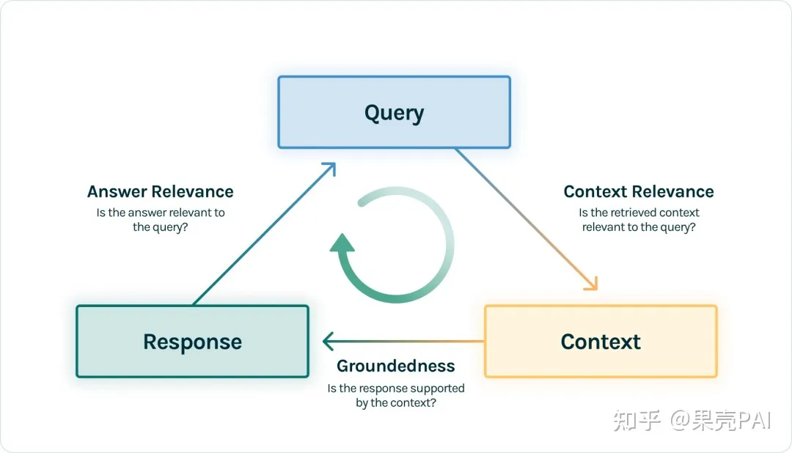
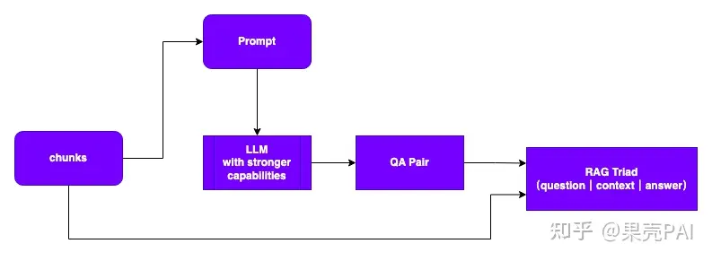
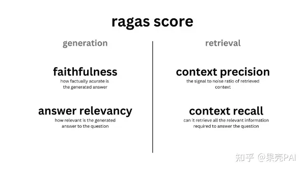
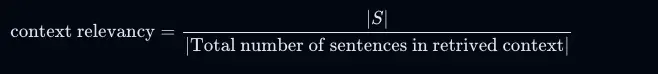
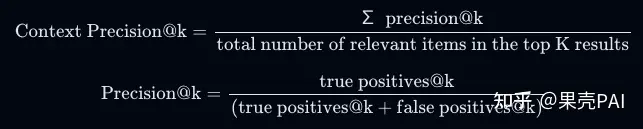
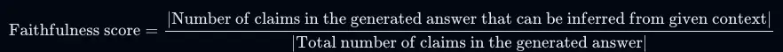
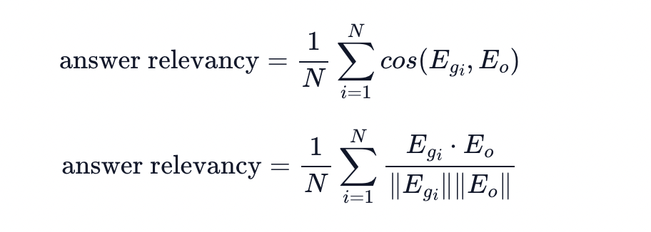

## RAG效果评估：Ragas使用自定义LLM

## 写在前面

如果你构建了RAG想应用于实际业务系统，那么你一定会非常关注「RAG应用的效果如何？」「如何测评？」，本文会为你提供一套完整方案。

通用RAG应用的搭建可以参考之前的文章：

- [果壳PAI：一文搞懂大模型RAG应用（附实践案例）](https://zhuanlan.zhihu.com/p/668082024)
- [果壳PAI：大模型记忆的海马体——向量数据库](https://zhuanlan.zhihu.com/p/673543191)

通用RAG应用搭建过程中会涉及到很多问题点，例如向量数据库选择、Embedding模型选择、chunk参数配置（chunk大小、chunk重合比例等）、相关性阈值、Top-K等等。

本文主要侧重**RAG测评方案**，以及如何在开源工具RAGAS基础上**使用自定义的LLM进行测评。**

## 1、RAG评估方案

RAG整个环节主要涉及到三部分内容：输入query、检索到的上下文context、LLM的回答Response，这也是 RAG 整个过程中最重要的三元组，它们之间两两相互牵制。因此可以通过**检测三元组之间两两元素的相关度**，来评估RAG 应用的效果：



- **Context Relevance:** 衡量检索的质量的指标，主要衡量召回的 chunk 支持 Query 的程度。如果该得分低，反应出了召回了太多与Query 问题无关的内容，这些错误的召回知识会对 LLM 的最终回答造成一定影响。
- **Groundedness:** 衡量 LLM 的 Response 遵从召回的 Context 的程度的指标。如果该得分低，反应出了 LLM 的回答不遵从召回的知识，那么回答出现幻觉的可能就越大。
- **Answer Relevance:** 衡量最终的 Response 回答对 Query 提问的相关度指标。如果该得分低，反应出了可能答不对题。

### 1.1 如何构造评估数据集？

在构建完RAG应用后，我们一般只有分段后文本chunks，那么如何只基于chunks构造我们的评测数据集呢？答案是——**利用大模型进行QA挖掘。**

当然我们可以使用一些开源工具，也可以自己设计Prompt实现，这个过程并不困难，可以简单认为是一个「Prompt工程」过程。但无论是怎么做，其原理大致如下：



### 1.2 选择评测指标

常用评测指标如下：



- 上下文相关性（**Context Relevancy**）

该指标衡量召回的Context 支持 Query 的程度。如果该得分低，反应出了召回了太多与Query 问题无关的内容，这些错误的召回知识会对 LLM 的最终回答造成一定影响。在RAGAS中，是从句子粒度统计相关性。计算公式如下：



- 上下文召回率（**Context Recall**）

该指标衡量检索到的Context与标注answer答案一致的程度，被视为基本事实。它是基于基本事实和检索到的Context的，值的范围在0到1之间，值越高表示性能越好。计算公式如下：


- 上下文精确度（**Context Precision**）

该指标衡量检索到的Context中存在的所有基本事实相关chunks的排名是否更高的指标。理想情况下，所有相关chunk都必须出现在最高级别。该度量是使用query和context计算的，值在0到1之间，其中得分越高表示精度越高。计算公式如下：



- 忠实度（**Faithfulness/Groundedness**）

该指标衡量生成的answer与给定context的事实一致性。它是根据answer和检索到的context来计算的。答案按比例缩放到（0,1）范围，越高越好。计算公式如下：



- 答案相关性（**Answer Relevancy**）

该指标衡量生成的answer与给定提示的相关性。不完整或包含冗余信息的答案得分较低。该度量是使用query和answer计算的，值在0到1之间，其中得分越高表示相关性越好。



## 2、使用RAGAS评估

### 2.1 数据封装

Ragas测评需要使用标准的Datasets数据格式，因此需要提前将自定义数据集进行封装

```python
from datasets import Dataset

questions, answers, contexts, ground_truths = [], [], [], []
# 填充自己的数据内容
evalsets = {
              "question": questions,
              "answer": answers,
              "contexts": contexts,
              "ground_truths": ground_truths
            }
evalsets = Dataset.from_dict(evalsets)
```

### 2.2 指标选择与一键测评

选择需要的评测指标，并制定数据集进行测评，Ragas默认使用ChatGPT，需要提前配置openai-Key

```python
import os
from ragas import evaluate

os.environ["OPENAI_API_KEY"] = "your-openai-key"
from ragas.metrics import (
    answer_relevancy,
    faithfulness,
    context_recall,
    context_precision,
)

result = evaluate(
    evalsets,
    metrics=[
        context_precision,
        faithfulness,
        answer_relevancy,
        context_recall,
    ],
)

df = result.to_pandas()
df.head()
```

## 3、RAGAS使用自定义LLM

Ragas默认使用ChatGPT，用过的都懂，由于各方面原因，使用受到了限制....。那么如何使用自己的LLM在Ragas框架下测评呢?

直接上代码～

```python
# 以使用ERNIE-Bot为，使用qianfan-sdk先定义自己的模型
from langchain_community.chat_models import QianfanChatEndpoint
from ragas.llms import LangchainLLM
from langchain_community.embeddings import QianfanEmbeddingsEndpoint

chat = QianfanChatEndpoint(model=model, qianfan_ak=QIANFAN_AK, qianfan_sk=QIANFAN_SK, **model_kwargs)
v_llm = LangchainLLM(chat)

v_embeddings = QianfanEmbeddingsEndpoint(
               qianfan_ak=QIANFAN_AK,
               qianfan_sk=QIANFAN_SK,
           )

# 然后重新指定各评价指标使用的llm
from ragas import evaluate
from ragas.metrics import (
    answer_relevancy,
    faithfulness,
    context_recall,
    context_precision,
)

faithfulness.llm = vllm
answer_relevancy.llm = vllm
answer_relevancy.embeddings = v_embeddings

context_recall.llm = vllm
context_precision.llm = vllm

# 重新一键式测评
result = evaluate(
    evalsets,
    metrics=[
        context_precision,
        faithfulness,
        answer_relevancy,
        context_recall,
    ],
)

df = result.to_pandas()
df.head()
```

## 参考链接

- [https://www.trulens.org/trulens_eval/core_concepts_rag_triad/](https://link.zhihu.com/?target=https%3A//www.trulens.org/trulens_eval/core_concepts_rag_triad/)
- [https://github.com/explodinggra](https://link.zhihu.com/?target=https%3A//github.com/explodinggradients/ragas)
- [🚀 Get Started | Ragas](https://docs.ragas.io/en/latest/getstarted/index.html)
