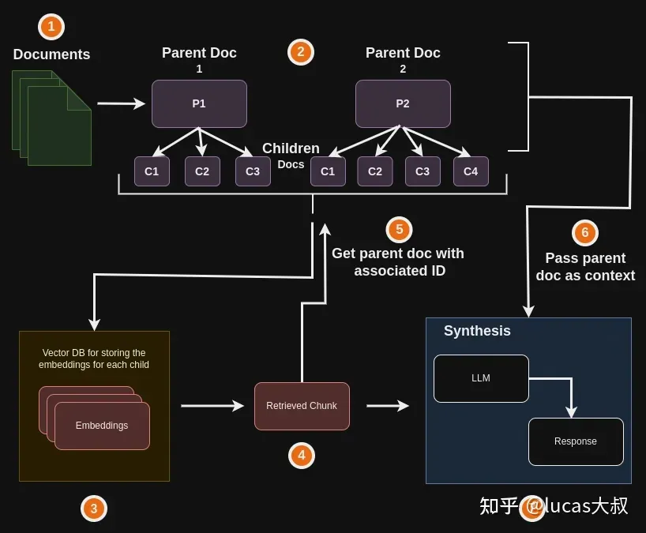
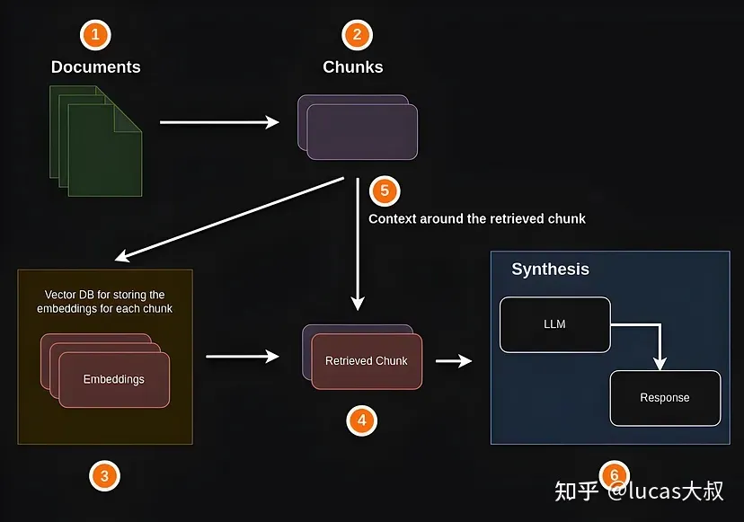
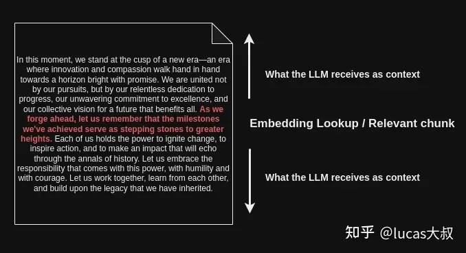

## 基础RAG管道创建

## 背景

当在RAG系统中构建知识库时，需要将文本进行分割、embedding入库，检索到的文本质量对大模型生成答案的质量具有至关重要的影响。检索到的与回答用户query相关的文本质量越高，得到的答案就越有根据和相关性，也更容易阻止LLM生成错误或不是基于特定领域知识的答案。作为RAG管道的第一个环节，其他环节都取决于检索到文本的质量和检索机制上。本文介绍了一种称之为small-to-big retrieval的高级检索技术。

## Small-to-Big Retrieval

在构建RAG管道时，我们通常要把特定领域的文本分割成更小的chunk或片段。假设每个chunk或片段包含200个单词，用户问了一个问题，而这个问题只用200个单词中的一行句子就可以回答，chunk中其余的文本可能会使检索器很难找到与回答用户问题最相关的那句话。有时候分割的chunk会有多达1000多个单词，在其中发现一句相关的句子就像大海捞针一样，是个非常大的挑战。

那怎么解决这种问题呢？本文引入了“Small-to-Big Retrieval”技术。在传统的RAG应用程序中，我们在chunk上执行搜索检索，并将相同的chunk传递给LLM来合成或生成答案。如果我们将检索到的chunk和传递给LLM的chunk两者解耦，这不是更好吗？也就是说，我们有一段文本或chunk用于搜索，另一段chunk用于生成答案。用于搜索的chunk比用于合成或生成最终答案的chunk小得多，以避免出现繁琐的问题。

下面我们举个栗子来说明“Small-to-Big Retrieval”技术。取一个100个单词的chunk，对于这个chunk创建10个较小的chunk，每个chunk10个单词（大致为一个句子）。我们将使用这10个较小的chunk来进行搜索，以找到与回答用户问题最相关的句子。当用户提问时，我们可以很容易地从10个较小的chunk中找到最相关的句子。换言之，直接切入正题，不浪费非必要的操作。此外，基于embedding的检索在较小的文本大小下效果最好。chunk大小越小，嵌入后就越准确地反映其语义。

从10个较小的句子中找到最相关的句子后该怎么办？一种直接的想法是把它直接给到LLM，根据检索到的最相关的句子合成一个响应。这样做是可行的，但LLM获取不到足够的上下文，容易输出幻觉。因为只把最相关的较小chunk传给LLM，而缺少必要的上下文，它会自行填补相关的知识空白和对整个数据的理解，这就有可能生成与事实不相符的答案。

解决这个问题的一种方法是让较小的chunk与父chunk相关，这样LLM将有更多的上下文来作为答案的依据，而不是试图生成自己的幻觉信息。换言之，10个单词的每个较小chunk将与100个单词的较大chunk相关，并且当给定的较小chunk（10个单词chunk）被识别为与回答用户问题相关时，父chunk（100个单词chunk）将被检索并被发送到LLM。

这就是“Small-to-Big”检索技术背后的全部思想，而且效果非常好。下面将介绍两种类型的“Small-to-Big ”检索。

## “Small-to-Big ”检索

### **Parent Document Retrieval**

首先检索与回答查询最相关的较小数据段，然后使用它们相关的父标识符访问并返回将作为上下文传递给LLM的较大父chunk。在LangChain中可以通过 ***ParentDocumentRetriever*** 来实现。

### Sentence Window Retrieval

Sentence Window Retrieval首先检索与回答查询最相关的特定句子，然后返回该句子周围更多的文本，为LLM提供更广泛的上下文作为其响应的基础。

## 创建基础RAG管道

此处进入实践环节，展示如何利用 LlamaIndex 创建RAG应用。以下是基础RAG管道的简单图表展示：

