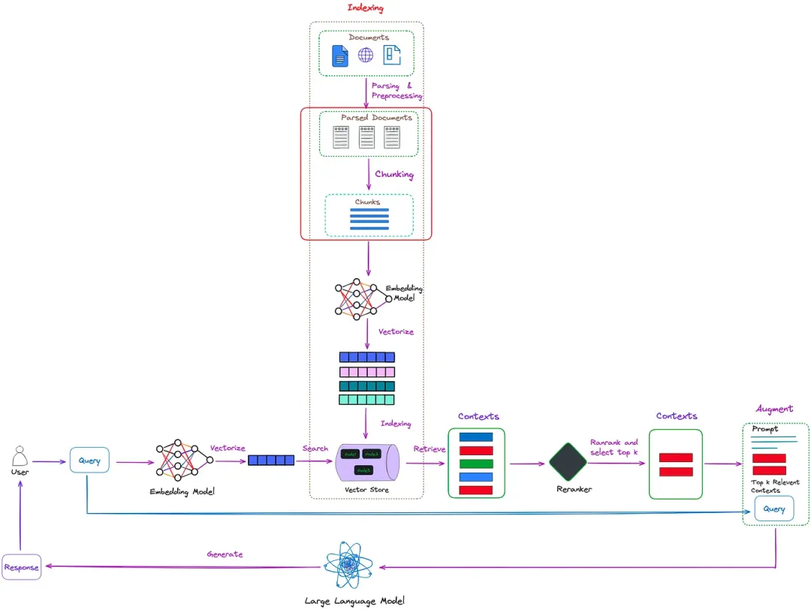
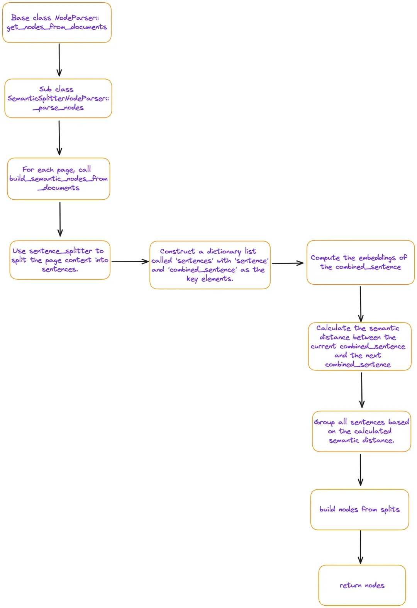
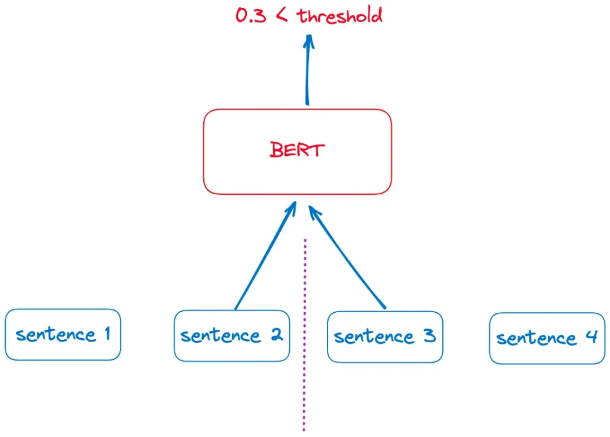
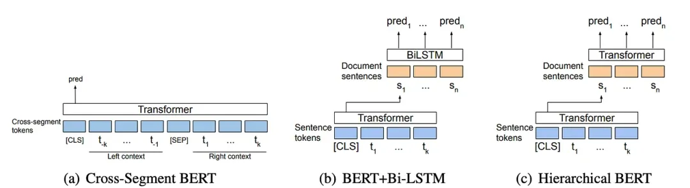
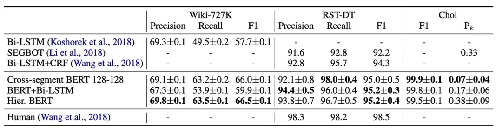
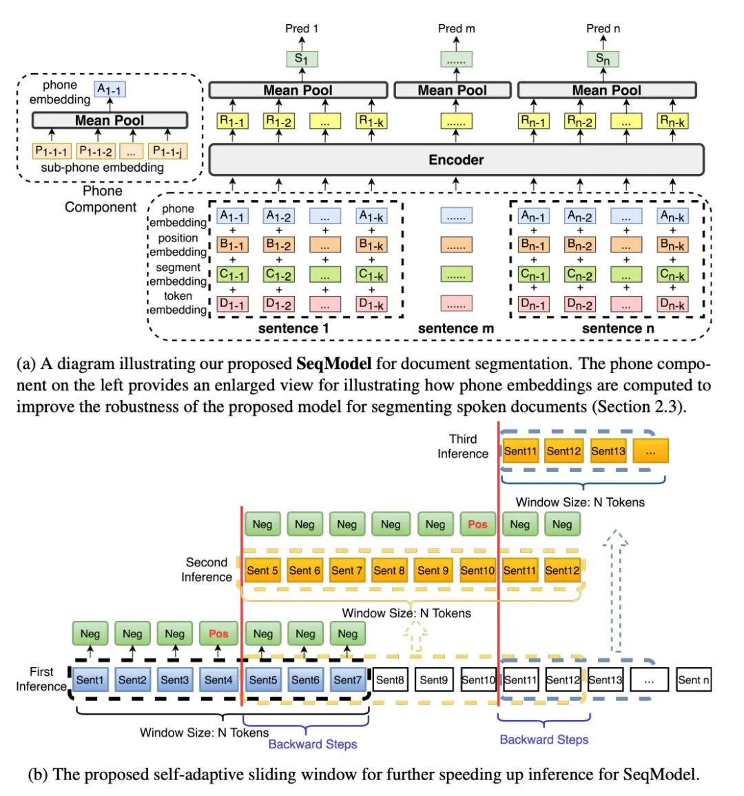

# RAG系列05：基于语义的Chunk分割

RAG中，在读取了文件之后，最主要的任务是把这些数据拆分成更小的 chunk 片段，随后将这些特征进行 embedding 以表达它们的语义。在 RAG 中，这一过程的位置如下图所示。



最常见的分块方法是基于规则的，采用了诸如固定分块大小或相邻分块重叠等技巧。对于多级文档，我们可以使用 Langchain 提供的 RecursiveCharacterTextSplitter。它允许我们定义多级分隔符。

然而，在实际应用中，由于预定义规则（如分块大小或重叠部分的大小）的刻板，基于规则的分块方法很容易导致诸如检索上下文不完整或分块过大含有噪声等问题。因此，在分块方面，**最优雅的方法显然是基于语义进行分块**。**语义分块的宗旨是确保每个分块尽可能包含语义上独立的信息。**

本文将探讨语义分块的方法，我们将介绍三种类型的方法：

- 基于 embedding 的方法

- 基于模型的方法

- 基于大型语言模型（LLM）的方法

# Embedding-based methods

LlamaIndex 和 Langchain 都提供了基于嵌入的语义分块器。以 LlamaIndex 为例，核心代码流程为：

```python
# load documents
dir_path = "YOUR_DIR_PATH"
documents = SimpleDirectoryReader(dir_path).load_data()

embed_model = OpenAIEmbedding()
splitter = SemanticSplitterNodeParser(
 buffer_size=1, breakpoint_percentile_threshold=95, embed_model=embed_model
)

nodes = splitter.get_nodes_from_documents(documents)
```

对 semantic_splitter.py 文件中的流程进行跟踪，可以发现其主要流程为：



- `sentence`：当前的句子

- `index`：当前句子的序号

- `combined_sentence`：一个滑动窗口，默认包含`[index - self.buffer_size, index, index + self.buffer_size]`这三个句子（通常，`self.buffer_size = 1`）。这个窗口是用来计算句子之间的语义相关性的。将前后的句子结合起来，目的是为了减少噪声，更好地捕捉连续句子之间的关系。

- `combined_sentence_embedding`：句子的 embedding 向量

通过以上分析，我们可以看出，基于嵌入的语义分块本质上是通过一个滑动窗口（`combined_sentence`）来计算相似度。那些相邻并且满足阈值的句子会被归为一个分块。

实验表明，基于 embedding 的分块方法产出的结果似乎有些“粗犷”。而且对源代码的分析表明此方法是建立在页面基础之上的，对于跨越多页的内容分块问题，它并没有直接给出答案。在很大程度上，embedding 方法的效能与所选用的嵌入模型息息相关。至于它的实际表现如何，还需经过时间的考验和进一步的评估。

# 基于模型的方法

## Naive BERT

BERT 的预训练过程中包含了一个二元分类任务——下一句预测（NSP），旨在让模型学习两个句子之间的关系。在这个过程中，BERT 会同时接收两个句子作为输入，并预测第二个句子是否紧随第一个句子。

我们可以根据这个原理设计一个简单的分块方法。对于一篇文档，首先将其拆分成独立的句子。然后，通过滑动窗口的方式，将相邻的两个句子送入 BERT 模型进行 NSP 判断，如下图所示：



这种方法的一个优点是，它可以直接使用，无需进行额外的训练或微调。然而，这种方法在确定文本分割点时，只考虑了相邻的句子，而忽略了更远距离段落的信息。此外，这种方法的预测效率也相对较低。

## Cross Segment Attention

论文 《Text Segmentation by Cross Segment Attention》[1]提出了三种基于跨片段注意力的模型，如下图所示：



，以预测每个句子是否为文本分割边界。

这三种模型取得了最先进的结果，结果如下图所示：



然而，到目前为止，只找到了这篇论文的训练实现[2]。尚未发现可供推理使用的公开模型。因此要将它们应用到实际的文本分割任务中，还需要自己动手训练模型。

## SeqModel

跨片段模型独立地向量化每个句子，没有考虑到更广泛的上下文信息。论文 《Sequence Model with Self-Adaptive Sliding Window for Efficient Spoken Document Segmentation》[3]提出了进一步的改进，即 SeqModel。SeqModel 利用 BERT 同时编码多个句子，在进行句子向量计算之前，建模了更长上下文内的依赖关系。然后，它预测每个句子之后是否会发生文本分割。此外，这个模型采用了自适应性滑动窗口方法来提高推理速度，同时不牺牲准确性。SeqModel 的示意图如下图所示。



```python
from modelscope.outputs import OutputKeys
from modelscope.pipelines import pipeline
from modelscope.utils.constant import Tasks

p = pipeline(
 task = Tasks.document_segmentation,
 model = 'damo/nlp_bert_document-segmentation_english-base'
)

result = p(documents='We demonstrate the importance of bidirectional pre-training for language representations. Unlike Radford et al. (2018), which uses unidirectional language models for pre-training, BERT uses masked language models to enable pretrained deep bidirectional representations. This is also in contrast to Peters et al. (2018a), which uses a shallow concatenation of independently trained left-to-right and right-to-left LMs. • We show that pre-trained representations reduce the need for many heavily-engineered taskspecific architectures. BERT is the first finetuning based representation model that achieves state-of-the-art performance on a large suite of sentence-level and token-level tasks, outperforming many task-specific architectures. Today is a good day')

print(result[OutputKeys.TEXT])
```

总的来说，基于模型的语义分块方法仍有很大的提升空间。作者的建议的一种改进方法是创建针对特定项目的训练数据，以进行领域微调。

# LLM-based methods

论文 《Dense X Retrieval: What Retrieval Granularity Should We Use?》[5]介绍了一种新的检索单元，称为 proposition。proposition 被定义为文本中的原子表达式，每个表达式都封装了一个独特的事实，并以简洁、自包含的自然语言格式呈现。通过构建 prompt 并与 LLM 结合可以来实现这一点。LlamaIndex 和 Langchain 都已实现了相关算法，LlamaIndex 的实现思想是使用论文中提供的 prompt 来生成 proposition：

```python
Decompose the "Content" into clear and simple propositions, ensuring they are interpretable out of
context.
1. Split compound sentence into simple sentences. Maintain the original phrasing from the input
whenever possible.
2. For any named entity that is accompanied by additional descriptive information, separate this
information into its own distinct proposition.
3. Decontextualize the proposition by adding necessary modifier to nouns or entire sentences
and replacing pronouns (e.g., "it", "he", "she", "they", "this", "that") with the full name of the
entities they refer to.
4. Present the results as a list of strings, formatted in JSON.

Input: Title: ¯Eostre. Section: Theories and interpretations, Connection to Easter Hares. Content:
The earliest evidence for the Easter Hare (Osterhase) was recorded in south-west Germany in
1678 by the professor of medicine Georg Franck von Franckenau, but it remained unknown in
other parts of Germany until the 18th century. Scholar Richard Sermon writes that "hares were
frequently seen in gardens in spring, and thus may have served as a convenient explanation for the
origin of the colored eggs hidden there for children. Alternatively, there is a European tradition
that hares laid eggs, since a hare’s scratch or form and a lapwing’s nest look very similar, and
both occur on grassland and are first seen in the spring. In the nineteenth century the influence
of Easter cards, toys, and books was to make the Easter Hare/Rabbit popular throughout Europe.
German immigrants then exported the custom to Britain and America where it evolved into the
Easter Bunny."
Output: [ "The earliest evidence for the Easter Hare was recorded in south-west Germany in
1678 by Georg Franck von Franckenau.", "Georg Franck von Franckenau was a professor of
medicine.", "The evidence for the Easter Hare remained unknown in other parts of Germany until
the 18th century.", "Richard Sermon was a scholar.", "Richard Sermon writes a hypothesis about
the possible explanation for the connection between hares and the tradition during Easter", "Hares
were frequently seen in gardens in spring.", "Hares may have served as a convenient explanation
for the origin of the colored eggs hidden in gardens for children.", "There is a European tradition
that hares laid eggs.", "A hare’s scratch or form and a lapwing’s nest look very similar.", "Both
hares and lapwing’s nests occur on grassland and are first seen in the spring.", "In the nineteenth
century the influence of Easter cards, toys, and books was to make the Easter Hare/Rabbit popular
throughout Europe.", "German immigrants exported the custom of the Easter Hare/Rabbit to
Britain and America.", "The custom of the Easter Hare/Rabbit evolved into the Easter Bunny in
Britain and America." ]

Input: {node_text}
Output:
```

对应的中文为：

```python
将“内容”分解为清晰简单的命题，确保它们在脱离上下文的情况下也能被理解。

1. 将复合句拆分为简单句。尽可能保持输入原文的措辞。
2. 对于任何带有附加描述信息的命名实体，将此信息分离成其独有的命题。
3. 通过为名词或整个句子添加必要的修饰语，并将代词（例如，“它”、“他”、“她”、“他们”、“这个”、“那个”）替换为它们所指实体的全名，使命题脱离上下文。
4. 以JSON格式的字符串列表呈现结果。

输入：标题：欧斯特雷。章节：理论与解释，与复活节野兔的联系。内容：复活节野兔（Osterhase）最早的证据记录于1678年德国西南部，由医学教授乔治·弗兰克·冯·弗兰肯瑙记录，但在18世纪之前，德国其他地区对此并不了解。学者理查德·塞尔蒙写道：“春天在花园里经常看到野兔，因此它们可能为孩子们藏在花园里的彩色鸡蛋提供了一个方便的解释。另外，有一个欧洲传统，认为野兔下蛋，因为野兔的抓痕或形态和一种叫做 lapwing 的鸟的巢非常相似，而且两者都出现在草地上，并且都是在春天首次被看到。在19世纪，复活节卡片、玩具和书籍的影响使得复活节野兔/兔子在整个欧洲流行起来。德国移民随后将这一习俗带到英国和美国，在那里它演变成了复活节兔子。”
输出：[ "复活节野兔最早的证据在1678年由乔治·弗兰克·冯·弗兰肯瑙在德国西南部被记录下来。", "乔治·弗兰克·冯·弗兰肯瑙是一位医学教授。", "复活节野兔的证据在德国其他地区直到18世纪才为人所知。", "理查德·塞尔蒙是一位学者。", "理查德·塞尔蒙提出了关于复活节期间野兔与这一传统可能联系的假设。", "春天在花园里经常看到野兔。", "野兔可能为孩子们藏在花园里的彩色鸡蛋提供了一个方便的解释。", "有一个欧洲传统认为野兔下蛋。", "野兔的抓痕或形态和一种叫做 lapwing 的鸟的巢非常相似。", "野兔和 lapwing 的鸟巢都出现在草地上，并且都是在春天首次被看到。", "在19世纪，复活节卡片、玩具和书籍的影响使得复活节野兔/兔子在整个欧洲流行起来。", "德国移民将复活节野兔/兔子的习俗带到了英国和美国。", "复活节野兔/兔子的习俗在英国和美国演变成了复活节兔子。" ]

输入：{node_text}
输出：
```

使用llamaIndex实现：

```python

```

总体而言，这种利用 LLM 构建命题的切块方法已经实现了更为精细的文本块。它与原始节点形成了一种从小到大的索引结构，为语义切块提供了一种新颖的思路。然而，这种方法依赖于 LLM，成本相对较高。

# 结论

相对于使用特定的规则进行块切分，语义切分可以在一定程度上保留上下文关系。因此召回的内容也会相对更全面，更有助于得到优质的回答。

### 参考资料

[1]《Text Segmentation by Cross Segment Attention》: *https://arxiv.org/abs/2004.14535*

[2] 训练实现: *https://github.com/aakash222/text-segmentation-NLP/*

[3]《Sequence Model with Self-Adaptive Sliding Window for Efficient Spoken Document Segmentation》: *https://arxiv.org/abs/2107.09278*

[4] ModelScope框架: *https://github.com/modelscope/modelscope/*

[5]《Dense X Retrieval: What Retrieval Granularity Should We Use?》: *https://arxiv.org/pdf/2312.06648.pdf*
