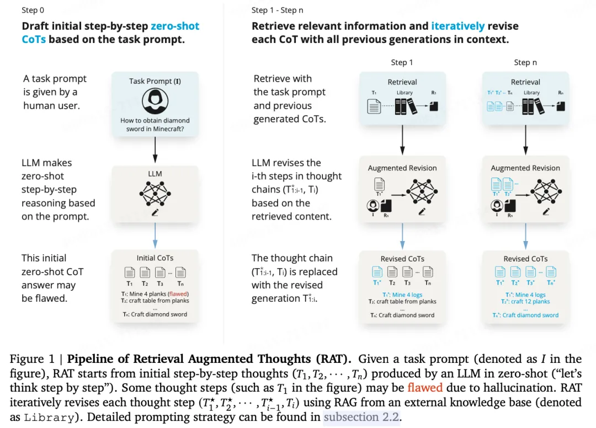
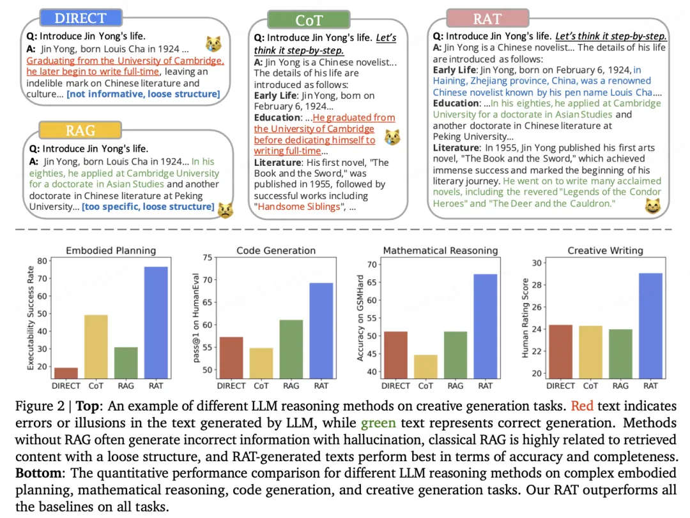
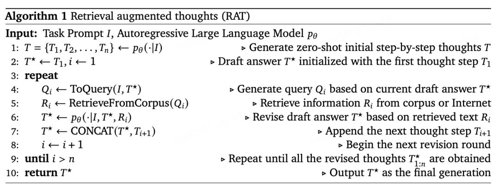
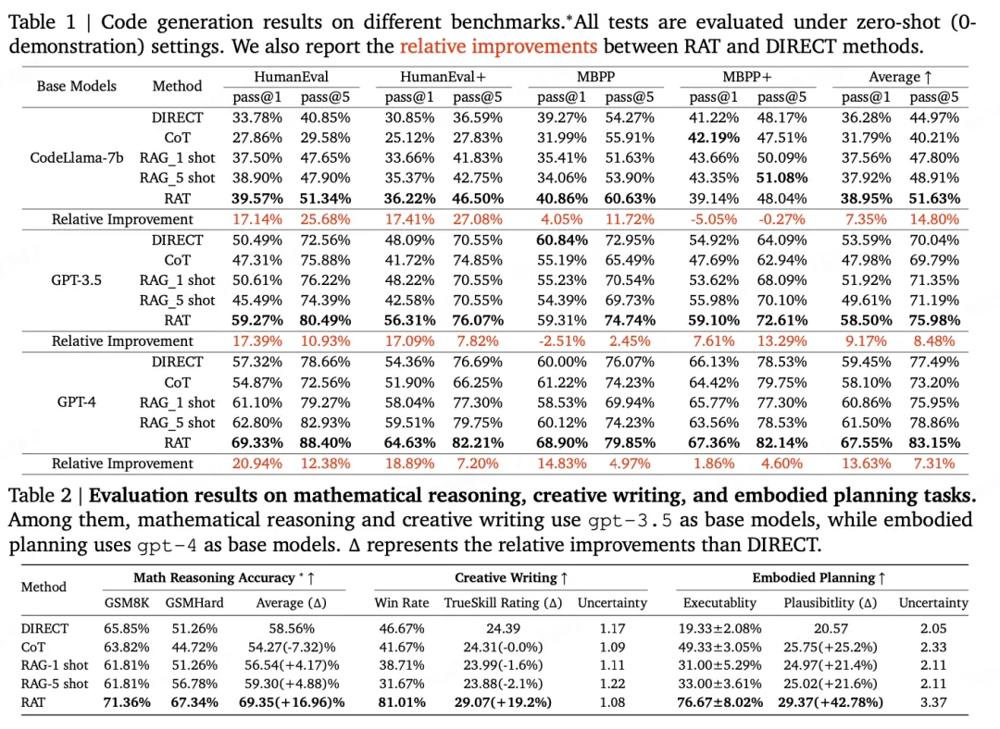
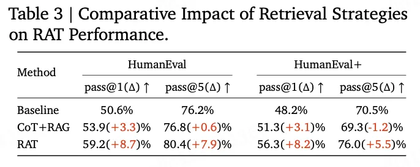
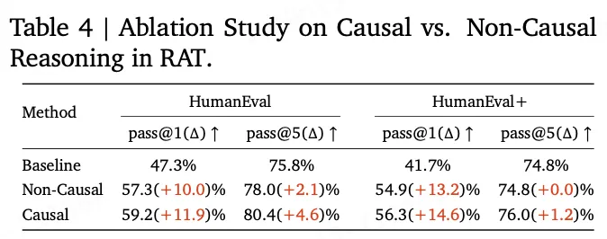
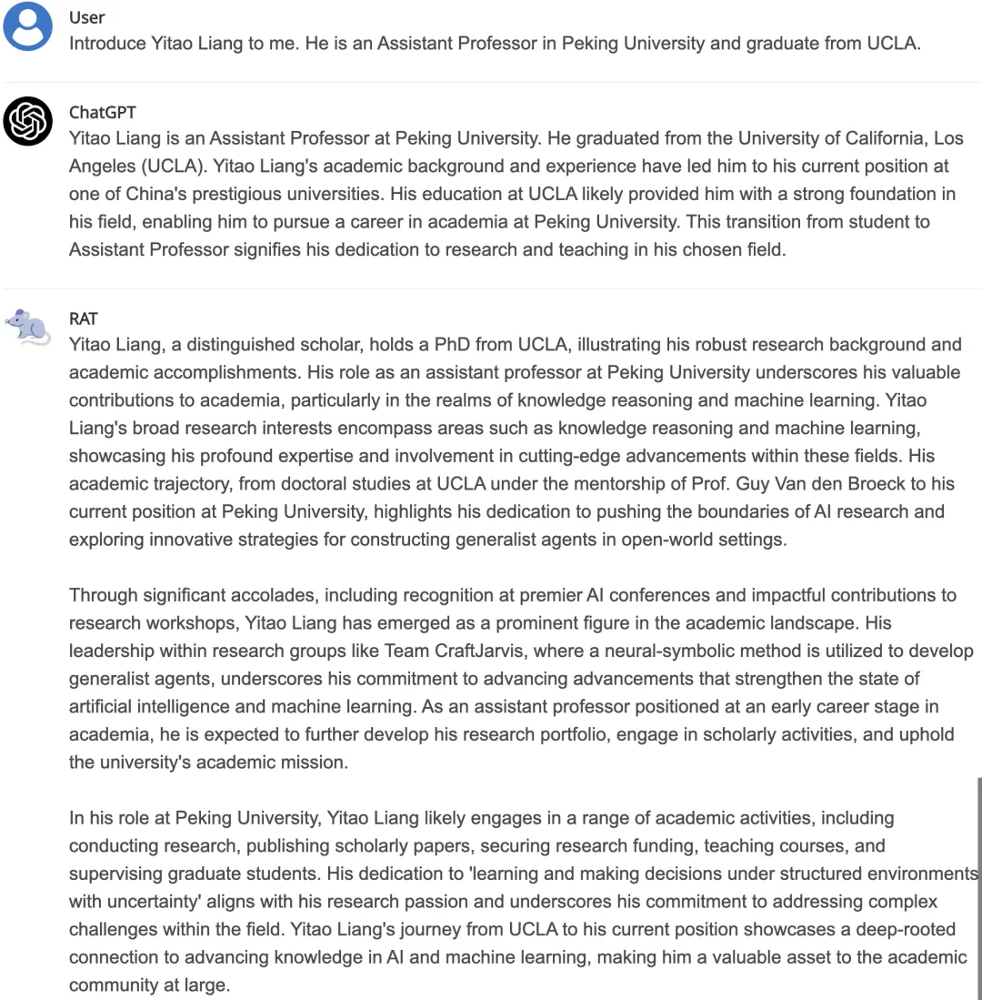

# RAG论文┃RAT=RAG+CoT

本文主要对论文《RAT: Retrieval Augmented Thoughts Elicit Context-Aware Reasoning in Long-Horizon Generation》[1]进行讲解。*目前网络上可以找到一些相关介绍，但是大多只介绍了思路，而且主要靠 GPT 翻译，比较生涩，不能很细致地了解所有原理。因此这里做一个详细的描述。*

总的来说，本文将 CoT 和 RAG 结合，提出了 RAT。首先由 CoT 生成多个 steps，然后利用 RAT 对每个 step 中的信息进行纠正，以防止长文本生成中出现的幻觉问题。个人理解，RAT 更适用于开放性+长文本生成这种场景。由于其流程首先通过 LLM 进行初步回答再进行纠正，基于知识库的小片段问答不是很友好，本质原因有以下两点：

- 小片段问答往往有着唯一答案，强依赖于知识库具体内容，而 LLM 没有相关知识，在这个问题上甚至微调都不一定能很好地起作用

- 迭代过程耗时增大。对于  个 steps，需要访问  次 LLM

当然，上述的局限不是 RAT 的问题，RAT 本来宣称的就是在长文本生成中具备减轻幻觉的能力。如何将此能力融入到问答场景上来，这一点值得借鉴和思考的。

# 摘要

本文研究如何在信息召回的情况下迭代地修复 CoT，以提高大型语言模型在长文本生成任务中的推理和生成能力，同时大幅减轻幻觉现象。作者提出了 retrieval-augmented thoughts (RAT)。翻译过来比较拗口，贴一下原文吧：

> revises each thought step one by one with retrieved information relevant to the task query, the current and the past thought steps, after the initial zero-shot CoT is generated.

总结来说，利用 CoT 生成多个步骤，然后在每个步骤中加入 RAG 以减少模型幻觉并提高效果。即：*RAG+CoT=RAT*。

实验结果表明：将 RAT 应用于 GPT-3.5、GPT-4 和 CodeLLaMA-7b，可以提升性能；平均而言，代码生成能力提升了 13.63%，数学推理能力提升了 16.96%，创意写作能力提升了 19.2%，具体任务规划能力提升了 42.78%。

# Introduction

当前，LLM 和 CoT 结合已经在很多任务上取得了不错的成果。学者指出：LLM 的回答和中间推理步骤可能会出现幻觉。在 zero-shot CoT 和长文本生成（long-horizon generation）中，比如代码生成、任务规划、数学推理等，这个问题愈发明显。在完成这些任务时，中间思维的事实有效性可能是至关重要的。

当前已经有一些技术已经可以用于减轻这个问题，比如 RAG 中利用检索到的信息来促进更加基于事实的推理。本文探讨了如何将 RAG 与复杂的长期推理相结合。在此之前，我们有一个直觉就是，*通过外部知识的帮助（RAG），可以减轻中间推理过程（CoT）中的幻觉。* 我们提出的提示策略，即检索增强思维（RAT），如图 1 所展示。



本文的 RAT 策略包含两个关键步骤。

- 首先，由 LLM 生成的初始零样本 CoT。由于模型幻觉，其中的某些步骤可能是错误的。

- 其次，本文设计了一个逐步的方法，而不是一次性检索和修正整个 CoT 并生成最终响应，LLM 按照 CoT（一系列子任务）逐步生成响应，只有当前的思维步骤将基于检索到的信息、当前和过去的 CoT 以及任务提示进行修正。这种策略可以类比为人类推理过程：在解决复杂的长期问题时，我们可以利用外部知识逐步调整我们的思考。

本文在一系列具有挑战性的长期任务上评估了 RAT，包括代码生成、数学推理、具身任务规划以及创意写作。本文使用了不同规模的几个 LLM：GPT-3.5（Brown 等人，2020），GPT-4（OpenAI，2023），CodeLLaMA-7b（Rozière 等人，2023）。结果表明，将 RAT 与这些 LLM 结合使用，相比于传统的 CoT 提示和 RAG 方法，具有显著的优势。特别是，本文在所选任务上观察到了新的最高性能水平：

- 代码生成：HumanEval（+20.94%），HumanEval+（+18.89%），MBPP（+14.83%），MBPP+（+1.86%）

- 数学推理问题：GSM8K（+8.36%），GSMHard（+31.37%）

- Minecraft 任务规划（在可执行性上提高了 2.96 倍，在合理性上提高了+51.94%）

- 创意写作（在人类评分上提高了+19.19%）。

本文额外的消融研究进一步证实了 RAT 的两个关键组成部分的作用：使用 RAG 修订 CoT 以及逐步修订与生成。这项工作揭示了 LLM 如何在零样本的情况下，借助外部知识修正其推理过程，正如人类所做的那样。

# 检索增强的思维

我们的目标是支持在利用大型语言模型（LLM）时的长推理和生成，同时减少幻觉的发生。为了在长期任务上获得令人满意的表现，两个要素促进。然而，简单地结合这两者并不一定能带来改进。

1. 应该检索哪些相关信息；

2. 如何有效地利用相关事实信息来修正推理步骤。为了更好地理解本文的方法以及为什么此方法能够解决这两个问题，我们首先简要介绍了 RAG 和 CoT 的概念。
   
   

*RAG*: 旨在解决大型语言模型生成虚构事实的问题，通过提供从可信来源提取的相关文本，一般被用于问答（QA）任务。简单地说就是首先根据相关性找到和问题相关的内容，然后把相关的内容和用户问题拼接成 Prompt 交给大模型。然而，复杂的推理任务（例如，那些需要多步骤推理的任务）很难转化为有效的搜索查询，这导致在寻找相关文档时遇到挑战。传统上，RAG 一次性检索所有相关信息。然而，它忽略了一个事实，即很难预测在后续的推理和生成步骤中需要哪些“事实”或信息。任务提示本身几乎不足以为此提供足够的线索。

CoT：旨在提高 LLM 在需要复杂推理步骤的任务中的性能，例如多步骤的数学应用题。具体来说，CoT 提示不是直接让 LLM 生成正确答案，而是激励 LLM 首先输出中间推理步骤，这些步骤被称为“思维”。LLM 的这种行为可以通过 prompt 进行触发，比如著名的“Let's think step by step”），或者通过在类似任务中执行少量样本示例来触发。然而，由于没有对中间思维进行直接监督，LLM 可能会因为缺乏相关的领域知识而犯错误，或者受到虚构信息的偏差。

## RAT = RAG + CoT

我们的直觉是为了缓解上述提到的 CoT 提示和 RAG 的问题，本文将应用 RAG 来修订由 CoT 提示生成的每一个思维步骤。具体来说，对于一个任务提示 ，我们首先通过 zero-shot prompt 生成多个思考步骤 。在长文本生成任务中， 可以是中间推理步骤，例如代码生成中的带有注释的伪代码、创意写作中的文章大纲等。



但是这当中， 当中的思考（thoughts）可能是有问题的，比如存在模型幻觉。因此，我们在基于这些思考生成的最终回复是有偏差的，因此利用 RAG 对生成的 thought 进行纠正。具体来说，假设我们已经固定了之前的思维步骤，现在准备修订 ，我们首先将文本  转换为查询 ：

其中 ToQuery(·)可以是一个文本编码器或者是一个 LLM，它将任务提示 、当前以及过去的思维步骤  转换为一个可以被检索系统处理的查询 。

我们采用 RAG 使用  检索相关的文档 ，然后将这些文档前置到提示中以生成修订后的思维步骤 ：

最后，根据实际任务的不同，修订后的思维步骤  可以直接用作最终的模型响应。对于代码生成或创意写作等任务，LLM 将进一步被提示，以逐步从每个修订后的思维步骤生成完整的响应（代码，文章）。这里的公式，看的时候还挺迷糊的，实际执行时这只是利用 prompt 而已。

需要注意的是，在修订第  个思维步骤  时，我们不仅仅是使用当前步骤  或者完整的思维链  来为 RAG 产生查询，我们确保查询  是从当前思维步骤  和之前修订后的思维步骤  产生的，即本文采用因果推理来使用 RAG 修订思维步骤。

这允许通过不断查阅不同的参考文本来纠正原始思维步骤  中的错误，并确保推理的每一步都得到了最准确和相关信息支持，从而显著提高生成输出的质量和可靠性。

为什么这套方法被认为是有用的呢，我们认为有以下两个方面：

- 首了解复杂推理中将使用哪些信息的最直接方式是“观察”推理步骤。本文的方法利用了所有生成的思维步骤以及任务提示，为更有效的检索提供更多线索。

- 有些信息无法直接检索，特别是与困难复杂问题的最终答案相关的信息。相反，检索与假设更容易的中间问题相关的信息更为可行。得益于许多推理任务的组合性质，迭代检索过程可能也会更有效。

- 需要针对性地纠正潜在的虚构信息。使用 RAG 修订完整的 CoT 可能会导致在其他已经正确步骤中引入错误。逐个修订每一步可能更为可靠。

# Experiments

接下来作者进行了一系列实验来验证 RAT 方法，这些测试重点在于长文本生成和推理。本文采用了四组基准测试。

- 代码生成：包括 HumanEval、HumanEval+、MBPP 和 MBPP+。这些基准测试涵盖了广泛的编程问题，从简单的函数实现到更复杂的算法挑战，为评估生成能力提供了强大的测试平台。采用经典的通过率 pass@k 作为评估指标，其中  表示采样数量。

- 数学推理评估：在 GSM8K 和 GSM-HARD 数据集上进行的，这些数据集包含了成千上万的多步骤数学问题。采用准确率作为评估指标。

- 创意写作任务：评估 RAT 的多样性，包括调查、总结等，突显开放式文本生成不同方面。进行了人类评估计算 true_skill 评分。

- 实体规划任务（Embodied Planning）：在开放环境 Minecraft 上进行评估。一系列 100 个任务，从简单目标到具有挑战性的钻石目标，通过 MC-TextWorld 进行评估。在 MC-TextWorld 中计算计划执行成功率作为可执行性作为评估指标。类似创意写作任务，也进行了人类 elo 评分评估。

*基线方法（Baselines）*。为了建立一个全面和公平的比较环境，本文纳入了一系列基线方法。本文的基线包括原始的语言模型，称为 DIRECT，以及带有  个检索示例的检索增强生成（RAG）方法，实现在 single-shot（1 次）和 multi-shot（5 次）配置中。此外，本文考察了零样本 CoT（CoT）。对于不同的方法，使用相同的语言模型作为基础模型。

*RAG 设置*。RAT 利用检索增强生成方法的强大功能，这些方法通过整合外部知识源来提高语言模型的性能。具体来说，本文采用了 codeparrot/github-jupyter 数据集作为本文的主要搜索向量库，用于代码生成和数学推理任务。对于 Minecraft 中的具身规划任务，本文使用了 Minecraft Wiki1 和 DigMinecraft2 网站作为 LLMs 可访问的信息源。对于开放式的创意写作任务，本文使用 Google 在互联网上搜索查询。本文使用了 OpenAI 的 text-embedding-ada-002 API 服务，用于不同方法和基础模型的所有嵌入计算。

考虑到基准污染的风险（一个可能导致代码库包含正在评估的确切问题的解决方案的问题），本文采用了郭等人描述的严格预处理方法。



实验结果总结就是一句话：4 个实验结果表明了 RAT 很厉害，显著提高了生成上下文的准确性和效率。

## 消融实验



*对 RAT 中检索的消融研究。* 在这项消融研究中，本文探讨了不同的检索策略对 RAT 效能的影响，重点关注通过优化内容检索来提高生成输出的效果。表 3 中详细列出的实验结果表明，与基准方法相比，RAT 通过对检索查询的迭代精化取得了显著的进步。相比之下，CoT+RAG 通过使用语言模型输出的整个推理思维作为查询，旨在获得更广泛的内容理解。然而，RAT 引入了一种更动态的方法，通过使用不断修改的推理思维部分作为查询，这允许进行更集中和相关的信息检索过程。比较分析显示，在 HumanEval 和 HumanEval+ 基准的 pass@1 和 pass@5 指标上，RAT 超越了基准和 CoT+RAG 方法。特别是，在 HumanEval 基准中，RAT 在 pass@1 上比基准提高了 8.7 个百分点，在 pass@5 上提高了 7.9 个百分点，并在 HumanEval+ 基准中同样取得了令人印象深刻的增益。这些改进强调了 RAT 检索策略的有效性，它通过基于演变的推理思维和先前查询迭代精化后续查询，确保检索到高度相关的信息。这个过程不仅增强了检索到的信息的相关性，而且显著提高了最终生成输出的质量和准确性。结果牢固地确立了 RAT 动态检索方法在利用上下文细微差别来驱动更精确和有效的生成过程方面的优势。



*在 RAT 中对因果推理的消融研究。* 在这项消融研究中，本文系统地考察了因果推理和非因果推理方法对 RAT 系统性能的影响，以思维链作为基准。本文的发现揭示了在引入因果推理技术时生成能力的显著提升。具体来说，因果方法，它通过迭代进行推理和检索，在 HumanEval 和 HumanEval+ 基准上的 pass@1 和 pass@5 指标上都带来了显著的改进。例如，在 HumanEval 数据集上，因果方法在 pass@1 上比基准（CoT）高出 11.9 个百分点，在 pass@5 上高出 4.6 个百分点。这种方法与非因果方法形成对比，尽管后者也超越了基准，但它使用初始推理思维直接检索所有必要的步骤并生成最终答案。因果方法的优越性能强调了顺序推理和信息检索在提高生成输出的准确性和可靠性方面的价值。这种迭代过程可能有助于根据不断更新的上下文细化搜索和推理步骤，从而允许更精确和相关的信息检索，进而支持更准确的最终答案。这些结果牢固地确立了因果推理在长期问题解决任务中的有效性。

## RAT 鲁棒性

实验表明，RAT 的能力在诸多任务重进行了验证，包括代码生成、数学推理、创意写作和具身规划。这些任务的多样性强调了 RAT 的泛化能力，证明了它在高度多样化的挑战中具有稳健的性能。此外，本文的所有实验设置都是零样本进行的，没有为 RAT 设计特定任务的提示，而是使用了尽可能简单的提示来表达对所有方法的问题或指令。这种方法确保了 RAT 在开放结尾场景中的泛化能力。

本文评估的多样性进一步通过在不同容量的一系列语言模型上测试 RAT 得到增强。这包括 CodeLlama-7b、ChatGPT（gpt-3.5-turbo）以及更先进的 GPT-4（gpt-4）模型。值得注意的是，RAT 在不同规模的语言模型上保持了其泛化能力，在诸如 HumanEval 的代码生成任务基准上显示出改进。特别值得一提的是，在使用 GPT-4 时观察到了最大的改进，这归功于它从检索到的文本中进行上下文学习的卓越能力。在 MBPP+ 上，基于 CodeLlama-7b 的 RAT 显示出了性能下降。这种下降可能是由于较小语言模型的上下文学习能力有限。

对于数学推理任务，RAT 显示出了显著的相对改进，当应用于 GPT-3.5 模型时，总体平均改进了 18.44%。这种改进的趋势在使用 GPT-4 时持续存在，它从 DIRECT 到 RAT 实现了惊人的 10.26% 的相对改进。这些发现突显了 RAT 的鲁棒性及其在计算和创意任务范围内有效提升语言模型性能的能力。

# 总结

本文提出了检索增强思维（RAT），它将思维链（CoT）提示与检索增强生成（RAG）相结合，以应对具有挑战性的长期推理和生成任务。本文的关键思想包括使用 RAG 以思维作为查询来修订由 LLM 生成的零样本思维链，并通过因果方式逐步修订思维并生成响应。RAT 作为一种零样本提示方法，在具有挑战性的代码生成、数学推理、具身任务规划和创意写作任务上，已经证明了相较于普通的 CoT 提示、RAG 和其他基线方法的显著优势

# 流程细节探索

prompt 分为三个层面（直接用 GPT 翻译成中文了）：

- *生成初始答案（prompt1）*：虽然 CoT 说自己是"step-by-step"的，但实际上是单轮的。因此需要从单轮回答中解析出有哪些步骤/思考。这里用了一个 trick，在 prompt 中让 LLM 通过换行来输出不同的 step。

- *生成搜索查询（prompt2）*：这个的流程是总结出当前文本写了什么，然后根据总结的内容去检索相关知识。prompt2 相当于生成 RAG 的 input。

- *根据检索到的上下文修订答案（prompt3）*：在 prompt3 之前，会进行 RAG 得到相关内容，然后再根据相关的内容去修订当前回答。

```python
prompt1 = """
尝试用逐步的思考来回答这个问题\指令，并使答案更具结构化。
使用 `\n\n` 来将答案分成几个段落。
直接响应指令。除非被要求，否则不要在答案中添加额外的解释或介绍。
"""

prompt2 = """
我想验证给定问题的内容准确性，特别是最后几句话。
请用相应的问题总结内容。
这个总结将被用作必应搜索引擎的查询。
查询应该简短，但需要足够具体，以确保必应能够找到相关知识或页面。
您还可以使用搜索语法，使查询足够简短和清晰，以便搜索引擎能够找到相关的语言数据。
尽量使查询与内容中的最后几句话尽可能相关。
**重要**
直接输出查询。除非被要求，否则不要在答案中添加额外的解释或介绍。
"""

prompt3 = """
我想根据在维基百科页面上学到的相关文本来修订答案。
你需要检查答案是否正确。
如果你在答案中发现了错误，请修订答案使其更好。
如果你发现有些必要的细节被忽略了，请根据相关文本添加这些细节，以使答案更加可信。
如果你发现答案是正确的且不需要添加更多细节，请直接输出原始答案。
**重要**
尽量保持修订后答案的结构（多个段落及其子标题），使其更具结构性以便理解。
用 `\n\n` 字符分隔段落。
直接输出修订后的答案。除非被要求，否则在修订后的答案中不要添加额外的解释或声明。
"""
```

开源代码中 CraftJarvis/RAT[2] 有着一些工程上的处理（比如加了超时处理等），在此不详细展开。

最后，看一个具体的 case 对比 LLM 和 RAT，如下图所示。可以看出，RAT 的结果全面性更好，根据过程分析，其也能较好地避免幻觉。



### 参考资料

[1]《RAT》: *https://arxiv.org/abs/2403.05313*

[2] CraftJarvis/RAT: *https://github.com/CraftJarvis/RAT*
