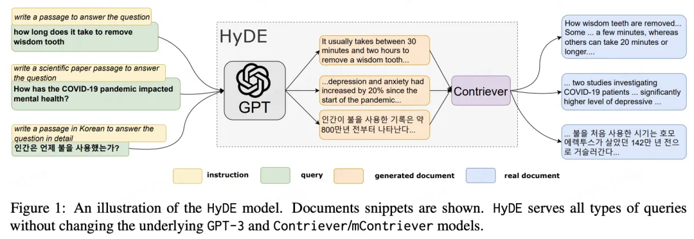

# RAG系列06：Query重写之HyDE

在检索增强生成（RAG）中，*用户原始查询的原始输入问题可能是措辞不准确或缺少语义信息。* 例如以下问题：今天回家的路上看到了美丽的风景，非常开心！想学习 python 该怎么办？这个请求中，前面的风景、开心等词语均为无关信息。会对真实的请求学习 python 产生干扰。如果直接搜索用户的请求，可能会产生不正确或无法回答的 LLM 响应。因此，有必要使得*用户查询的语义空间与文档的语义空间保持一致*。


从流程上来看，也就是用户的原始 query 和召回的内容之间不匹配。从工程角度来看，有两个角度可以解决此问题：

- 召回阶段：在用户问题不变的情况下如何更好地理解语义信息，找到更正确的相关文档

- 问题阶段：在后续召回流程不变的情况下，如何使得用于召回的输入更准确 比如 langchain 中，有 embedding 组件和 vectorstore 组件，但是没有 query 重写组件。因此只能从召回阶段入手。而如果是自己编码解决问题，只需要写一个函数进行 query 重写即可。

对于*用户查询的语义空间与文档的语义空间存在不一致* 还有另一种解释：我们在数据向量化入库的时候，是将原始文档的 chunk 进行 embedding 然后基于 embedding 入向量库。而 RAG 之所以成立，因为我们认为以下的三段式成立：

- 大前提：相似内容的具备相似的 embedding

- 小前提：用户请求 query 和相关的内容具备一定的相似性

- 结论：可以通过用户请求找到对应的内容

上述的推论总体而言是成立的，但是在具体问题上可能效果不太好。即*小前提上：query 和对应的相关内容（答案）可能只存在弱相关性，导致难以找到最相关的文档内容。*

查询重写（Query Reriting）是调整查询和文档语义的关键技术，当前有很多方法被提出用于解决此问题。*本文介绍 Query 重写之假设性文档嵌入，出自方法 HyDE[1] 。* 翻译为假设性文档嵌入，来源于 CMU 的以下文章：


根据前面所说的三段式推论，我们有一个直观的感受：因为有时候请求和回答相差较大，因此通过请求找回答比较难。但是，*我们可以先生成假回答，假回答和真回答虽然可能存在事实错误，但是会比较像，因此能更容易找到相关内容。* 这里的假回答，就是论文中提到的假设性文档（Hypothetical Document）。



核心的流程图如上所示，具体的过程可以分为以下几个步骤：

1. 对于用户 query，使用 LLM 生成  个假设性文档（回答），虽然生成的回答可能是错的，但是他们应当类似于真实的文档。此步骤相当于是利用 LLM 对 query 进行解释

2. 将假设性文档进行编码，得到 ，这里的  实际上就是 embedding，得到了  个向量

3. 计算向量的平均值，这里有两种方法，一种是对 k 个向量  进行平均，另一种是将查询  也作为一个可能的假设，求平均，即：

<svg xmlns="http://www.w3.org/2000/svg" role="img" focusable="false" viewBox="0 -1749.5 12431.1 2999" aria-hidden="true" style="vertical-align: -2.827ex; width: 28.125ex; height: 6.785ex; max-width: 300% !important;">
   <g stroke="currentColor" fill="currentColor" stroke-width="0" transform="matrix(1 0 0 -1 0 0)">
    <g data-mml-node="math">
     <g data-mml-node="mi">
      <path data-c="76" d="M173 380Q173 405 154 405Q130 405 104 376T61 287Q60 286 59 284T58 281T56 279T53 278T49 278T41 278H27Q21 284 21 287Q21 294 29 316T53 368T97 419T160 441Q202 441 225 417T249 361Q249 344 246 335Q246 329 231 291T200 202T182 113Q182 86 187 69Q200 26 250 26Q287 26 319 60T369 139T398 222T409 277Q409 300 401 317T383 343T365 361T357 383Q357 405 376 424T417 443Q436 443 451 425T467 367Q467 340 455 284T418 159T347 40T241 -11Q177 -11 139 22Q102 54 102 117Q102 148 110 181T151 298Q173 362 173 380Z">
      </path>
     </g>
     <g data-mml-node="mo" transform="translate(762.8, 0)">
      <path data-c="3D" d="M56 347Q56 360 70 367H707Q722 359 722 347Q722 336 708 328L390 327H72Q56 332 56 347ZM56 153Q56 168 72 173H708Q722 163 722 153Q722 140 707 133H70Q56 140 56 153Z">
      </path>
     </g>
     <g data-mml-node="mfrac" transform="translate(1818.6, 0)">
      <g data-mml-node="mn" transform="translate(1091.7, 676)">
       <path data-c="31" d="M213 578L200 573Q186 568 160 563T102 556H83V602H102Q149 604 189 617T245 641T273 663Q275 666 285 666Q294 666 302 660V361L303 61Q310 54 315 52T339 48T401 46H427V0H416Q395 3 257 3Q121 3 100 0H88V46H114Q136 46 152 46T177 47T193 50T201 52T207 57T213 61V578Z">
       </path>
      </g>
      <g data-mml-node="mrow" transform="translate(220, -686)">
       <g data-mml-node="mi">
        <path data-c="6B" d="M121 647Q121 657 125 670T137 683Q138 683 209 688T282 694Q294 694 294 686Q294 679 244 477Q194 279 194 272Q213 282 223 291Q247 309 292 354T362 415Q402 442 438 442Q468 442 485 423T503 369Q503 344 496 327T477 302T456 291T438 288Q418 288 406 299T394 328Q394 353 410 369T442 390L458 393Q446 405 434 405H430Q398 402 367 380T294 316T228 255Q230 254 243 252T267 246T293 238T320 224T342 206T359 180T365 147Q365 130 360 106T354 66Q354 26 381 26Q429 26 459 145Q461 153 479 153H483Q499 153 499 144Q499 139 496 130Q455 -11 378 -11Q333 -11 305 15T277 90Q277 108 280 121T283 145Q283 167 269 183T234 206T200 217T182 220H180Q168 178 159 139T145 81T136 44T129 20T122 7T111 -2Q98 -11 83 -11Q66 -11 57 -1T48 16Q48 26 85 176T158 471L195 616Q196 629 188 632T149 637H144Q134 637 131 637T124 640T121 647Z">
        </path>
       </g>
       <g data-mml-node="mo" transform="translate(743.2, 0)">
        <path data-c="2B" d="M56 237T56 250T70 270H369V420L370 570Q380 583 389 583Q402 583 409 568V270H707Q722 262 722 250T707 230H409V-68Q401 -82 391 -82H389H387Q375 -82 369 -68V230H70Q56 237 56 250Z">
        </path>
       </g>
       <g data-mml-node="mn" transform="translate(1743.4, 0)">
        <path data-c="31" d="M213 578L200 573Q186 568 160 563T102 556H83V602H102Q149 604 189 617T245 641T273 663Q275 666 285 666Q294 666 302 660V361L303 61Q310 54 315 52T339 48T401 46H427V0H416Q395 3 257 3Q121 3 100 0H88V46H114Q136 46 152 46T177 47T193 50T201 52T207 57T213 61V578Z">
        </path>
       </g>
      </g>
      <rect width="2443.4" height="60" x="120" y="220">
      </rect>
     </g>
     <g data-mml-node="mrow" transform="translate(4502, 0)">
      <g data-mml-node="mo">
       <path data-c="5B" d="M269 -1249V1750H577V1677H342V-1176H577V-1249H269Z">
       </path>
      </g>
      <g data-mml-node="munderover" transform="translate(583, 0)">
       <g data-mml-node="mo">
        <path data-c="2211" d="M60 948Q63 950 665 950H1267L1325 815Q1384 677 1388 669H1348L1341 683Q1320 724 1285 761Q1235 809 1174 838T1033 881T882 898T699 902H574H543H251L259 891Q722 258 724 252Q725 250 724 246Q721 243 460 -56L196 -356Q196 -357 407 -357Q459 -357 548 -357T676 -358Q812 -358 896 -353T1063 -332T1204 -283T1307 -196Q1328 -170 1348 -124H1388Q1388 -125 1381 -145T1356 -210T1325 -294L1267 -449L666 -450Q64 -450 61 -448Q55 -446 55 -439Q55 -437 57 -433L590 177Q590 178 557 222T452 366T322 544L56 909L55 924Q55 945 60 948Z">
        </path>
       </g>
       <g data-mml-node="TeXAtom" transform="translate(148.2, -1087.9) scale(0.707)" data-mjx-texclass="ORD">
        <g data-mml-node="mi">
         <path data-c="69" d="M184 600Q184 624 203 642T247 661Q265 661 277 649T290 619Q290 596 270 577T226 557Q211 557 198 567T184 600ZM21 287Q21 295 30 318T54 369T98 420T158 442Q197 442 223 419T250 357Q250 340 236 301T196 196T154 83Q149 61 149 51Q149 26 166 26Q175 26 185 29T208 43T235 78T260 137Q263 149 265 151T282 153Q302 153 302 143Q302 135 293 112T268 61T223 11T161 -11Q129 -11 102 10T74 74Q74 91 79 106T122 220Q160 321 166 341T173 380Q173 404 156 404H154Q124 404 99 371T61 287Q60 286 59 284T58 281T56 279T53 278T49 278T41 278H27Q21 284 21 287Z">
         </path>
        </g>
        <g data-mml-node="mo" transform="translate(345, 0)">
         <path data-c="3D" d="M56 347Q56 360 70 367H707Q722 359 722 347Q722 336 708 328L390 327H72Q56 332 56 347ZM56 153Q56 168 72 173H708Q722 163 722 153Q722 140 707 133H70Q56 140 56 153Z">
         </path>
        </g>
        <g data-mml-node="mn" transform="translate(1123, 0)">
         <path data-c="31" d="M213 578L200 573Q186 568 160 563T102 556H83V602H102Q149 604 189 617T245 641T273 663Q275 666 285 666Q294 666 302 660V361L303 61Q310 54 315 52T339 48T401 46H427V0H416Q395 3 257 3Q121 3 100 0H88V46H114Q136 46 152 46T177 47T193 50T201 52T207 57T213 61V578Z">
         </path>
        </g>
       </g>
       <g data-mml-node="TeXAtom" transform="translate(537.8, 1150) scale(0.707)" data-mjx-texclass="ORD">
        <g data-mml-node="mi">
         <path data-c="6B" d="M121 647Q121 657 125 670T137 683Q138 683 209 688T282 694Q294 694 294 686Q294 679 244 477Q194 279 194 272Q213 282 223 291Q247 309 292 354T362 415Q402 442 438 442Q468 442 485 423T503 369Q503 344 496 327T477 302T456 291T438 288Q418 288 406 299T394 328Q394 353 410 369T442 390L458 393Q446 405 434 405H430Q398 402 367 380T294 316T228 255Q230 254 243 252T267 246T293 238T320 224T342 206T359 180T365 147Q365 130 360 106T354 66Q354 26 381 26Q429 26 459 145Q461 153 479 153H483Q499 153 499 144Q499 139 496 130Q455 -11 378 -11Q333 -11 305 15T277 90Q277 108 280 121T283 145Q283 167 269 183T234 206T200 217T182 220H180Q168 178 159 139T145 81T136 44T129 20T122 7T111 -2Q98 -11 83 -11Q66 -11 57 -1T48 16Q48 26 85 176T158 471L195 616Q196 629 188 632T149 637H144Q134 637 131 637T124 640T121 647Z">
         </path>
        </g>
       </g>
      </g>
      <g data-mml-node="mi" transform="translate(2193.7, 0)">
       <path data-c="66" d="M118 -162Q120 -162 124 -164T135 -167T147 -168Q160 -168 171 -155T187 -126Q197 -99 221 27T267 267T289 382V385H242Q195 385 192 387Q188 390 188 397L195 425Q197 430 203 430T250 431Q298 431 298 432Q298 434 307 482T319 540Q356 705 465 705Q502 703 526 683T550 630Q550 594 529 578T487 561Q443 561 443 603Q443 622 454 636T478 657L487 662Q471 668 457 668Q445 668 434 658T419 630Q412 601 403 552T387 469T380 433Q380 431 435 431Q480 431 487 430T498 424Q499 420 496 407T491 391Q489 386 482 386T428 385H372L349 263Q301 15 282 -47Q255 -132 212 -173Q175 -205 139 -205Q107 -205 81 -186T55 -132Q55 -95 76 -78T118 -61Q162 -61 162 -103Q162 -122 151 -136T127 -157L118 -162Z">
       </path>
      </g>
      <g data-mml-node="mo" transform="translate(2743.7, 0)">
       <path data-c="28" d="M94 250Q94 319 104 381T127 488T164 576T202 643T244 695T277 729T302 750H315H319Q333 750 333 741Q333 738 316 720T275 667T226 581T184 443T167 250T184 58T225 -81T274 -167T316 -220T333 -241Q333 -250 318 -250H315H302L274 -226Q180 -141 137 -14T94 250Z">
       </path>
      </g>
      <g data-mml-node="msub" transform="translate(3132.7, 0)">
       <g data-mml-node="mi">
        <path data-c="64" d="M366 683Q367 683 438 688T511 694Q523 694 523 686Q523 679 450 384T375 83T374 68Q374 26 402 26Q411 27 422 35Q443 55 463 131Q469 151 473 152Q475 153 483 153H487H491Q506 153 506 145Q506 140 503 129Q490 79 473 48T445 8T417 -8Q409 -10 393 -10Q359 -10 336 5T306 36L300 51Q299 52 296 50Q294 48 292 46Q233 -10 172 -10Q117 -10 75 30T33 157Q33 205 53 255T101 341Q148 398 195 420T280 442Q336 442 364 400Q369 394 369 396Q370 400 396 505T424 616Q424 629 417 632T378 637H357Q351 643 351 645T353 664Q358 683 366 683ZM352 326Q329 405 277 405Q242 405 210 374T160 293Q131 214 119 129Q119 126 119 118T118 106Q118 61 136 44T179 26Q233 26 290 98L298 109L352 326Z">
        </path>
       </g>
       <g data-mml-node="mi" transform="translate(520, -150) scale(0.707)">
        <path data-c="69" d="M184 600Q184 624 203 642T247 661Q265 661 277 649T290 619Q290 596 270 577T226 557Q211 557 198 567T184 600ZM21 287Q21 295 30 318T54 369T98 420T158 442Q197 442 223 419T250 357Q250 340 236 301T196 196T154 83Q149 61 149 51Q149 26 166 26Q175 26 185 29T208 43T235 78T260 137Q263 149 265 151T282 153Q302 153 302 143Q302 135 293 112T268 61T223 11T161 -11Q129 -11 102 10T74 74Q74 91 79 106T122 220Q160 321 166 341T173 380Q173 404 156 404H154Q124 404 99 371T61 287Q60 286 59 284T58 281T56 279T53 278T49 278T41 278H27Q21 284 21 287Z">
        </path>
       </g>
      </g>
      <g data-mml-node="mo" transform="translate(3946.6, 0)">
       <path data-c="29" d="M60 749L64 750Q69 750 74 750H86L114 726Q208 641 251 514T294 250Q294 182 284 119T261 12T224 -76T186 -143T145 -194T113 -227T90 -246Q87 -249 86 -250H74Q66 -250 63 -250T58 -247T55 -238Q56 -237 66 -225Q221 -64 221 250T66 725Q56 737 55 738Q55 746 60 749Z">
       </path>
      </g>
      <g data-mml-node="mo" transform="translate(4557.8, 0)">
       <path data-c="2B" d="M56 237T56 250T70 270H369V420L370 570Q380 583 389 583Q402 583 409 568V270H707Q722 262 722 250T707 230H409V-68Q401 -82 391 -82H389H387Q375 -82 369 -68V230H70Q56 237 56 250Z">
       </path>
      </g>
      <g data-mml-node="mi" transform="translate(5558.1, 0)">
       <path data-c="66" d="M118 -162Q120 -162 124 -164T135 -167T147 -168Q160 -168 171 -155T187 -126Q197 -99 221 27T267 267T289 382V385H242Q195 385 192 387Q188 390 188 397L195 425Q197 430 203 430T250 431Q298 431 298 432Q298 434 307 482T319 540Q356 705 465 705Q502 703 526 683T550 630Q550 594 529 578T487 561Q443 561 443 603Q443 622 454 636T478 657L487 662Q471 668 457 668Q445 668 434 658T419 630Q412 601 403 552T387 469T380 433Q380 431 435 431Q480 431 487 430T498 424Q499 420 496 407T491 391Q489 386 482 386T428 385H372L349 263Q301 15 282 -47Q255 -132 212 -173Q175 -205 139 -205Q107 -205 81 -186T55 -132Q55 -95 76 -78T118 -61Q162 -61 162 -103Q162 -122 151 -136T127 -157L118 -162Z">
       </path>
      </g>
      <g data-mml-node="mo" transform="translate(6108.1, 0)">
       <path data-c="28" d="M94 250Q94 319 104 381T127 488T164 576T202 643T244 695T277 729T302 750H315H319Q333 750 333 741Q333 738 316 720T275 667T226 581T184 443T167 250T184 58T225 -81T274 -167T316 -220T333 -241Q333 -250 318 -250H315H302L274 -226Q180 -141 137 -14T94 250Z">
       </path>
      </g>
      <g data-mml-node="mi" transform="translate(6497.1, 0)">
       <path data-c="71" d="M33 157Q33 258 109 349T280 441Q340 441 372 389Q373 390 377 395T388 406T404 418Q438 442 450 442Q454 442 457 439T460 434Q460 425 391 149Q320 -135 320 -139Q320 -147 365 -148H390Q396 -156 396 -157T393 -175Q389 -188 383 -194H370Q339 -192 262 -192Q234 -192 211 -192T174 -192T157 -193Q143 -193 143 -185Q143 -182 145 -170Q149 -154 152 -151T172 -148Q220 -148 230 -141Q238 -136 258 -53T279 32Q279 33 272 29Q224 -10 172 -10Q117 -10 75 30T33 157ZM352 326Q329 405 277 405Q242 405 210 374T160 293Q131 214 119 129Q119 126 119 118T118 106Q118 61 136 44T179 26Q233 26 290 98L298 109L352 326Z">
       </path>
      </g>
      <g data-mml-node="mo" transform="translate(6957.1, 0)">
       <path data-c="29" d="M60 749L64 750Q69 750 74 750H86L114 726Q208 641 251 514T294 250Q294 182 284 119T261 12T224 -76T186 -143T145 -194T113 -227T90 -246Q87 -249 86 -250H74Q66 -250 63 -250T58 -247T55 -238Q56 -237 66 -225Q221 -64 221 250T66 725Q56 737 55 738Q55 746 60 749Z">
       </path>
      </g>
      <g data-mml-node="mo" transform="translate(7346.1, 0)">
       <path data-c="5D" d="M5 1677V1750H313V-1249H5V-1176H240V1677H5Z">
       </path>
      </g>
     </g>
    </g>
   </g>
  </svg>

4. 按照 RAG 的思路，以  作为 embedding，进行召回 HyDE 这个缩写也就来源于以上几步：生成假设性文档并进行 embedding。从其思想上看，具备以下的效果：
   
   

论文附录给出了生成假设性文档的 prompt，实际上也很简单，比如对于 WebSearch，其 prompt 如下

```python
Please write a passage to answer the question
Question: [QUESTION]
Passage:

```

当前， LangChain 和 LlamaIndex 中，HyDE 方法都已经实现了。作者通过实验对比，也证明了 HyDE 方法可以显著提高 RAG 的回答效果。当然，失败的例子也是有不少的，可以参考这个页面：失败 case[2]。可能是以下原因：

1. 当查询在没有上下文的情况下被误解时，HyDE 可能会产生误导

2. 对于开放式问题，HyDE 可能会不准

总的来说，HyDE 是一个无监督的方法，可以帮助 RAG 提高效果。但是因为它不完全依赖于 embedding 而是强调问题的答案和查找内容的相似性，也存在一定的局限性。比如如果 LLM 无法理解用户问题，自然不会产生最佳结果，也可能导致错误增加。因此，用户需要根据场景决定是否选用此方法。


### 参考资料

[1] HyDE: *https://arxiv.org/pdf/2212.10496.pdf*

[2] 失败case: *https://docs.llamaindex.ai/en/stable/examples/query_transformations/HyDEQueryTransformDemo/#failure-case-1-hyde-may-mislead-when-query-can-be-mis-interpreted-without-context*
